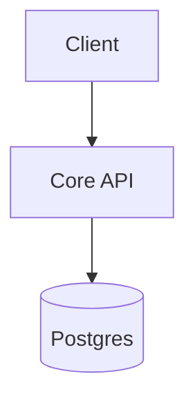
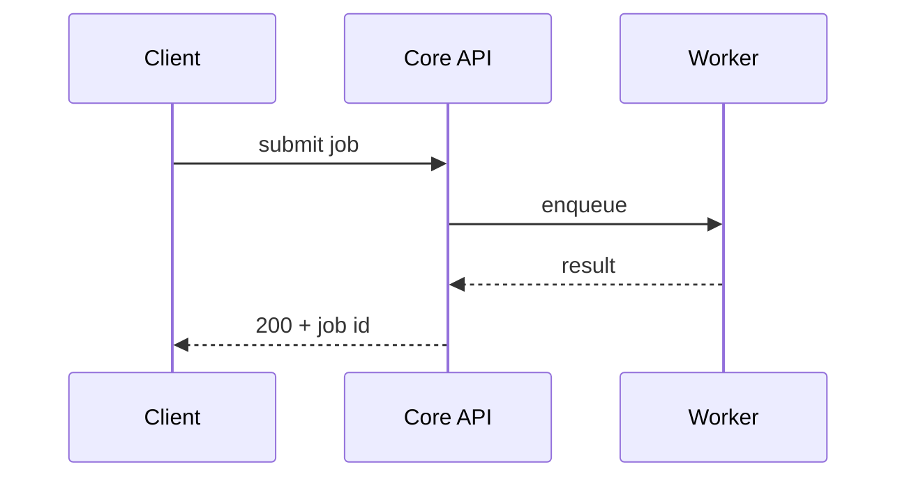

# Architecture Foundation

This document defines the physical and logical boundaries of the system required to deliver the MVP.

## 1. Constraints & Budgets

## 2. Top-Level Topology

A `graph` diagram is **required** here — it is the reader's first mental model of the system. Show every service and the external dependencies (datastores, brokers, third-party APIs) and the connections between them; label each edge with what flows along it. The prose names what each node owns; the diagram carries the shape.

## 3. Key Capabilities & Technical Decisions

### Capability Ports & Providers

Each technical capability the system depends on — LLM inference, a relational or vector store, messaging, telemetry, object storage, email, payments — is an **interface** the system depends on, satisfied by exactly one chosen **provider**: the implementation that fulfils it, wired in at the edge and swappable. Record the capability, the provider, and the provider's **operational footprint** (exactly one of `env` · `compose-service` · `runner` · `none`), with a one-line rationale. `none` is a first-class choice: a **bare interface** — the capability plus a failing contract test, no provider yet — to be built later as a bet. There are no default providers; infrastructure (a database, a tracing backend) appears *because* a provider's footprint requires it, never as a guess.

> Distinct from the **capability ledger** in `docs/surfaces.md`, which tracks user-facing *features* across surfaces. This table is about *technical capabilities* and the providers that satisfy them.

| Capability | Provider | Footprint | Rationale |
|---|---|---|---|

## 4. Component Boundaries & Contracts

## 5. Communication & Integration Patterns

For each non-trivial flow across services — a request that fans out, an event chain, an async path — draw a `sequenceDiagram` so timing and ordering are legible. The prose explains the failure modes and the design decisions the diagram cannot show. Skip trivial single-hop calls.

## 6. Service-Level Requirements

| Requirement | Originates From | Applies To |
|---|---|---|

## 7. Surfaces & Capability Core
