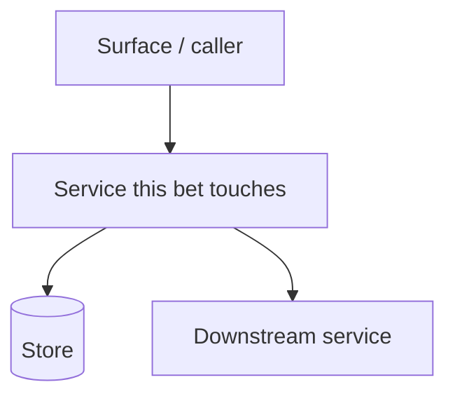

# Bet: [Feature Name]

*`surfaces:` lists the registry slugs (from `docs/surfaces.md`) this bet delivers to — validation fills the capability ledger from this scope. When the project has no surface registry, omit the key entirely: the bet runs against the single implicit surface, exactly as before the registry existed. A single-surface registry means one entry and nothing more.*

## The Pitch
*Provide a brief explanation of the problem, the proposed solution, the appetite, and the stakes.*

- **Problem:** What user problem are we solving?
- **Appetite:** How much is solving this worth — judged by opportunity cost, what else this cycle could hold? State worth, not an effort estimate. (Express in calendar time only when human-coordination time is the real constraint.)
- **Stakes:** What is at risk if we get this wrong — blast radius (surface touched, who feels it), reversibility (one-way door or iterate-behind-a-flag), and review load (how much a human must hold to vouch for it)? Stakes earns the rigour; it is not effort.
- **Solution:** At a high level, how will we solve this?
- **Success Signal:** What observable outcome confirms this bet delivered its intended value?

### Topology

*A `graph` of the services and components this bet touches and how they connect — the picture that frames the solution at a glance. Renders on GitHub and the docs site. Leave the placeholder below at discovery; the design phase fills it in once the actual shape is known (`workflows/02-design.md` updates it as a living document), so a reader of the pitch always sees the system the bet plays in.*

## Rabbit Holes & No-Gos
*Two distinct lists. Rabbit holes protect the appetite from technical surprise; no-gos protect it from scope creep.*

**Rabbit Holes** — the technical traps or unknowns that could silently eat the appetite. Name where the work could balloon, and the guard or proof of concept that keeps it bounded — the proof of concept itself is run later, in Design (Step 1.92), not here. Skip only if the bet is genuinely low-risk technically — and say so if it is.

- [ ] Risk: <what could balloon> — Guard: <the proof of concept, cap, or decision that bounds it>

**No-Gos** — the things we are explicitly NOT doing, to prevent scope creep. Include natural extensions users would expect but are excluded — "users will expect X, but we are not doing X because…" — so reviewers do not raise them as gaps.

- [ ] Out of scope item 1 — why it is excluded
- [ ] Out of scope item 2 — why it is excluded

**Surface no-gos** — when the registry holds surfaces beyond this bet's `surfaces:` scope, name each surface the capability will not reach in this bet, with its disposition: **deferred** (will reach it later — state the intent) or **omitted** (deliberately never — state the rationale). Validation writes these dispositions into the capability ledger; a surface left unstated here becomes an empty ledger cell the bet cannot close with. Skip this list when the registry holds one surface or the project has no registry.

- [ ] Surface `<slug>` — deferred: <what brings the capability there, and roughly when>
- [ ] Surface `<slug>` — omitted: <why this capability deliberately never ships here>
