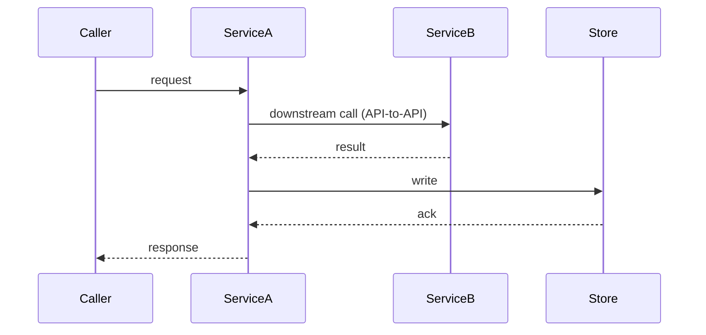

## Data Flows & Business Logic

*How data moves through the system, the business logic that governs it, and the routing decisions along the way — diagram-heavy, does not redraw the topology (the pitch's Solution owns that). Skip trivial CRUD; a flow with no non-obvious timing, ordering, routing, or failure mode does not belong here.*

---

### [Flow Name]

**Trigger:** [what initiates this flow — a user action, a scheduled job, an upstream event]

**What persists:** [what is written and where, at the end of this flow]

**Business logic & routing:** [the rules that govern this flow — validation, branching, the routing/decision points (which path a request takes and why), idempotency, and any cross-service or API-to-API calls it makes. State the decisions, not just the path.]

**Key decisions:** [the design choices that shape this flow and why — sync vs async, cache strategy, fallback behaviour, consistency model]

*Where a flow's logic is a branch or decision rather than a sequence, a `flowchart` is the right diagram — show the routing decision and each path's outcome.*

---
*(Add a `### [Flow Name]` block with its own diagram for each significant, non-trivial data path or piece of business logic in the bet.)*
