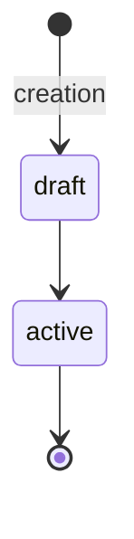

# <Entity Name>

**Owner:** <service-name>

## What it is

One paragraph describing the entity and its role in the system. State the
invariant the entity exists to enforce.

## Fields

| Field | Type | Description |
|---|---|---|
| id | uuid | Primary identifier. |
| ... | ... | ... |

## Lifecycle

States and what triggers each transition. If the entity has no meaningful
state machine (e.g. immutable record), say so explicitly and remove both the
diagram and the table.

When the entity does have a state machine, draw it as a `stateDiagram-v2` so a
reader sees the shape before reading the triggers. The table below the diagram
carries the detail the diagram cannot.

Every trigger must be mechanically detectable — backed by a field in the
Fields table or an emitted event. A state reached by the passage of time or
inactivity needs the field that makes it detectable (e.g. `last_active_at`); a
state with no detectable trigger cannot be enforced and is invalid.

| State | Triggered by | Description |
|---|---|---|
| draft | creation | Initial state on insert. |
| ... | ... | ... |

## Domain events

Significant state changes this entity models, named `<entity>.<verb>`. These
are domain-modeling concepts, not a commitment to publish messages. Whether an
event is actually published to a broker or bus is an architecture decision — if
the architecture provisions no message broker, these remain in-process domain
events with no external publish channel. Do not imply a publish mechanism the
architecture has not provided.

| Event | Trigger | Payload summary |
|---|---|---|
| <entity>.created | initial insert | id, owner, created_at |
| ... | ... | ... |

## Invariants

Constraints that must hold for the entity to be valid. Listed explicitly so
that violations are detectable in tests and at boundaries.

An invariant may only assert a guarantee the architecture and accepted ADRs
actually provide. When an ADR records that a guarantee was deliberately
surrendered — a monitor rather than a pre-screen, eventual rather than
immediate consistency — state the weaker guarantee the system enforces, never
the stronger one the ADR gave up.

- ...

## Notes

Anything non-obvious — historical decisions, edge cases, known gotchas.
