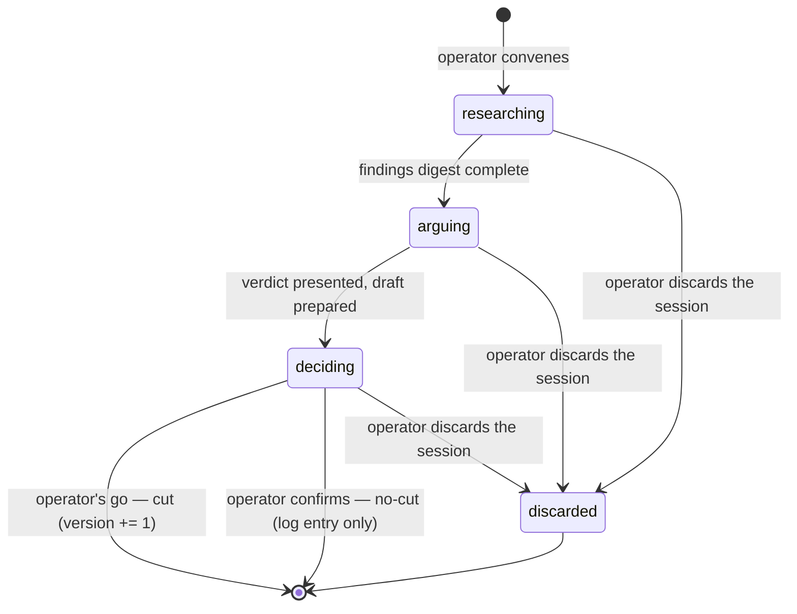

# Research Run

**Owner:** workbench

## What it is

A research run is one convened session investigating whether a topic's stance still
holds. It lives entirely in quarantine — `.staycurrent/sessions/<slug>.md`, gitignored —
so a failed or interrupted run can never leave a trace in published content. A run that
resolves does so to exactly one of two outcomes, `cut` or `no-cut`, and every resolution
is durably recorded: a cut increments the topic's version, a no-cut still updates
`last_researched` and logs the run. An abandoned session is not a resolved run — it is
discarded by deleting the quarantine file and leaves no trace in published content. The invariant it exists to enforce: research in
progress is invisible to `topics/` until the operator's explicit go and the publish gate
both clear it.

## Fields

Fields from the session-state schema (`.staycurrent/sessions/<slug>.md` frontmatter):

| Field | Type | Description |
|---|---|---|
| topic | string | The topic slug this run researches. |
| phase | enum: `researching` \| `arguing` \| `deciding` | Current phase of the run. |
| opened | ISO date | Date the session file was created. |
| against_version | integer | The version this run researches against. |

## Lifecycle

| State | Triggered by | Description |
|---|---|---|
| researching | operator convenes the run | Session file created; sources gathered into `## Findings`. |
| arguing | findings digest complete | Stance points raised and resolved in `## Argument`; a cut/no-cut verdict is presented. |
| deciding | verdict presented | `## Draft` holds the changelog entry and article deltas awaiting the operator's decision. |
| resolved — cut | operator's explicit go | content-core executes the cut: version += 1, session file cleared, research-log entry appended. |
| resolved — no-cut | operator confirms the no-cut verdict | Topic status reverts to `current`; `last_researched` updates; session file cleared; research-log entry appended. |
| discarded | operator discards the session — mechanically detectable as the session file's deletion while unresolved | The quarantine file is deleted; nothing is written to `topics/` — no research-log entry, no `last_researched` update, no trace in published content. |

Every *resolved* run — cut or no-cut — appends an entry to `research-log.md` and updates
`last_researched`; a quiet run is still currency information. A discarded session appends
nothing: abandonment is not a resolution.

## Domain events

Modeled as in-process domain events only — the architecture provisions no message broker,
so nothing here implies a publish channel.

| Event | Trigger | Payload summary |
|---|---|---|
| research-run.convened | operator convenes a run | topic, against_version, opened date |
| research-run.cut | the run resolves with the operator's go | topic, new version, cut paths |
| research-run.no-cut | the run resolves without a cut | topic, last_researched |
| research-run.discarded | operator discards an unresolved session | topic — in-process only; its sole effect is deletion of the quarantine file, never a `topics/` write |

## Invariants

- A run never mutates `topics/` before the operator's explicit go and a passing publish
  gate — staging happens in quarantine first.
- An interrupted run resumes from its session file; nothing is reconstructed from memory.
- Filesystem wins reconciliation: a topic showing `status: in-research` with no matching
  session file reverts to `current`, and the reversion is reported to the operator.

## Notes

A session's body sections accumulate as the run progresses — `## Findings`, then
`## Argument`, then `## Draft` — so any phase can be re-entered by reading the file alone.
Transient research I/O (a fetch, a search) self-repairs with bounded retries (3×,
backoff) and degrades silently unless exhausted, recorded as a provenance gap; anything
that would touch `topics/` outside the action contract halts instead of self-repairing.
