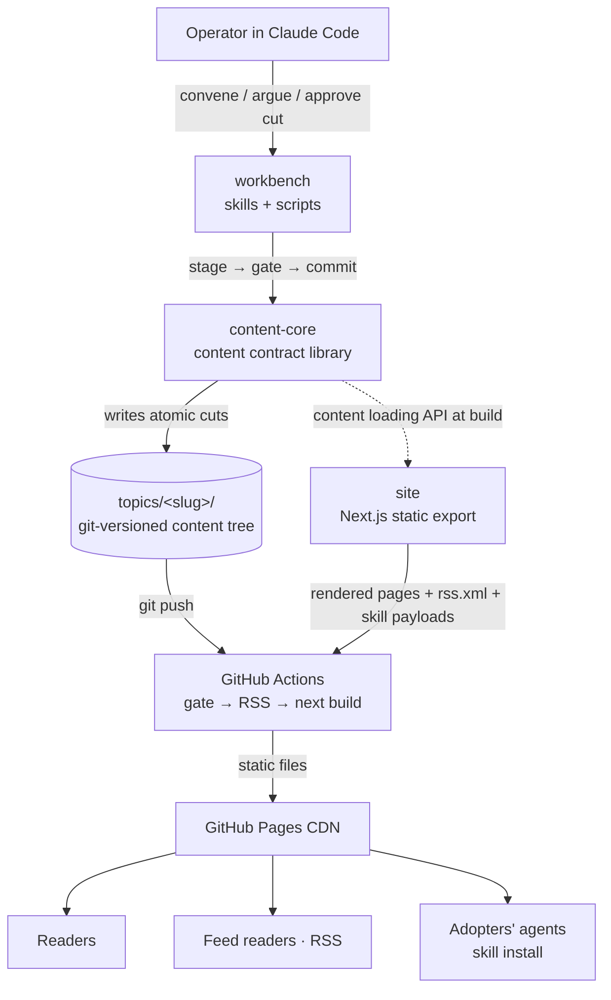
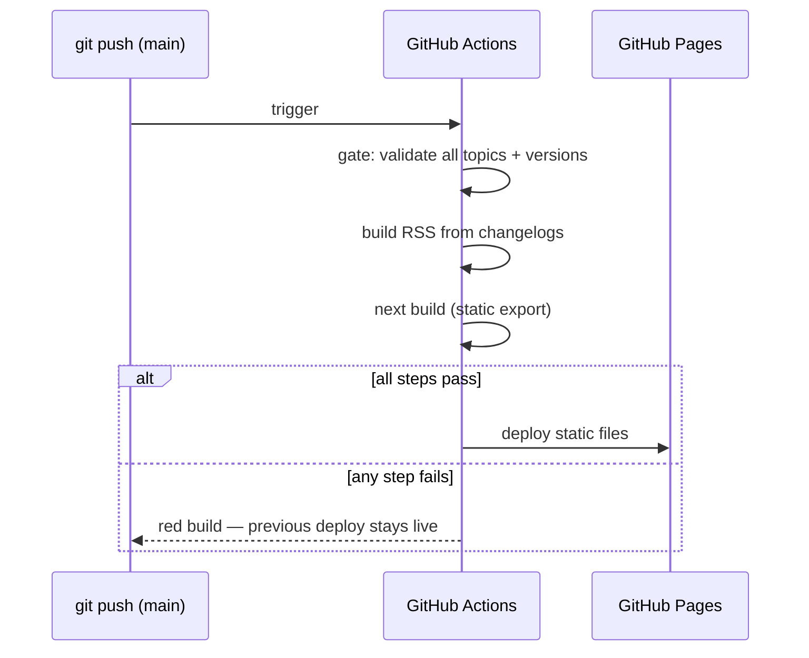

# Architecture Foundation

Stay Current is a publication system with no servers. One git repository holds both the engine and its first instance: the content tree (`topics/`), an embedded capability core that enforces the content contract, a statically rendered reader site, and the operator workbench that runs the research loop inside Claude Code. Publishing is a git push; the deployed product is a set of static files on a CDN. This document defines the boundaries that make that shape hold — including the engine/instance line that keeps the framework extractable.
## 1. Constraints & Budgets

- **Scale-to-zero.** The system incurs no runtime cost while idle. The site is fully static on a managed host; there are no servers, databases, or background processes to operate or pay for. Research runs on the operator's Claude Code subscription, not on hosted infrastructure.
- **No runtime auth, no reader data.** The site serves anonymous readers over HTTPS and collects nothing — no accounts, no analytics, no tracking. The only write path is git push with the operator's credentials; the repo is the trust boundary.
- **Fail closed on publish.** A build that cannot validate its content does not deploy: the publish gate blocks on any incomplete version, and a failed CI run leaves the previous deploy live. RPO is zero because git is the store; RTO is one rebuild-and-redeploy cycle (minutes).
- **Performance budgets** (from the design system, enforced at build): article text visible < 1.5 s on median mobile, CLS < 0.02, JavaScript as progressive enhancement — every page reads without it.
- **Auditability over approval.** No human approval gate sits after a version cut; the compensating control is that every published artifact is a git commit with a mechanical gate check in its history (product-brief constraint).
- **Supply-chain floor for skills.** Companion skills ship as plain markdown-and-files payloads — no executables, no network calls, no host-specific features — so an adopter's agent runtime can consume them with nothing to sandbox.
## 2. Top-Level Topology



Three components share one repository. **content-core** owns the content contract and is the only code allowed to mutate `topics/`. **site** is a build-time reader of that tree. **workbench** is the operator's conversational surface; it acts only through content-core. Everything downstream of a git push is mechanical: CI re-runs the same gate the workbench ran, builds the feed and the pages, and deploys static files. There is no runtime component anywhere — the CDN serves bytes cut at build time.
## 3. Key Capabilities & Technical Decisions

**Content store — git + filesystem**

The `topics/<slug>/` directory tree is the only data store. Content is markdown with YAML frontmatter; version snapshots are immutable directories (`versions/vN/`); topic state lives in the living article's frontmatter with `due` and `superseded` always derived, never stored (design-system contract). Access patterns are frontmatter sweeps for status questions and full-file reads at build time — both trivially served by the filesystem, which is why no database exists. Git provides history, backup, audit trail, and rollback (a bad cut is one revert).

*Downstream obligations:* every mutation of `topics/` goes through content-core's stage → gate → commit contract; one cut is one commit. Nothing outside the repo may hold state the system depends on.

**Static rendering — Next.js App Router, static export**

The site pre-renders every route at build time (`output: 'export'`) and ships as static files. Next.js is chosen because the GroundWork `nextjs-app` generator scaffolds it with brand-token theming wired in, and App Router's `generateStaticParams` maps one-to-one onto the content tree (topics × faces × versions). The export constraint is embraced, not fought: no route handlers, no server components at runtime, no image optimizer service.

*Downstream obligations:* anything dynamic is either computed at build or is progressive enhancement on the client. New routes must be statically enumerable from the content tree.

**Content processing — content-core (unified/remark + gray-matter)**

content-core parses frontmatter (gray-matter), validates it against the topic-state schema, renders markdown through a unified/remark pipeline (GFM tables, heading anchors), and rewrites ```mermaid fences into a client-rendered component themed from the house tokens — with the fenced source left readable when JavaScript is off. Client rendering extends the design system's JavaScript allowlist by one entry (recorded as a design-system refinement at this phase's commit); each diagram container reserves layout space (explicit min-height from the fence's declared size or the measured default) so rendering cannot move settled text and the CLS budget holds. The same library exposes the publish gate and the version-cut mechanics, so the workbench and CI validate with the identical code path.

*Downstream obligations:* the site never parses `topics/` directly; it consumes content-core's typed loading API. Gate logic exists exactly once.

**Hosting & CI — GitHub Pages + GitHub Actions**

The repo already lives on GitHub; Pages and Actions are the zero-cost, CI-native pair. The deploy pipeline is: push → gate over all topics and versions → RSS build → `next build` → Pages deploy. A gate or build failure stops the pipeline with the previous deploy intact.

*Downstream obligations:* the pipeline is the only path to production; no manual uploads. The gate runs in CI even though the workbench already ran it — the repo, not the operator's machine, is the trust boundary.

**LLM inference — Anthropic Claude, in the operator's Claude Code session**

The research loop's intelligence is the operator's own Claude Code session. The product ships no LLM integration: no API keys, no provider SDK, no inference cost center. Workbench "programs" are skills — instructions and contracts the session executes — which is what keeps research on subscription pricing (product-brief constraint) and the workbench portable to any Claude Code installation.

*Downstream obligations:* workbench capabilities must be expressible as skills plus deterministic scripts; anything requiring a hosted model call is out of architecture.

**RSS — build artifact**

The site-wide feed is generated at build by content-core from the newest changelog entries; an RSS item is a changelog entry, verbatim (design-system rule: one written artifact serves page, feed, and agent). No feed service, no per-topic feeds at MVP.

### Capability Ports & Providers

| Capability | Provider | Footprint | Rationale |
|---|---|---|---|
| content-store | git + filesystem (`topics/`) | `none` | Filesystem serves both access patterns; git is history and audit trail |
| static-hosting | GitHub Pages | `env` | Zero cost, CDN-backed, native to the repo's home |
| ci-cd | GitHub Actions | `env` | Runs the gate and build on the trust boundary; free tier suffices |
| llm-inference | Anthropic Claude via operator's Claude Code session | `none` | No product integration by design; subscription pricing constraint |
| diagram-rendering | mermaid (client-side, house theme) | `none` | Renders in-browser from fenced source; no build-time browser dependency |
| search | — (deferred) | `none` | No interface at MVP; sidebar is the index until ~25 topics |
| telemetry | — (none by design) | `none` | The product collects nothing about readers |
## 4. Component Boundaries & Contracts

**content-core** — the embedded capability core.

- **Owns:** the content contract (topic frontmatter schema, changelog and provenance anatomies, the `topics/` layout), contract validation, the fail-closed publish gate, version-cut mechanics (stage → gate → commit), the content loading API, and RSS generation.
- **Does not own:** editorial decisions (the operator's), rendering (the site's), research choreography (the workbench's).
- **Contract:** a typed module API — exported TypeScript types (`TopicFrontmatter`, `ChangelogEntry`, `VersionSnapshot`, `ProvenanceRecord`, `GateResult`) and functions the surfaces call in-process. The `topics/` filesystem layout is itself a published contract; the design system's Document Architecture section is its normative definition.
- **Why the boundary sits here:** the gate and the schemas must exist exactly once. If the site parsed content its own way, gate-passing content could still fail to render — the contract would have two enforcers and no authority.

**site** — the reader-facing surface (graphical-ui, web).

- **Owns:** routes, rendering, theming, and the static serving of companion-skill payloads — raw file trees and per-version zip archives (format resolved below); `/[topic]/skill` binds skill version to article version.
- **Does not own:** content mutation — it is a build-time reader with no write path.
- **Contract:** the published URL structure (`/`, `/[topic]`, `/[topic]/changelog|history|v/[n]|skill`, `/changelog`, `/about`, `/rss.xml`) and the skill-payload fetch paths. Slugs are permanent; URL changes are migrations.

**workbench** — the operator's surface (agentic-protocol).

- **Owns:** research-run choreography (due detection, session quarantine in `.staycurrent/sessions/`, the argue/decide flow), and invoking content-core to execute cuts.
- **Does not own:** gate logic (it calls content-core's), rendering, or any autonomous publish authority — the operator's explicit go precedes every cut (product-brief constraint).
- **Contract:** the workbench skill set's documented operations (`convene`, `cut`, `log`, `create`) and the session-state schema from the design system.
- **Root instruction file & agent wiring:** the workbench's L0 entry point is **`STAYCURRENT.md`** at the repo root — ≤150 lines carrying the topology, the shared vocabulary, and the routes to the workbench skills, nothing else. Agent runtimes reach it through the existing agent-wiring convention: `AGENTS.md` (the canonical instruction source every agent already loads, `CLAUDE.md` symlinks to it) carries one pointer line to `STAYCURRENT.md`. Cold start stays within the ≤3-read budget: (1) `STAYCURRENT.md`, (2) the frontmatter sweep of `topics/*/article.md`, (3) the task-specific file. Keeping the product's operator surface out of `AGENTS.md` itself preserves the framework/product separation — `AGENTS.md` belongs to the development process, `STAYCURRENT.md` to the publication.

**Skill distribution — the resolved format.** A companion skill is distributed as the plain file tree the design system specifies (`SKILL.md` + `references/`), published by the site in two forms per version: browsable raw files under `/skills/<slug>/` (current) and `/skills/<slug>/v/<n>/` (archived), and a single downloadable `.zip` of the same tree for one-command install. The install page (`/[topic]/skill`) shows the one-liner — fetch the archive, unpack into the agent runtime's skills directory — and states the `article_version` binding. The zip is generated at build from the same gate-checked files it mirrors; no registry, no installer, no package manager at MVP. Because payloads live at top-level `/skills/` while topics own the root namespace, the root path segments `skills`, `changelog`, `about`, and `rss.xml` are **reserved slugs** — content-core's gate rejects a topic slug that collides with them.

**Framework / instance boundary.** The brief commits to two products sharing one engine; the boundary is drawn now, extracted later. At MVP the engine (content-core, the site app, the workbench skills) and the first instance (staycurrent.dev's `topics/`, brand tokens, domain) live in **one repository** — the reference deployment. The line between them is enforced by a rule, not a package split: **engine code never names the instance** — no topic slugs, site titles, or staycurrent-specific values in `core/`, `services/site/`, or the workbench skills; everything instance-specific resolves from `topics/`, `brand-tokens.json`, and one site-config module. A builder adopts the framework today by templating the repo and replacing those three things. Extracting the engine into a distributable package is a post-MVP bet — a packaging exercise, not a rewrite, precisely because the naming rule holds from the first commit.

**Trust boundaries.** Three exist: repo write access (operator's git credentials — the only mutation path), the CI publish path (the gate re-validates everything before deploy, so a hand-edited commit cannot silently publish a broken version), and skill-payload consumption by third-party agents (mitigated by the markdown-only floor and per-version provenance).
## 5. Communication & Integration Patterns

Every interaction is synchronous — in-process calls at build and research time, git as the hand-off between them. There are no queues, no events, no network calls between components; the sequence diagrams below carry the two flows where ordering and failure behaviour matter.

**The version cut** — the one flow that mutates published truth:

```mermaid
sequenceDiagram
    participant O as Operator
    participant W as workbench (Claude Code)
    participant C as content-core
    participant T as topics/ (git)
    O->>W: convene <topic>
    W->>W: research → digest → argue (session quarantine)
    W->>O: verdict: cut / no-cut (position to argue)
    O->>W: explicit go
    W->>C: cut(topic) — staged artifacts
    C->>C: publish gate over staged tree
    alt gate passes
        C->>T: write snapshot + changelog + frontmatter, one commit
        C-->>W: cut report (paths)
    else gate fails
        C-->>W: halt: exact missing artifact named
        Note over W,T: topics/ untouched; staged set intact in quarantine
    end
```

The gate runs against the *staged prospective tree* before anything touches `topics/` — a failed cut leaves published content byte-identical and the session resumable. Nothing that touches `topics/` self-repairs (design-system rule); the failure surfaces to the operator with the exact missing artifact named.

**The publish pipeline** — from push to CDN:



CI re-runs the same gate the workbench ran, through the same content-core code path — the repo is the trust boundary, so validation cannot depend on what the operator's machine did. A red build is loud (CI status) and safe (the CDN keeps serving the last good deploy).

**Failure modes and their answers:** a transient research fetch retries bounded (3×, backoff) and degrades to a provenance gap; a gate failure halts with the artifact named; a CI failure blocks deploy; a bad published cut is reverted with one git revert, which restores every artifact of the cut atomically because a cut is one commit.
## 6. Service-Level Requirements

| Requirement | Originates From | Applies To |
|---|---|---|
| Gate logic exists exactly once; workbench and CI call the same code path | §3 content processing | content-core |
| Every `topics/` mutation is stage → gate → commit; one cut = one git commit | §4 boundaries, design system | content-core, workbench |
| `due` and `superseded` are always derived, never stored | Design system state contract | content-core |
| Site consumes content only through content-core's typed loading API | §4 boundaries | site |
| Every route statically enumerable from the content tree; no runtime handlers | §3 static rendering | site |
| Build fails if any article page cannot state version + last-researched date | Design system ("currency is never guessed") | content-core, site |
| Pages readable and navigable with JavaScript disabled | Design system NFR | site |
| Article text < 1.5 s median mobile; CLS < 0.02; WCAG 2.1 AA | Design system NFR | site |
| Mermaid fences render client-side, themed both ways; source visible without JS; containers reserve layout space (CLS budget) | §3 diagram-rendering | content-core, site |
| Skill payloads: markdown and files only, no executables, `article_version` binding | §1 supply-chain floor | content-core (gate), site (serving) |
| Skill distribution: browsable file tree + per-version zip, both built from gate-checked files | §4 skill distribution | site |
| `STAYCURRENT.md` root instruction file ≤150 lines; cold start ≤3 file reads | §4 root instruction file | workbench |
| Engine code never names the instance; instance specifics live in `topics/`, brand tokens, one site-config module | §4 framework/instance boundary | content-core, site, workbench |
| Workbench capabilities are skills + deterministic scripts; no hosted LLM calls | §3 llm-inference | workbench |
| Cut requires the operator's explicit go; nothing publishes autonomously | Product brief authority model | workbench |
| Session state quarantined in `.staycurrent/sessions/` (gitignored); interrupted runs resume | Design system error posture | workbench |
| CI re-runs the full gate before every deploy; failed builds leave previous deploy live | §5 publish pipeline | ci-cd |
## 7. Surfaces & Capability Core

The capability core (`content-core`) deploys **embedded** — a TypeScript library called in-process by both surfaces, never over a network. The consequence: its contract is a typed module API plus the `topics/` filesystem contract, not OpenAPI; capability behaviour is proven headless against the module API with no surface running.

| Surface | Type | Access path | Auth |
|---|---|---|---|
| site | graphical-ui (web) | content-core in-process at build time | none — anonymous static serving |
| workbench | agentic-protocol | content-core in-process via scripts; writes land as git commits | operator's git credentials; no runtime auth |

Both surfaces deploy from one repository in one push — there is no independent-deploy versioning problem between them. The externally consumed contracts are the ones that outlive deploys: topic URLs and slugs (permanent; renames are migrations), the RSS feed shape, and the skill-payload anatomy. Each evolves additively within a framework major version; a breaking change to any of them is a framework major-version event, recorded by ADR.

Surface detail — registry rows, scaffold mapping, and status — lives in `docs/surfaces.md`.
