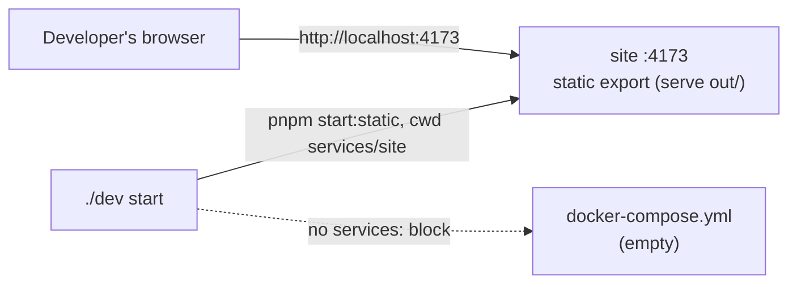
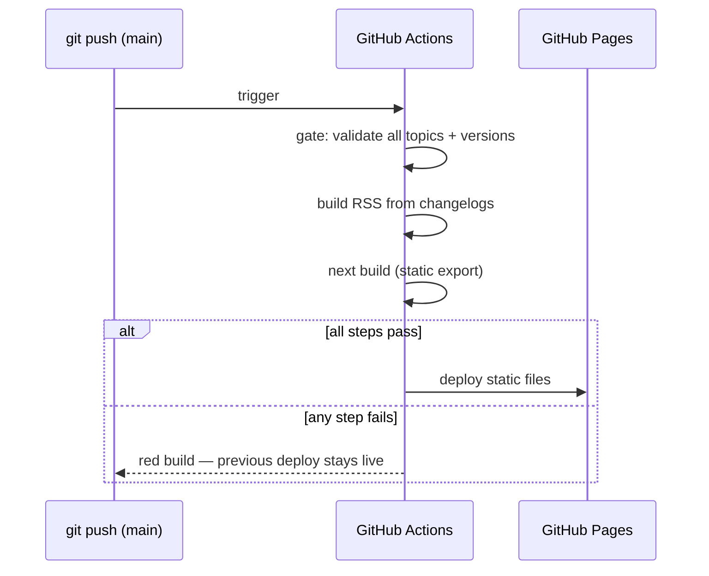

# Infrastructure

This document describes how Stay Current boots, runs, and deploys — the physical topology behind the logical boundaries in [`docs/architecture/index.md`](index.md). The topology is small by design: one native process for local development, no containers, and a static-file deploy with no server in the request path ([ADR 0001](decisions/0001-fully-static-site-no-servers.md)).

## Local development

### Prerequisites

| Tool | Version | Used for |
|---|---|---|
| Node.js | 24+ | Running `site` and the `./dev` CLI bundle |
| pnpm | 11+ | Installing and running `services/site` |
| uv | any | Managing the `tests/` Python virtual environment |
| Python | 3.11+ | The system-test suite (installed by `uv`) |

### What `./dev start` does

| Unit | Kind | Boot command | Health |
|---|---|---|---|
| site | native runner | `pnpm start:static` (cwd `services/site`) — `next build && serve out -l 4173 --no-clipboard` | HTTP 200 on `http://localhost:4173/` |

`docker-compose.yml` provisions no `services:` block — Stay Current runs no database, cache, or message broker, so there is no infrastructure for `./dev start --docker` to boot ([ADR 0001](decisions/0001-fully-static-site-no-servers.md)). `./dev start` therefore starts exactly one process: the site runner.

The runner serves the **built static export**, not a dev server: it runs `next build` and serves the resulting `out/` directory — the same artifact GitHub Pages deploys — so system tests and milestone proofs run against what production actually ships. (`next dev` injects a development-overlay portal into every page, which falsifies render assertions.) For hot-reload iteration, run `pnpm dev` in `services/site` instead; it binds the same port 4173, so stop the runner first.

- `./dev status` / `./dev status --json` report the site runner's live state — always check this instead of assuming a port is free or occupied.
- `./dev logs` prints the recent tail for site; `./dev logs site` filters to it explicitly; `./dev logs --follow` streams (interactive terminals only).
- `./dev stop` gracefully kills the native `site` process. There are no containers to tear down.

The full `./dev` command catalogue, including which commands do meaningful work in this project, is in [`docs/getting-started/dev-cli-reference.md`](../getting-started/dev-cli-reference.md).

## Surfaces

Every registered surface ([`docs/surfaces.md`](../surfaces.md)) has an operational entry here — a runner (or the statement that none exists), a health signal, and the medium its tests drive it through.

| Surface | Type | Runner | Port | Health signal | Test medium |
|---|---|---|---|---|---|
| site | graphical-ui, web | native (`pnpm start:static`) | 4173 | HTTP 200 on `/` | playwright |
| workbench | agentic-protocol | none — manual scaffold | — | `node workbench/cli.mjs status` exits 0 | subprocess-cli |

site's runner and health check are live today — `./dev status` and `./dev start` both act on it.

workbench has no runner because its scaffold is `manual`: no generator produced it, so `./dev status` reports nothing for it — there is no process to track. Its operational expectation is a deterministic CLI at `workbench/cli.mjs` plus the Claude Code skills that drive research runs, and its health signal is that CLI exiting `0` on `status`. Neither the CLI nor the skills exist yet; both arrive with the first bet. Until then, the health signal fails by absence — there is no `workbench/cli.mjs` to run.

content-core — the embedded capability core both surfaces call ([architecture §4](index.md)) — is built at `core/` (`@staycurrent/core`): the Loading API, cut/session mechanics, the fail-closed publish gate, and `buildRss`, called in-process by both surfaces at build/run time. Its captured contract lives at [`docs/architecture/api/content-core/`](api/content-core/).

## System tests

`tests/` is a pytest harness that exercises both surfaces from outside the running system.

| Property | Value |
|---|---|
| Environment | `tests/.venv`, managed by `uv` |
| Dependencies | `tests/pyproject.toml` (`pytest`, `pytest-playwright`, `pytest-asyncio`, `httpx`, `tenacity`, `pexpect`, …) |
| Browser | Playwright chromium, installed via `uv run playwright install chromium` |
| Test paths | `tests/system/` (permanent suite), `tests/bets/<slug>/` (bet-progress suites, archived at delivery) |

`tests/conftest.py` derives a `surfaces` fixture from the surface registry: `site` maps to `playwright` at `http://localhost:4173`, `workbench` maps to `subprocess-cli` at `node workbench/cli.mjs`. Both surfaces are now exercised: the site through render/a11y/token/route system tests, the workbench through the operator-contract and loop-rehearsal modules that subprocess `node workbench/cli.mjs` against fixture trees.

The shared `cluster` fixture health-gates every test on the running stack: it polls every URL-reach surface (the site at `http://localhost:4173`) and every service `docker-compose.yml` declares. It probes the Jaeger query API only when compose declares a `jaeger` service — this project provisions none by design, so no Jaeger probe runs. Against the booted stack the suite reports 4 passed, 6 skipped (`pytest system/ -rs`). The skips: the visual-regression test, opt-in behind `GROUNDWORK_VISUAL_REGRESSION=1`; four service-parametrized tests whose `svc` parameter set is empty because `docker-compose.yml` declares no services; and one CRUD placeholder marked "real CRUD lands in Phase 4".

| Command | Behavior |
|---|---|
| `./dev test` | Runs `tests/system/` against the already-running stack — the fast inner loop |
| `./dev test integration` | Boots the stack, runs `tests/system/` with `GROUNDWORK_REQUIRE_SERVICES=1` and `GROUNDWORK_REQUIRE_TRACES=1`, tears down after |
| `./dev test bet <slug>` | Runs `tests/bets/<slug>/` against the already-running stack |
| `./dev test bet <slug> --integration` | Boots the stack, installs chromium if the suite uses Playwright, runs `tests/bets/<slug>/`, tears down after |

`tests/bets/` holds no suites yet — bet-progress tests are scaffolded by `./dev new milestone` / `./dev new slice` once the first bet starts.

## Deployment

Publishing is a git push. The pipeline gates on content validity before it builds anything, and a failed step leaves the previous deploy live:

The workflow lives at `.github/workflows/publish.yml` (founding bet): one workflow, two triggers — every push to `main` deploys, every pull request verifies without deploying — running install → full-tree gate → prebuild + build → suites → advisory `groundwork check` → Pages deploy, fail-closed at each step. The custom domain (`staycurrent.dev`) binds through the repository's Pages settings and DNS, not the exported `CNAME` file (Actions-based Pages deploys ignore it).

## Capability footprints

Every capability the product depends on resolves to a provider and a footprint, projected from [`.groundwork/capability-ports.json`](../../.groundwork/capability-ports.json):

| Capability | Provider | Footprint | Operationally |
|---|---|---|---|
| content-store | git + filesystem | `none` | `topics/` and git are the store; nothing to provision or start |
| static-hosting | GitHub Pages | `env` | Enabled in the repo's GitHub settings, not started by `./dev` |
| ci-cd | GitHub Actions | `env` | Runs on GitHub's infrastructure at push time, not a local process |
| llm-inference | Anthropic Claude, in the operator's Claude Code session | `none` | No API key, no SDK, no local process — the operator's own session provides it |
| diagram-rendering | mermaid (client-side) | `none` | Renders in the reader's browser from the fenced source; no build-time dependency |
| search | none (deferred) | `none` | No interface exists; nothing to provision |
| telemetry | none (by design) | `none` | The product collects nothing about readers |

A `none` footprint means the capability needs no provisioning, no credential, and no local process — `./dev status` has nothing to report for it because there is nothing running. An `env` footprint means the capability is satisfied by state that lives outside this repository's runtime — a GitHub repository or organization setting — not a process `./dev start` or `./dev stop` controls. Every capability in this project is `none` or `env`; none requires a container, which is why `docker-compose.yml` provisions nothing.
