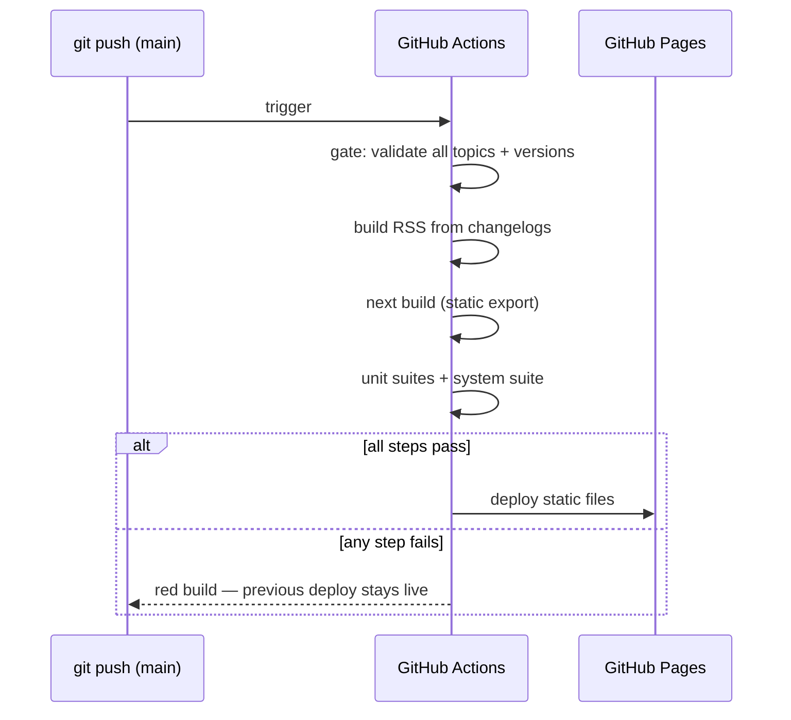

# Infrastructure

This document describes how Stay Current builds, runs, and deploys — the physical topology behind the logical boundaries in [`docs/architecture/index.md`](index.md). The topology is small by design: one static export for local development, no containers, and a static-file deploy with no server in the request path ([ADR 0001](decisions/0001-fully-static-site-no-servers.md)).

## Local development

### Prerequisites

| Tool | Version | Used for |
|---|---|---|
| Node.js | 24+ | Building `core` and `site`, running the workbench CLI |
| pnpm | 11+ | Installing and running `core` and `services/site` |
| uv | any | Managing the `tests/` Python virtual environment |
| Python | 3.11+ | The system-test suite (installed by `uv`) |

### Running the site

| Step | Command (cwd) | Result |
|---|---|---|
| Build the content core | `pnpm install && pnpm build` (`core`) | `core/dist`, which the site consumes as a `file:` dependency |
| Build and serve the site | `pnpm install && pnpm start:static` (`services/site`) | `next build`, then `serve out -l 4173` — HTTP 200 on `http://localhost:4173/` |

The site is served as the **built static export**, not a dev server: `pnpm start:static` runs `next build` and serves the resulting `out/` directory — the same artifact GitHub Pages deploys — so system tests run against what production actually ships. (`next dev` injects a development-overlay portal into every page, which falsifies render assertions.) For hot-reload iteration, run `pnpm dev` in `services/site` instead; it binds the same port 4173, so run one at a time.

There is no database, cache, or message broker to start. Stay Current runs no infrastructure ([ADR 0001](decisions/0001-fully-static-site-no-servers.md)).

## Surfaces

| Surface | Type | Runner | Port | Health signal | Test medium |
|---|---|---|---|---|---|
| site | graphical-ui, web | `pnpm start:static` | 4173 | HTTP 200 on `/` | playwright |
| workbench | agentic-protocol | none — a CLI | — | `node workbench/cli.mjs status` exits 0 | subprocess-cli |

The workbench is a deterministic CLI at `workbench/cli.mjs` plus the Claude Code skills in `.claude/skills/` that drive research runs. Its health signal is that CLI exiting `0` on `status`.

content-core — the embedded capability core both surfaces call ([architecture §4](index.md)) — is built at `core/` (`@staycurrent/core`): the loading API, cut and session mechanics, the fail-closed publish gate, and `buildRss`, called in-process by both surfaces at build and run time. Its captured contract lives at [`docs/architecture/api/content-core/`](api/content-core/).

## System tests

`tests/` is a pytest harness that exercises both surfaces from outside the running system.

| Property | Value |
|---|---|
| Environment | `tests/.venv`, managed by `uv` |
| Dependencies | `tests/pyproject.toml` (`pytest`, `pytest-playwright`, `pytest-asyncio`, `httpx`, `tenacity`, `pexpect`, …) |
| Browser | Playwright chromium, installed via `uv run playwright install chromium` |
| Test path | `tests/system/` |

`tests/conftest.py` derives a `surfaces` fixture: `site` maps to `playwright` at `http://localhost:4173`, `workbench` maps to `subprocess-cli` at `node workbench/cli.mjs`. The site is exercised through render, accessibility, token, and route tests; the workbench through the operator-contract and loop-rehearsal modules that subprocess `node workbench/cli.mjs` against fixture trees.

The shared `cluster` fixture health-gates every test on the served site. With `STAYCURRENT_REQUIRE_SERVICES=1` (CI sets it) an unreachable site is a failure rather than a skip. The visual-regression test is opt-in behind `STAYCURRENT_VISUAL_REGRESSION=1`; its baselines live under `tests/.cache/visual/`, which is gitignored.

```bash
cd tests && STAYCURRENT_REQUIRE_SERVICES=1 uv run pytest system/
```

## Deployment

Publishing is a git push. The pipeline gates on content validity before it builds anything, and a failed step leaves the previous deploy live:


```mermaid
sequenceDiagram
    participant T as git push (main)
    participant A as GitHub Actions
    participant P as GitHub Pages
    T->>A: trigger
    A->>A: gate: validate all topics + versions
    A->>A: build RSS from changelogs
    A->>A: next build (static export)
    A->>A: unit suites + system suite
    alt all steps pass
        A->>P: deploy static files
    else any step fails
        A-->>T: red build — previous deploy stays live
    end
```

The workflow lives at `.github/workflows/publish.yml`: one workflow, two triggers — every push to `main` deploys, every pull request verifies without deploying — running install → full-tree gate → prebuild + build → suites → Pages deploy, fail-closed at each step. The custom domain (`staycurrent.dev`) binds through the repository's Pages settings and DNS, not the exported `CNAME` file (Actions-based Pages deploys ignore it).

## Capability footprints

| Capability | Provider | Footprint | Operationally |
|---|---|---|---|
| content-store | git + filesystem | `none` | `topics/` and git are the store; nothing to provision or start |
| static-hosting | GitHub Pages | `env` | Enabled in the repo's GitHub settings |
| ci-cd | GitHub Actions | `env` | Runs on GitHub's infrastructure at push time, not a local process |
| llm-inference | Anthropic Claude, in the operator's Claude Code session | `none` | No API key, no SDK, no local process — the operator's own session provides it |
| diagram-rendering | mermaid (client-side) | `none` | Renders in the reader's browser from the fenced source; no build-time dependency |
| search | none (deferred) | `none` | No interface exists; nothing to provision |
| telemetry | none (by design) | `none` | The product collects nothing about readers |

A `none` footprint means the capability needs no provisioning, no credential, and no local process. An `env` footprint means the capability is satisfied by state that lives outside this repository's runtime — a GitHub repository setting. Every capability in this project is `none` or `env`; none requires a container.
