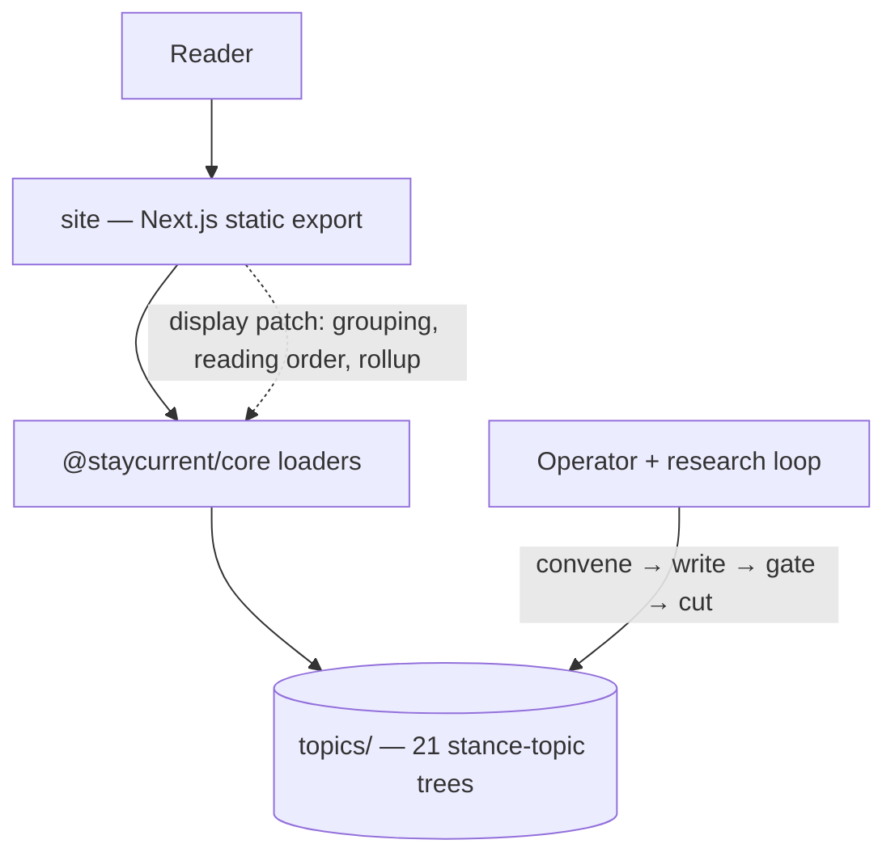

# Bet: Databases Catalogue — the Foundations-First Data Layer

## The Pitch

- **Problem:** The `databases` topic is one ~5,300-word essay carrying the entire data layer.
  Measured against the principal-interview data-layer rubric this bet's discovery research
  established (`research/interview-rubric.md` — 11 competencies, 10 question archetypes, and a
  per-competency map of v2's coverage), v2 covers seven competencies partially and four not at
  all: capacity estimation, caching and invalidation, consistency and consensus depth, and
  derived data / CDC. The single-essay format cannot close those gaps: the founding pitch's own
  guard ("the databases article balloons into an encyclopedia") caps its depth, readers cannot
  diff engines side by side, and there is no learning path — a reader who needs replication
  mechanics and a reader who needs "which engine for this workload" are served by the same
  undifferentiated wall of prose. The catalogue's depth *is* the product; today the product is
  one article deep.
- **Appetite:** Worth a sustained multi-wave editorial program — this is the site's core value
  proposition, not a feature beside it, and the operator has committed to the full seven-profile,
  full-foundations scope ("all in"). The bound is per-wave, not per-program: each of the six
  waves must leave the deployed site strictly better standing alone, so the program can pause at
  any wave boundary with full value banked. Scope flexes by consolidating pieces under the
  no-stance-no-topic test — never by shipping thin pieces. Steady-state maintenance is priced
  and accepted: ~30 research runs/year (~2.5/month) at per-piece cadences that track volatility.
- **Stakes:** Medium-high blast radius, high reversibility. The public catalogue is the product,
  and this program grows it from 1 to 21 topics, consuming most of the ~25-topic design
  headroom. Two one-way doors: topic slugs are permanent (no rename migration exists; `SLUG_RE`
  caps them at 3 words) and this program mints 20 new ones, and published stances are
  commitments the changelog must honestly walk back if wrong. Everything else is a single
  revertible git commit per cut, gated fail-closed before it lands. Review load per increment
  is bounded: one piece, one gate pass, one operator go. The display patch is display-only and
  low-stakes.
- **Solution:** Decompose the monolith into a foundations-first, hub-and-spoke catalogue of 21
  stance-topics (20 new + the hub re-cut) in three registers: **13 foundation pieces** (deep
  mechanism essays in four movements — sizing lens; single-node; distributed; deriving &
  serving), **7 tech profiles** (comparable engine entries — each its coordinates on 8 canonical
  decision axes, with a ★ core trio of relational / key-value / columnar featured above the four
  specialized escape hatches), and the **`databases` hub re-cut as chooser and map** (axes,
  master comparison matrix, reading path, decision tree). The spine follows the field's
  consensus carve, pressure-tested against DDIA (both editions), Petrov, and the CMU/MIT
  curricula in `research/pedagogy-teardown.md`. Every mechanism is written as the teachable
  quadruple — decision enabled → downside accepted → failure mode → the estimate that triggers
  it — with four anchor systems (feed, ledger, metrics store, typeahead) threaded through every
  layer; the profile skeleton and quadruple are designed in Design Foundations and recorded as
  authoring convention beside the existing writer-skill rules (a methodology edit, not a
  workbench capability change). Delivery runs in six waves under two invariants: no depth
  regression (the hub sheds a deep section only after its expanded replacement is live) and no
  dead links (the hub re-cut therefore lands last). All content lands as normal stance-topics
  through the existing content loop; per `research/content-model-audit.md` the only code change
  is a display-only site patch — area grouping, reading order, hub freshness rollup — via
  additive frontmatter the validator already tolerates. This deliberately refines the product
  brief's "a topic is one article on a broad practice area" framing — the practice area is now
  served by a *catalogue* of finer-grained stance-topics with the hub as its face — and that
  refinement is applied at pitch commit under the Living Documents protocol to both
  `docs/product-brief.md` and `docs/design-system.md`'s shared-vocabulary "topic" entry, which
  carries the same framing. Retro items absorbed: **R1** (the patch types new frontmatter keys → verify
  gate↔loader parity in one pass, ADR 0006 standard) and **R3** (the program's first cut
  confirms the deployed site shows the new version standing with the prior archived, if the v2
  cut has not already closed it). Maturity **G3** (missing repo-map, fix-now) is absorbed into
  this bet — one command, and the display patch's impact analysis benefits immediately;
  placement is decided at decomposition.
- **Success Signal:** Three checks, each answerable yes/no on the deployed site. **(1) Rubric
  audit:** at program end, all 11 competencies and all 10 archetypes in
  `research/interview-rubric.md` map to live, provenance-cited sections — the audit table
  published in the bet's validation. **(2) Reader journeys:** from `/databases`, any of the 7
  profiles is reachable in ≤2 clicks via the matrix; the reading path is navigable end to end;
  a manual link sweep finds zero dead cross-links. **(3) Wave integrity:** after every wave the
  site builds green through the fail-closed gate and net published depth on every mechanism
  never decreased. A no on any check is as informative as a yes: it names the wave where the
  structure failed.

### Topology

## Rabbit Holes & No-Gos

**Rabbit Holes**

- [ ] Risk: 21 research runs balloon — each convene is a full sources → digest → verdict loop.
  Guard: research is pre-seeded by the three committed discovery digests under `research/`
  (interview rubric, pedagogy teardown, content-model audit); pieces are authored one at a time
  inside wave boundaries that are legal stop points; the no-stance-no-topic test merges thin
  pieces instead of padding them.
- [ ] Risk: the display patch creeps into a content-contract change (validated prereqs, a second
  register, nested URLs). Guard: additive-frontmatter display-only scope is pinned in the pitch;
  the three contract-level extensions are named no-gos below with explicit escalation triggers.
- [ ] Risk: profiles re-teach mechanisms and balloon into essays. Guard: the profile skeleton is
  an authoring convention — 8-axis coordinates plus links to foundations, never re-teaching —
  and the hub matrix makes a bloated profile visibly non-comparable.
- [ ] Risk: slug regret — slugs are permanent and this program mints 20 new ones. Guard: the
  full slug set is locked in Design Foundations against `SLUG_RE` and future-catalogue semantics
  (foundations unprefixed as site-level primitives; profiles typed) before the first cut.
- [ ] Risk: mermaid-heavy pieces hit the known caption-channel gap (no alt/caption contract on
  fences). Guard: match the v2 convention (caption-less fences, source fallback on render
  failure); the caption channel remains a named deferred bet — not solved ad hoc here.

**No-Gos**

- [ ] No content-contract change — no second content register, no structured/validated profile
  fields, no gate-enforced cross-links or prereqs, no multi-topic atomic cut. Each becomes its
  own future bet only if the authoring conventions prove insufficient in practice; the trigger
  is a wave retrospective naming the convention that failed, not authoring convenience.
- [ ] No nested URLs (`/databases/relational-databases`) — grouping is display-only over flat
  permanent slugs; a URL re-homing requires the rename migration that does not exist. Separate
  bet if ever.
- [ ] No companion-skill authoring — the change-proposal-2 deferral holds; placeholder skills
  ride each cut with only the version binding moving. The chooser-as-first-skill instinct is
  recorded in discovery notes for the future skill-design bet.
- [ ] No stream/batch-processing piece and no encoding/schema-evolution piece — DDIA Part III
  proper and serialization are data-engineering scope, not this resource's reader; each gets a
  fold-note (derived-data and schema-design respectively), not a topic.
- [ ] No search — the parking-lot instinct says revisit at ~25 topics; this program lands at 21.
  Re-raise in the first post-program bet discovery, not here.
- [ ] No new workbench capability — the loop's existing commands already handle N topics.

**Surface no-gos**

- [ ] Surface `workbench` — omitted: the catalogue is delivered entirely through content and the
  site's display layer; `create`/`convene`/`gate`/`cut` already operate per-slug with no change.
