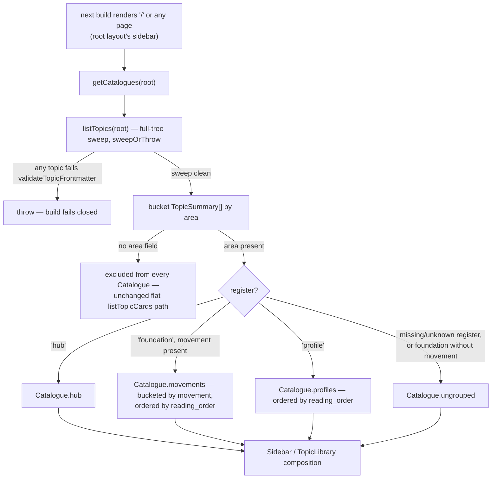

## Data Flows & Business Logic

*How data moves through the three paths the display patch adds: the group-by-area accessor
feeding the library and sidebar, the foundation reading-order rail, and the hub's freshness
rollup. All three are build-time-only reads with no write path — `services/site` has never had
one (`docs/architecture/index.md` §4: site "does not own: content mutation"), and this bet does
not add one. Every other flow this bet touches (a single topic's article render, a changelog
page, a version archive) is unchanged from the archived `first-living-topic` technical design
and `docs/architecture/index.md` §5; this file covers only the paths the display patch
introduces, per `research/content-model-audit.md`'s PATCH-tier rows. Trivial CRUD — one
`getTopic` read, one `loadVersion` read — is skipped, per this workflow's own instruction.*

*Flows (b) and (c) both build on flow (a)'s `getCatalogues` accessor rather than re-sweeping
`topics/` independently. Read (a) first.*

---

### (a) Catalogue grouping — area sweep to register buckets

**Trigger:** every static build that renders a page needing the catalogue's shape — the Topic
Library (`/`), the root layout's sidebar tree (every page, via `app/layout.tsx`), and,
indirectly through flows (b) and (c), any foundation or hub page. Next.js's static export means
this runs once per `next build`, never per request — there is no runtime trigger
(`docs/architecture/index.md` §1, "Scale-to-zero").

**What persists:** nothing. This is a pure read composed entirely from `topics/*/article.md`
frontmatter already on disk. No new file, cache, or derived artifact is written anywhere.

**Business logic & routing:** `getCatalogues` (new, `services/site/lib/content.ts`) sweeps the
full `topics/` tree through the same fail-closed path every other whole-catalogue accessor
already uses — `sweepOrThrow`, the function `listTopicCards` and `listSiteChangelog` both call
today. A single malformed topic anywhere, in any area, still fails the whole build
(01-ui-design.md's Error row for this view: "exactly like `listTopicCards`' existing
`sweepOrThrow` behavior"). The sweep result then buckets three ways, generically — nothing in
this logic names "databases," "foundation," or any instance slug (see Key decisions):

1. Every `TopicSummary` carrying a non-blank `area` joins that area's `Catalogue`. A topic with
   no `area` at all joins none — it stays exactly as visible today, through the unchanged flat
   `listTopicCards` path.
2. Within one area, `register` routes the topic. `'hub'` becomes `Catalogue.hub`. `'profile'`
   joins `Catalogue.profiles`, ordered by `reading_order` ascending. `'foundation'` **with** a
   non-blank `movement` joins that movement's bucket inside `Catalogue.movements`, ordered by
   `reading_order` ascending within the bucket. Movements are ordered by the lowest
   `reading_order` any of their members carries, so movement order is a property of the data —
   never separately authored.
3. Anything left over — `register` missing or not one of the three known values, or a
   `'foundation'` missing `movement` — lands in `Catalogue.ungrouped`, never silently dropped.

Every field driving this routing is additive and unvalidated (`04-data-design.md`). A topic
carrying none of them today — the live `topics/databases/article.md`, pre-recut — simply
produces zero `Catalogue`s, and both the sidebar and the library fall back to their current flat
rendering, untouched. The mid-rollout interim frame 01-ui-design.md wireframes (the v2 essay,
unchanged, with the rollup band already above it) is this exact case, not a special one: once
an early wave sets `area`/`register: hub` on the hub topic's frontmatter, the rollup band
(flow c) starts working immediately, independent of when that topic's body prose re-cuts.

**Key decisions:**

- **Grouping lives in `services/site`, not `core`.** Register, movement, and reading order are
  display concerns — which shelf a card sits on — not content-contract concerns.
  `@staycurrent/core` only needs to pass the raw optional fields through
  (`03-api-design.md`'s `validateTopicFrontmatter` entry) and stays completely ignorant of what
  "foundation" or "profile" means.
- **No area is ever hardcoded.** `docs/architecture/index.md` §4 commits that engine code —
  `core/`, `services/site/`, the workbench skills — "never names the instance." `getCatalogues`
  therefore takes no area argument and returns one `Catalogue` per distinct `area` value the
  sweep actually finds, rather than a function scoped to the literal string `"databases"`. A
  hardcoded or config-supplied single area was rejected: staying generic costs almost nothing
  here, and a hardcoded area is exactly the instance leak the architecture's own boundary
  forbids, not a stylistic preference.
- **Malformed beats missing, but never fails the build.** A `register` value misspelled as
  `'foundaton'`, or a `reading_order` authored as the string `"5"` instead of the number `5`, is
  treated as absent — it routes to `ungrouped` — never as an issue `validateTopicFrontmatter`
  raises. Silent-and-safe was chosen over clever coercion (auto-correcting `"5"` to `5`) because
  coercion hides an authoring mistake instead of surfacing it, and this design has no gate check
  to surface it through instead — a no-go from the pitch.



---

### (b) Foundation reading-order and prereq resolution

**Trigger:** the static build renders a topic page (`/[topic]/`) whose live frontmatter carries
`register: 'foundation'` — one of the 17 foundation pages, never a profile and never the hub
(01-ui-design.md: "only on the 17 foundation pages — never on a profile, never on the hub").

**What persists:** nothing. A pure read, resolved fresh on every build from whatever the sweep
currently contains — which is why the rail is correct at every wave boundary without a code
change.

**Business logic & routing:** `getReadingPosition` (new, `content.ts`) takes the page's
already-loaded `TopicFrontmatter` — the caller already holds it from `getTopic(slug)` for the
page's other needs (trust header, body), so this function does not re-load the topic, matching
`content.ts`'s established "read once, pass in" shape (`getTopicVersion`'s own doc comment names
the precedent). It resolves in three steps:

1. **Guard.** If `register !== 'foundation'`, or `area` is blank, or `reading_order` is not a
   positive integer, return `null` and the caller renders no rail at all. This makes the rail
   fail *soft*, not closed: a foundation that has not yet been annotated with these fields does
   not break the build — these fields are unvalidated by design — it simply has no rail yet.
2. **Locate.** Call `getCatalogues(root)` (flow a), find the `Catalogue` whose `area` matches,
   and flatten its `movements` into one list ordered by `reading_order`. That flattened list
   *is* the 17-piece reading path; movements are a presentational partition of it, not a second
   ordering. Find this topic's own position in that list: its 1-based index and the list length
   give `indexInPath`/`totalInPath`; its index and count within just its own movement's bucket
   give `indexInMovement`/`totalInMovement`.
3. **Resolve links.** For each slug in `prereqs` (if any), look it up in the same flattened
   list. Found: use its real title. Not found — the piece has not cut yet, or the slug was
   mistyped — fall back to a humanized form of the slug itself (split on `-`, capitalize each
   word: `distributed-transactions` becomes "Distributed Transactions"), so the rail never shows
   a raw slug or blank text; the link still points at the real URL and 404s until that piece
   lands, exactly as 01-ui-design.md's Degraded row specifies. For `next`: the entry immediately
   following this one in the flattened list, or `null` if this is the last piece. `next` is
   never a free-text pointer, so it can never dangle — by construction it only ever names a slug
   the current sweep has already proven exists. When `next` is `null`, the caller falls back to
   a hub link.

**Key decisions:**

- **`next` is derived, not authored — this resolves 01-ui-design.md's open decision 2 in the
  safer direction.** That document originally flagged the footer "Continue" pointer as the
  design's most exposed dangling-link risk, precisely because an *authored* forward
  pointer could name a piece that has not cut yet, and it proposed an editorial mitigation
  ("only add 'Continue' once the next piece has actually cut") as a stopgap until a future
  link-graph-validation bet closes the gap for real. Deriving `next` from the same live sweep
  that already proves `prereqs`' backward links exist removes the *forward* risk mechanically,
  today, with no new field and no editorial discipline to remember across six waves. See
  `04-data-design.md`'s Decisions for the operator for the recommendation this produces: adopt
  "header-and-footer, unconditionally" rather than the header-only fallback.
- **Prereq resolution still cannot promise existence, and does not try to.** `prereqs` stays
  free text (`04-data-design.md`) because validating it — existence, acyclicity — is explicitly
  deferred as its own small bet (`research/content-model-audit.md`'s BET tier). Adding that
  validation here would be a gate check this bet's no-gos forbid. The humanized-slug fallback is
  a display nicety, not a correctness guarantee.
- **The function is total.** `getReadingPosition` never throws. Every loader in this codebase
  fails closed on the seven required frontmatter fields because they are load-bearing state
  ("currency is never guessed," `docs/architecture/index.md`); `movement` and `reading_order`
  are not — they are optional display data, and a foundation missing them should render
  normally, just without a rail.

```mermaid
sequenceDiagram
    participant Page as "/[topic]/page.tsx (foundation)"
    participant Content as "content.ts"
    participant Core as "@staycurrent/core loaders"
    Page->>Content: getTopic(slug) — already needed for the trust header/body
    Content->>Core: loadTopic(root, slug)
    Core-->>Content: Topic { frontmatter, ... }
    Content-->>Page: Topic
    Page->>Content: getReadingPosition(topic.frontmatter, root)
    Content->>Content: guard — register, area, reading_order all present and valid?
    alt guard fails
        Content-->>Page: null
        Page->>Page: render no rail
    else guard passes
        Content->>Content: getCatalogues(root) [flow a]
        Content->>Content: flatten this area's movements; locate own slug
        Content->>Content: resolve prereqs[] — found: real title; not found: humanized slug
        Content->>Content: resolve next — following entry, or null
        Content-->>Page: ReadingPosition
        Page->>Page: render rail; "Continue" points at the hub when next is null
    end
```

---

### (c) Catalogue freshness rollup

**Trigger:** the static build renders the area's hub page — the one topic per area whose
frontmatter carries `register: 'hub'` (01-ui-design.md's "The `/databases` Hub" view; today
that is the `databases` topic, but nothing in the mechanism names it).

**What persists:** nothing. Every number in the rollup band is recomputed from whatever the
sweep currently contains, which is why it reads correctly at every wave boundary without a code
change (01-ui-design.md's Empty/interim row: "the true live count..., never a hardcoded 25").

**Business logic & routing:**

1. The hub page calls `getCatalogues(root)` (flow a) and takes the one `Catalogue` matching its
   own `area`.
2. It flattens that `Catalogue` — `hub` plus every `movements` entry plus every `profiles` entry
   plus `ungrouped` — into one list of `{slug, version}` pairs. `ungrouped` topics count here: a
   foundation with a broken `register` is still a real, published, freshness-bearing piece of
   the catalogue and must not silently vanish from the total.
3. For each pair it calls the existing `getTopicCutDate(slug, version)` (unchanged, `content.ts`)
   — the same accessor the trust header and the sidebar's own per-item freshness dots already
   call, reusing rather than duplicating the one place that knows freshness keys on a version's
   **cut date**, never `last_researched` (`freshness.ts`'s own rule: a no-cut run must not light
   the dot).
4. The resulting `{slug, title, cutDate}` list is handed to `summarizeCatalogueFreshness` (new,
   `services/site/lib/freshness.ts`) — a pure function with no filesystem access — which applies
   the existing `isFresh` 14-day window per entry to get `freshCount`, and picks the entry with
   the latest `cutDate` as `mostRecentlyCut` (ties broken by slug ascending, the same tie-break
   `listSiteChangelog` already documents for same-day cuts).

**Key decisions:**

- **The rollup counts every topic in the area, including `ungrouped` ones.** The Instrumentation
  Strip's promise is "how much of this catalogue exists and how current is it" — a claim about
  the area, not about the grouping's cleanliness.
- **Freshness math stays in `freshness.ts`, not `content.ts`.** `freshness.ts`'s existing
  docstring already draws this line: "Pure date math — no `@staycurrent/core` call." `content.ts`'s
  job stops at handing back facts (`cutDate` per topic); every existing caller —
  `app/layout.tsx`'s `buildTopicNavEntries`, `app/[topic]/page.tsx`'s trust header — already
  composes the two modules this same way rather than having `content.ts` reach for `isFresh`
  itself. `summarizeCatalogueFreshness` is new because this specific composition (many dates in,
  one summary out) has no existing precedent to reuse; every current call site handles exactly
  one date.
- **`getTopicCutDate` fans out per topic, not one batched read.** At most 25 extra `loadVersion`
  calls at build time (the design's own topic ceiling, `research/content-model-audit.md`), each
  two small file reads. The filesystem is already the system's whole content store
  (`docs/architecture/index.md` §3), and batching or caching this would be complexity spent on a
  cost too small to matter — a static-export system pays this once per deploy, never per
  request.

```mermaid
sequenceDiagram
    participant Page as "/[topic]/page.tsx (hub)"
    participant Content as "content.ts"
    participant Core as "@staycurrent/core loaders"
    participant Fresh as "freshness.ts"
    Page->>Content: getCatalogues(root) [flow a]
    Content->>Core: listTopics(root)
    Core-->>Content: TopicSummary[]
    Content-->>Page: Catalogue for this area
    Page->>Page: flatten hub + movements + profiles + ungrouped → {slug, version}[]
    loop each entry
        Page->>Content: getTopicCutDate(slug, version)
        Content->>Core: loadVersion(root, slug, version)
        Core-->>Content: VersionSnapshot.cut
        Content-->>Page: cutDate
    end
    Page->>Fresh: summarizeCatalogueFreshness(entries)
    Fresh->>Fresh: isFresh(cutDate) per entry (14-day window); pick latest, ties by slug ascending
    Fresh-->>Page: CatalogueFreshness { totalCount, freshCount, mostRecentlyCut }
    Page->>Page: render Instrumentation Strip
```
