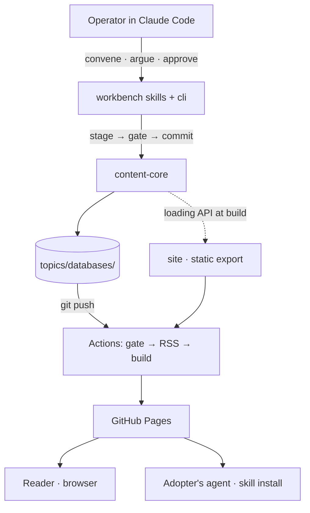

# Bet: First Living Topic — Databases

## The Pitch

- **Problem:** Opinionated technical guides decay from the moment they publish, and the AI skills that encode the same stances rot invisibly alongside them. Stay Current's premise is that a publication can maintain itself: one operator, inside a Claude Code session, publishes an opinionated living topic — article and companion skill cut together, provenance visible — and keeps it current through a gated research loop. This MVP tests that premise as a hypothesis: **can the full loop close once, end to end, without the operator hand-editing around the machinery?** If it cannot — if a trustworthy version cut requires bypassing the gate, or the loop costs more effort than the trust it produces — the product premise fails, not just a feature.
- **Appetite:** The whole current cycle. This is the founding bet: more topics, wider distribution, and framework extraction are all worthless until the loop demonstrably closes once. Capped at one focused operator-week of attention — if the loop cannot close inside that, we stop and re-examine the premise rather than extend the cycle.
- **Stakes:** Blast radius is small — greenfield, zero readers, one operator, no external consumers of any contract yet. Reversibility is high — a static site and a git-versioned content tree; any artifact reverts in one commit. The real stake is the **contract this bet sets**: the `topics/` schemas, gate semantics, and article anatomy shipped here are inherited by every future topic, so an error compounds across the catalogue. That is what earns the review rigour — the gate, the domain invariants, and front-door proofs at every milestone.
- **Solution:** Build the embedded `content-core` (contract types, fail-closed publish gate, content loading API, RSS generation) over the `topics/` tree. Seed `topics/databases/` — a living article on databases (relational, document, key-value, columnar, vector, graph; how to choose; the convergence trend; practitioner mental models) with a companion skill authored to the same stance, cut together as v1 through the gate. Render both through the site's committed routes and trust apparatus. Give the operator the workbench — `workbench/cli.mjs` plus Claude Code skills — to convene research runs and execute gated cuts. Publish through GitHub Actions to Pages: gate → RSS → build → deploy, fail closed.
- **Success Signal:** Three observations, each through the real front door, each falsifiable:
  1. A cold reader opens the deployed site in a browser, reads the databases article at v1, and can see its currency — version, last-researched date, changelog, provenance — without any explanation.
  2. A fresh Claude Code session installs the companion skill from the site's install page and answers a database-selection question in the article's stance — pass means the recommendation follows the article's published selection heuristic and names the same trade-offs; a generic answer that ignores the heuristic is a fail.
  3. The operator convenes a research run against the live topic and the run resolves through the mechanical gate — a legitimate v2 cut or an honest no-cut — with zero hand-edits outside the gate. A failure here is a "no" to the hypothesis, not a bug to patch around.

### Topology

## Rabbit Holes & No-Gos

**Rabbit Holes**

- [ ] Risk: the databases article balloons into an encyclopedia — Guard: strong-not-exhaustive v1 scoped to the operator-directed coverage; the writer skill's depth bar governs; the research loop exists precisely to improve it cut by cut.
- [ ] Risk: mermaid client rendering and dual-theme diagram styling eat frontend time — Guard: reuse the proven remark transform from the framework's docs-site generator; the design system already commits the reserved-space and theming rules; no experimentation with build-time rendering.
- [ ] Risk: version-route edge cases under static export (current-version redirect, archived banner persistence) — Guard: design phase fixes the exact rendering rules; a throwaway proof-of-concept in design (Step 1.92) if the `trailingSlash`/redirect interplay surprises.
- [ ] Risk: the publish gate creeps toward a workflow engine — Guard: the gate is directory-completeness plus frontmatter checks, exactly as the design system specifies; anything richer is a future bet.
- [ ] Risk: the research-run skill sprawls into scheduling and autonomy — Guard: manual convene only; the skill is instructions plus deterministic scripts; no cron, no batch runs, no unattended anything.

**No-Gos**

- [ ] Search or command palette — the sidebar is the index; escalation trigger is ~25 topics (design-system decision).
- [ ] Visual diff between versions — the changelog entry is the returning reader's diff; deferred until readers ask for more.
- [ ] A second topic — catalogue growth proves nothing new about the loop; it dilutes the signal.
- [ ] Skill registry, installer, or package manager — the zip plus install one-liner is the committed distribution (ADR 0005).
- [ ] Framework extraction into a distributable package — post-MVP bet; the engine-never-names-the-instance rule keeps it cheap later.
- [ ] Analytics or readership measurement — the product measures currency, not clicks; readers beyond the operator are upside, not survival (product brief).
- [ ] Comments or community features — readers will expect them on a publication; excluded permanently by the product brief.
