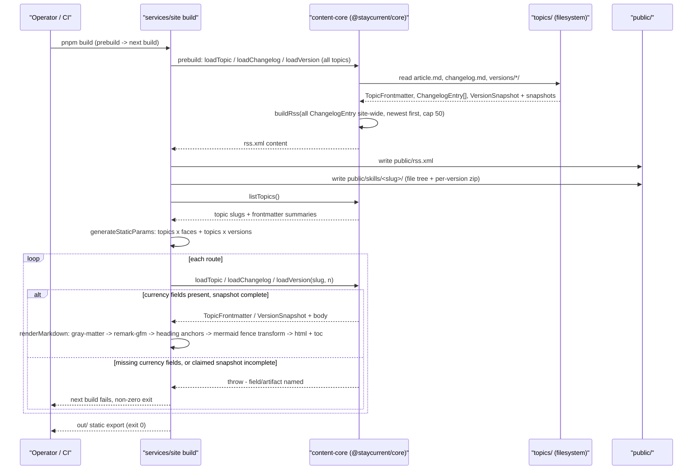
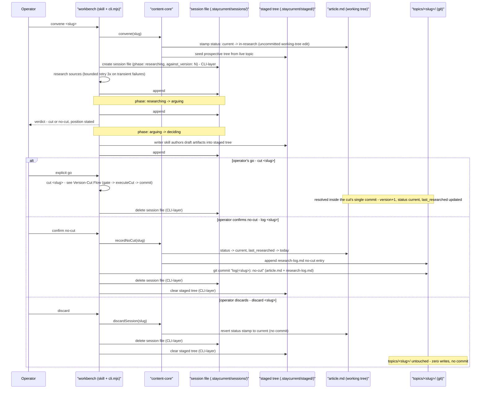

## Data Flows & Business Logic

*How data moves through the system, the business logic that governs it, and the routing decisions along the way — diagram-heavy, does not redraw the topology (the pitch's Solution owns that). Skip trivial CRUD; a flow with no non-obvious timing, ordering, routing, or failure mode does not belong here.*

---

### Site Build Data Flow

**Trigger:** `next build` inside `services/site` — invoked locally (`pnpm build` / `pnpm start:static`) or as a stage of the Publish Flow below. `package.json`'s `prebuild` lifecycle script runs first and unconditionally, before `next build` starts.

**What persists:** Nothing in `topics/` — this flow is read-only over content. It writes build output only: `services/site/public/rss.xml`, `services/site/public/skills/<slug>/` (browsable file tree + per-version `.zip`), and `next build`'s own `out/` static export. None of it is git-tracked as published truth; it is regenerated from `topics/` on every build.

**Business logic & routing:** The `prebuild` script calls `@staycurrent/core`'s loading API — `loadTopic`, `loadChangelog`, `loadVersion` — for every topic, and `buildRss` folds every `ChangelogEntry` site-wide into `public/rss.xml` — newest first, capped at the 50 most recent entries across all topics (each RSS item is a changelog entry, verbatim — no separate feed-authoring step). This prebuild is `buildRss`'s only caller: the feed is a build artifact of the site, never something the workbench writes. The same pass copies each topic's current `skill/` into `public/skills/<slug>/` and materializes a `.zip` per version from the matching `versions/vN/skill/` snapshot — both artifacts come from files the gate already validated at cut time, never re-derived. `next build` then calls `listTopics` to drive `generateStaticParams`, enumerating routes as topics × faces (`article`, `changelog`, `history`, `skill` — one route each per topic) plus topics × versions (`/[topic]/v/[n]`, one route per snapshot `1..current`). Each route's render calls `loadTopic`/`loadChangelog`/`loadVersion` and pipes the returned body through `renderMarkdown`: `gray-matter` (already applied by the loading API) → `remark-gfm` (tables, autolinks) → heading-anchor injection (TOC deep links) → the mermaid-fence transform (rewrites fenced mermaid code blocks into a client-rendered marker, leaving the fenced source intact for no-JS readers) → `{ html, toc }`. The `/[topic]/v/[n]` page for `n === current version` redirects to `/[topic]` — the redirect target is fully known at build time, so it costs nothing dynamic. `superseded` is computed here, once per version route, by comparing the snapshot's `N` to the live `TopicFrontmatter.version` — it is never read from a stored field. Instance-specific values (site title, domain) resolve from `site.config.json`, never from a hardcoded string in `services/site` — the engine/instance boundary holds even inside this flow.

Two independent things can fail this build, and they are not the same check. When this flow runs as a stage of the Publish Flow, the full five-artifact `runPublishGate` has already run as a separate CI step *before* `prebuild` starts — a gate failure means this flow never begins. Independently of that, `loadTopic` and `loadVersion` enforce the narrower currency-field NFR ("currency is never guessed") at load time, on every invocation, regardless of whether a gate run preceded it: a topic or snapshot missing `version` or `last_researched` throws, and the throw propagates as a non-zero exit from `next build`. This is why a standalone `pnpm build` — run locally, with no CI gate step wrapping it — still fails safely on a malformed topic even though no full gate ran.

**Key decisions:** Fully synchronous, in-process, build-time-only reads — there is no caching layer between `topics/` and the rendered page because every build re-reads the whole tree fresh; a stale read is structurally impossible within one build. Diagram rendering is deferred to the browser (client-side mermaid) rather than attempted at build time, so a malformed mermaid fence degrades the diagram, not the build.

**Failure modes:** a topic or snapshot missing `version`/`last_researched` → `loadTopic`/`loadVersion` throws, non-zero exit; a `changelog.md` entry claiming a `versions/vN/` directory that is absent or incomplete (only possible if the gate was bypassed, e.g. a hand-edited commit reached this flow without CI's gate step) → `loadVersion` throws, non-zero exit; a malformed mermaid fence → non-fatal, renders as inert fenced source until a reader's browser attempts it — never a build failure; the `prebuild` script's own I/O failure (cannot write `public/rss.xml` or a skill zip) → non-zero exit before `next build` is invoked at all, per the npm lifecycle contract.

**Consistency notes:** The entire site build reads one immutable git checkout at one commit — every route sees the same coherent snapshot of `topics/`, so there is no read-skew window between, say, a topic's article and its changelog. Nothing here is eventually consistent; it is build-time-consistent by construction, because the build is the only consumer and it reads once, synchronously, in-process.



---

### Version-Cut Flow

**Trigger:** The operator's explicit go — following a convened research run's verdict (see the Research-Run Flow below), or the founding v1 of a new topic (e.g. `topics/databases/`): `workbench/cli.mjs create <slug>` seeds a staged topic skeleton through core's `createTopic(slug)`, and that skeleton cuts through this identical gate and path — topic creation is not a bootstrapped exception.

**What persists:** In one git commit, `cut(<slug>): v<N>` — `topics/<slug>/versions/vN/` (`article.md`, `skill/`, `provenance.md`), `changelog.md`'s new `## vN` entry prepended, the live `article.md` frontmatter (`version → N`, `last_researched`, `status → current`), the live `skill/` replaced byte-identical to `versions/vN/skill/`, and `research-log.md`'s cut entry. The cut is atomic across five artifacts — the snapshot's `article.md`, `skill/`, and `provenance.md` in `versions/vN/`, the `## vN` entry atop `changelog.md`, and the RSS item generated at site build from that changelog entry verbatim (Version's atomicity invariant; the fifth artifact needs no write here because the changelog entry *is* its source). The live-tree updates and the research-log entry ride in the same commit as the record of the cut, not as additional artifacts of the invariant.

**Business logic & routing:** By the time `cut <slug>` runs, `.staycurrent/staged/<slug>/` (gitignored, basename == slug) already holds the complete prospective tree — the *would-be* state of `topics/<slug>/` after this cut, not a mutation of the live tree. It was seeded at `convene` (core's `convene(root, slug)`, which seeds via `stageCut`) or `create` (core's `createTopic(slug)`), and the research/writer skill authored the draft artifacts **directly into it** — the article rewrite, the `versions/vN/` snapshot, the changelog entry, `provenance.md`, the skill deltas. The quarantine is workbench-writable by design: the core-only mutation rule guards `topics/` specifically, not the staging area. The session file's `## Draft` is session narrative — the record of what is proposed and why — never the artifact source; the staged tree is. `workbench/cli.mjs cut <slug>` then makes three explicit sequential calls, no core function wrapping another. (1) `runPublishGate(staged)` returns a `GateResult` — filesystem inspection against the staged set: `versions/vN/` contains `article.md`, `skill/`, `provenance.md` (`ProvenanceRecord` — at least one entry across `## Sources`/`## Synthesis`); `changelog.md`'s top entry is `## vN`; `article.md` frontmatter carries `version: N`; `skill/SKILL.md` frontmatter carries `article_version: N`; live `skill/` is byte-identical to `versions/vN/skill/` — where "live" means the state `topics/` *will* hold post-commit, so nothing is at risk while the gate runs. (2) On pass, `executeCut(root, slug, gateResult)` — content-core moves the staged set into `topics/<slug>/`, pure filesystem mechanics, no git operation; it takes the `GateResult` as an argument and refuses anything but a pass, so the gate cannot be skipped by calling order. (3) The CLI issues the single `git add` + `git commit` — the CLI, not content-core, owns the git commit, which is what makes "one cut is one commit" an invariant of the tool that runs it rather than a convention content-core could be called around. The (gitignored) session file is deleted afterward as CLI-layer cleanup — core never touches `.staycurrent/sessions/` — not as part of the commit.

**Key decisions:** Synchronous, single-writer — one operator, one CLI process, sequential invocations, so there is no concurrent-cut race to arbitrate. Staging against the *prospective* tree rather than the live one is the design that makes a failed cut a true no-op against published content: the gate's failure mode and its success mode both leave `topics/` in exactly one of two states (unchanged, or the new version), never a third, partial state. Seeding the staged tree at convene/create and letting the skill author into it directly means the gate validates byte-for-byte what the skill wrote — no transformation step between draft and gate input where drift could creep in. Keeping `cut` as three explicit calls orchestrated by the CLI — gate, execute, commit — rather than one core wrapper makes the gate visible in the call sequence and keeps each core function single-purpose; splitting "write" (`executeCut`) from "commit" (the CLI) keeps content-core's contract a pure typed module API with no VCS dependency, while still making the commit boundary exact.

**Failure modes:** gate fails on the staged tree → halt (the design system's template: `Blocked` / `Cause` / `State` / `Action`, naming the exact missing artifact), staged set stays intact in `.staycurrent/staged/<slug>/`, `topics/<slug>/` is byte-identical to before, the session file is **not** cleared (resumable) — the skill fixes the named artifact in the staged tree and re-running `cut <slug>` is idempotent, since the gate re-inspects the same staged paths and an already-correct artifact simply passes. A crash between `executeCut`'s filesystem write and the CLI's git commit is the one real gap in this flow: the working tree could hold uncommitted mutations with no matching commit. Re-entry is still safe — re-running `cut <slug>` re-runs the gate over the still-intact staged tree; if the working tree already matches the staged output, the gate passes immediately and the CLI commits; if it doesn't, the gate names the discrepancy and halts, same as any other failure. Reserved-slug collision (a topic slug matching `skills`, `changelog`, `about`, `rss.xml`) and article/skill version-binding drift are both gate rejections, named the same way.

**Consistency notes:** Atomicity comes from git's commit semantics, not a database transaction — `executeCut`'s writes and the CLI's commit are two steps, not two-phase-committed, which is why the crash window above is named rather than hand-waved. Rollback is git: reverting the commit restores every artifact of the cut atomically, because the cut was one commit — no bespoke undo path exists or is needed.

```mermaid
sequenceDiagram
    participant O as Operator
    participant Sk as "research/writer skill"
    participant Wk as "workbench/cli.mjs"
    participant Core as "content-core"
    participant St as ".staycurrent/staged/<slug>/"
    participant Sq as ".staycurrent/sessions/<slug>.md"
    participant T as "topics/<slug>/ (git)"

    Note over St: seeded earlier - convene() [via stageCut] at convene, or createTopic(slug) at create
    Sk->>St: author draft artifacts (article rewrite, versions/vN/, changelog entry, provenance.md, skill deltas)
    Sk->>Sq: append ## Draft narrative (what is proposed and why - not the artifact source)
    O->>Wk: explicit go - cut <slug>
    Wk->>Core: (1) runPublishGate(staged)
    Core->>St: inspect staged tree (five-artifact checks + version binding)
    Core-->>Wk: GateResult
    alt gate passes
        Wk->>Core: (2) executeCut(root, slug, gateResult)
        Core->>T: move staged set into topics/<slug>/ (filesystem mechanics, no git)
        Core-->>Wk: artifact paths
        Wk->>T: (3) git add + commit "cut(<slug>): v<N>" (single commit)
        T-->>Wk: commit sha
        Wk->>Sq: delete session file (CLI-layer cleanup, not part of the commit)
        Wk-->>O: cut report - paths
    else gate fails
        Wk-->>O: halt - Blocked / Cause / State / Action (exact missing artifact named)
        Note over St,T: staged set intact in .staycurrent/staged/<slug>/; topics/<slug>/ byte-identical to before; session file not cleared, resumable
    end
```

---

### Research-Run Flow

**Trigger:** The operator convenes a run — `workbench/cli.mjs convene <slug>` — typically accepting the workbench's own state-block proposal ("`<topic>` is furthest over — convene it?"). The full CLI command set is `status | create | convene | gate | cut | log | discard` — `create <slug>` seeds a staged topic skeleton (core's `createTopic`) so a founding v1 resolves through the same gate and cut path as any research run. Every command that touches `topics/` does so through a named content-core function, never a hand edit; session-file lifecycle (create/delete) is CLI-layer — core never touches `.staycurrent/sessions/`.

**What persists:** Exactly one of three outcomes. **Cut**: delegates entirely to the Version-Cut Flow above — one `cut(<slug>): v<N>` commit. **No-cut**: `workbench/cli.mjs log <slug>` calls content-core's `recordNoCut(slug)` — research-log entry appended, `last_researched` bumped, `status` reverted to `current` — and the CLI makes the one `log(<slug>): no-cut` commit; no version increments, no new snapshot. **Discard**: `workbench/cli.mjs discard <slug>` calls content-core's `discardSession(slug)` — the working-tree status stamp reverts, the only `topics/` touch — and the CLI clears the quarantine itself: session file and `.staycurrent/staged/<slug>/` both deleted; zero other writes, no commit; `topics/<slug>/` is untouched in git.

**Business logic & routing:** `convene <slug>` calls content-core's `convene(root, slug)`, which stamps `status: current → in-research` into the **working-tree** copy of the live `article.md` — an uncommitted edit, not a git write — and seeds `.staycurrent/staged/<slug>/` with the prospective tree the run will author into (calling `stageCut` internally — the one sanctioned core-calls-core composition); the CLI then creates `.staycurrent/sessions/<slug>.md` (`phase: researching`, `against_version` set to the live version) itself. Neither the status stamp nor the session file is git-tracked truth at this point: the design system states plainly that nothing published ever derives from session quarantine, and that holds for the status stamp too, because it is never committed until the run resolves. Researching gathers sources (transient I/O self-repairs, see Failure modes) into `## Findings`, presented as a ranked digest, never as activity narration. The digest closes the `researching → arguing` transition; `## Argument` accumulates stance points raised and resolved, ending in a stated verdict — cut or no-cut, as a position with a reason, open to the operator's pushback (the propose-vs-prompt rule: propose when the filesystem and findings can settle it, prompt only when the stance itself is genuinely contested). `arguing → deciding` follows the verdict; the research/writer skill authors the draft artifacts directly into `.staycurrent/staged/<slug>/` — the staged tree is the artifact source — while the session file's `## Draft` narrates the proposed cut awaiting the operator's decision. From `deciding`, exactly one of the three branches above fires — `cut`, `log`, or `discard`, each a CLI command orchestrating named core functions. The no-cut resolution is not routed through the five-artifact publish gate — it isn't a version cut, so `recordNoCut` validates only against the narrower schema (the `status` enum, an ISO date), the same class of check the gate itself would apply to those two fields.

**Key decisions:** In-research is a working-tree/session-local signal, never a committed one — the only two states that ever appear in git history for a topic's `status` field are `current` (always, until a cut or no-cut resolution commits) and the resolution itself. This is what makes discard genuinely free: reverting an uncommitted edit and deleting a gitignored file leaves zero trace, with nothing to revert in git. The run's three resolutions are mutually exclusive and terminal — there is no partial or hybrid outcome, mirroring Version's own atomicity.

**Failure modes:** transient research I/O (a fetch, a search) retries three times with backoff (1s/2s/4s), then degrades silently — continuing without that source and recording a provenance gap — unless exhausted, in which case one factual digest line reports it. A session schema violation or unresolvable state halts (`blocking` severity: full diagnostic, no workaround attempted). A crash between `convene`'s uncommitted status stamp and resolution is recovered by cold-start resolution on the next session — surfaced by `workbench/cli.mjs status`: session file present → offer to resume; session file missing → filesystem wins, and the reversion executes through core's `discardSession(slug)` (the same stamp-reversion path as an explicit discard; the CLI has no session file to clean up), reported to the operator — never a hand edit of frontmatter. A gate failure on the cut branch is the Version-Cut Flow's failure mode, inherited unchanged. The operator overruling the stated verdict is not a failure — the argue phase exists precisely to make that the expected path, not the exceptional one.

**Consistency notes:** Because `in-research` never lands in git history, the published audit trail (`git log` over `topics/`) records only resolved outcomes — a cut or a no-cut — never an abandoned line of research. That is a direct consequence of "everything published is git-versioned, with quarantine as the one sanctioned exception," applied to the status field as well as the session body.



---

### Publish Flow (CI)

**Trigger:** `git push` to `main` (a direct push or a merged PR) — the repository's only path to production; no manual upload exists.

**What persists:** GitHub Pages' served static file set, replaced atomically at deploy — never `topics/`. Every step in this flow is a reader over `topics/`, exactly like the Site Build Data Flow it wraps; CI has no write path into content.

**Business logic & routing:** GitHub Actions installs dependencies (`pnpm install --frozen-lockfile`), then runs `runPublishGate` over **every** topic and **every** version snapshot in the tree — not just what changed in this push — through the identical `content-core` code path the workbench's cut used. Full-tree, every push, because the repository (not the operator's machine) is the trust boundary: a hand-edited commit that never went through `workbench/cli.mjs cut` must still be caught here. On a passing `GateResult`, the pipeline runs `prebuild` (RSS + skill payloads) and `next build` — the Site Build Data Flow above, unmodified, now with the gate precondition already satisfied. On a passing build, Pages deploys the static output. Any step failing — install, gate, prebuild, build, or the deploy call itself — stops the pipeline before the next step runs.

**Key decisions:** The gate re-runs in CI even though the workbench already ran it pre-commit — this is deliberate redundancy, not waste, because CI validates commits the workbench never touched. The build triggers on every push to `main`, not on a `topics/`-path filter or a schedule, because one repository carries both the engine and the instance — a framework-code change can affect the deployed output just as a content change can. Deploy is the terminal step with no post-deploy smoke test or automated rollback: reversion is a `git revert` and a re-push, the same "rollback is git" principle the Version-Cut Flow relies on, not a runtime rollback command against Pages.

**Failure modes:** install failure (lockfile drift, registry outage) blocks before the gate runs at all. Gate failure names the exact offending artifact, the same as a local cut, but surfaces as a red CI check rather than an interactive halt — there is no operator in the loop to address a template to. Prebuild failure (an RSS or skill-payload write error) blocks before `next build`. Build failure — a currency-field or snapshot-completeness throw from the Site Build Data Flow — blocks before deploy. A deploy-step failure (a GitHub Pages API error) is the one case where the build succeeded but nothing new shipped; the previous deploy stays live and CI reports red regardless of which step failed.

**Consistency notes:** No partial deploys — GitHub Pages replaces the served file set atomically at the platform level, so there is never a window where old and new pages are served interleaved. RPO is zero and RTO is one rebuild-and-redeploy cycle, because git is the store and the deploy target holds no state of its own: recovering from a bad deploy means fixing the commit and letting the pipeline run again, not restoring anything at the CDN.

```mermaid
sequenceDiagram
    participant Dev as "git push (main)"
    participant GA as "GitHub Actions"
    participant Core as "content-core (CI)"
    participant Site as "next build"
    participant Pages as "GitHub Pages"

    Dev->>GA: trigger
    GA->>GA: install (pnpm install --frozen-lockfile)
    GA->>Core: runPublishGate() over every topics/<slug>/ + versions/vN/
    alt gate passes
        Core-->>GA: GateResult: pass
        GA->>Core: prebuild - buildRss() -> public/rss.xml; skill payloads -> public/skills/<slug>/
        GA->>Site: next build (see Site Build Data Flow)
        alt build succeeds
            Site-->>GA: out/ static export
            GA->>Pages: deploy static files
            Pages-->>Dev: new deploy live
        else build fails
            Site-->>GA: non-zero exit
            GA-->>Dev: red build - previous deploy stays live
        end
    else gate fails
        Core-->>GA: GateResult: fail - artifact named
        GA-->>Dev: red build - previous deploy stays live
    end
```

---

### Reader & Adopter Read Flows

**Trigger:** A reader's browser requesting a page, or an adopter's agent fetching a companion skill — both plain HTTPS `GET`s against GitHub Pages. Neither is multi-step enough to warrant a sequence diagram: each is a single request against a file the Site Build Data Flow already fully decided at build time, with no server on the other end to add a second hop.

**What persists:** Nothing. No accounts, no sessions, no analytics — the site collects nothing about a reader, and a skill-install fetch is a stateless file transfer.

**Business logic & routing:** Every reader page — the article, the changelog, `/[topic]/history`, an archived `/[topic]/v/[n]` — is a static file the CDN serves unchanged; there is no server-side logic to route around. Skill install is one of two equivalent static fetches against `/skills/<slug>/`: the single `.zip` for one-command install, or the browsable raw file tree for manual inspection — both built from the same gate-checked `skill/` snapshot in the Site Build Data Flow, so they can never disagree with each other. The `article_version` binding a skill states is read directly from the fetched `SKILL.md` frontmatter by the consuming agent; nothing server-side checks or enforces it, because nothing server-side exists.

**Key decisions:** No runtime auth, no server logic — every choice a reader's browser or an agent's fetch makes (which zip, which version path) is a client-side decision against files whose content was already fully decided at build time, not a decision the read path itself makes.

**Failure modes:** a nonexistent or mistyped slug is a designed 404 (an honesty state, not a generic framework fallback); requesting `/[topic]/v/[n]` for the current version redirects to `/[topic]` rather than erroring, per the Site Build Data Flow's redirect rule.

**Consistency notes:** The only staleness window in this flow is ordinary CDN edge-cache propagation after a new deploy — never a data-consistency concern, because the origin is immutable static files. A read is either current-as-of-the-last-deploy or a clean 404; there is no state in which it can return a wrong-but-plausible answer.

---

### Data Ownership & Consistency Model

- **`topics/` is owned exclusively by content-core mutations.** Across all five flows above, every write to `topics/` — committed or working-tree — goes through a named content-core function: `executeCut` (the only writer of a version cut, gated by the `GateResult` it requires from `runPublishGate`), `recordNoCut` (the no-cut resolution), `convene` (the working-tree status stamp, seeding the staged tree via `stageCut`) and `discardSession` (the stamp's reversion), and `createTopic` (the staged founding skeleton). All are invoked through `workbench/cli.mjs` (`status | create | convene | gate | cut | log | discard`); hand-editing frontmatter is a violation, not a fallback. The `.staycurrent/` quarantine — session files and the staged tree — is workbench-writable by design: the core-only rule guards `topics/` specifically, and session-file lifecycle is CLI-layer (core never touches `.staycurrent/sessions/`). The Site Build Data Flow and the Publish Flow never write to `topics/` — both are readers, in local dev and in CI alike.
- **site is read-only at build.** The loading API (`listTopics`/`loadTopic`/`loadChangelog`/`loadVersion`) never mutates its source tree; `services/site` has no write path in any flow above.
- **Derived state is never stored.** `due` (topic) and `superseded` (version) are computed at read time by whichever consumer needs them — the workbench computes `due` for its state block, site computes `superseded` for the archived banner by comparing a snapshot's `N` to the live article's `version` — and neither value is ever written to frontmatter. Storing either would let it drift from the fact it restates; deriving it makes that drift structurally impossible.
- **Every flow above is synchronous and in-process; git is the only hand-off between them.** No flow uses a queue, an event bus, or a network call between components. Two properties of this system make that sufficient rather than a shortcut taken early: **single-writer repo** — one operator, one CLI, sequential git commits, so there is never a second concurrent writer for a queue or a lock to arbitrate against; and **build-time reads** — site and CI both re-read the entire `topics/` tree fresh at every build rather than subscribing to change notifications, so there is no long-lived reader to notify and no cache-invalidation or event-ordering problem for an event bus to solve. Git's own commit history is the durable, ordered log an event stream would otherwise exist to provide.
