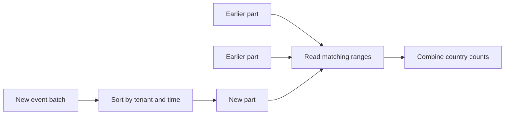
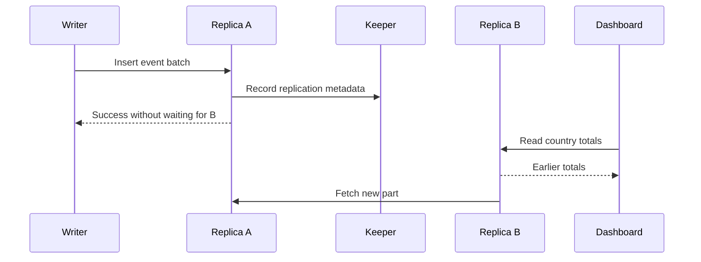

# Column stores: building an events dashboard with ClickHouse

Editorial pilot for `/clickhouse/`, prepared 2026-10-02. The examples and
diagrams are illustrative; they are not benchmark results or executed SQL.

> Column stores make analytical queries cheaper by reading fewer values and
> processing them in batches. ClickHouse combines that layout with sorted,
> immutable data parts. Following one dashboard query explains both the speed
> this design can offer and the work it creates for writes and updates.

Your application records an event whenever someone views a page or completes
a purchase. Each event includes a tenant, time, country, event type, user,
and a larger payload of application details.

The dashboard asks a small question about a large history: how many purchases
did each country produce for tenant A during September? We will build the
storage around that question, then change the workload to find its limits.

## Begin with a file of events

A simple implementation keeps each event's fields together. To answer the
dashboard, scan the events, keep those matching the tenant, month, and event
type, and add one to the appropriate country's count.

| Tenant | Time | Country | Type | User | Payload |
| --- | --- | --- | --- | --- | --- |
| A | Sep 1, 09:00 | SE | purchase | 17 | … |
| B | Sep 1, 09:01 | DE | view | 28 | … |
| A | Sep 1, 09:02 | SE | purchase | 39 | … |
| A | Sep 1, 09:03 | DE | purchase | 42 | … |

Here SE means Sweden and DE means Germany. The answer is two purchases for
Sweden and one for Germany. The user identifiers and
payloads do no work for the query. As the history grows, repeatedly bringing
those bytes into memory becomes wasteful.

A row-oriented database can address particular queries with indexes,
including indexes that contain all the values a query needs. Here we will
explore a different physical layout, useful when many analytical questions
read a few fields across a substantial part of the dataset.

## Put the values the query needs together

Store each column's values together while preserving their correspondence.
The third tenant, timestamp, and country still describe the same event.

```text
tenant    [A, B, A, A]                       read
time      [09:00, 09:01, 09:02, 09:03]       read
country   [SE, DE, SE, DE]                   read
type      [purchase, view, purchase, purchase] read
user      [17, 28, 39, 42]                   skip
payload   […]                               skip
```

The dashboard can leave the user and payload columns alone. Reading four of
six columns does not mean reading two-thirds of the bytes: their sizes and
compression differ. The gain depends on the values the query avoids reading.

Similar values together also offer compression opportunities. A country
column has repeated short codes; a timestamp column may contain small changes
between nearby values. Compression saves storage and transferred bytes, while
decompression requires processor work.

Finally, the engine can apply an operation to a batch of values instead of
handling a complete row at a time. This is **vectorised execution**. It helps
use the processor efficiently; it does not mean vector similarity search.
Column pruning, compression, and batch execution solve different parts of
the same scan problem. [ClickHouse's execution design](https://clickhouse.com/docs/concepts/why-clickhouse-is-so-fast)

## Stop scanning other tenants' events

We still scan values from every tenant to answer a question about A. If the
events are sorted by tenant and then time, A's events occupy a range we can
locate before reading the event details.

ClickHouse expresses that arrangement with a sorting key. An illustrative
table for the dashboard is:

```sql
CREATE TABLE events
(
    tenant_id String,
    event_time DateTime,
    country String,
    event_type String,
    user_id UInt64,
    payload String
)
ENGINE = MergeTree
ORDER BY (tenant_id, event_time);
```

Each sorted data part has a sparse primary index: entries identify groups of
rows that might match. Those groups are called **granules**. The index helps
choose candidate granules; the query still checks values within them.

```text
One part, sorted by (tenant, time)

group 1: A, August       skip
group 2: A, September    read
group 3: A, October      skip
group 4: B, September    skip
```

These are invented group boundaries to show the principle. Real granules can
straddle the range, so the query may read nonmatching rows near its edges.
ClickHouse keeps an index per part, not one ordering across every file in the
table. [Primary indexes](https://clickhouse.com/docs/primary-indexes)

The key now explains a limitation. A query for September across all tenants
cannot select one contiguous interval from this ordering. A query for one
user's complete history has a different problem again. A second arrangement
can help, but maintaining it consumes storage and write work.

Key order is therefore a workload decision. “Put the most selective column
first” is insufficient: which predicates occur together matters, and the
order determines which ranges can be excluded efficiently.
[Sparse primary-index guide](https://clickhouse.com/docs/guides/best-practices/sparse-primary-indexes)

## New events must not rewrite the whole history

Keeping one enormous file sorted would make an out-of-order arrival painful.
Instead, ClickHouse writes incoming batches as new, sorted **parts**. Each
part contains column data and the metadata needed to read it.

For a simple insert into our table, follow the batch: sort its rows by tenant
and time, form the columns, compress their data, and write a new part. A read
now considers several parts and combines their matching rows. New data does
not have to merge with older data before it can be queried.



This diagram omits physical file formats and shows a simple single-node
MergeTree table. The important observation is that the read visits the
relevant ranges in several independent parts.
[Table parts](https://clickhouse.com/docs/parts)

## Small writes create work later

Suppose every event arrives in its own insert and produces a tiny part.
Queries must consider many parts, and the server must manage their files and
indexes. The insert pattern has created a read and maintenance problem.

Background merges combine smaller parts into larger sorted parts. That reduces
the number of parts future queries consider, while spending processor time and storage
bandwidth now. The old parts are retired after replacement. Inserts and
queries share resources with this continuing maintenance.
[Part merges](https://clickhouse.com/docs/merges)

Batching helps because it creates fewer initial parts for the same number of
events. Asynchronous inserts can also buffer arrivals before writing a part.
The price is waiting to form the batch, and the acknowledgement mode matters:
accepting data into a buffer is different from waiting for that buffer to be
flushed. Choose those semantics explicitly for the ingest path.
[Asynchronous inserts](https://clickhouse.com/docs/optimize/asynchronous-inserts)

This gives an operational symptom a cause. If part counts keep growing,
investigate the insert pattern and whether merges can keep up. Increasing
query capacity alone may leave the source of the work unchanged.

## Follow the dashboard read

The query now looks like this:

```sql
SELECT country, count() AS purchases
FROM events
WHERE tenant_id = 'A'
  AND event_time >= '2026-09-01 00:00:00'
  AND event_time < '2026-10-01 00:00:00'
  AND event_type = 'purchase'
GROUP BY country;
```

For each relevant part, the engine uses the tenant and time range to choose
candidate granules. It reads the required column data, checks the predicates,
and accumulates counts by country. Work can run in parallel, with partial
counts combined into the final result.

Three separate questions explain the cost: how many parts must it consider,
how many granules might match, and how many column bytes must it process?
This is more useful than asking whether a table has “an index”. An index can
exist while excluding very little for the actual filter.

## Avoid recounting the same history

If every dashboard refresh asks for the same daily totals, even an efficient
scan repeats work. We can maintain daily counts by tenant, country, and event
type as events arrive.

A ClickHouse incremental materialized view runs a transformation on inserted
blocks and writes the results to a target table. The dashboard can then read
far fewer aggregate records. This shifts computation to ingestion and keeps
an additional representation of the data.

The representation also limits the questions it can answer. Daily country
counts cannot later reveal individual users' paths. Keep the raw events if
those questions matter. Changes to existing source rows do not automatically
recompute an incremental view's earlier results, so corrections need an
explicit design. [Incremental materialized views](https://clickhouse.com/docs/materialized-view/incremental-materialized-view)

## Change an event and the tradeoff becomes visible

Now an upstream correction changes a purchase's country. Our simple model
of immutable parts cannot edit that value in place. The storage system needs
a way to represent the correction and eventually reconcile it with existing
data.

One ClickHouse option is ReplacingMergeTree: insert another version with the
same sorting key, and replacement happens during merges. Until reconciliation,
multiple versions can remain visible to an ordinary query. `FINAL` applies
the replacement rules at query time, which adds read work.

That design needs a stable event identity in the sorting key. Our original
`(tenant_id, event_time)` key is not sufficient: two different events can share
those values. Treating them as versions of one event would change the answer.
An event identifier and a version policy belong in the redesigned schema.
[ReplacingMergeTree](https://clickhouse.com/docs/engines/table-engines/mergetree-family/replacingmergetree)

Other update mechanisms exist. The transferable lesson is to follow how
corrections become visible and how much work they create. A supported `UPDATE`
statement does not establish the same cost or guarantees as a transactional
row store. The dashboard also needs a policy for correcting its rollups.

## A second copy introduces a visibility question

One machine is a failure boundary. Self-managed ReplicatedMergeTree tables
keep copies on several replicas, using ClickHouse Keeper or ZooKeeper for
coordination. Data replication is asynchronous: a replica can learn about
and fetch an inserted part after the accepting replica has answered.



This simplified sequence shows the window that matters to the dashboard.
A successful insert does not by itself mean every replica can answer with
the new data. Losing the only copy before replication completes can also
lose the batch. Insert-quorum settings make acknowledgement wait for more
copies; read visibility still needs a deliberate policy.
[Replicated table engines](https://clickhouse.com/docs/engines/table-engines/mergetree-family/replication)

ClickHouse Cloud changes the mechanism. SharedMergeTree separates shared
object storage from compute and coordinates metadata through Keeper. Adding
compute does not mean copying a whole shard's local files from a peer. Yet
replicas still need to observe the new metadata, so shared durable storage
does not imply immediate visibility everywhere.
[SharedMergeTree](https://clickhouse.com/docs/cloud/reference/shared-merge-tree)

## More copies and more partitions solve different problems

Replicas hold copies of a shard's data. Shards hold different portions of the
data. If one copy cannot hold or process the required dataset, distributing
data across shards creates another design decision: where should each event go?

Routing by tenant keeps one tenant's query local, but a large tenant can
dominate one shard. Spreading that tenant's events makes more machines useful
and requires combining their answers. A Distributed table can route work
across underlying shard tables; it is not itself the local data store.
[Distributed table engine](https://clickhouse.com/docs/engines/table-engines/special/distributed)

The country count combines easily: add each shard's count for SE to the other
SE counts. Exact distinct-user counts need more information, because the same
user may occur on several shards. The operation being distributed matters as
much as the number of machines.

## What carries over to other analytical engines

Column layout, compression, batch execution, and avoiding irrelevant data
are broadly useful analytical techniques. ClickHouse's MergeTree parts,
replacement rules, and replication arrangements are implementation choices.
Knowing the shared ideas helps you ask useful questions about another engine
without assuming it has those same details.

DuckDB offers an embedded analytical engine: the application can query through
a library inside its own process. That changes deployment and ownership of
the workload. A continuously shared dashboard service creates different
operating needs from an analyst's local job.
[DuckDB overview](https://duckdb.org/why_duckdb)

Managed warehouses make further choices about shared storage, independent
compute, scheduling, and billing. Compare those properties against the
workload. Storing columns does not settle query
latency, concurrent-user behaviour, or operating cost.

## Try a different workload

Our dashboard benefits from the design because it aggregates many events,
uses a few fields, and can accumulate data in batches. Its tenant and time
filters also fit the chosen sorting key. Those conditions explain why this
design is worth evaluating.

Now imagine the application needs to reserve the last item in stock while
creating an order. A columnar scan is not the difficult part of that request.
The difficult part is coordinating changing records and enforcing an
invariant. Keep that responsibility in a store designed to provide the needed
transactional guarantees, then feed the analytical view with an explicit
freshness and recovery policy.

Finally, change the dashboard to ask for one user's events across all tenants.
Which choice becomes expensive? The sorting key no longer puts the desired
history together. Columns still help avoid unrelated fields, but they cannot
make the tenant-first ordering serve every access pattern. Consider a second
representation only after deciding how often that query runs and whether the
extra storage and ingest work are justified.

---

Draft evidence note: the linked documentation supports the mechanisms and
product boundaries. Sources were consulted on 2026-10-02. The dashboard,
diagrams, SQL, and workload reasoning
are illustrative editorial synthesis. This draft makes no measured latency or
capacity claim. Publishing requires a version-specific provenance record and
the other artifacts specified by the research skill.
