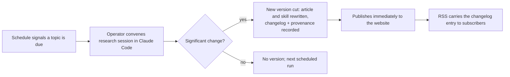

# Stay Current — Product Brief

Stay Current is a publication system whose content maintains itself. Each topic it covers produces a matched pair: a living article — an opinionated, stance-carrying synthesis of a broad practice area such as observability, testing, or cost engineering in cloud environments — and a distributable AI skill that encodes the same stance so an engineer's AI agents implement the practice, not just read about it. A recurring research loop keeps both halves current, rewriting the article and its skill together as the field moves. Every topic carries a version-controlled history, a changelog that explains each change, and the provenance behind each version.

The product is two things sharing one engine. The **framework** is open source: anyone can use it to run a self-researching site on their own topics. The **first site**, staycurrent.dev, is the operator's own publication — the proving ground that keeps the framework honest, covering engineering practice areas for the operator and for other engineers in the same field.

#### System Purpose

Stay Current eases the burden of staying relevant. It does the research and aggregates the movement of each field — the facts and the opinions, as both change — into the two forms an engineer's practice runs on: the writing that states a stance and the AI skills that implement it. It serves engineers who need a trustworthy, current view of a practice area: those learning a topic for the first time, those tracking how it evolves, those who want their AI agents to build to the same standard, and the operators who publish for all of them. It enables a single operator to sustain a library of deep, opinionated articles and their executable counterparts that would otherwise decay or consume their author.

#### The Problem

Staying relevant is relentless work. An engineer's work spans many domains at once — testing, observability, cost engineering, and more — and holding a current, nuanced, *and* opinionated understanding of each one is an unbounded job: the field moves whether or not you were watching, and every domain you stop watching is a stance quietly going stale. No individual sustains that watch across every domain they build in; the burden is the problem.

Technical writing decays the same way, from the moment it is published. Opinionated practice guides are the worst hit: their stances are durable, but the facts supporting them rot — a recommended tool goes dormant, an "experimental" standard stabilises, a platform limitation disappears. A guide that still says any of these things a year later is worse than no guide, because it teaches with authority and is wrong.

The conventional defences both fail. Manual review promises — a `last_reviewed` date in the frontmatter — depend on an author finding time that content maintenance never wins. And abandoning depth for news feeds trades the problem for a worse one: aggregators tell a reader *that* things changed, never what the change means for how they should build.

The same decay now has a second victim. Engineers increasingly encode their practice as AI skills — instruction sets their coding agents follow — and those skills rot exactly as the writing does, except invisibly: a stale article misleads the reader who checks it, while a stale skill silently builds yesterday's practice into today's code. Nothing keeps the opinion and its executable form current, or keeps them consistent with each other.

The reader pays twice. A newcomer cannot tell whether the definitive-sounding article they found reflects the field or its history. A practitioner who already knows a topic has no efficient way to learn what has changed since they last looked — their choices are rereading everything or trusting nothing.

#### Target Users

**Fresh readers — engineers meeting a topic for the first time**

- **Who they are:** Engineers who need to come up to speed on a practice area — observability, testing strategy, cloud cost engineering — and want one deep, opinionated treatment rather than a dozen contradictory blog posts. They value a stance they can adopt or argue with over a neutral survey that decides nothing.
- **Job to be done:** Learn the current state of the practice from a single article they can trust to be current — including which tools are alive, which standards are stable, and which received wisdom no longer holds.
- **Success looks like:** They read the living article as the definitive current take and act on it without cross-checking whether it has silently gone stale. The visible version history and per-version provenance are what earn that trust — the article shows its work instead of asking for faith.

**Returning readers — practitioners staying current**

- **Who they are:** Engineers who already know a topic at the level of the article's previous version. Their scarce resource is attention; rereading a long article to find the three paragraphs that changed is a cost they will not pay.
- **Job to be done:** Learn what has changed in the field — and what it means for how they build — without rereading what they already know. The changelog is their primary document, not a teaser for the article: each entry describes the change and its consequence well enough to stand alone.
- **Success looks like:** They subscribe to the RSS feed, arrive when a new version is cut, read the changelog entry, and leave current — opening the full article only when a change is large enough to warrant it.

**Skill adopters — engineers whose agents build to the stance**

- **Who they are:** Engineers who work with AI coding agents and want those agents to uphold a considered practice rather than improvise one. They may also be fresh or returning readers; what distinguishes them is that they consume the topic through their tooling, not only through their eyes.
- **Job to be done:** Install a topic's skill into their agent environment so the agents implement the current state of the practice — and stay on it as the skill updates with each version cut, instead of freezing the practice at install time.
- **Success looks like:** Their agents' output reflects the article's current stance without the engineer restating it. When a version cut shifts the stance, the feed tells them, and pulling the updated skill takes a moment — they learn of the change from the changelog, never from a discrepancy discovered in code review.

**The operator — the site's author-of-record and first user**

- **Who they are:** An engineer who wants to publish and rely on a current knowledge base without hand-maintaining it. The first operator is the product's builder, publishing on the engineering topics of their own field; the site's usefulness to its own operator is the bar the product must clear before any other.
- **Job to be done:** Sustain a library of deep articles and their companion skills by showing up to a scheduled research conversation — the system does the research, presents what moved, and drafts the rewrite; the operator argues the stance. The dialogue replaces the relentless solo work of watching every field.
- **Success looks like:** The operator treats their own site as their reference — consulting it instead of re-researching a topic, running their own agents on its skills — and trusts the loop enough that versions publish straight out of the research conversation with no separate review pass.

**Builders — engineers who adopt the framework**

- **Who they are:** Engineers outside the first site's field who want the same mechanism for their own topics. The framework reaches them as an open-source project built in the open — its development is public and watchable, which is the point, independent of adoption volume.
- **Job to be done:** Stand up a self-researching site of their own: configure topics, deploy the reader-facing site, and run the same research loop from their own agent tooling.
- **Success looks like:** A builder goes from cloning the framework to a live site with a researched first article without needing the original operator's help.

#### Capabilities

**Living articles.** Each topic is one article: an opinionated synthesis of a broad practice area, written with a stance — what to do, what to reject, and why. The article is always the current truth; when the field moves, the article is rewritten, not appended to. Topics are broad ("testing", "observability", "cost engineering in cloud environments"), so each article is a deep, structured essay rather than a post.

**Companion skills.** Each topic ships a distributable AI skill that renders the article's stance executable: an engineer installs it and their coding agents implement the practice the article describes. The article and the skill are one opinion in two forms — prose for the human, instructions for the agent — and a version cut updates both together, so the skill can never lag the writing it implements.

**Version history and changelog.** Every topic carries its full version history. Cutting a new version produces a changelog entry written to stand alone: it describes what changed in the field and what the change means for the reader's practice, at a depth that spares a reader familiar with the previous version from rereading the article. The history makes the topic auditable — any claim can be traced to when it appeared, what it replaced, and why.

**Provenance — sources and influences.** Each version records what it is based on. Claims that trace to citable material carry their sources; synthesis drawn from the research agent's own domain knowledge is labelled as such rather than dressed in false citations. Distinguishing the two honestly is the trust contract: the reader always knows whether they are reading evidence or informed judgment.

**The research loop.** A schedule dictates when each topic is re-researched. A research run is a conversation in the operator's agent session: the system investigates what has changed in the field since the current version and presents it, the stance is argued, and the run ends in a significance decision — findings that materially affect the topic's claims or stance cut a new version; noise does not. Versions publish straight from that conversation — the version history, changelog, and provenance make every change visible and reversible, which is what makes publishing without a separate review pass safe.

**Distribution.** An RSS feed announces each new version, carrying the changelog entry so subscribers learn what changed from the feed itself. Skills are distributed from the site alongside their articles, versioned so an adopter can see which stance revision their agents are running. The feed is the site's only push channel.

**The framework.** Everything above is reproducible: an open-source framework packages the article model, companion skills, versioning, changelog, provenance, research loop, and reader-facing site so any operator can run an instance on their own topics. The first site is the framework's reference deployment; friction the operator hits is a framework gap by definition.

#### The Experience

Stay Current meets its users through two surfaces: a reader-facing **website** and the **operator's workbench inside Claude Code**. The framework is what makes both reproducible by other builders.

**The reader's journey — the website.** The front door is the topic library. A fresh reader opens a topic and reads the living article top to bottom as the current state of the practice; the version history, changelog, and per-version sources are one step away when they want to audit a claim. A returning reader enters through the other door: the RSS feed announces a new version, the changelog entry tells them what changed and why it matters, and the article itself is a click deeper for the changes worth the full read. A skill adopter takes the third path: from the topic page they install the companion skill into their agent environment, and return for updated skill versions as the stance evolves. Every topic page presents the same faces — current article, its skill, version history, changelog, provenance.

**The operator's journey — Claude Code.** Operating the site is a working conversation, not an application. The schedule surfaces which topics are due. The operator convenes the research workflow from Claude Code; the system researches the field and brings back what moved, and the session becomes a dialogue about what it means — whether the stance holds, bends, or reverses. That conversation is where the opinions earn their keep; the system then weighs significance and either cuts and publishes a new version — article, skill, changelog entry, provenance, RSS — or records that nothing warranted one. The system carries the research burden; the operator brings the judgment.

**The builder's journey — the framework.** A builder clones the open-source framework, configures their topics and schedule, deploys the website, and runs the same Claude Code workflow against their own subscription. From there their experience is the operator's journey on their own domain.

#### Domain Constraints

- **Research runs as a conversation in the operator's agent session, by design.** The research loop executes as workflows within the operator's Claude Code session — the update is a dialogue in which the research is presented to an engineer and the stance is argued before it ships, so opinions are examined rather than auto-refreshed. The system does not operate a hosted, autonomous research service; the schedule signals when a run is due, and the operator convenes it. Running on the operator's subscription rather than per-token APIs is the supporting economics.
- **Every version discloses its provenance.** A version cannot publish without its sources-and-influences record. Citable claims carry citations; agent-knowledge synthesis is labelled as synthesis. The system never presents uncited synthesis as sourced fact.
- **A topic's article and skill never disagree.** They are one stance in two renderings, cut in the same version. A version that updates one without the other cannot publish.
- **Versions publish straight from the research conversation.** The stance is argued during the session; once a version is cut there is no separate approval gate between it and the site. The compensating control is total visibility: version history, changelog, and provenance make every published change auditable and reversible.
- **One operator per site.** A site is a single-operator publication. The framework carries no roles, permissions, or editorial workflow.

#### Out of Scope

- **News aggregation.** The changelog digests what a change means for practice; the system never republishes headlines or streams raw links.
- **Community features.** No comments, no reader accounts, no social layer. Readers are served by the content, the feed, and the skills.
- **Multi-author editorial workflow.** No draft queues, review assignments, or contributor management — the one-operator constraint is permanent, not deferred.

#### Success Indicators

- **The operator relies on their own site.** The operator answers questions in a covered topic by consulting the article rather than re-researching, runs their own agents on the site's skills, and no longer hand-maintains parallel notes or skills on covered topics. This is the product's survival bar.
- **The loop runs on schedule and is trusted.** Scheduled research conversations actually happen when due, and the versions they cut publish with no separate review pass — a sustained cadence of argued-and-shipped updates is the observable form of trust.
- **Changelog entries stand alone.** A returning reader can state what changed and what it means for their practice from the changelog entry only. An entry that forces a full article reread to be understood has failed.
- **Returning readers exist.** RSS subscribers return to the site after a version is cut, and skill adopters pull updated skill versions — readership beyond the operator is the upside signal, valuable but not the survival condition.
- **A builder stands up an instance unaided.** One engineer outside the original field takes the framework from clone to a live site with a researched first article without the original operator's help — the observable form of "building in the open" having produced something usable.
