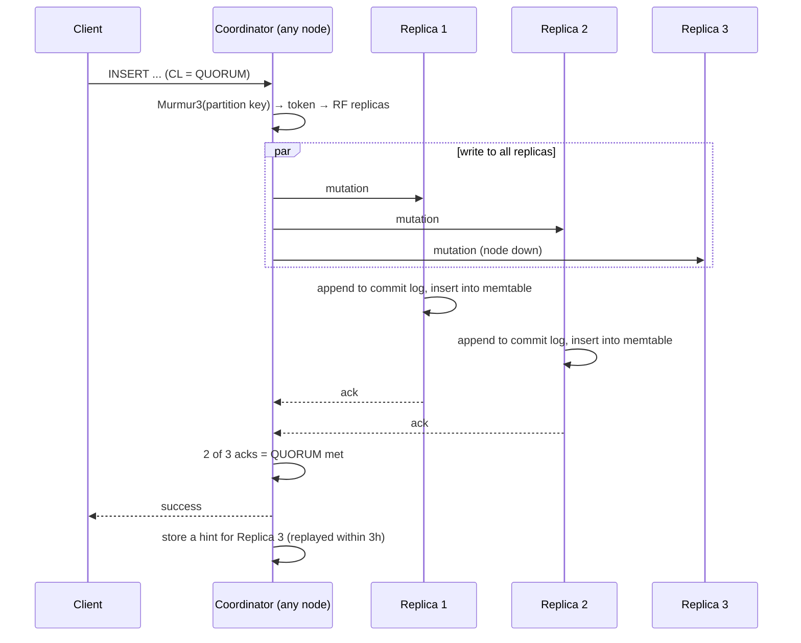

# Cassandra and ScyllaDB

> Cassandra is the database for writes that arrive faster than one machine can take them, when every query is known in advance. It survives a datacentre loss without a failover, and it charges you in query flexibility, in repair and compaction chores, and in a consistency model you tune per request. ScyllaDB is the same design in C++ with one shard per core; it runs the same load on fewer machines, under a licence that stopped being open source in 2025.

This is one of the deep dives behind the [databases overview](/databases/). It covers how Cassandra works underneath: the ring, the write and read paths, compaction, tombstones, repair, and the consistency levels. It covers what you can index, where the transaction story stands now that Accord has slipped to 6.0, how a cluster scales and fails, what it costs to run, and the questions a system-design interview asks about it. ScyllaDB is covered in each section where its C++ reimplementation changes the answer.

## What it is

Cassandra started at Facebook in 2008 as the store behind inbox search, was open-sourced the same year, and became an Apache top-level project in 2010. It joins two designs. From Amazon's Dynamo paper it takes distribution: a hash ring, no leader, tunable quorums, hinted handoff, and anti-entropy repair. From Google's Bigtable it takes the data model: a sorted, wide-column store on a log-structured merge tree. The licence is Apache 2.0 and has never changed.

The current stable release is 5.0.9, published on 7 August 2026 as a bug-fix release on the 5.0 line, which shipped on 5 September 2024. The 4.1 and 4.0 lines still get fixes. The next major version is 6.0, which was going to be 5.1 until the project renamed it. It's at alpha2, also published on 7 August 2026. Its two headline changes are Accord transactions and Transactional Cluster Metadata, and neither is production-ready until 6.0 reaches general availability. The project hasn't published a date; Instaclustr's write-up gives the second half of 2026 as the target.

Most Cassandra is self-managed on virtual machines or Kubernetes, with `nodetool` and a repair scheduler. The managed offerings are DataStax Astra DB (serverless, billed per request), Instaclustr (dedicated clusters billed per node-hour), and Amazon Keyspaces, which speaks the Cassandra query language (CQL) over Amazon's own storage and isn't Cassandra underneath.

ScyllaDB is a reimplementation of Cassandra in C++ on the Seastar framework, started in 2015 by the team behind the KVM hypervisor. It speaks the same CQL protocol and reads the same SSTable format, and it adds a [DynamoDB](/dynamodb/)-compatible API called Alternator. Until 2024 it shipped an AGPL open-source edition and a paid Enterprise edition. In December 2024 the company announced a single source-available product, first shipped as 2025.1. Under the ScyllaDB Source Available License (version 1.1, dated 12 April 2026) you can run it in production free up to 50 vCPUs and 10 TB of storage across your organisation, provided you've never been a paying customer and don't offer it as a service. The current release is 2026.3, published on 8 September 2026. ScyllaDB Cloud is the managed offering.

## Architecture

A Cassandra node is one Java process, and every node is the same. There is no primary and no config server. Any node can take any request and act as the **coordinator** for it, forwarding the work to the nodes that hold the data. Inside the process, work runs on fixed thread pools (32 concurrent readers and 32 writers by default) fed by queues, so an overloaded node shows up as dropped messages rather than a hung process.

Placement is consistent hashing. The partition key is hashed with Murmur3 to a 64-bit **token**, and the tokens form a ring. Each node owns 16 ranges of the ring by default (`num_tokens: 16`, down from 256 before 4.0), called virtual nodes or vnodes. A row lives on the node that owns its token, plus the next nodes around the ring up to the replication factor, chosen from different racks. Nodes learn about each other by **gossip**: every second, each node swaps state with a few random peers. Each node decides for itself whether a peer is alive, using a phi accrual failure detector with a threshold of 8.

The storage engine is a log-structured merge tree. A write goes first to the **commit log**, an append-only file that exists so the node can replay writes after a crash. By default the commit log is fsynced every 10 seconds (`commitlog_sync: periodic`), and the write is acknowledged before that fsync. Then the write goes into the **memtable**, an in-memory sorted structure per table. When the memtable fills it's flushed to disk as an **SSTable**: an immutable, sorted file with a bloom filter, a partition index, per-partition statistics, and a compression map (LZ4 in 16 KiB chunks by default). SSTables are never modified, only merged by compaction and then deleted. Cassandra 5.0 added a trie-based memtable and a trie-indexed SSTable format (BTI), enabled with `sstable.selected_format: bti`.

Here is the write path from client to durable.

Every write goes to every replica whatever the consistency level; the level only decides how many acknowledgements the coordinator waits for. A replica that doesn't answer within the write timeout (2 seconds) gets a **hint**: the coordinator stores the mutation locally and replays it when the replica returns, for up to 3 hours of downtime. After that window the replica stays inconsistent until repair fixes it.

The read path runs the same hops in reverse, with more work at each. The coordinator sends a full data request to one replica and digest requests (a hash of the answer) to as many more replicas as the consistency level needs. It picks the data replica with the **dynamic snitch**. The snitch is the component that knows which rack and datacentre each node is in; the dynamic snitch wraps it and tracks each replica's recent read latency, so the full request goes to the replica that has been answering fastest. On each replica, the read merges the memtable with every SSTable that might hold the partition. The bloom filter rules most files out (default false-positive rate 1 per cent, or 10 per cent under levelled compaction, held off-heap). For the rest, the key cache (5 per cent of heap or 100 MiB, whichever is smaller) or the partition index gives the offset, the compression map gives the chunk, and the chunk cache or the page cache serves the bytes. The rows from each source are merged cell by cell, newest timestamp wins, and tombstones (deletion markers) suppress anything older than themselves. If the digests disagree, a **read repair** runs before the client gets an answer: the coordinator fetches full data from the disagreeing replicas and writes the newest version back. That blocking step is what gives you monotonic quorum reads.

One slow replica would otherwise set the latency of every read that lands on it, so each table has a `speculative_retry` setting, `99PERCENTILE` by default. If the data replica hasn't answered within the table's 99th-percentile read latency, the coordinator sends the same request to another replica and takes whichever answers first. The cost is an extra read on the slowest few per cent of requests, and it can't help at `ALL`, where every replica has to answer anyway. ScyllaDB honours the same table property, and its per-shard scheduler also keeps compaction from starving user reads, so fewer replicas are slow in the first place.

ScyllaDB keeps this design and changes the process model. Seastar pins one thread to each core and gives it its own memory, its own share of every table (a **shard**), its own network queue, and its own I/O scheduler. Nothing is shared between cores, so there are no locks on the hot path, and there's no JVM and no garbage-collection pause. It keeps its own row cache in user space instead of relying on the page cache, because it knows what the bytes mean. The partitioner is still Murmur3 and the SSTable format is compatible, which is how a Cassandra cluster migrates with the same drivers. The consequence is that ScyllaDB scales up before it scales out: the recommended node has 20 to 60 logical cores and 64 to 256 GB of RAM, with a disk-to-RAM ratio of 30:1 as the rule of thumb and 100:1 as the ceiling.

## Data model and indexing

A primary key has two parts. The **partition key** is hashed to place the partition on the ring; every row with that key lives together on the same replicas, sorted on disk. The **clustering columns** order rows inside the partition. So `PRIMARY KEY ((sensor_id, day), ts)` puts one sensor's readings for one day in one partition, sorted by time, and "sensor 7 on Tuesday between 09:00 and 10:00" is one sequential read on one replica. "All sensors above 40 degrees" has no partition key, touches every node, and is refused unless you add `ALLOW FILTERING`.

So you list every query first and design a table for each. Joins don't exist, so if a user's timeline and a channel's message list both need a message, you write it twice into two tables and keep them in step yourself. The documentation calls this query-first modelling and denormalisation.

Partition size is the limit most teams hit. The hard limit is 2 billion cells per partition. The guidance from DataStax, which every operator repeats, is to stay under 100 MB and 100,000 cells, and ideally under 10 MB. A large partition makes compaction slow (the whole partition is rewritten each time), makes repair stream more, and concentrates the load for that key on its replicas. The fix is **bucketing**: add a day, an hour, or a hash suffix to the partition key so one logical stream becomes many bounded partitions. The documentation's sizing formula is simple: cells equal rows times (columns minus key columns minus static columns), plus the static columns. Work it out for the worst case.

Two more shapes matter. **Static columns** belong to the partition rather than the row. **Collections** (list, set, map) live inside a cell and are read whole; a set item is capped at 65,535 bytes and a map at 65,535 keys, and a single value at 256 MiB by default. Keep them small.

Cassandra has had three secondary index implementations, and 5.0 finally has a good one. The original **secondary index (2i)** is a hidden table on each node mapping the indexed value to local partition keys. A query on it has no partition key, so it goes to every node and gathers results; fine for low-cardinality lookups on small clusters, slow everywhere else. **SASI** tried to fix that and is now off by default; treat it as deprecated.

**Storage-attached indexes (SAI)**, new in 5.0, are the ones to use. The index is written into the memtable with the data and flushed as part of each SSTable: a trie with postings lists for text, a kd-tree for numbers and times. The segments share the SSTable's row-id and offset files, so a second or third indexed column costs little extra; the documentation puts the total at 20 to 35 per cent over the unindexed data. The write cost is memtable heap: each indexed column counts against it, so heavily indexed tables flush more often. Queries support equality, ranges, `IN`, `AND` and `OR` across several columns, and `CONTAINS` on collections. A query without the partition key is still a distributed range read, asked in rounds across the token ranges, so it's cheap when selective and a scatter-gather when not. There's no covering index and no partial index; SAI filters, and the row is fetched from the table.

**Vector search** is SAI with a vector type. A `vector<float, 1536>` column can carry an approximate-nearest-neighbour (ANN) index (the jvector library, a DiskANN-style graph on disk), queried with `ORDER BY embedding ANN OF ? LIMIT 10`. Similarity functions are cosine (the default), Euclidean, and dot product; the documentation recommends dot product for normalised vectors because it's about half the cost. ScyllaDB's vector search runs as a separate service and, as of 2026.3, is only in ScyllaDB Cloud.

**Materialised views** are server-side denormalisation: a second table with a different primary key that the server maintains. They're off by default (`materialized_views_enabled: false`). The view key must contain every base-key column plus at most one more, the view write is a read-before-write on the base replica, and an open bug (CASSANDRA-13826) can shadow updates that arrive by hint or repair when a base column is dropped. Most teams I've seen keep their own second table instead. ScyllaDB's global secondary indexes are built on its views and are supported, but on tablet keyspaces the keyspace must stay "RF-rack-valid" (one replica per rack) for as long as the view or index exists.

Counters are a special column type: a 64-bit integer you can only increment or decrement, in a table where every non-key column is a counter. They can't have a TTL, and an increment that times out may or may not have applied, so a retry can over-count.

## Transactions and consistency

Cassandra has no isolation levels because it has no multi-row transactions in the relational sense. What it promises is narrower. A single write to a single partition is atomic and isolated: another reader sees all of it or none. That holds for an `INSERT`, an `UPDATE` touching several rows of one partition, and a `BATCH` that stays inside one partition. Across partitions there is no isolation at all.

A **logged batch** extends atomicity across partitions. The coordinator writes the batch to a batchlog on two other nodes before applying it, so if the coordinator dies the batch is replayed and every statement eventually lands. Readers can still see the partitions change at different moments. A common mistake is bulk loading with a multi-partition batch to "save round trips": the coordinator fans out to every partition's replicas and holds the batchlog, so it's slower than separate writes. The server warns above 10 partitions in an unlogged batch and refuses batches over 50 KiB.

**Lightweight transactions (LWT)** give you compare-and-set on one partition: `INSERT ... IF NOT EXISTS`, `UPDATE ... IF balance >= 10`. They run Paxos among the partition's replicas. In the original implementation that's four round trips: prepare and promise, read the current value, propose and accept, commit and acknowledge. Across datacentres those four trips are the whole latency budget, and contended keys time out (`cas_contention_timeout: 1000ms`). Cassandra 4.1 added Paxos v2, which cuts one to two trips from reads and one from writes. ScyllaDB folds the read into the prepare round and prunes Paxos state in the background. Either way, an LWT is a few milliseconds in one datacentre and tens to hundreds across two, and it serialises everything on that partition. Use it for the uniqueness check or the lock, never the hot path.

A write timeout is not a failure. A `WriteTimeoutException` means the coordinator didn't collect enough acknowledgements within the 2-second write timeout. The mutation may have reached none, some, or all of the replicas, and a hint may still deliver it later. So the client has to decide whether to retry, and the general rule is to retry a write only if applying it twice leaves the same result. A plain `INSERT`, `UPDATE`, or `DELETE` passes that test: it writes cells with a timestamp, and a second copy merges into the first. A counter increment fails it, because a retry can add twice. An LWT fails it too: the compare-and-set may have committed just before the timeout, so a retry finds its own write and reports the condition false, and the only way to know is to read the row back. Appending to a list is a third case, since each append is a new element. The drivers follow the same rule and retry a timed-out statement automatically only if you've marked it idempotent.

Conflicts between plain writes resolve by **last-write-wins**. Every cell carries a microsecond timestamp set by the coordinator (or by the client with `USING TIMESTAMP`), and the newest wins when replicas merge. Two clients updating the same cell at once, or two coordinators with skewed clocks, lose one write silently. There's no vector clock and no conflict callback. If two writers race on a row, give each its own column, or use an LWT. Deletes are writes too: a delete with an older timestamp than a concurrent insert loses.

**Accord** is the project's answer and the reason 6.0 exists. It's a leaderless consensus protocol (CEP-15) for strictly serialisable transactions across any set of partitions, with the fast path completing in one wide-area round trip. The CQL is `BEGIN TRANSACTION ... COMMIT TRANSACTION`, with `LET` to read rows into variables and `IF` to condition the writes on them. Tables opt in with `transactional_mode = 'full'` after a migration, because Accord can't safely read data written by non-serial writes. The trunk documentation suggests staying under five `LET` statements and three partitions per transaction; counters, aggregates, `ORDER BY`, and range deletes are out. As of September 2026 it's alpha. Plan on 2027 before you build on it.

## Replication and failover

Replication is leaderless and per keyspace. `NetworkTopologyStrategy` takes a replication factor per datacentre (`{'dc1': 3, 'dc2': 3}` is the common shape) and spreads each datacentre's replicas across racks. There is no primary to fail over from and no election. A single node's death is a non-event for clients: coordinators mark it down within seconds and its writes collect hints.

Three mechanisms bring a lagging replica back. **Hinted handoff** replays writes missed during up to 3 hours of downtime. **Read repair** fixes whatever a quorum read touches. **Anti-entropy repair** (`nodetool repair`) compares Merkle trees between replicas and streams the differences, and it's the only one of the three that is complete. Incremental repair, the default, only compares data written since the last run; full repair compares everything and is what catches disk corruption. The documented schedule is incremental every 1 to 3 days plus full every 1 to 3 weeks, or full every 5 days on its own.

Repair is mandatory because of tombstones. A delete writes a marker, and compaction may drop that marker after `gc_grace_seconds`, 10 days by default. If a replica missed the delete and the marker is dropped from the others before repair copies it over, the next repair finds the old row on the lagging replica, treats it as new, and resurrects it everywhere. The documentation calls these zombies. So every node must be fully repaired at least once per `gc_grace_seconds`, and the usual advice is every 7 days. Cassandra 5.0.8 backported CEP-37, a repair scheduler inside the database (enabled with `-Dcassandra.autorepair.enable=true`); before it, teams ran Reaper or cron. ScyllaDB schedules repair in ScyllaDB Manager and, in 2026, inside the database.

What a failure loses depends on the level you wrote at. At `ONE`, a single replica acknowledged, and its commit log is fsynced every 10 seconds, so a crash of that node can lose up to 10 seconds of acknowledged writes that hadn't reached the others. At `QUORUM` a majority holds the write, so losing one node loses nothing. Set `commitlog_sync: batch` if an acknowledged write must survive a power cut on the acknowledging node; it costs an fsync per write group.

Replacing a dead node is a bootstrap with `-Dcassandra.replace_address_first_boot`, which streams its ranges from the survivors. Streaming is throttled to 24 MiB/s per node by default, and since 4.0 whole SSTables can be sent with zero-copy streaming. If the node was down longer than the hint window, repair afterwards.

Multi-region is what the design was built for. Each datacentre has its own replicas, and clients write at `LOCAL_QUORUM`: a local majority acknowledges and the cross-region copies arrive asynchronously, so a write costs one local round trip. The remote copies are cheap because of how the coordinator sends them. Rather than message each of the three replicas in the other region, it sends one copy to one of them with a list of the others, and that node fans the write out inside its own datacentre. So a write crosses the wide-area network (WAN) once per remote datacentre whatever the replication factor there, and at `LOCAL_QUORUM` that one message goes out without delaying the acknowledgement. Losing a datacentre loses nothing that reached a local quorum elsewhere, and the application keeps running with no reconfiguration. What you give up is that a reader in the other region may not see the write for the length of the network delay. `EACH_QUORUM`, a majority in every datacentre, closes that gap: a write at that level is held by a majority in each region before the client hears back, at the cost of a cross-region round trip per write. It's a legal read level as well (since 3.0 the only level refused on reads is `ANY`), though waiting on every region for a read is rarely what you want. One trap: plain `QUORUM` counts replicas across all datacentres, so three replicas in each of two regions needs four acknowledgements, and losing a region leaves you short.

ScyllaDB changes one thing here. Since 2025.2, topology and schema live in a Raft group rather than gossip, so node additions, removals, and schema changes are serialised through a log. That makes concurrent topology operations safe. It also means those operations need a Raft quorum of nodes. Data reads and writes carry on without it, but a two-datacentre cluster with equal node counts can't change schema or topology while one datacentre is down. ScyllaDB's advice is a third datacentre, even a single non-data node with `join_ring=false`. Cassandra 6.0's Transactional Cluster Metadata (CEP-21) does the same for membership, token ownership, and schema.

## Scaling

Reads scale two ways. More replicas per datacentre give the coordinator more nodes to spread reads across, at the cost of disk. Caches keep the hot set off disk: the key cache, the chunk cache, and the page cache. Drivers are token-aware, so a good client sends each request straight to a replica and the coordinator hop disappears. There's no read-replica tier and no pooler; every node serves reads.

Writes scale by adding nodes, because the hash spreads them evenly. A new node takes its 16 tokens (placed by an allocator that balances for a replication factor of 3), streams those ranges from the current replicas, and joins. Then `nodetool cleanup` on the old nodes removes what they no longer own. Token count is a documented trade-off: 1 token makes expansion inflexible, 4 is recommended for clusters heading past 30 nodes, 8 gives about 10 per cent imbalance, and 16 suits clusters that grow and shrink often but is not recommended over 50 nodes, because every extra token shares data with more peers.

Hot partitions are the other problem, and adding nodes does nothing for them. A partition lives on exactly RF nodes, so a key that draws a tenth of the traffic puts a tenth of the traffic on three nodes, whatever the cluster size. There's no server-side answer because placement is a hash, so the remedies are in the model. The first is the same bucketing that bounds partition size: put a day, an hour, or a minute in the partition key, and a hot stream rotates onto a new partition, on new replicas, as time passes. The second is **salting**: add a small integer to the key (`channel_id, bucket, shard` with shard 0 to 15), have writers pick one at random, and have readers query all 16 partitions and merge the results. Writes now spread over 16 times as many replicas, and reads pay 16 requests where they paid one. So salt only the keys that need it, and pick the salt count from the number of nodes you want the key spread across. Read heat has a different remedy: a cache in front of the table, because a million readers of the same 50 rows shouldn't reach the database at all.

Rebalancing is where ScyllaDB's **tablets** replace vnodes. A tablet is a slice of one table's token range, about 5 GB by default, with its own replicas. A load balancer coordinated through Raft moves tablets between nodes and shards to equalise disk and load, splits a tablet when the average passes twice the target size, merges below half, and aims for no more than 100 tablets per shard. Tablets stream as whole SSTable files, cleanup is automatic, and several nodes can join at once. They're the default for new keyspaces and can't be toggled on an existing one; you drop and recreate.

The ceilings are mostly per node. The Cassandra documentation says a typical production server has 8 or more cores and 32 GB, with the heap no more than half of RAM, and it doesn't publish a data-per-node figure. The working rule among operators is 1 to 2 TB of data per node, because bootstrap, repair, and compaction all scale with it, and at 24 MiB/s a 4 TB node takes days to rebuild. ScyllaDB's limits page allows 4,096 CPUs per node and "low hundreds" of nodes per cluster, and its 30:1 rule puts a 256 GB machine at about 7.5 TB.

## Consistency versus availability

Cassandra chooses availability. During a partition both sides keep taking reads and writes at whatever level they can still satisfy, and the data is reconciled afterwards by timestamp. The documentation lists the guarantees: eventual consistency of writes to a single table, linearisable LWTs, all-or-nothing logged batches, and secondary indexes consistent with their local replica. Anything stronger you build with the consistency level.

The levels are per request. `ANY` (writes only) succeeds if one replica or even a hint was written. `ONE`, `TWO`, and `THREE` wait for that many replicas anywhere. `QUORUM` waits for a majority of all replicas across all datacentres, `LOCAL_QUORUM` a majority in the coordinator's datacentre, `EACH_QUORUM` a majority in every datacentre (on reads as well as writes), and `ALL` every replica. `LOCAL_ONE` is `ONE` kept local. `SERIAL` and `LOCAL_SERIAL` govern the Paxos phase of an LWT.

The rule that makes them useful is **W + R > RF**: if the replicas that acknowledged a write and the replicas consulted by a read must overlap, the read sees the write. With RF 3, `QUORUM` both ways (2 + 2 > 3) gives you read-your-writes and monotonic reads, at the price of waiting for the slower of two nodes on every request. `ONE` both ways is the fastest request and a read that may return the previous value. `ALL` writes with `ONE` reads satisfy the rule but fail every write when one replica is down, which is the opposite of what the design is for.

What you trade in normal operation is the write-write conflict story. Two concurrent updates to one cell resolve by timestamp, and one is gone with no error. Quorum reads don't help; only an LWT does. Read-modify-write in application code is the standard way to lose data in Cassandra, which is why the model pushes you to append new rows and cells rather than update old ones.

Across regions the tunable is the same one, and most deployments run `LOCAL_QUORUM` everywhere and route each user to one region.

## Operations

Backups are **snapshots**: `nodetool snapshot` hard-links the current SSTables into a snapshot directory, which takes seconds and no extra space until compaction rewrites the originals. `auto_snapshot` is on by default and fires before any `TRUNCATE` or `DROP`. Incremental backups (off by default) hard-link each newly flushed SSTable so you can ship deltas. Point-in-time recovery needs commit-log archiving on top, and a restore means copying SSTables back per node and repairing. Nobody does this by hand at scale; Medusa, the vendors' tools, and the managed services' built-in PITR exist for it. ScyllaDB 2026.3 adds native, tablet-aware backup and restore to object storage.

Upgrades are rolling, one major version at a time, with a snapshot first. Cassandra 5.0 introduced `storage_compatibility_mode`: upgrade at `CASSANDRA_4` (still able to roll back), then restart at `UPGRADING`, then `NONE`, at which point the SSTable format changes and the maximum TTL expiry moves from 2038 to 2106. 5.0 runs on Java 11 or 17; 6.0 adds Java 21 with generational ZGC as the default collector.

The housekeeping is compaction and repair. **Compaction** merges SSTables so reads touch fewer files and dead data is dropped, throttled to 64 MiB/s per node by default. The strategy is set per table and it's the most consequential tuning choice you make:

- **Size-tiered (STCS)**, the default: merge four similar-sized SSTables into one. Cheapest on writes, worst on reads (a row can be in many files) and on space (a compaction can need half the disk free).
- **Levelled (LCS)**: fixed 160 MB SSTables in levels ten times the size of the last, non-overlapping within a level, so a read checks at most one file per level. About 10 per cent extra disk and roughly double the write I/O. For read-heavy tables that get updated.
- **Time-window (TWCS)**: STCS inside a time window, never across windows. For time series with a TTL, because a whole SSTable expires and is deleted without a rewrite. Pick a window that gives 20 to 30 windows over the TTL, don't write old timestamps, and repair often, or old and new data land in one file.
- **Unified (UCS)**, new in 5.0: one strategy with a per-level `scaling_parameters` knob (`T4` behaves like STCS, `L10` like LCS, and you can mix), a 1 GiB target SSTable size, and sharding so several compactions run in parallel. The documentation now calls it the best recommendation for all workloads.

ScyllaDB's default is its own **incremental compaction strategy (ICS)**: size-tiered in behaviour, but built from 1 GB fragments so STCS's temporary space cost goes away. Its requirements page asks for at least 20 per cent free disk under ICS, against 30 to 50 per cent under STCS.

Watch for signs that compaction and repair are falling behind. `PendingCompactions` climbing means writes are outrunning compaction and reads are slowing. Dropped mutations (`DroppedMessage`) mean a node is shedding writes that hints or repair will have to recover; any steady rate is a capacity problem. `TombstoneScannedHistogram` and `TombstoneWarnings` mean reads are stepping over deletes: a read crossing 1,000 tombstones logs a warning and one crossing 100,000 is aborted. Add coordinator latency at the 99th percentile, `LiveSSTableCount`, hints on disk and `Hints_not_stored`, and the large-partition warnings (ScyllaDB keeps a `system.large_partitions` table).

A capacity estimate begins with the row count and works outward to disk. Take a messaging table: 200-byte messages, 50 million a day, kept 90 days. That's 4.5 billion rows and 900 GB raw. Per-cell overhead (a timestamp and flags, about 8 bytes each) adds 20 to 40 per cent; LZ4 typically takes half back. Multiply by replication factor 3, then leave compaction headroom (100 per cent for STCS, 50 per cent for LCS or UCS): 900 GB × 1.3 × 0.5 × 3 × 1.5 ≈ 2.6 TB across the cluster, or three to four nodes at 1 TB each. The write rate is about 600 a second average and perhaps 6,000 at peak, well inside one node, so disk and the wish to survive a node loss set the count.

The managed cost models are per request or per node. Astra DB Serverless bills $0.62 per million write units (1 KB each) and $0.37 per million read units (4 KB each) on AWS, with storage on top and a $25 monthly credit. Amazon Keyspaces on demand is $0.625 per million write units (1 KB at `LOCAL_QUORUM`), with reads and storage priced separately, a 1 MB row limit, and no partition size limit. Instaclustr and ScyllaDB Cloud bill per instance-hour; ScyllaDB publishes a calculator rather than a per-vCPU rate. A self-managed cluster costs the instances (storage-optimised with local NVMe, the i-series on AWS) plus the operator's time.

## Performance envelope

Neither project publishes a throughput-per-node figure in its documentation, so this section holds only the numbers that appear nowhere else in the piece. The partition, value, collection, batch, and tombstone limits are in the data-model, transactions, and operations sections, and the write and LWT timeouts are in architecture and transactions.

Inside one datacentre a single-partition request at `LOCAL_QUORUM` is single-digit milliseconds on healthy hardware, with the 5-second read timeout as the ceiling. The tail is set by garbage collection on Cassandra and by compaction on both; ScyllaDB's pitch is the tail, with no JVM pauses and a scheduler that throttles compaction against user requests.

Throughput scales with cores and nodes, and the documentation says writes are CPU-bound. My own figure, not a documented one: an 8 to 16-core Cassandra node serves in the low tens of thousands of simple operations a second, and ScyllaDB several times that on the same hardware because it drives every core without coordination. Measure with `cassandra-stress` on your own data shape before you believe either.

ScyllaDB's limits page adds numbers Cassandra doesn't publish: partitions in the gigabytes and rows in the hundreds of kilobytes for good latency, 65,533 bytes per key, 65,535 statements per batch, tables per keyspace in the low thousands, and 16,000 dimensions per vector. Connections per node are unlimited by default in Cassandra, and drivers hold one or two per node per client.

## When to use it, and when not to

Use Cassandra or ScyllaDB when the writes are the problem. An event firehose, IoT telemetry, a message store, an activity feed, a profile store keyed by user, a metrics backend: workloads that append far more than they update, whose queries fit on one page, and whose data runs to tens of terabytes and up. It fits active-active deployment across regions with local reads and writes, when the other region may lag by the network delay. And it fits when the application must keep taking writes through a datacentre loss without anyone being paged.

Choose ScyllaDB when the hardware bill or the latency tail is what hurts and the licence is acceptable. Choose Cassandra for an Apache licence with no usage cap and the widest pool of operators and tools.

Don't use either when the queries aren't known in advance, because there's no planner to save you. Don't use it when the workload updates or deletes the same rows continually, because tombstones and compaction will dominate every read. Don't use it when the data fits on one well-provisioned [Postgres](/relational/), which covers most applications under a terabyte or two. Don't use it if you need transactions across entities this year, because Accord isn't shipped. And don't use it when nobody will own repair, upgrades, and compaction; if the model is still right, pay Astra, Keyspaces, or ScyllaDB Cloud to own them.

## Interview deep dive

**Q. Design the storage for a chat application: a billion messages a day, a channel's recent messages must load in under 10 ms, history kept two years.**
Start from the queries: "last N messages in channel X" and "messages in channel X between two times". The table is `messages (channel_id, bucket, message_id, sender, body) PRIMARY KEY ((channel_id, bucket), message_id)` with `message_id` a timeuuid clustered descending, so the newest are at the front. The bucket is a day, which keeps a busy channel under the 100 MB guide: 10,000 messages a day at 300 bytes is 3 MB. A read for "recent" is one partition from one replica; a read across days walks buckets. Use TWCS with a two-year TTL so expired days drop as whole files, RF 3 per region, and `LOCAL_QUORUM` both ways. Unread counts go in a per-user cursor row.

**Q. One channel becomes hot: a live event with millions of readers and thousands of writers a second. What happens, and what do you do?**
Its partition sits on three replicas, so those three nodes take all of it however big the cluster is, and their queues and compaction fall behind first. You see it as large-partition warnings and latency skew on three nodes. Then it's the remedies from the scaling section: shrink that channel's bucket to an hour or a minute so the hot partition rotates, or salt it across 16 partitions so writes spread and reads fan out and merge, and put its recent messages in a cache with a short TTL so the readers never reach the database.

**Q. How does the cluster take more writes when we add nodes, and what does adding one cost?**
Writes spread by hash of the partition key, so a new node adds a proportional share of capacity. Adding one costs a bootstrap: it streams its ranges from the current replicas at the 24 MiB/s throttle, about half a day per terabyte, and then every other node runs `cleanup` to drop what it gave up. The source nodes carry that I/O on top of their normal work, so add one Cassandra node at a time and watch pending compactions. ScyllaDB with tablets moves whole files under a balancer, and several nodes can join at once.

**Q. A node dies. What did we lose, and what does recovery look like?**
Nothing, if writes were acknowledged at `QUORUM` with RF 3: a majority held them. At `ONE`, writes acknowledged only by the dead node and its last 10 seconds of un-fsynced commit log are at risk if the disk is gone. Clients don't notice: coordinators mark it down and route around it, and its share of writes becomes hints for up to 3 hours. Bring it back within the window and the hints replay. Beyond it, replace it with `replace_address_first_boot`, which streams its ranges from the survivors, then run a full repair before `gc_grace_seconds` runs out.

**Q. A user updates their profile, reloads, and sees the old value. Why, and how do you stop it?**
Write at `ONE` and read at `ONE` means 1 + 1 is not greater than 3: the read went to a replica the write hadn't reached. Use `LOCAL_QUORUM` for both so the sets overlap and the read must include a replica that has the write. A second version of the bug is two updates to the same cell within the same microsecond, or from coordinators with skewed clocks, where last-write-wins keeps the older one. That needs an LWT, or a model where each writer owns its own cell.

**Q. Estimate the cluster for 50,000 sensor readings a second, 100 bytes each, kept 30 days, RF 3.**
Rows: 50,000 × 86,400 × 30 ≈ 130 billion. Raw: 13 TB; add 30 per cent cell overhead and halve for LZ4, about 8.5 TB. Times 3 replicas: 25 TB. Plus 50 per cent compaction headroom under UCS or TWCS: about 38 TB of disk. At 1.5 TB of data per node that's roughly 25 Cassandra nodes, or a dozen large ScyllaDB nodes at 3 TB. The write rate is 50,000 a second at the client, but each write lands on three replicas, so the cluster absorbs 150,000 replica writes a second, about 6,000 per node across 25 nodes. That's still well below what a node does, so disk sets the count. Key on `(sensor_id, day)` with TWCS in 1-day windows over the 30-day TTL.

**Q. Why do deletes make reads slower, and what's `gc_grace_seconds` for?**
A delete writes a tombstone, and every read of that partition merges the tombstone against the files it might shadow until compaction removes both. A queue-shaped table that inserts and deletes the same rows all day accumulates thousands of tombstones per partition; reads warn at 1,000 and fail at 100,000. `gc_grace_seconds` (10 days) is how long the tombstone is kept so every replica, including one that was down, gets a copy through repair. Drop it early and repair later, and the row comes back. So repair within the window, and model deletes away with TTLs and TWCS.

**Q. When would you use a logged batch, an LWT, or neither?**
A logged batch when one event must land in two denormalised tables and it's fine for a reader to see one before the other; it's eventual all-or-nothing without isolation, and slower than two separate writes, so never a bulk loader. An LWT when two clients can race on one partition and one must lose explicitly: a unique username, a lock, a stock decrement. It's four round trips in Cassandra's original Paxos, so it's for the occasional check, not for every write. Neither for the common case: design writes so they don't conflict, append rows, and give each writer its own cell.

**Q. We run in two regions. What happens when one goes down, and what did we give up in normal operation?**
With three replicas per region and clients at `LOCAL_QUORUM`, the surviving region carries on with no failover step: its writes needed only a local majority and its reads never left. Nothing acknowledged there is lost; writes acknowledged in the lost region that hadn't crossed the link arrive when it returns or by repair. In normal operation you gave up cross-region read-your-writes: a user routed to the other region sees stale data for the link's delay, and `EACH_QUORUM` buys that back at a round trip per write. On ScyllaDB, two equal regions lose schema and topology changes while one is down, so run a third small region for the Raft quorum.

**Q. When would you not use Cassandra?**
When the queries aren't fixed, because a team that needs a new filter every week needs a planner, which means Postgres or, at scale, [CockroachDB or Spanner](/distributed-sql/). When the workload updates or deletes the same keys all day, because tombstones and read-before-write are the two things the engine does worst. When the data fits on one big Postgres. When you need multi-entity transactions this year. And when nobody will own repair.

**Q. We need to query messages by sender as well as by channel. SAI index or a second table?**
Ask how the query is bounded. "Sender X in channel Y" keeps the partition key, so an SAI index on `sender` filters inside the partition and is cheap. "All messages by sender X across channels" has no partition key, so the SAI query fans out across token ranges and slows as the table grows; that wants its own table, `messages_by_sender ((sender, bucket), message_id)`, written alongside the first in a logged batch. Rule: an index when the partition key stays in the query, a denormalised table when it doesn't, and materialised views only after reading the caveats.

**Q. What's the difference between vnodes and ScyllaDB's tablets, and why does it matter operationally?**
Vnodes are fixed token ranges assigned at bootstrap; balance depends on where the tokens fell, moving data means streaming a whole range, and nodes join one at a time with a cleanup afterwards. Tablets split each table into 5 GB units with their own replica sets, tracked through Raft, and a balancer moves them between nodes and shards continuously, splitting and merging as the table grows. So you can add several nodes at once, growth is background work rather than an event, and disk evens out by itself. The cost is a Raft quorum for topology changes and a stricter rack rule for keyspaces with views or indexes.

## What changed recently

- **5 September 2024.** Cassandra 5.0 shipped with storage-attached indexes, vector search, the unified compaction strategy, trie memtables and SSTables, full Java 17 support, and dynamic data masking.
- **December 2024.** ScyllaDB announced the move from an AGPL edition plus a paid Enterprise edition to a single source-available product, first shipped as 2025.1. The free tier is 50 vCPUs and 10 TB per organisation.
- **2025.** Cassandra 5.0.3 (February), 5.0.4 (April), 5.0.5 (August), and 5.0.6 (October) were bug-fix releases. Cassandra 5.1 was renamed 6.0. ScyllaDB 2025.2 made Raft-managed topology mandatory.
- **Early 2026.** Cassandra 6.0-alpha1 appeared. ScyllaDB 2026.1 added capacity-aware tablet balancing.
- **12 April 2026.** The ScyllaDB Source Available License moved to version 1.1.
- **May 2026.** Cassandra 5.0.7 and 5.0.8; 5.0.8 backported CEP-37, the built-in repair scheduler.
- **7 August 2026.** Cassandra 5.0.9, 4.1.12, 4.0.21, and 6.0-alpha2 released together. 5.0.9 fixes a coordinator load-shedding bug that misrouted query responses and adds cqlsh support for Python 3.12 and 3.13.
- **8 September 2026.** ScyllaDB 2026.3 with full-text search (BM25), large-data guardrails, tablet-aware restore, and native backup to OCI object storage.
- **Pending.** Cassandra 6.0 GA with Accord and Transactional Cluster Metadata. Trunk is at 6.0-alpha3; the second half of 2026 is the target Instaclustr reports, and the project hasn't committed to a date.
