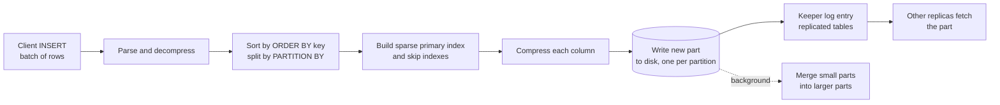

# ClickHouse

> ClickHouse is the engine to reach for when you need to aggregate billions of append-only rows in under a second: events, logs, metrics, clickstreams. It gets that speed from sorted, compressed, immutable column files merged in the background, and it pays for it with slow point lookups, expensive updates, and joins that must fit one side in memory.

This is a deep dive for someone who has to design a system on ClickHouse and defend it in a room. It covers how a part is laid out on disk, why the ORDER BY key decides almost everything, what an insert does step by step, how replication runs through Keeper, and what replica lag means for a reader. It then covers ClickHouse Cloud's object-storage engine, the documented limits, and where the engine stops being the right choice. DuckDB and the cloud warehouses each get a paragraph, and it closes with the interview questions a Staff+ candidate should expect.

## What it is

ClickHouse began in 2009 as an experiment inside Yandex: could analytical reports be produced in real time from raw rows that were also arriving in real time? It went into production for Yandex.Metrica in 2012 and was open-sourced in June 2016 under the Apache 2.0 licence. ClickHouse, Inc. was incorporated in September 2021 to commercialise it. The licence hasn't changed; the LICENSE file in the repository is still Apache 2.0, while much of the analytical field moved to source-available terms.

Releases are monthly. The newest stable is 26.9, released 21 September 2026, with a point release 26.9.6 on 29 September. LTS versions come out in March and August, and two are supported at a time for at least twelve months. The current pair is 26.8 (27 August 2026) and 26.3 (26 March 2026). Two changes in 26.9 matter before you upgrade. The old query analyser can no longer be re-enabled, and the default compression for MergeTree columns became size-aware: LZ4 for parts under 100 MB and ZSTD(3) above.

Self-managed ClickHouse is a single C++ binary that runs on anything from a laptop to a cluster of hundreds of servers. The documentation mentions production clusters of about 300 servers under one Keeper ensemble. ClickHouse Cloud is the managed service, built on a different storage engine, SharedMergeTree, with data on object storage and metadata in Keeper.

## Architecture

ClickHouse is one process with a pool of worker threads; there's no per-connection process and no separate storage daemon. A query is parsed, planned, and unfolded into a physical operator graph with as many parallel lanes as `max_threads`, which defaults to the number of cores. Each lane streams its share of the data block by block, where a block is a batch of rows in columnar form (65,409 by default). Operators use SIMD instructions on those batches.

### The storage engine: parts, granules, marks

Every MergeTree table is a directory of **parts**. A part is an immutable, sorted chunk of the table. On disk it's a directory holding one compressed file per column plus a marks file per column, a `primary.idx`, checksums, and any skip indexes and projections. Parts under 10 MB (`min_bytes_for_wide_part`) are written in **compact** format with all columns in one file; larger parts are **wide**, one file per column. The rows inside a part are sorted by the table's ORDER BY key.

Rows in a part are grouped into **granules** of `index_granularity` rows, 8,192 by default. A granule is the smallest unit ClickHouse reads; it never reads half of one. The **primary index** is sparse. It stores the ORDER BY key values of the first row of every granule, one entry per granule, and it's small enough to keep entirely in memory. The documentation's worked example has an 8.87 million row table with 1,083 granules and a primary index of 96.93 KB. Each column's **marks file** maps a granule number to the offset of the compressed block in the column file and the row offset inside it. So a granule chosen from the index can be found in every column without a scan.

A column file is compressed in blocks. The default general-purpose codec is LZ4 self-managed and ZSTD in Cloud. You can set a codec per column and chain a specialised codec in front of a general one. `Delta` stores differences between neighbours. `DoubleDelta` stores deltas of deltas and suits timestamps with a steady stride. `Gorilla` XORs consecutive floats and suits slowly changing readings. `T64` crops unused high bits of integers, and `GCD` divides by the common divisor. `CODEC(DoubleDelta, ZSTD)` on a timestamp column is the classic combination.

### Memory structures

There's no buffer pool of the Postgres kind and no memtable of the RocksDB kind. Inserts go straight to disk as parts, and reads rely on the operating system page cache plus a **mark cache** (5 GiB by default) for mark files. Above that sit the **query cache**, which stores whole results for 60 seconds by default, and the **query condition cache** (100 MB), which remembers one bit per filter and granule saying whether any row matched. Per-query memory is bounded by `max_memory_usage` and per-server by `max_server_memory_usage_to_ram_ratio`, 0.9 of RAM.

### The write path, step by step

When an INSERT arrives, the server decompresses and parses it and splits the rows by partition key. It sorts each group by the ORDER BY key, builds the sparse primary index and any skip indexes, compresses each column, and writes the result as a new part directory. The insert is acknowledged once that part is on disk and, for replicated tables, once its entry is in Keeper. Nothing existing is touched, which is why concurrent inserts don't contend.

The cost is that every insert makes at least one part, and a table with too many parts is slow to read and slow to merge. Background merge threads (16 by default) keep combining small parts into larger ones, up to 150 GiB compressed per part, and merged-away parts are deleted after 8 minutes. If active parts in a partition pass 1,000 (`parts_to_delay_insert`) inserts are throttled, and at 3,000 (`parts_to_throw_insert`) they fail with "Too many parts". So you batch. The guidance is bulk inserts of tens of thousands of rows, or **asynchronous inserts**, where the server buffers many small INSERTs itself. It flushes at 10 MiB (100 MiB in Cloud), 450 queries, or an adaptive timeout of 50 to 200 ms (up to 1,000 ms in Cloud). `async_insert` and `wait_for_async_insert` both default to on since 26.2, so a client is acknowledged only after the flush. `wait_for_async_insert = 0` returns immediately and can lose data.

Retries are safe because inserts are deduplicated. Each block's hash is remembered, in Keeper for replicated tables, for the last 10,000 blocks or 3,600 seconds. A client that times out re-sends the same batch and the server drops the duplicate.

### The read path

A SELECT first prunes parts by partition using each part's min-max values for the partition key. It then binary-searches each remaining part's primary index for granule ranges that can match and applies skip indexes to drop more granules. It reads only the needed columns for only those granules and streams them through the operator lanes. The limit is that a granule is the unit. A point lookup by primary key still decompresses at least one granule of 8,192 rows per matching part. The docs say up to `index_granularity * 2` extra rows can be read at the edges of a range. That's fine for a scan and wrong for an OLTP-style get by id at thousands per second.

## Data model and indexing

The **ORDER BY key** is the one decision that matters. It's the sort order within every part, it's the primary index, and unless you say otherwise it's the PRIMARY KEY too. A filter on the first key column is a binary search. A filter on a later column alone falls back to a "generic exclusion search" that only works well when the columns before it have low cardinality. The docs' worked example makes the point. With `ORDER BY (URL, UserID, IsRobot)` a query on UserID reads 7.92 million rows in 26 ms. With `ORDER BY (IsRobot, UserID, URL)` the same query reads 20,320 rows in 3 ms. The order also changes compression: the UserID column compressed to 877 KiB in one order and 11.24 MiB in the other. The guidance is low-cardinality filter columns first, the columns you filter on most next, and stop at four or five.

**Partitions** (`PARTITION BY`) are for data management, not speed. Parts in different partitions never merge, so partitioning by month lets you drop a month with `DROP PARTITION` or expire it with TTL without rewriting anything. Partition by something high-cardinality and you get thousands of partitions that never merge and a "Too many parts" error. A single INSERT touching more than 100 partitions is refused, and the error text recommends keeping the total under 1,000 to 10,000.

**Skip indexes** are secondary indexes that don't point at rows. They store a small summary per block of `GRANULARITY` granules and let the reader skip blocks that can't match. `minmax` stores the min and max of an expression and works when values track the sort order. `set(N)` stores up to N distinct values per block and works when a column is clumpy. `bloom_filter(p)` (default false-positive rate 0.025) answers equality and IN, and works on arrays and map keys. `tokenbf_v1` and `ngrambf_v1` are Bloom filters over tokens and n-grams for substring search. Both are now deprecated in favour of the **text index**, an inverted index that went GA in 26.2. There's also a `vector_similarity` index (HNSW, from 25.8). A skip index costs write time (built per part, rebuilt on merge) and disk. It only covers parts written after it's added unless you `MATERIALIZE INDEX`, which is a mutation.

**Projections** are the closest thing to a covering index. A projection is a copy of the part's data stored inside the part in a different ORDER BY, or a pre-aggregated version with a GROUP BY, and the planner picks the one that reads the fewest granules. The costs: data is written twice on insert and merge, `FINAL` queries can't use them, and lightweight deletes and updates aren't supported on tables that have them.

**Materialised views** in ClickHouse are insert triggers. The view's SELECT runs against each block as it's inserted into the source table, and the result goes into a target table. It never sees existing data and never reads the source at query time. The standard pattern is a raw events table plus views that write rollups into a `SummingMergeTree` or `AggregatingMergeTree` table whose ORDER BY matches the view's GROUP BY. Beyond sums you store partial states with `-State` combinators (`uniqState`, `quantileState`) and read them with `-Merge`. Views run one after another in the insert path, so each adds latency to every insert.

There's no unique index. ClickHouse doesn't enforce primary key uniqueness, and the same key can appear in several parts.

## Transactions and consistency

An INSERT of one block into one partition of one MergeTree table is atomic, durable once acknowledged (to one replica by default), and isolated. Readers see the table before or after, never half. A block is at most `max_insert_block_size` rows, 1,048,449 by default, so an insert of two million rows is two blocks and each commits on its own. An insert spanning several partitions commits per partition, and an insert through a Distributed table commits per shard. Reads use MVCC on parts: a query runs against the set of parts active when it started, and merges replacing those parts underneath don't affect it.

There's an experimental `BEGIN TRANSACTION` / `COMMIT` / `ROLLBACK` giving snapshot isolation across statements, but it only works on non-replicated tables and isn't in Cloud, so treat it as absent for design purposes.

The bigger difference from a row store is how existing rows change. There are three mechanisms.

**Mutations** (`ALTER TABLE ... UPDATE` and `ALTER TABLE ... DELETE`) rewrite every affected part in the background. They run asynchronously and in order, a SELECT during a mutation sees a mix of mutated and unmutated parts, and there's no rollback.

**Lightweight DELETE** (`DELETE FROM ... WHERE`) writes a hidden `_row_exists` mask column instead of rewriting data columns, and readers filter on it. Rows are physically removed at the next merge, and by default it doesn't work on tables with projections.

**Lightweight UPDATE** (`UPDATE ... SET ... WHERE`) arrived experimentally in 25.7 and became beta, on by default, in 25.8. It writes a **patch part** holding only the changed columns and rows plus system columns naming the original part and row offset, about 40 bytes uncompressed per updated row. SELECTs apply patches on read, so the change is visible immediately, and merges fold patches into the base parts over time. The docs scope it to small updates, up to about 10% of a table. They warn that skip indexes are ignored on patched columns and projections are ignored for the whole table while patches exist.

For the common "upsert" case none of these is the answer. The answer is `ReplacingMergeTree`: insert a new version of the row and the engine keeps the highest version at merge time. Between merges both versions exist, so you read with `FINAL` (a merge on the fly, which costs CPU) or with `argMax` over the version column.

## Replication and failover

Self-managed replication is `ReplicatedMergeTree`, per table, coordinated through **ClickHouse Keeper** (or ZooKeeper). Keeper is a C++ Raft implementation speaking the ZooKeeper protocol; by default it gives linearisable writes and non-linearisable reads, and you run three nodes. Keeper stores the replication log and part metadata, not data. Each INSERT adds about ten Keeper entries per block. The docs say one ensemble comfortably coordinates several hundred INSERTs per second across a cluster, which is another reason to batch.

Replication is **asynchronous and multi-master**. You insert into any replica; it writes the part locally, logs it in Keeper, and the other replicas fetch the compressed part over the network. Merges go through the same log and each replica performs the same merge itself, so only inserted data crosses the wire. There's no leader to elect, so failover is just sending queries somewhere else, and a replica that was down catches up from the log when it returns.

Default durability is one replica. If the replica that acknowledged an insert dies before another replica fetched the part, that data is gone. `insert_quorum = 2` (or `'auto'` for a majority) makes the insert wait until that many replicas have the block, within `insert_quorum_timeout` (10 minutes). If the quorum isn't reached, the block is deleted everywhere. `insert_quorum_parallel` is on by default and allows concurrent quorum inserts. It also means no single replica is guaranteed to hold every prior write, so `select_sequential_consistency` needs it off.

Replica lag is visible to readers. A Distributed query skips replicas whose delay exceeds `max_replica_delay_for_distributed_queries` (300 seconds) and falls back to stale replicas if none are fresh. There's no read-your-writes across replicas by default: write to replica A and immediately read from replica B and you may not see the row. If Keeper is unreachable, every replicated table on that server becomes read-only. Reads keep working; inserts fail. That's the failure mode to design for.

ClickHouse Cloud's **SharedMergeTree** changes the picture. Data lives in object storage (S3, GCS, Azure Blob), metadata lives in Keeper, and replicas don't talk to each other at all. Every insert is effectively a quorum write, because the part is in durable object storage and the metadata is in a Keeper quorum, so `insert_quorum` is irrelevant. Replicas learn about new parts by fetching metadata from Keeper asynchronously, so reads are still eventually consistent across replicas. But a replica can be added in seconds with nothing to copy. To read your own write from a different replica, `SYSTEM SYNC REPLICA LIGHTWEIGHT` forces a metadata fetch. Or set `select_sequential_consistency` on the query, at the cost of a Keeper round trip.

Multi-region: self-managed replication across regions works if latency stays in the tens of milliseconds. The docs say US coast to coast is fine and US to Europe isn't, because Keeper is a consensus protocol. ClickHouse Cloud services are single-region, and the data resiliency page says plainly that there's no automatic failover or syncing across regions. The answer is exporting backups to a second region and restoring there.

## Scaling

**Vertical first.** The sizing guide says to scale every replica up before adding replicas, and to buy the biggest server you can, because there's no automatic resharding. Query parallelism is per core, so doubling cores roughly doubles throughput on a big scan and doubles memory with it. The single-server numbers in the performance envelope below come from one 59-core machine.

**Reads scale with replicas.** Each replica holds all the data for its shard and serves queries on its own, so adding replicas multiplies query throughput. Cloud adds **parallel replicas**: one coordinator splits a single query's granules across all replicas and merges the partial states, so one heavy query also gets faster.

**Writes scale with shards** in self-managed clusters. A **Distributed** table holds no data. It names a cluster from the server config, a local table, and a **sharding key**. An INSERT into it evaluates the key, takes the remainder modulo the shard weights, and routes the row. `rand()` spreads load evenly; `intHash64(UserID)` co-locates a user's rows so `IN` and `JOIN` on UserID can run per shard without `GLOBAL`. By default the Distributed table writes rows to a local queue and forwards them in the background, so an initiator that dies right after acknowledging can lose them. `distributed_foreground_insert = 1` sends synchronously, and the docs recommend writing directly to the shard tables when you can.

Hot keys are your problem to avoid, because the key is a plain expression. A sharding key on tenant_id with one tenant ten times the size of the rest gives one shard ten times the load. The documented pattern is bi-level sharding, one "layer" of several shards per big tenant. Rebalancing after adding a shard is manual: weight the new shard higher for new writes, move partitions by detaching and attaching, or `INSERT ... SELECT` between clusters as a last resort.

**Joins.** The default `join_algorithm` is `direct,parallel_hash,hash,ie_join`. That means a direct lookup if the right side is a dictionary, otherwise a parallel hash join that builds a hash table of the right-hand table in memory. If the right side doesn't fit, you spill or switch to `grace_hash`, `partial_merge`, or `full_sorting_merge`, all slower. On a sharded cluster a plain `JOIN` runs on each shard against that shard's local copy of the right table. That's only correct if the right table is replicated everywhere or co-sharded. `GLOBAL JOIN` and `GLOBAL IN` compute the right side once on the initiator and broadcast it to every shard as a temporary table. There are no shuffle joins as of 2025, so a large-to-large join across shards has no good plan. This is why the engine favours denormalised wide tables.

## Consistency versus availability

ClickHouse chooses availability for reads and a soft form of consistency for writes. Under a partition, a replica cut off from Keeper keeps serving whatever parts it has and refuses inserts. Replicas that can still reach Keeper keep accepting inserts and replicating among themselves. Nothing rejects a read for being stale unless you ask it to. In normal operation the trade is asynchronous replication. An insert acknowledged by one replica is visible on the others after a network transfer, usually well under a second, and a reader on the wrong replica sees the old state until then.

## Operations

**Backups.** `BACKUP TABLE|DATABASE|ALL TO Disk('name', 'path')`, `TO S3('url', key, secret)` or `AzureBlobStorage(...)`, with `SETTINGS base_backup = ...` for incrementals and `ASYNC` to return immediately. `RESTORE` takes the same syntax. Backups copy parts, so they're consistent per table at the moment the part list is captured. There is no write-ahead log to replay, so point-in-time recovery in the Postgres sense doesn't exist. Cloud takes a daily backup retained 24 hours by default, configurable from every 6 to every 48 hours and 1 to 45 days on the paid tiers, and can export it to your own bucket in another region.

**Upgrades.** Self-managed upgrades are rolling: keep one replica per shard up while you upgrade the others, then swap. The docs promise a one-year compatibility window spanning two LTS releases. Cloud upgrades add new replicas before removing old ones.

**Housekeeping** is merges, and merges are mostly automatic. Watch that they keep up. `system.parts` gives active part counts per partition, `system.merges` what's running, `system.mutations` anything stuck, and `system.replication_queue` (`system.virtual_parts` in Cloud) replication lag. TTL merges run at least every 4 hours, and a table partitioned by the TTL column can drop whole parts instead of rewriting them (`ttl_only_drop_parts`). TTL can also move a part to a slower volume or an S3 disk (`TO VOLUME 'cold'`), recompress it, or roll it up with a GROUP BY.

**Capacity maths.** The sizing guide gives ratios rather than numbers. It wants 8 GB of RAM per core for warehousing workloads and 4 GB per core for general use. Memory to compressed storage should be 1:100 to 1:130 for long-retention data (100 GB RAM per replica for 10 TB), or 1:30 to 1:50 for customer-facing access. The docs don't publish a compression ratio; measure yours from `system.columns` on a sample.

**Cloud cost model.** Compute is metered per minute in units of 8 GiB RAM and 2 vCPU. The billing page doesn't print a unit rate, but its worked examples imply one. Two 8 GiB replicas on Scale run $436.95 a month, roughly $0.30 per unit-hour. Storage is $25.30 per TB per month of compressed data, and backups count, so 1 TB of data plus one backup is $50.60. Basic is one replica in one zone, capped at 1 TB; Scale is two or more replicas across zones, from $499.38 a month in the example. Idle services stop being billed for compute, and Kafka ClickPipes cost $0.20 per unit-hour plus $0.04 per GB ingested.

**Ingestion from Kafka** has three routes. The **Kafka table engine** is built in: a Kafka table is a consumer, a materialised view reads blocks from it into a MergeTree table, and delivery is at-least-once. **ClickPipes** is the Cloud-managed connector, at-least-once by default with an exactly-once option added in 2026. The **Kafka Connect sink** gives exactly-once self-managed at the cost of running Connect. The use case ClickHouse, Inc. is pushing hardest is observability. It bought HyperDX in March 2025 and now ships **ClickStack**: ClickHouse plus an OpenTelemetry collector plus the HyperDX UI, open source and also managed in Cloud. ClickStack leans on the JSON type (production-ready since 25.3), the text index, and asynchronous inserts.

**Data lakes.** ClickHouse reads Iceberg, Delta Lake, Hudi and Paimon tables from object storage. Since 25.7 it writes Iceberg with INSERT, and 25.8 added CREATE, ALTER DELETE, writes through REST and Glue catalogues, and Delta Lake writes. The `DataLakeCatalog` database engine attaches a Glue, Unity, Hive Metastore, REST, OneLake or Snowflake Horizon catalogue as a database.

## Performance envelope

Numbers the documentation and the vendor's own benchmarks publish:

- Granule: 8,192 rows. Block: 65,409 rows. Insert block: 1,048,449 rows. Primary index for 8.87 million rows: 1,083 entries, 96.93 KB.
- Parts per partition: throttle at 1,000, error at 3,000. Total parts per table: 100,000. Partitions per insert: 100. Merge target: 150 GiB per part.
- Single-server scan: 173 million rows per second for a filtered `max()` on 59 cores (docs example). Single-server ingest: about 4 million rows per second by default, 8.8 million tuned, on 59 cores and 236 GB (ClickHouse loading benchmark). Keeper: several hundred INSERT statements per second per cluster.
- Connections: 4,096 per server by default. Cloud: 1,000 concurrent queries per replica.

What isn't published: a query latency SLO, a compression ratio, or a maximum table size. The practical ceiling on a self-managed shard is the biggest disk you can attach; Cloud's ceiling is object storage.

## When to use it, and when not to

Use ClickHouse for append-mostly data that you aggregate: product analytics and clickstreams, logs and traces, metrics, ad-tech and fraud event streams, financial tick data. The question it answers is "group these billions of rows by a few dimensions and give me counts, sums and quantiles in under a second".

Don't use it as a system of record. Point reads by primary key decompress a whole granule; updates are patch parts or full rewrites; there are no multi-row transactions you'd want to rely on; there's no unique constraint. Don't use it for large-to-large joins across a normalised schema, because the right side must fit in memory on each node and there's no shuffle. Don't use it if the write stream is many tiny inserts you can't batch. And don't shard it self-managed if you can avoid it, because rebalancing is your job.

**DuckDB** is the small-scale alternative. It's an in-process, single-node columnar engine under the MIT licence, at 1.5.6 as of 28 September 2026 with a 2.0 alpha announced on 2 September. It reads Parquet, CSV and JSON from disk or S3, runs inside a Python process, needs no server, and is fast enough for a few hundred gigabytes on one machine. Pick DuckDB when one analyst or one job needs the answer. Pick ClickHouse when many users or an application do, when data arrives continuously, or when one box's disk and memory aren't enough.

**Snowflake and BigQuery** are the managed-warehouse contrast. Both separate storage from compute completely, keep immutable micro-partitions or column blocks on object storage, and bill for the compute you use. Snowflake bills per second with a 60-second minimum, an XS warehouse costing 1 credit per hour and doubling up to 128 at 4XL. BigQuery bills on demand at $6.25 per TiB scanned after the first free TiB a month, or by reserved slots. They win on zero operations and on concurrency for ad-hoc SQL over a shared lake. ClickHouse wins on latency for repeated queries over hot data, on cost for always-on workloads, and on high-rate ingestion, because a warehouse charges per scan or per second and doesn't want thousands of small inserts. Iceberg support on both sides lets the same data be read by either.

## Interview deep dive

**Q. Design an events pipeline on ClickHouse: ingest, table design, rollups.**
Producers write to Kafka, and the Kafka table engine with a materialised view (or ClickPipes in Cloud) pulls batches into a raw `events` MergeTree table. The raw table has `PARTITION BY toYYYYMM(event_time)` for retention and `ORDER BY (tenant_id, event_type, toStartOfHour(event_time), user_id)`. That puts low-cardinality filters first, the time bucket where range queries need it, and the user id last so per-user lookups still prune within a tenant. Timestamps get `CODEC(DoubleDelta, ZSTD)`, and a `TTL event_time + INTERVAL 13 MONTH` drops whole partitions. Rollups are materialised views writing into an `AggregatingMergeTree` keyed by `(tenant_id, event_type, toStartOfHour(event_time))` with `countState()`, `uniqState(user_id)` and `quantileState(latency)` columns, read with `-Merge` functions.

**Q. This query took 20 ms and now takes 4 seconds. The table is `ORDER BY (event_time, tenant_id)` and the filter is on `tenant_id`. Why?**
The key starts with `event_time`, which has high cardinality, so the primary index can't binary-search on the tenant. It falls back to a generic exclusion search that excludes almost nothing, and the query reads the whole table; it was only fast while the table was small. The fix is to lead the key with the low-cardinality column, `ORDER BY (tenant_id, event_time)`, which also compresses better because each tenant's rows are contiguous. If you can't change the key, a projection with the other order or a `set` skip index on tenant_id are the fallbacks. `EXPLAIN indexes = 1` shows the granule counts before and after.

**Q. Estimate capacity for 5 billion events a day.**
That's about 58,000 events per second on average. Plan for a 3x peak, 175,000 per second, which one well-fed node handles, since the vendor benchmark is millions of rows per second on 59 cores. At 300 bytes per raw event it's 1.5 TB a day uncompressed. The compression ratio has to be measured, but at 5x it's 300 GB a day, so 30 TB for 100 days of retention. The sizing guide's 1:100 memory-to-storage ratio puts that at about 300 GB of RAM per replica: a pair of 64-core, 384 GB replicas on local NVMe. In Cloud that's two 30-vCPU, 120 GiB replicas with object storage at $25.30 per TB per month, around $760 a month for storage. Those rows must arrive as a few hundred INSERT statements per second at most, so batching is non-negotiable.

**Q. How do you scale writes past one node?**
Self-managed: shards behind a Distributed table with a sharding key, or write directly to shards from the producer, which the docs prefer. Choose a key that co-locates the rows you join on (a tenant or user hash) and watch for tenants large enough to make a hot shard. Bi-level sharding gives a big tenant its own layer. Adding a shard means weighting writes towards it and manually moving partitions to rebalance old data. In Cloud there's one shard on object storage and you add replicas. Either way the rate that matters is INSERT statements per second, not rows, because each statement is a part and each part is a Keeper transaction.

**Q. One tenant is 40% of the data and its dashboards are slow. What do you do?**
It's a hot key at two levels. In the sort key, if `tenant_id` leads, that tenant's granules are contiguous and the index still prunes the other 60%. So the fix is more rollup and a projection ordered for that tenant's queries. In sharding, if the key is `tenant_id`, that tenant sits on one shard and saturates it. Give it its own layer of shards, or shard by a `(tenant_id, user_id)` hash so it spreads, accepting `GLOBAL` joins for that tenant. In Cloud, give the tenant its own read-only service so it can't starve other tenants' compute.

**Q. A replica dies right after acknowledging an insert. What's lost?**
With defaults, the insert was acknowledged when the part was on that one replica's disk and logged in Keeper. If no other replica had fetched the part yet, it's lost, and the client won't know. `insert_quorum = 2` makes the acknowledgement wait for a second replica and removes the block everywhere if the quorum isn't reached in 10 minutes. `fsync_after_insert` guards against an OS crash before the page cache flushed. In Cloud the part is in object storage before the ack, so a replica dying loses nothing.

**Q. Users insert a row, refresh, and it's missing. What's happening?**
They wrote to one replica and read from another through a load balancer. Replication is asynchronous, so the second replica hasn't fetched the part yet, or in Cloud the metadata. Fixes in order of cost: pin a session to one replica for read-after-write, or in Cloud run `SYSTEM SYNC REPLICA LIGHTWEIGHT` before the read. Self-managed, use `insert_quorum` with `insert_quorum_parallel = 0` and `select_sequential_consistency = 1` so reads only go to replicas holding every quorum write. The same symptom appears with `ReplacingMergeTree` for a different reason: both versions of a row exist until merge, so read with `FINAL` or `argMax`.

**Q. How would you handle a user profiles table that changes often?**
Not with mutations, which rewrite parts. Model it as `ReplacingMergeTree(updated_at)` keyed by `user_id`, insert the full new row on every change, and read with `FINAL` or `argMax(col, updated_at)`. Use the `is_deleted` column if deletes matter. For small targeted fixes use lightweight `UPDATE`, which writes a patch part visible immediately, remembering the 10% guideline and that projections are disabled while patches exist.

**Q. Two 10 TB tables need to be joined. What's the plan?**
There isn't a good one inside ClickHouse. The hash join needs the right side in memory on each node, `grace_hash` and `full_sorting_merge` spill but are slow, and across shards there's no shuffle. Ask what the join is for. If it's enrichment, denormalise at ingest with a materialised view or make the smaller side a dictionary. If both sides are events, co-shard both tables on the join key so the join is local per shard. If it's a one-off, run it in a warehouse or Spark over Iceberg.

**Q. When would you not use ClickHouse?**
When the workload is transactional, needs unique constraints, or does frequent row updates. When queries are point lookups at high rate. When the schema is normalised and the joins are big on both sides. When you need multi-region active-active with consistency. When one analyst on a laptop would be served by DuckDB. Or when the team can't run Keeper and a merge pipeline, and would rather pay Snowflake or BigQuery per query to operate nothing.

## What changed recently

- **2025-03-14** ClickHouse acquired HyperDX; ClickStack, the open-source observability stack, followed during the year.
- **2025-03-20** 25.3 LTS: JSON type marked production-ready.
- **2025-07-24** 25.7: lightweight `UPDATE` with patch parts, experimental; `INSERT` into Iceberg tables.
- **2025-08-28** 25.8 LTS: lightweight `UPDATE` to beta and on by default. Iceberg `CREATE`, `ALTER DELETE`, and writes through REST and Glue catalogues; Delta Lake writes; data lake catalogues to beta; HNSW vector index.
- **2026-02-26** 26.2: text index GA; `async_insert` and insert deduplication on by default.
- **2026-08-27** 26.8 LTS: patch parts v2 with bounded memory; Keeper can store data on disk in an LSM tree; Snowflake Horizon catalogue reads and writes.
- **2026-09-21** 26.9: old analyser removed; size-aware default compression (LZ4 under 100 MB, ZSTD(3) above). Incremental refresh for append-only refreshable materialised views; `CREATE TOKEN`; PromQL in private preview on Cloud.
- **2026, Cloud** Kafka ClickPipes gained an exactly-once option; Managed Postgres in public beta; On-Demand Compute and horizontal autoscaling in private preview.
- **2026-08-26** DuckLabs acquired by AWS; DuckDB stays MIT under the DuckDB Foundation, with a 2.0 alpha announced 2026-09-02.
