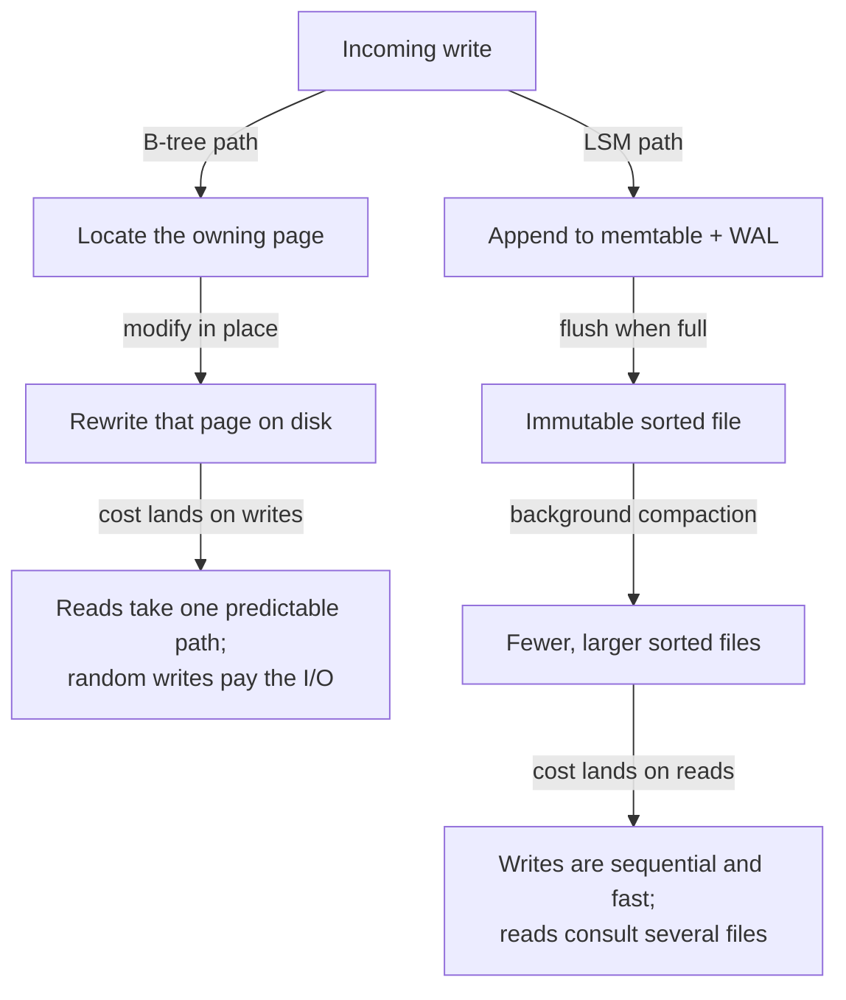
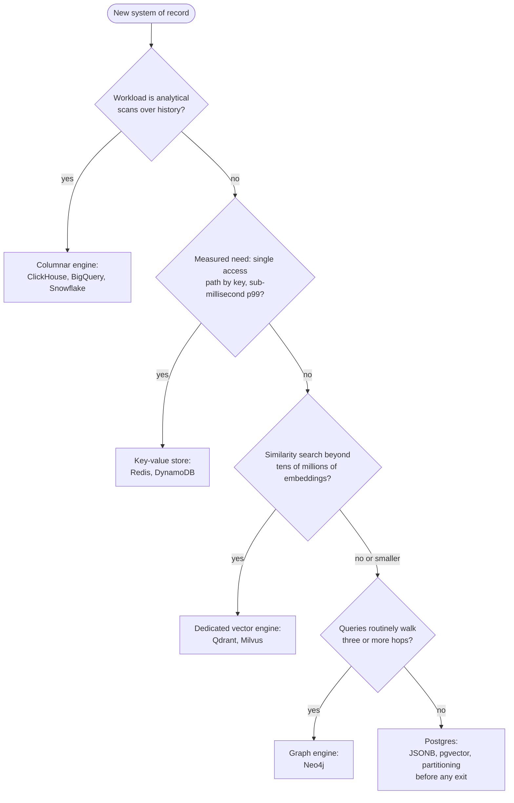
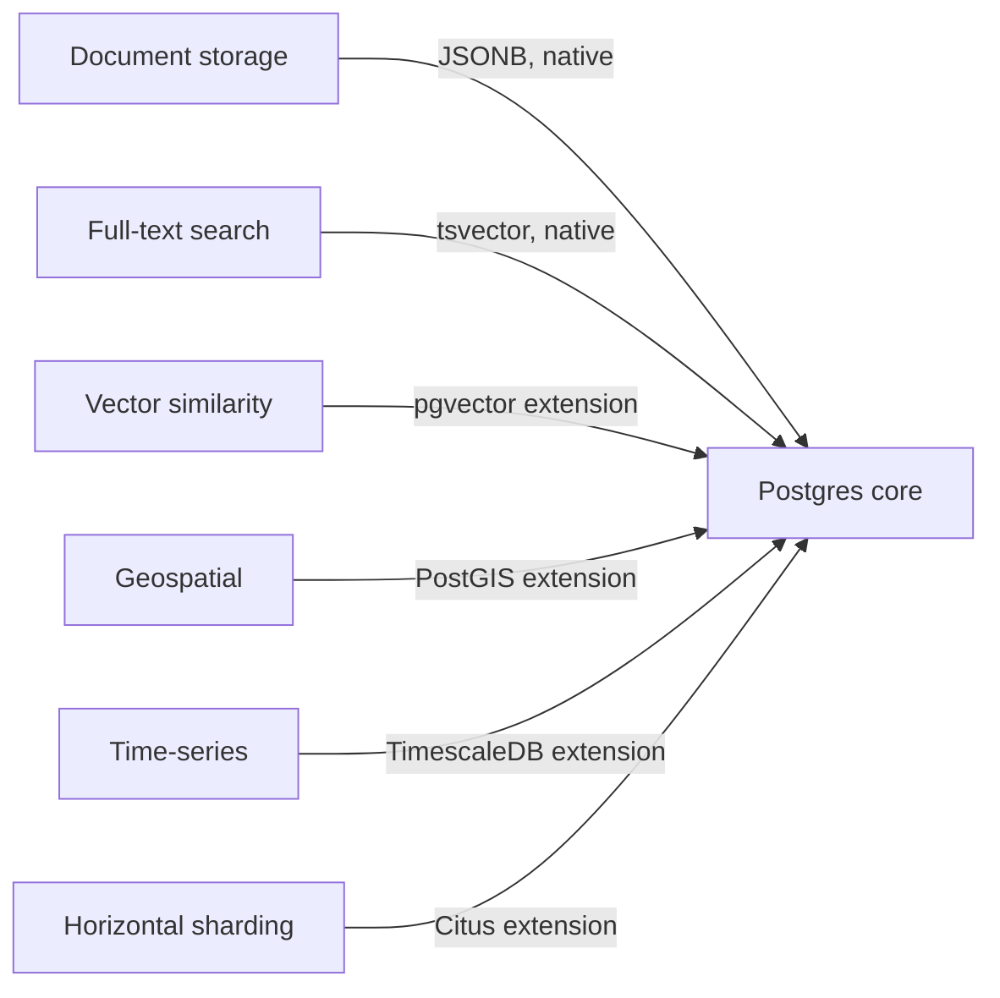

# Databases

> Start on a general-purpose relational database; in 2026 that means Postgres. Leave it only when a measured access pattern forces you out, because specialised engines are escape hatches, not starting points. The caveat is real: at genuine global write scale, for sub-millisecond cache reads, and for billion-scale vector recall, the escape hatch is the correct door.

This article covers the engine families a practitioner chooses between: relational, document, key-value, wide-column and columnar, vector, and graph. It explains what each family makes cheap, how to choose between them, and why the families are steadily absorbing each other's features. One mental model organises everything that follows: **a database is a data structure you rent over a network.**

Every engine is three choices wearing a brand name. A storage layout decides which bytes sit next to each other on disk. An index structure decides which lookups skip the full scan. A query surface decides which questions you can ask without writing the traversal yourself. Families differ because they fix those three choices for different access patterns. An access pattern the layout fights stays slow no matter how much hardware you rent.

## Choose by access pattern, nothing else

The workload's access pattern is the only selection criterion that survives contact with production. An access pattern is the concrete set of operations a system performs: the read-to-write ratio, point lookups versus range scans versus aggregations, the latency budget per operation, the consistency the business logic assumes, and the size of the hot working set. Those measurements pick the engine. Nothing else does.

The common selection errors all ignore the access pattern. Choosing by the data's conceptual shape fails because every domain looks like a graph on a whiteboard and almost no workload is a traversal. Choosing by anticipated scale fails because the anticipated scale rarely arrives, while the distributed engine bought for it charges its operational tax from day one. Choosing by familiarity or fashion fails quietly, then expensively, when the first unanticipated query arrives.

A social product's feed makes the trap concrete. The domain model is a graph of users and follows. The access pattern is a hot, denormalised read of the newest posts per user, plus a fan-out write on every post. That is a key-value pattern with a range component, not a graph workload. A team that buys a graph engine for that domain shape has bought deep-traversal machinery to serve a query that never walks more than one hop.

The practical discipline follows directly: start on the general-purpose engine, instrument it, and read the pattern out of production. In Postgres, `pg_stat_statements` names the queries that dominate load. A measured pattern that the relational layout genuinely fights is the licence to reach for a specialised engine. A diagram of the domain is not.

## Two workloads: OLTP and OLAP

Every database serves one of two workload shapes well, and the split explains half the product landscape. OLTP, online transaction processing, is many small operations against current state: fetch this order, update that balance. It wants row storage, where all the fields of one record sit together, because the unit of work is the record. OLAP, online analytical processing, is few large questions against history: revenue by region by month, five years deep. It wants column storage, where all the values of one field sit together, because a scan that reads three columns out of eighty then skips most of the bytes on disk.

The split is operational, not academic. Running analytics on the OLTP primary is the classic self-inflicted incident: one analyst's five-year scan evicts the hot working set and every user-facing query slows at once. The durable architecture keeps transactional truth in a row store and analytical copies in a column store, with a pipeline between them. Vendors selling the collapse of that pipeline appear in the convergence section below.

## The storage-layer trade: B-trees and LSM-trees

Beneath every transactional engine sits one of two index structures, and the choice is the read/write trade made physical. A B-tree keeps records in a sorted tree of fixed-size pages and updates pages in place. An LSM-tree, a log-structured merge-tree, never updates in place: writes append to an in-memory buffer backed by a write-ahead log (the WAL, the crash-recovery journal), the buffer flushes to immutable sorted files, and background compaction merges those files into fewer, larger ones.

The diagram is the entire trade: both paths store the same data, and they differ only in where the cost lands. The B-tree pays at write time with random page I/O and rewards reads with one predictable path; Postgres, MySQL, and SQL Server sit here. The LSM-tree pays at read time, because a lookup consults several sorted files, and rewards writes with pure sequential appends; RocksDB, Cassandra, and most ingestion-heavy stores sit here.

This one distinction decodes most database marketing. An engine advertising an order-of-magnitude write-throughput advantage is an LSM engine, and the honest follow-up questions are about read amplification and compaction stalls, the costs the benchmark moved off-stage. It also explains a common production surprise: telemetry firehoses hurt on B-tree engines not because the engine is bad but because the layout charges every append the price of a random write.

## The engine families

| Family | The structure you rent | What it makes cheap | Canonical engines |
|---|---|---|---|
| Relational | Sorted tables with B-tree indexes, joined at query time | Questions you did not plan for | Postgres, MySQL, SQL Server |
| Document | Trees of nested records, indexed by path | Reading and writing one aggregate whole | MongoDB, Couchbase |
| Key-value | A hash or sorted map at network scale | Get and put by exact key at extreme throughput | Redis, DynamoDB |
| Wide-column | A partitioned, sorted map of sparse rows | Write-heavy append within a partition | Cassandra, ScyllaDB |
| Columnar | Column-at-a-time files with vectorised scans | Aggregations over billions of rows | ClickHouse, BigQuery, Snowflake |
| Vector | An approximate-nearest-neighbour index over embeddings | "What is similar to this?" | pgvector, Qdrant, Milvus |
| Graph | An adjacency structure walked without indexes | Many-hop relationship queries | Neo4j, Memgraph |

The table names the trade each family makes; the verdicts below say when each trade is worth taking.

### Relational: the default for a reason

The relational model's superpower is answering questions nobody anticipated. Joins, secondary indexes, and a declarative planner mean the question you invent next quarter runs against the schema you designed last year. Transactions and constraints keep a decade of accumulating data honest, which matters more than any launch-week benchmark. The honest costs: horizontal write scaling is an add-on rather than a birthright, schema migrations demand discipline, and object-relational mapping friction is permanent. Those costs are the cheapest in this article, which is why the stance starts here.

### Document: the aggregate is the unit

A document store earns its keep when one aggregate, such as an order with its line items, is always read and written whole, and when records are genuinely heterogeneous. The honest costs: cross-aggregate questions reintroduce the joins the engine does not want to do, and "schemaless" relocates the schema into application code, where it drifts unversioned. Postgres's `JSONB` type serves the middle honestly: documents inside a relational engine, indexed, with joins available the day you need them. Reach for a dedicated document engine when the aggregate boundary is stable and cross-cutting queries are provably rare.

### Key-value: one operation, brutally fast

A key-value store does one thing at a speed nothing else matches: get and put by exact key, in memory in Redis's case, at contractual any-scale latency in DynamoDB's. The cost is the query surface, which is the key and nothing else. Every future question must be pre-computed into the keyspace at write time, so an evolving domain pays a redesign for each new access path. Correct as a cache, as a session store, and as the system of record for a stable, known access pattern at brutal scale. Wrong as the system of record for a domain still discovering its questions.

### Wide-column and columnar: two designs sharing a name

The shared word "column" causes real selection errors, because the two designs solve opposite problems. A wide-column store such as Cassandra is an LSM-based transactional engine: a partitioned, sorted map built for relentless write volume and geographic spread, with tables designed per query in advance. A columnar engine such as ClickHouse or a cloud warehouse is the OLAP side of the split above, built for scanning billions of rows and useless at point updates. Buy wide-column for write-heavy serving with known queries. Buy columnar for analytics. Never substitute one for the other.

### Vector: similarity as a query primitive

A vector database indexes embeddings, the numeric representations models produce, so that "what is similar to this?" becomes a query, served by an approximate-nearest-neighbour (ANN) index that trades a little recall for a lot of speed. The honest costs: the index is approximate by construction, combining vector search with metadata filters is hard at the index level, and recall, latency, and cost form a three-way trade that tightens as the corpus grows. `pgvector` inside Postgres serves corpora into the tens of millions of vectors alongside the rest of your data. Dedicated engines earn their operational bill at hundreds of millions of vectors, heavy filtered search, or strict tenant isolation.

### Graph: buy it for traversals, not for graphs

A graph database stores adjacency directly, so walking from a node to its neighbours costs the same at hop five as at hop one, where the equivalent SQL join chain grows a scan per hop. That is the entire purchase. Most workloads described as graph problems are one or two hops deep, and one or two hops is a join Postgres executes without complaint. Buy a graph engine when deep, variable-depth traversal is the product itself: fraud-ring detection, dependency and impact analysis, knowledge-graph reasoning. The honest costs: a smaller operational ecosystem, and analytics over whole graphs usually belongs in batch compute rather than the serving engine.

## Choosing: the decision, drawn

Read the diagram top-down, and hold one rule while reading: every "yes" edge demands a measurement, not a forecast. The p99 latency (the 99th-percentile response time) that justifies the key-value exit is a number from production or a load test, never a hunch. The default node at the bottom carries its own pressure valves, because `JSONB`, `pgvector`, read replicas, and native partitioning each defer an exit that once looked mandatory.

The stance breaks in three named places, and pretending otherwise would be dishonest. Genuine global write scale breaks it: a single-writer Postgres tops out, and active-active multi-region writes are what Spanner-class and Dynamo-style systems are for by design. Sub-millisecond p99 at high throughput breaks it: a disk-backed transactional engine across a network hop does not outrun an in-memory store, so caches belong to Redis and its kin. Billion-scale, heavily filtered vector recall breaks it: purpose-built ANN engines exist precisely for the corner where `pgvector` runs out. Each break is an access pattern, measured; none of them is a reason to skip the default on day one.

## What CAP and PACELC actually buy you

CAP is narrower than its fame. The theorem says that during a network partition, a distributed store chooses between consistency, refusing some requests rather than serving stale data, and availability, answering everywhere at the risk of divergence. It says nothing about behaviour when the network is healthy, and a single-node database sidesteps it entirely. PACELC completes the picture: if a Partition occurs, the trade is Availability versus Consistency; Else, the trade is Latency versus Consistency. The "else" branch is where systems spend nearly all of their lives, which makes PACELC the version worth memorising.

What the pair buys in practice is a reading skill, not an architecture. Synchronous replication purchases consistency and pays in write latency; asynchronous replication purchases latency and pays in replication lag the application must design around, starting with read-your-own-writes. Most consistency incidents in ordinary systems come from reading stale async replicas, not from partitions. The vocabulary's daily use is decoding replica-lag bugs and vendor claims, and its verdict favours the stance: a single-region Postgres with one synchronous standby is a strongly consistent default, and eventual consistency is a cost you take deliberately for a measured latency or availability need, never a default you inherit unexamined.

## The convergence: every database becomes every other database

Feature sets are converging; storage physics are not. Holding those two facts together is the whole trick to reading the 2026 market. The specialised-engine era began as a correction, crystallised by Stonebraker and Çetintemel's 2005 argument that one size fits all was over, and for fifteen years the correction held: an engine per workload, glued together per system. The current decade runs the film in reverse, through four forces.

Multi-model creep is the first force. MongoDB ships multi-document transactions and full-text search; Redis ships JSON documents, secondary querying, and vector search; Cassandra ships secondary indexes and vector search. Every specialised engine climbs toward general-purpose, because every vendor eventually wants the workloads adjacent to its niche.

The second force runs the other way, and it is the one the stance rides: the general-purpose core absorbs each specialised capability at good-enough quality.

The extension mechanism is the moat the diagram draws. Each absorbed capability deletes a reason to run a second engine, and a deleted second engine is a deleted backup regime, upgrade cadence, on-call rotation, and cross-store consistency problem. The feature-checklist comparison between Postgres-plus-extension and the dedicated engine misses that the operational bill of the second engine is the real price, and it is paid monthly.

HTAP, hybrid transactional/analytical processing, is the third force: engines such as TiDB and SingleStore keep a row copy and a column copy of the same data and route each query to the right one, collapsing the OLTP-to-OLAP pipeline into a single system. The fourth is disaggregated storage and compute: Aurora and Neon rebuild Postgres on shared, replicated storage with stateless compute in front, the shape cloud warehouses proved first. Disaggregation makes engines operationally interchangeable in exactly the way the rented-data-structure model predicts, because what you rent stops being a machine and becomes the structure itself.

What never converges is the physics underneath: row versus column layout, B-tree versus LSM, memory versus disk. Convergence blurs the feature checklists while leaving those trades exactly where they were. That asymmetry is the deepest argument for the stance. When features converge, the engine with the lowest operational cost and the broadest absorption mechanism wins the default, and the exits stay open only where physics, not feature lists, force them.

## What would change this stance

A stance that cannot name its falsifiers is a preference. These are the developments that would move this one:

- Distributed SQL at commodity cost: a managed Spanner-class engine matching single-node Postgres latency and operational simplicity at comparable price would make "start distributed" free, and the single-node default would weaken.
- Postgres fragmentation: cloud vendors forking the extension ecosystem until "Postgres" no longer names one compatible surface would hollow out the absorption argument.
- HTAP landing for real: a mainstream engine serving transactional and analytical load on one copy of data without interference would retire the row/column split as an architectural boundary.
- Retrieval-first products dominating: if the embedding index becomes the system of record for mainstream applications, the vector caveat stops being a corner and becomes the centre.

Until one of those arrives, the default holds: rent the general-purpose data structure, measure what production does to it, and let the measurements, never the whiteboard, open the escape hatches.
