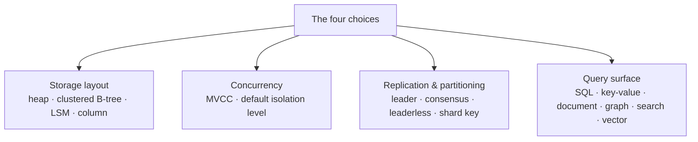
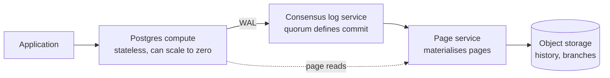

# Databases

> Start on Postgres and leave it only when a measured access pattern forces you out. The specialised engines are escape hatches, not starting points, and in 2026 the doors are well marked: writes that must be accepted in several regions at once, reads that must return in under a millisecond, and vector recall at billions of rows. Everything else is a Postgres feature, an extension, or a managed Postgres with a different storage layer underneath.

This article is a map of the database landscape as it stands in September 2026. It covers what is out there, how each kind of engine works underneath, which problem it was built to solve, what it gives up to solve it, and where it stops being the right choice. The aim is to leave you able to make a system-design decision and defend it, which means the mechanisms matter as much as the product names. Products come and go. The mechanisms, and the trade-offs they force, have been stable for decades.

One mental model organises everything that follows: **a database is a data structure you rent over a network.** Every engine, whatever its brand, is a small number of choices about that data structure. Learn to see the choices and the catalogue stops being a list of two hundred products and becomes a dozen shapes.

## How to read a database

Four choices sit under every engine. When you meet a new one, find its answers to these four questions and you already know most of what it can and cannot do.

### 1. How does it lay bytes out on disk?

The storage layout decides which reads are cheap and which writes are cheap, and no amount of hardware changes that.

A **heap with B-tree indexes** is what Postgres uses. Rows land wherever there is space; a B-tree index maps each key to the row's location. Reads by key are a few page lookups; range scans over an index are sequential; writes update the heap and every index. This layout treats reads and writes evenly, which is why it is the general-purpose default.

A **clustered B-tree** is what MySQL's InnoDB uses. The table *is* the primary-key index: rows are stored inside the tree, in key order. Scanning a range of primary keys reads contiguous pages, which is fast. The price is that every secondary index stores the primary key rather than a row location, so a lookup through a secondary index costs two tree descents, and a wide primary key inflates every index.

A **log-structured merge tree (LSM)** is what Cassandra, ScyllaDB, CockroachDB, RocksDB, and most stores built for write volume use. Writes append to an in-memory table that is flushed to disk as an immutable sorted file; background compaction merges files and drops overwritten values. Writes are sequential and cheap. Reads may have to consult several files, so they cost more and depend on a bloom filter per file to skip the ones that cannot contain the key. Deletes are the sting: a delete is a marker, called a tombstone, that reads must skip until compaction removes it. A workload that deletes heavily on an LSM engine gets slower reads until it learns to live with that.

A **column store** is what ClickHouse, DuckDB, Snowflake, and BigQuery use. Each column is stored as its own run of values, compressed, in immutable chunks. A query that touches three columns of a hundred reads three per cent of the bytes, and a whole column of similar values compresses to a fraction of its size. The price is that a single row is scattered across every column file, so reading or updating one row means touching all of them. Column stores are built for questions over many rows and few columns, and they are poor at point reads and single-row updates.

### 2. What does it promise when two things happen at once?

Concurrency control decides what a transaction sees while other transactions run. Almost every engine now uses **multi-version concurrency control (MVCC)**: a write creates a new version of a row instead of overwriting, so readers keep seeing a consistent older version without blocking writers. The differences are in what *isolation level* the engine gives you by default, and the defaults are weaker than most people assume.

Postgres defaults to **read committed**: each statement sees data committed before that statement began, so two statements in one transaction can see different states. MySQL's InnoDB defaults to **repeatable read**, which fixes a snapshot for the whole transaction but does not stop two transactions from each reading a value and both writing on the strength of what they read, an anomaly called write skew. Only **serializable** promises the outcome of some one-at-a-time ordering, and it charges for that with retries: a serializable transaction that conflicts is aborted and the application must run it again. CockroachDB and Spanner default to serializable; YugabyteDB moved its default down to read committed in 2025 because the retries surprised people. The isolation level your engine defaults to is a property of your system whether you chose it or not, so find out what it is.

### 3. How does it survive a machine dying, and how does it grow?

**Replication** copies data to more than one machine. The shape of the copying decides what you can promise after a failure.

*Leader-based* replication has one node accept writes and stream them to followers. Postgres and MySQL do this, asynchronously by default, which means an acknowledged write can be lost if the leader dies before a follower receives it. Both can be told to wait for a follower before acknowledging, at the cost of a network round trip per commit. Redis is leader-based and asynchronous too, and its documentation says plainly that acknowledged writes can be lost on failover.

*Consensus-based* replication uses a protocol such as Raft or Paxos to make a majority of nodes agree on each write before it is acknowledged. Losing a minority of nodes loses nothing. CockroachDB, YugabyteDB, TiDB, Spanner, and Neon's write path all do this. The cost is that every commit is a round of messages among the replicas, and if the replicas are in different regions, that round is a cross-region round trip. There is no protocol that avoids this. Consensus across regions costs the speed of light.

*Leaderless* replication, in the Dynamo style that Cassandra and ScyllaDB follow, lets any node accept a write and sends it to several replicas; a read asks several replicas and takes the newest answer. You tune how many replicas must acknowledge a write and how many must answer a read. Set them so the two sets overlap and reads see the latest write; set them lower and you trade that guarantee for availability and speed.

**Partitioning** (sharding) splits data across machines so that no one machine holds it all. Hash partitioning spreads keys evenly and makes range queries expensive; range partitioning keeps neighbouring keys together and risks hot spots when writes cluster on recent keys. The choice of partition key is the most consequential decision in a partitioned system, because a query that does not include the key must ask every partition, and because a key whose values are unevenly popular makes one machine the bottleneck. Every store that scales writes horizontally asks you to make this choice up front. Postgres does not, because Postgres does not partition across machines; that is precisely the limit that sends people to the distributed tier.

### 4. What questions does it answer cheaply?

The query surface is the last choice, and it is the one that shows on the product page. SQL over a relational model lets you ask questions you did not anticipate when you designed the schema, at the cost of a query planner that can guess wrong. A key-value API answers one question, "give me the value for this key", extremely fast and nothing else. A document model stores a whole aggregate together so that one read fetches everything about one entity. A graph model makes traversals across many hops cheap. An inverted index makes "which documents contain these words" cheap. A vector index makes "which stored vectors are nearest this one" cheap. Each of these is an index structure and a query language wrapped around one of the storage layouts above, and the sections that follow are organised by that wrapping.

```mermaid
graph TD
    Q[The four choices] --> S[Storage layout<br/>heap · clustered B-tree · LSM · column]
    Q --> C[Concurrency<br/>MVCC · default isolation level]
    Q --> R[Replication & partitioning<br/>leader · consensus · leaderless · shard key]
    Q --> A[Query surface<br/>SQL · key-value · document · graph · search · vector]
```

With those four questions in hand, here is the landscape.

## General-purpose relational engines

**The problem they solve.** Most applications need one store that keeps data correct under concurrent writers, answers questions nobody planned for, and does not lose acknowledged writes. The relational engines solve that problem completely for one machine's worth of data, and one machine is bigger than most people think: a single well-provisioned Postgres serves tens of thousands of transactions per second over terabytes.

### PostgreSQL

Postgres is the default in 2026 and this article's recommendation, so it is worth being precise about why. It is not the fastest engine at any one thing. It is the engine with the fewest surprises across all of them, and the one every managed vendor now emulates.

*Under the hood.* Heap tables with B-tree indexes, plus a family of other index types (GIN for arrays and JSON, GiST for geometry, BRIN for huge append-only tables, HNSW through the pgvector extension). MVCC keeps old row versions in place and a background process, VACUUM, reclaims them; a table that is updated heavily and vacuumed badly bloats, which is the one operational habit every Postgres team has to learn. Replication streams the write-ahead log to standbys, asynchronously unless you name a synchronous standby. Logical replication, a separate mechanism, ships row changes rather than bytes and is what feeds change-data-capture pipelines. Default isolation is read committed. One operating-system process serves each connection, so connections are expensive and the default cap is 100, which is why every Postgres deployment of any size puts a pooler in front of it. PgBouncer in transaction mode is the standard answer and the managed vendors ship it built in.

*What changed.* PostgreSQL 18 shipped on 25 September 2025 with a new asynchronous I/O subsystem that can use io_uring on Linux; the release notes credit it with up to three times faster reads in some workloads. The same release added a native `uuidv7()` function, B-tree skip scans, data checksums on by default, and temporal primary and foreign keys. Version 19 is in beta with general availability planned for October 2026, bringing a `REPACK` command that replaces `VACUUM FULL` and can run concurrently, parallel autovacuum, and logical replication of sequences. The bigger story is the ecosystem: Databricks paid about a billion dollars for Neon in May 2025, Snowflake paid $250 million for Crunchy Data a month later, and PlanetScale launched a Postgres product in September 2025. The 2025 Stack Overflow survey put Postgres at 55.6 per cent of respondents, 18.6 points ahead of MySQL. The vendors are consolidating around it because the developers already have.

*Where it shines.* Transactional workloads of every ordinary shape; anything that needs JSON, full-text search, geospatial, or vectors alongside relational data without a second system; anywhere the team's time matters more than the last ten per cent of throughput.

*Where it does not.* Writes go through one primary, and Postgres has no built-in way to spread a table across machines. Read replicas lag. A workload that needs more write throughput than one large machine can absorb, or that needs writes accepted in several regions at once, has outgrown it. That is a real ceiling, and it is much higher than the point at which most teams leave.

### MySQL and MariaDB

MySQL is still the second most widely deployed database by the DB-Engines count, and the one behind more of the web's history than any other. In 2026 its story is a stable one.

*Under the hood.* InnoDB stores the table inside its primary-key B-tree, so rows are physically in key order and range scans by primary key are the cheapest read there is. Secondary indexes hold the primary key, so a secondary lookup is two tree descents, and a random or wide primary key hurts everything. MVCC is done with undo logs rather than in-place versions, so there is no VACUUM, and the equivalent housekeeping is purging old undo records. Replication ships the binary log of logical changes, asynchronously by default, with semi-synchronous and group replication available. Default isolation is repeatable read, stronger than Postgres's default and still not serializable.

*What changed.* MySQL 9.7 became the first long-term-support release since 8.4 in April 2026, with a new hypergraph optimiser and JavaScript stored programs, alongside a new "26.x" numbering for the faster innovation track. A `VECTOR` column type has existed since 9.0, but the community edition has no index over it; approximate vector search lives in Oracle's HeatWave and in Google's Cloud SQL. MariaDB, the community fork, reached 12.3 LTS in May 2026 and has had vector search since 11.8.

*Where it shines.* Read-heavy workloads that scan by primary key; teams and tooling with deep MySQL experience; Vitess (below) when you must shard it.

*Where it does not.* The same single-primary ceiling as Postgres, and a smaller extension story: the things Postgres does with extensions, MySQL mostly does not do.

### SQLite

SQLite is the most deployed database in the world because it is a library, not a server. It runs inside the application, stores everything in one file, and is in the public domain.

*Under the hood.* A single-file B-tree. In its default mode one writer locks out readers; in write-ahead-log mode, which everyone should turn on, readers proceed concurrently while one writer at a time appends to the log. Transactions are serializable. There is no replication and no network protocol, by design.

*What changed.* Releases are steady (3.53 in mid-2026, 3.54 due in October) and the interesting movement is around it rather than in it. Turso is rewriting SQLite in Rust as a file-compatible engine with concurrent writers and asynchronous I/O, still pre-1.0, and its earlier fork libSQL adds replication to the edge. The pattern of one SQLite file per tenant, replicated to the edge, is a real architecture now.

*Where it shines.* Embedded and mobile apps, command-line tools, per-tenant data, test fixtures, and any service whose whole dataset fits on one disk and is written by one process.

*Where it does not.* Anything with more than one writer, and anything that must be reached over a network without a process in front of it.

## Postgres with a different storage layer

**The problem they solve.** Running Postgres well is work: failover, backups, connection pooling, upgrades, and the wasted money of a machine sized for peak. The managed tier takes that work, and the interesting entries rebuild the storage layer to change what Postgres can do.

The architectural move they share is **disaggregation**: separate the stateless Postgres compute from durable storage, and put the storage on a replicated, log-structured service or on object storage. Amazon Aurora described this in its 2017 SIGMOD paper: the database sends only its write-ahead log to a storage service that materialises pages, replicated six ways. Neon, now the technology behind Databricks' Lakebase, runs unmodified Postgres against a service where a Paxos quorum of "safekeepers" defines commit and "pageservers" serve pages, with history kept in object storage. Because compute holds no state, a database can be branched copy-on-write in seconds and scaled to zero when idle. Snowflake's Postgres, built on Crunchy Data and generally available since February 2026, and PlanetScale's Postgres on local NVMe are the other two serious entrants; Google's AlloyDB adds a columnar in-memory engine so analytical queries run on the transactional data.

```mermaid
graph LR
    App[Application] --> PG[Postgres compute<br/>stateless, can scale to zero]
    PG -->|WAL| SK[Consensus log service<br/>quorum defines commit]
    SK --> PS[Page service<br/>materialises pages]
    PS --> OS[(Object storage<br/>history, branches)]
    PG -.->|page reads| PS
```

*Where they shine.* Anyone who wants Postgres without operating it; workloads that are idle most of the time; teams that want a database per pull request.

*Where they do not.* They are still one Postgres primary. Disaggregation moves durability and scaling of *storage* to a service; it does not spread writes across machines. Latency to storage is a network hop, which shows up on write-heavy workloads. And a managed Postgres is a bill: scale-to-zero helps the idle case, not the busy one.

## Distributed SQL

**The problem it solves.** Some systems must accept writes in several regions, survive the loss of a whole region, or hold more data under one schema than any machine can, and still offer SQL and transactions. Distributed SQL engines do this by partitioning a relational database across nodes and replicating each partition with a consensus protocol.

*Under the hood.* The pattern is consistent across Spanner, CockroachDB, YugabyteDB, and TiDB. Data is split into ranges (Spanner's "splits", CockroachDB's "ranges", Yugabyte's "tablets", TiDB's "regions"). Each range is a Raft or Paxos group of three or more replicas; a write is committed once a majority of that group has it. A stateless SQL layer routes queries to the ranges they touch. Underneath, CockroachDB uses its own LSM engine, Pebble; Yugabyte and TiDB use RocksDB. The hard part is ordering transactions across ranges without a single clock. Spanner uses TrueTime, GPS and atomic clocks that bound the uncertainty to single-digit milliseconds, and *waits out* that uncertainty before acknowledging a commit. Google's own walkthrough of a read-write transaction puts the commit wait at around five milliseconds on top of the Paxos round. CockroachDB uses hybrid logical clocks and pays with occasional restarts instead of waits. All of them default to serializable isolation, or did until users pushed back.

*What changed.* Aurora DSQL reached general availability in May 2025 as Amazon's entry: a disaggregated, multi-region, active-active Postgres-compatible engine that uses optimistic concurrency, so conflicts surface as a serialisation failure at commit time. It is not Postgres. As of August 2026 it has foreign keys but a cap of roughly 3,000 modified rows per transaction, no triggers, no PL/pgSQL, no extensions, and it charges per unit of work rather than per node. CockroachDB retired its free Core edition in November 2024; the whole product is now under a source-available licence that is free for companies under $10 million in revenue, with telemetry. YugabyteDB and TiDB remain Apache 2.0.

*Where it shines.* A system of record that must survive a region; a global product whose users write from three continents and must all see one truth; a dataset that needs to be one logical database at a scale no single machine reaches.

*Where it does not.* Every commit is a consensus round, and across regions that is tens of milliseconds, which is a floor no configuration removes. CockroachDB's own documentation states that surviving a region failure means every write consults at least one other region. Single-row latency on a laptop-sized dataset will be several times what Postgres gives you. Schema and query compatibility are close to Postgres but not identical, and the operational skills are different. The honest test: if you cannot name the region failure or the write volume that forces you here, you are not here yet.

## Document stores

**The problem they solve.** Some data is naturally one nested thing: an order with its line items, a user profile with its settings. A document store keeps that aggregate together, so one read returns the whole thing and the schema can vary from document to document. Twenty years ago this was pitched as a rejection of the relational model. In 2026 it is a data model that relational engines also support, and the document stores in turn have grown schemas, secondary indexes, joins, and transactions. The question is which side of that convergence you want to start from.

### MongoDB

*Under the hood.* The WiredTiger storage engine, a B-tree with block compression. Replica sets are leader-based with an election protocol in the Raft family; a write with `w: majority` is durable across a majority of the set, and the corresponding read concern gives you data that cannot be rolled back. Sharding splits collections across replica sets by a hashed or ranged shard key, with the same key-choice consequences as any partitioned store. Multi-document transactions exist and are snapshot-isolated; the documented guidance is to keep them to about a thousand modified documents, and they abort after sixty seconds by default. A document is capped at 16 megabytes.

*What changed.* MongoDB 8.0 in late 2024 was a performance release. MongoDB 8.2 in September 2025 brought full-text search, vector search, and hybrid ranking to the self-managed editions, in public preview, through a separate search process fed by change streams; previously those were Atlas-only. The licence has been SSPL since 2018, which is not open source by the usual definition, and MongoDB sued FerretDB, the Postgres-backed compatible implementation, in 2025.

*Where it shines.* Aggregates that are read and written whole; schemas that genuinely vary per record; teams that think in JSON and want the operational packaging Atlas provides.

*Where it does not.* Relationships across documents: every cross-document join is either denormalised (and must be kept consistent by hand) or done in the application. Analytics over many documents. Anything where the 16 MB cap or the transaction budget is a real constraint. And it should be said plainly: a `jsonb` column in Postgres, with a GIN index, covers a large share of what people reach for MongoDB to do, inside one system with real joins next to it.

### Couchbase and Firestore

Couchbase 8.0 (October 2025) made an LSM engine, Magma, its default for datasets much larger than memory, and offers cross-document transactions within one datacentre; its source is under the Business Source Licence. Google's Firestore is a managed document store on Spanner's storage and transaction layer, strongly consistent and multi-region, with a MongoDB-compatible API since August 2025. Its limits are a one-mebibyte document on the standard edition and a sustained write rate of about one per second per document, which shapes how you model counters.

## Wide-column and key-value stores at scale

**The problem they solve.** When a workload is dominated by writes, keyed reads, or both, at a volume and geographic spread that no single primary can absorb, the answer since Amazon's 2007 Dynamo paper has been a partitioned, replicated key-value store that gives up cross-key transactions and ad-hoc queries in exchange for linear scale and predictable latency.

### Amazon DynamoDB

*Under the hood.* Every item has a partition key that is hashed to choose its partition, and an optional sort key that orders items within it. Each partition is replicated across availability zones and serves up to 3,000 read units and 1,000 write units per second; an item is at most 400 kilobytes. Reads are eventually consistent unless you ask for a strongly consistent read. Transactions cover up to 100 items across tables, all-or-nothing. There are no versions to run because there is no server to run.

*What changed.* On-demand pricing was halved in November 2024 to $0.625 per million writes and $0.125 per million reads in the US East region, which removed most of the case for provisioned capacity. Global tables gained multi-region strong consistency in June 2025, so a write acknowledged in one region is readable in another. Native vector search arrived in August 2026.

*Where it shines.* Key-addressed workloads at any scale with single-digit-millisecond latency and no operations: sessions, carts, user state, event sourcing by key.

*Where it does not.* Any query the key design did not anticipate. Every access pattern has to be designed into the table and its indexes up front, and a hot key hits a partition ceiling no matter how large the table is. Items over 400 KB, and analytics of any kind, live elsewhere.

### Apache Cassandra and ScyllaDB

*Under the hood.* Cassandra is the open-source Dynamo descendant: an LSM engine on every node, a consistent-hash ring, no leader. A write goes to every replica of its partition; you choose how many must acknowledge (`ONE`, `QUORUM`, `ALL`), and reads likewise, and if write and read quorums overlap you read the latest write. Conflicts resolve by last-write-wins timestamp. Deletes write tombstones that reads must skip until compaction clears them, and the guidance to keep partitions under about 100 megabytes is a real limit, not a suggestion. Lightweight transactions give single-partition compare-and-set through Paxos, at several round trips each.

ScyllaDB reimplements the same model in C++ with one shard per core and no shared state between cores, which is why it runs the same workload on fewer, larger machines. Its unit of distribution is now the "tablet", managed by Raft, rather than the virtual node.

*What changed.* Cassandra 5.0 (September 2024, at 5.0.9 in August 2026) added storage-attached indexes, a vector type with approximate-nearest-neighbour search, and a unified compaction strategy. The headline feature, Accord, a leaderless protocol for multi-partition strictly serializable transactions, slipped from 5.1 to 6.0, which is in alpha with general availability targeted for the second half of 2026. ScyllaDB dropped its AGPL open-source edition in 2025 for a source-available licence that is free up to 50 vCPUs and 10 terabytes.

*Where they shine.* Write-heavy, append-mostly data at high volume, replicated across datacentres, with queries that always include the partition key: telemetry, messaging, activity feeds at scale.

*Where they do not.* Read-modify-write patterns, deletes, ad-hoc queries, and anything that wants a transaction across keys today. Data modelling is query-first, and getting it wrong is expensive to fix.

### Bigtable and Cosmos DB

Google's Bigtable, the 2006 ancestor of this family, offers single-row transactions and eventual consistency across replicated clusters, with GoogleSQL over it now. Azure's Cosmos DB is notable for making the consistency trade-off explicit: five levels from strong to eventual, chosen per account or per request, which is a useful vocabulary even if you never use the product.

## In-memory stores and caches

**The problem they solve.** Some reads must return in well under a millisecond, and some data structures (counters, queues, leaderboards, rate limits) are awkward to express in a table. An in-memory store keeps everything in RAM, executes commands on a single thread so that each is atomic, and offers data structures rather than rows.

### Redis and Valkey

*Under the hood.* A single thread executes commands, with optional I/O threads for parsing and networking, so throughput per instance is bounded by one core and every command is atomic without locks. Persistence is a periodic snapshot, an append-only log, or both. Replication is leader-based and asynchronous; the documentation states that acknowledged writes can be lost on failover, and the `WAIT` command narrows the window without closing it. Cluster mode splits the keyspace into 16,384 hash slots, and multi-key operations must stay within one slot. Transactions are `MULTI`/`EXEC` blocks that execute serially with no rollback.

*What changed.* Redis changed its licence in March 2024 from BSD to a pair of source-available licences, and the Linux Foundation launched Valkey, a BSD-licensed fork of Redis 7.2 backed by AWS, Google, and Oracle, within a week. Redis 8.0 in May 2025 added AGPLv3 as a third licence option and folded JSON, the query engine, time series, probabilistic types, and vector sets into the core; Redis is at 8.10 in mid-2026. Valkey reached 9.0 in October 2025 and 9.1 in May 2026 with hash-field expiry, atomic slot migration, and a claimed billion requests per second per cluster. Memcached remains the simplest option: multithreaded, no persistence, no replication, distribution done by the client. Dragonfly is a multi-threaded reimplementation under the Business Source Licence. KeyDB is unmaintained and should be avoided.

*Where they shine.* Caches, sessions, rate limiters, leaderboards, pub/sub, lightweight queues, and anywhere a sorted set or a stream is the natural structure.

*Where they do not.* As a system of record. The dataset must fit in memory, replication can lose acknowledged writes, and a cluster gives you no strong consistency. Treat everything in Redis as reconstructible from somewhere else, and you will never be surprised.

## Analytical engines and the lakehouse

**The problem they solve.** Transactional engines are built for many small reads and writes by key. Analytical questions are the opposite shape: few queries, each scanning millions or billions of rows and touching a handful of columns. Running them on the transactional store slows it down and still takes minutes. The analytical engines store data by column, execute in vectorised batches, and increasingly separate the compute from the storage so that both scale independently.

### ClickHouse

*Under the hood.* The MergeTree engine writes each insert as an immutable sorted "part" and merges parts in the background, which makes ingestion fast and point updates historically slow: an `ALTER UPDATE` was an asynchronous mutation that rewrote whole columns. Since 25.7 a standard SQL `UPDATE` writes small "patch parts" that are visible immediately and folded in on merge. The open-source edition is shared-nothing; ClickHouse Cloud runs a variant on object storage with stateless compute. Apache 2.0, at 26.9 in September 2026.

*Where it shines.* Event, log, and observability analytics at high ingest with sub-second aggregations over billions of rows. It is the engine of choice when the data is append-mostly and the queries are aggregations.

*Where it does not.* Heavy point updates, large distributed joins, and anything transactional.

### DuckDB

*Under the hood.* An in-process, single-node columnar engine, MIT-licensed, that reads Parquet, CSV, and JSON from local disk or object storage directly. It is SQLite's shape applied to analytics: a library, one file, no server.

*What changed.* DuckDB reached 1.5 in March 2026 and announced a 2.0 with asynchronous I/O for remote files; its lakehouse format DuckLake 1.0 (April 2026) keeps table metadata in any SQL database and data in Parquet. In August 2026 AWS agreed to acquire DuckDB Labs, the commercial team, with the engine staying MIT under its foundation. Its Postgres extension, pg_duckdb, runs analytical queries inside Postgres.

*Where it shines.* Analytics on a laptop or a single box up to the low terabytes; embedded analytics inside an application; ad-hoc querying of files in object storage; the "do we need a warehouse yet" test, which it usually fails on your behalf.

*Where it does not.* Many concurrent writers, and scale-out, at least until 2.0's network features mature.

### Snowflake, BigQuery, Databricks, and Redshift

The cloud warehouses share one architecture, described in Snowflake's 2016 paper: data in immutable columnar files on object storage, and stateless compute clusters that any number of teams can point at it. Snowflake stores 50-to-500-megabyte "micro-partitions" and bills per second of virtual warehouse time, with a 60-second minimum on each start, in credits that double with each warehouse size. BigQuery stores its own columnar format, executes with Google's Dremel engine over "slots", and bills on-demand at $6.25 per tebibyte scanned, which rewards partitioning and punishes `SELECT *`. Databricks runs its Photon engine over Delta Lake and has been buying its way into transactional Postgres with Neon. Redshift is the incumbent inside AWS, now serverless by default.

*What changed.* The three vendors have converged on **Apache Iceberg** as the open table format, with Iceberg v3 generally available across Snowflake, Databricks, and DuckDB in 2026 and Apache Polaris graduating as the standard REST catalogue. That matters more than any single feature: the data can now sit in your object storage in an open format, and any of these engines, plus ClickHouse and DuckDB, can query it. The warehouse is becoming a compute choice rather than a place your data is locked.

*Where they shine.* Governed, multi-tenant analytics with elastic scale and no operations; data sharing between organisations; anything where the query volume is spiky and the data is large.

*Where they do not.* Small, hot, latency-sensitive queries (the start-up latency and minimum billing are wrong for them), and bursty or idle workloads where the meter runs anyway. And they are not operational stores, whatever the vendors now sell alongside them.

### The real-time OLAP tier

Between the warehouse and the transactional store sits a tier for dashboards that must reflect events within seconds: Apache Druid, Apache Pinot, and StarRocks, all Apache 2.0, all built around immutable segments with some form of upsert. ClickHouse competes here too. Choose one when the freshness requirement is real and the query shape is a filtered aggregation; otherwise the warehouse's streaming ingest is simpler.

## Search engines

**The problem they solve.** "Which records contain these words, ranked by relevance" is a question a B-tree cannot answer. An inverted index maps each term to the list of documents containing it, and a scoring function such as BM25 ranks the matches.

*The engines.* Elasticsearch and OpenSearch are both Lucene underneath and both use BM25 by default. Elastic changed its licence away from Apache 2.0 in 2021, which produced the AWS-backed OpenSearch fork, and then added AGPLv3 back as an option in September 2024; the two have been diverging since. Both now double as vector stores, with Elasticsearch's 9.2 storing quantised vectors on disk. Meilisearch and Typesense are the lighter alternatives for product search: Typesense keeps its whole index in memory (its documentation quotes 14 gigabytes of RAM for 28 million books), which is fast and bounded.

*Where they shine.* Text relevance, faceting, typo tolerance, log search, and hybrid text-plus-vector retrieval at scale.

*Where they do not.* As a source of truth, and for small corpora. Postgres's full-text search (a `tsvector` column with a GIN index) is transactional, needs no synchronisation pipeline, and is enough for a great many applications. Its ranking is not BM25 and it has no fuzzy matching; the ParadeDB extension adds BM25 in-Postgres for those who need it. Run a separate search cluster when you have measured that the built-in one is not enough.

## Vector search

**The problem it solves.** Embedding models turn text, images, and audio into vectors, and retrieval means finding the stored vectors nearest to a query vector. Exact nearest-neighbour search over millions of high-dimensional vectors is too slow, so the engines build approximate indexes, most often HNSW (a layered graph of neighbours) or an inverted-file index over clusters, trading a little recall for orders of magnitude in speed.

*The engines.* pgvector adds vector columns, HNSW, and IVFFlat indexes to Postgres; it indexes vectors up to 2,000 dimensions (4,000 with half-precision) because an index entry must fit an 8-kilobyte page. Qdrant (Rust, Apache 2.0), Milvus (Apache 2.0, whose 3.0 in July 2026 indexes vectors left in object storage), and Weaviate are the dedicated open-source engines. Pinecone is the managed pioneer; it replaced its chief executive in 2025 and has been reported to be exploring a sale. Meanwhile every general engine has added vectors: Redis 8, MongoDB 8.2, MySQL 9 (a type but no index in the community edition), Oracle 23ai, Cassandra 5, ClickHouse 25.8, Elasticsearch, DynamoDB.

*The stance.* Vector search is an index type, not a database category. Stonebraker and Pavlo's 2024 retrospective on sixty years of data models makes the historical case: every specialised model that claimed to obsolete the relational one was absorbed as a feature, and vectors are following the same path. Elastic's chief executive said it more bluntly in 2026: "vector databases are a feature". The practical consequence is that for most applications the vectors belong next to the data they describe, in pgvector or whichever store already holds the records, where a filter on the other columns and the vector search happen in one query.

*Where a dedicated engine still wins.* Very large collections, roughly beyond a hundred million vectors, where memory layout and quantisation decide cost; hard latency targets at high query rates; and teams that need the retrieval features (multi-vector, sparse-plus-dense hybrid) before the general engines ship them.

## Time-series stores

**The problem they solve.** Metrics and sensor data arrive as a firehose of timestamped points, are queried by time range and aggregate, and are rarely updated. The engines partition by time, compress runs of similar values hard, and pre-compute rollups.

*The engines.* TimescaleDB does this inside Postgres with "hypertables" that partition by time automatically, columnar compression that its documentation puts above ninety per cent for typical data, and continuous aggregates. The company renamed itself TigerData in June 2025, noting that most of its cloud workloads are no longer time-series at all. InfluxDB 3, rewritten in Rust on Apache Arrow and Parquet, reached general availability in 2025. QuestDB is a fast Apache 2.0 engine with its own binary ingestion protocol. ClickHouse handles time-series well as a special case of its general engine and is adding a PromQL interface. For operational metrics specifically, Prometheus 3.0 (November 2024) is its own category and usually the right answer.

*Where they shine.* Metrics, telemetry, and IoT at volumes where a plain table's per-row overhead and lack of compression would cost real money.

*Where they do not.* Anything that is not append-mostly and time-keyed. And the boundary with plain Postgres is further out than the vendors suggest: a partitioned Postgres table with BRIN indexes handles a surprising amount of time-series data before TimescaleDB earns its place.

## Graph databases

**The problem they solve.** Some questions are traversals: friends of friends, everything reachable from this node, the shortest path between two entities. In a relational engine each hop is a join, and a query that is ten hops deep is ten self-joins the planner did not expect. A graph engine stores adjacency directly, so following an edge is a pointer dereference.

*The engines.* Neo4j is the incumbent, with a GPLv3 community edition limited to a single server and a commercial edition for clustering; it moved to calendar versioning in 2025. Amazon Neptune supports Gremlin, openCypher, and SPARQL as a managed service. Apache AGE brings openCypher to Postgres as an extension. Kùzu, a promising embedded graph engine, was archived in October 2025.

*Where they shine.* Workloads that are genuinely traversal-shaped and deep: fraud rings, knowledge graphs, dependency analysis, recommendation by graph structure.

*Where they do not.* Most "graph-shaped" domains. Every domain model looks like a graph on a whiteboard and almost no workload is a traversal; it is lookups and joins of bounded depth, which Postgres does with a recursive common table expression. Pick a graph engine for the query, not the diagram.

## Embedded engines

SQLite (above) is the embedded relational engine. RocksDB is the embedded key-value engine, an LSM library from Meta that sits under CockroachDB's ancestors, YugabyteDB, TiDB's TiKV, Kafka Streams, and many others; at 11.x in 2026, with asynchronous reads and a wide-column entity API. If you are building a storage system rather than choosing one, this is where you start.

## Things that are not databases but get chosen like one

Apache Kafka is a replicated, partitioned log, not a database: it keeps an ordered, durable record of events that consumers read at their own pace. Kafka 4.0 (March 2025) removed ZooKeeper entirely in favour of its own KRaft consensus, and tiered storage to object storage is production-ready, which makes keeping the full history affordable. Use it to move and retain events; put the queryable state somewhere else. Materialize and RisingWave are "streaming databases" that keep SQL views incrementally updated as events arrive; Materialize moved from the Business Source Licence to Apache 2.0, and RisingWave is Apache 2.0 with its state on object storage. They answer "what is the current value of this aggregate over the stream" without a batch job, and are the right tool when that question is the whole application.

## How to choose

The selection errors are consistent enough to name. Choosing by the data's conceptual shape ("it's a graph", "it's documents") fails because the shape of the data is not the shape of the queries. Choosing by anticipated scale fails because the anticipated scale rarely arrives and the distributed engine bought for it charges its operational tax from day one. Choosing by familiarity or fashion fails quietly, then expensively, at the first query the engine was not built for.

What survives contact with production is the **access pattern**: the concrete set of operations the system performs, with numbers attached. Write it down before you choose. The procedure is short.

1. **List the queries.** Every read and write the system makes, including the reporting ones nobody mentioned. Each with its expected rate and the latency it must meet.
2. **Find the ratio.** Reads to writes, and within reads, point lookups against scans and aggregations.
3. **Name the consistency the business logic assumes.** Does a read after a write have to see it? Can two users both take the last seat? Which anomalies would be a bug?
4. **Size the working set.** The hot data, not the total. If it fits in one machine's memory the answer is different from if it does not.
5. **Name the failure you must survive.** A machine, a zone, a region. Each step up costs a round trip per commit.

Then read the answers against the table.

| If the pattern is | Start with | Because |
|---|---|---|
| Ordinary transactional reads and writes, one region, any schema | Postgres | Correct by default, one system for JSON, search, geo, and vectors, and the biggest ecosystem |
| The same, but you do not want to run it | A managed Postgres (Aurora, Neon/Lakebase, Supabase, PlanetScale) | Same engine, disaggregated storage, branching and scale-to-zero |
| Writes must be accepted in several regions, or must survive a region | Distributed SQL (Spanner, CockroachDB, YugabyteDB, TiDB, Aurora DSQL) | Consensus replication; accept tens of milliseconds per commit |
| Key-addressed reads and writes at very high volume, single-digit milliseconds | DynamoDB, or Cassandra/ScyllaDB if you run your own | Partitioned, replicated key-value; design every query into the key |
| Sub-millisecond reads, counters, queues, sessions | Redis or Valkey, in front of a durable store | In-memory data structures; never the source of truth |
| Aggregations over billions of rows | ClickHouse for events at high ingest; DuckDB on one box; a warehouse over Iceberg for governed multi-team analytics | Column storage and vectorised execution |
| Text relevance over a large corpus | Postgres full-text first; Elasticsearch or OpenSearch when measured insufficient | Inverted index and BM25 |
| Nearest-neighbour retrieval | pgvector, or the vector feature of whatever holds the records; a dedicated engine past ~100M vectors | An index type, not a category |
| Deep traversals | Postgres recursive queries first; Neo4j or Neptune for genuinely traversal-shaped work | Adjacency storage pays off only at depth |
| Data that lives inside one process or on one device | SQLite | A library, one file, serializable |

Four worked cases show the procedure running.

**A social feed.** Writes: a post is one insert, but fan-out to a million followers' timelines is a million appends. Reads: each timeline read is one range scan by user, at high frequency. Consistency: a user must see their own post immediately; followers can lag seconds. Working set: recent timelines, large. This is the canonical case for a key-value store with a sort key (DynamoDB or Cassandra keyed by follower, sorted by time) for the timelines, with Postgres holding the posts, users, and relationships, and Redis fronting the hottest timelines. Postgres alone works until the fan-out write volume exceeds one primary, and that is a measurable number.

**A ledger.** Writes: transfers between accounts, each touching two rows, at a moderate rate. Reads: balances and statements. Consistency: absolute; a lost or doubled transfer is a business event. Working set: small. This is Postgres, with serializable isolation on the transfer transaction and synchronous replication to a standby, and nothing else. Distributed SQL enters only if the ledger must accept writes in several regions at once, and most do not.

**A metrics store.** Writes: millions of timestamped points per minute, append-only. Reads: range queries with aggregation, dashboards, alerts. Consistency: eventual is fine. Working set: the last few hours, then cold. Prometheus if the metrics are operational; otherwise ClickHouse, or TimescaleDB if the metrics must live beside relational data and the volume is within one large machine.

**Retrieval for an assistant.** Writes: documents are chunked and embedded on ingest, a batch job. Reads: a query vector is matched against a few million chunks, filtered by tenant and permissions, with the text returned. Consistency: eventual. Working set: the whole index. pgvector in the same Postgres that holds the documents and permissions, so the filter and the search are one query. A dedicated vector engine when the collection passes tens of millions of vectors or the latency target is unforgiving.

## What changed in the last year, and what to watch

**Postgres consolidated.** Two of the largest analytics vendors bought Postgres companies in the same month of 2025, PlanetScale added Postgres to its MySQL sharding heritage, and Postgres 18 shipped asynchronous I/O. The 2024 essay that argued Postgres was becoming a "data management framework" with extensions for every specialised model now reads as a description of the market rather than a prediction. The counterpoint is that Oracle, MySQL, and SQL Server still outrank it on the installed-base measure DB-Engines tracks, and MySQL's decline there is slow.

**The licence wave and its answer.** Between 2018 and 2025 MongoDB, Elastic, CockroachDB, Redis, and ScyllaDB each moved away from an open-source licence. The community's answer was to fork under a foundation: OpenSearch from Elasticsearch, Valkey from Redis, OpenTofu from Terraform. Elastic and Redis have since added AGPL back. The practical lesson for a system-design decision is to read the licence of the engine you are about to depend on, and to note which ones have a foundation-backed fork if the terms change again.

**Storage moved to object storage.** Aurora and Snowflake showed a decade ago that separating compute from a replicated storage service works. Neon, Aurora DSQL, ClickHouse Cloud, Milvus 3.0, RisingWave, Turbopuffer, and SlateDB now put the durable copy on object storage directly, accepting higher latency for bottomless capacity, branching, and near-zero idle cost. Expect more engines to arrive in this shape, and expect the latency trade-off to be the thing that decides whether each one fits your workload.

**Vector search became a feature.** Every general engine in this article has it. The dedicated vector vendors are consolidating.

**Open table formats won.** Iceberg v3 is generally available in every major warehouse, and DuckDB writes it. The choice of analytical engine is becoming a compute choice over data you own.

**Reading list.** *Designing Data-Intensive Applications*, second edition (Kleppmann and Riccomini, March 2026) is the book behind the mechanisms section of this article, revised for the cloud-native and object-storage world. Stonebraker and Pavlo's *What Goes Around Comes Around... And Around* (SIGMOD Record, 2024) is the sixty-year history that explains why the relational model keeps winning. Andy Pavlo's yearly retrospective is the best single summary of what moved in the industry.

## Summary

A database is a data structure you rent over a network, and every engine is four choices: how bytes are laid out, what concurrent transactions see, how data is replicated and partitioned, and which questions are cheap. The general-purpose relational engines make even choices and Postgres makes the best of them in 2026, which is why the managed vendors are rebuilding their storage layers under it rather than replacing it. Distributed SQL buys survival and geographic reach with a consensus round per commit. Key-value stores buy scale with query-first data modelling. In-memory stores buy latency with the loss of durability guarantees. Column stores buy scan speed with the loss of cheap point access. Search, vector, time-series, and graph are index structures that the general engines have absorbed or are absorbing, and a dedicated engine earns its place only at a scale or latency you can measure. Write the access pattern down, read it against the four choices, and start on Postgres unless the numbers say otherwise.
