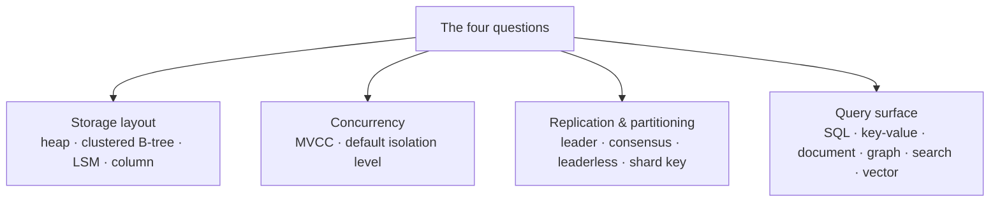
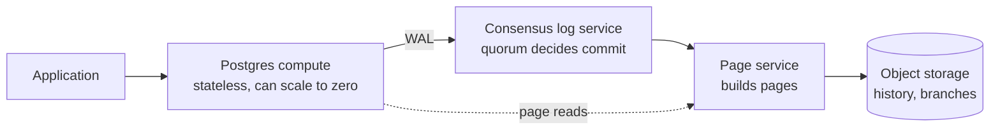

# Databases

> Use Postgres unless you have a specific reason not to. In 2026 there are three good ones: you need to take writes in several regions at once, you need reads back in under a millisecond, or you need to search billions of vectors. Almost everything else is a Postgres feature, an extension, or a managed Postgres with different storage underneath.

This is a map of the database landscape as of September 2026: what's out there, how each kind of engine works underneath, what problem it was built for, what it gives up, and where it stops being a good fit. I've written it for someone who has to pick a database for a system and defend the choice, so the mechanisms get as much space as the product names. Products change every year. The mechanisms, and the trade-offs they force on you, have been the same for decades.

One idea organises the rest: a database is a data structure you rent over a network. Every engine, whatever it's called, comes down to a handful of decisions about that data structure. Once you can see the decisions, two hundred products collapse into about a dozen shapes.

## How to read a database

There are four questions to ask about any engine. Once you know the answers you know most of what it can and can't do.

### How does it lay bytes out on disk?

The storage layout decides which reads are cheap and which writes are cheap, and hardware doesn't change that.

Postgres uses a **heap with B-tree indexes**. Rows go wherever there's room, and a B-tree index maps each key to the row's location. A read by key is a few page lookups, a range scan over an index is mostly sequential, and a write updates the heap plus every index on the table. Reads and writes cost about the same, which is why this is the general-purpose default.

MySQL's InnoDB uses a **clustered B-tree**. The table itself is the primary-key index: rows live inside the tree, in key order. Scanning a range of primary keys reads contiguous pages, which is fast. The downside is that every secondary index stores the primary key instead of a row location, so a lookup through a secondary index walks two trees, and a wide primary key makes every index bigger.

Cassandra, ScyllaDB, CockroachDB, RocksDB, and most engines built for write volume use a **log-structured merge tree**, usually shortened to LSM. Writes go to an in-memory table that gets flushed to disk as an immutable sorted file, and a background process (compaction) merges those files and throws away overwritten values. Writes are sequential and cheap. Reads might have to look in several files, so they cost more, and each file keeps a bloom filter so reads can skip files that can't contain the key. Deletes are awkward. A delete doesn't remove anything; it writes a marker (a tombstone) that every read has to step over until compaction finally clears it. If your workload deletes a lot, reads get slower, and in practice you end up tuning compaction or changing the model so you delete less.

ClickHouse, DuckDB, Snowflake, and BigQuery use a **column store**. Each column is stored as its own run of values, compressed, in immutable chunks. A query that touches three columns out of a hundred reads three per cent of the bytes, and a column full of similar values compresses to a small fraction of its size. The catch is that a single row is spread across every column file, so reading or updating one row means touching all of them. Column stores are good at questions over many rows and few columns, and bad at point reads and single-row updates.

### What does it promise when two things happen at once?

Concurrency control decides what a transaction sees while other transactions are running. Nearly every engine now uses **multi-version concurrency control**, or MVCC: a write creates a new version of the row rather than overwriting it, so readers keep seeing a consistent older version and don't block writers. What differs is the *isolation level* each engine gives you by default, and the defaults are weaker than most people assume.

Postgres defaults to **read committed**. Each statement sees whatever was committed before that statement started, so two statements in the same transaction can see different states of the database. MySQL's InnoDB defaults to **repeatable read**, which fixes one snapshot for the whole transaction, but still lets two transactions each read a value and both write based on what they read, an anomaly called write skew. Only **serializable** promises that the result is the same as if the transactions had run one at a time, and it pays for that with retries: a serializable transaction that conflicts with another gets aborted, and your application has to run it again. CockroachDB and Spanner default to serializable. YugabyteDB dropped its default to read committed in 2025 because the retries kept surprising people. Whatever your engine defaults to is part of your system's behaviour whether you chose it or not, so it's worth finding out.

### How does it survive a machine dying, and how does it grow?

**Replication** copies data to more than one machine, and the way it copies decides what you can promise after a failure.

With *leader-based* replication, one node accepts writes and streams them to followers. Postgres and MySQL both work this way, asynchronously by default, which means a write the client has been told succeeded can still be lost if the leader dies before a follower has it. Both can be configured to wait for a follower before acknowledging, at the cost of a network round trip on every commit. Redis is also leader-based and asynchronous, and its documentation says outright that acknowledged writes can be lost on failover.

With *consensus-based* replication, a protocol such as Raft or Paxos gets a majority of nodes to agree on each write before it's acknowledged, so losing a minority of nodes loses nothing. CockroachDB, YugabyteDB, TiDB, Spanner, and Neon's write path all do this. Every commit is a round of messages between the replicas, and if the replicas are in different regions, that round crosses regions. No protocol gets around that; it's the speed of light.

With *leaderless* replication, in the style of Amazon's Dynamo paper that Cassandra and ScyllaDB follow, any node can accept a write and forwards it to several replicas, and a read asks several replicas and takes the newest answer. You choose how many replicas have to acknowledge a write and how many have to answer a read. If the two sets overlap, reads see the latest write. If you set them lower you get more availability and lower latency and give up that guarantee.

**Partitioning**, or sharding, splits data across machines so no one machine has to hold it all. Hash partitioning spreads keys evenly and makes range queries expensive; range partitioning keeps neighbouring keys together and can put all the recent writes on one machine. Choosing the partition key is the most important decision in a partitioned system, for two reasons: a query that doesn't include the key has to ask every partition, and a key whose values aren't evenly popular makes one machine the bottleneck. Every store that scales writes across machines makes you decide this up front. Postgres doesn't, because Postgres doesn't partition across machines at all, and that's the limit that eventually sends people to the distributed tier.

### What questions does it answer cheaply?

The last question is the one you see on the product page. SQL over a relational model lets you ask questions you didn't plan for when you designed the schema, with a query planner that sometimes guesses wrong. A key-value API answers one question, "give me the value for this key", very fast, and nothing else. A document model stores a whole aggregate together, so one read returns everything about one entity. A graph model makes multi-hop traversals cheap. An inverted index answers "which documents contain these words". A vector index answers "which stored vectors are closest to this one". Each of these is an index structure and a query language on top of one of the storage layouts above, and the rest of this article is organised by that layer.

```mermaid
graph TD
    Q[The four questions] --> S[Storage layout<br/>heap · clustered B-tree · LSM · column]
    Q --> C[Concurrency<br/>MVCC · default isolation level]
    Q --> R[Replication & partitioning<br/>leader · consensus · leaderless · shard key]
    Q --> A[Query surface<br/>SQL · key-value · document · graph · search · vector]
```

## General-purpose relational engines

Most applications need one store that keeps data correct with several writers at once, answers questions nobody planned for, and doesn't lose writes it has acknowledged. The relational engines do all of that for one machine's worth of data, and one machine holds more than people tend to assume. A single well-provisioned Postgres will serve tens of thousands of transactions a second over terabytes of data.

### PostgreSQL

Postgres is the default in 2026 and the recommendation of this article, so it's worth saying why. It isn't the fastest engine at any one thing. It's the engine with the fewest surprises across all of them, and the one every managed vendor has decided to build on.

It stores rows in a heap with B-tree indexes, plus several other index types: GIN for arrays and JSON, GiST for geometry, BRIN for huge append-only tables, and HNSW through the pgvector extension. MVCC keeps old row versions in place, and a background process called VACUUM reclaims them. A table that's updated heavily and vacuumed badly bloats, and learning to watch for that is the one operational habit every Postgres team picks up. Replication streams the write-ahead log to standbys, asynchronously unless you name a synchronous one. Logical replication is a separate mechanism that ships row changes instead of bytes, and it's what feeds change-data-capture pipelines. The default isolation level is read committed. One operating-system process serves each connection, so connections are expensive and the default limit is 100; any Postgres of real size has a connection pooler in front of it. PgBouncer in transaction mode is the usual answer, and the managed vendors ship one built in.

PostgreSQL 18 came out on 25 September 2025 with a new asynchronous I/O subsystem that can use io_uring on Linux, which the release notes credit with up to three times faster reads in some workloads. It also added a native `uuidv7()` function, B-tree skip scans, data checksums on by default, and temporal primary and foreign keys. Version 19 is in beta, with general availability planned for October 2026; it brings a `REPACK` command that replaces `VACUUM FULL` and can run without locking the table, parallel autovacuum, and logical replication of sequences. The bigger news is around Postgres rather than in it. Databricks paid about a billion dollars for Neon in May 2025, Snowflake paid $250 million for Crunchy Data a month later, and PlanetScale launched a Postgres product in September 2025. The 2025 Stack Overflow survey had Postgres at 55.6 per cent of respondents, 18.6 points ahead of MySQL. The vendors are consolidating on it because the developers already had.

Use it for transactional workloads of any ordinary shape, and for anything that wants JSON, full-text search, geospatial, or vectors next to relational data without running a second system. It's the right choice whenever your team's time is worth more than the last ten per cent of throughput.

Its limit is that writes go through one primary, and it has no built-in way to spread a table across machines. Read replicas lag. If you need more write throughput than one large machine can take, or you need writes accepted in more than one region, you've outgrown it. That does happen, but it happens much later than most teams leave.

### MySQL and MariaDB

MySQL is still the second most deployed database by the DB-Engines count, and the one behind more of the web's history than any other. In 2026 not much about it is changing, and that's part of its appeal.

InnoDB stores the table inside its primary-key B-tree, so rows are physically in key order, and a range scan by primary key is the cheapest read there is. Secondary indexes hold the primary key rather than a row location, so a secondary lookup walks two trees, and a random or wide primary key hurts everything. MVCC uses undo logs instead of keeping old versions in place, so there's no VACUUM; the equivalent housekeeping is purging old undo records. Replication ships the binary log of logical changes, asynchronously by default, with semi-synchronous and group replication as options. The default isolation level is repeatable read, which is stronger than Postgres's default and still not serializable.

MySQL 9.7 shipped in April 2026 as the first long-term-support release since 8.4, with a new hypergraph optimiser and JavaScript stored programs, and Oracle moved the faster innovation track to a "26.x" numbering. There's been a `VECTOR` column type since 9.0, but the community edition has no index over it; approximate vector search lives in Oracle's HeatWave and Google's Cloud SQL. MariaDB, the community fork, reached 12.3 LTS in May 2026 and has had vector search since 11.8.

It suits read-heavy workloads that scan by primary key, teams with deep MySQL experience, and anyone who needs Vitess (below) to shard it. It has the same single-primary limit as Postgres and a much smaller extension story; most of the things Postgres does through extensions, MySQL doesn't do.

### SQLite

SQLite is the most deployed database in the world because it's a library rather than a server. It runs inside your process, keeps everything in one file, and is in the public domain.

It's a single-file B-tree. In its default mode a writer locks out readers. In write-ahead-log mode, which you should turn on, readers carry on while one writer at a time appends to the log. Transactions are serializable. There's no replication and no network protocol, on purpose.

Releases are steady (3.53 in mid-2026, 3.54 due in October), and the interesting movement is around it rather than in it. Turso is rewriting SQLite in Rust as a file-compatible engine with concurrent writers and asynchronous I/O; it's still pre-1.0. Its earlier fork, libSQL, adds replication to edge locations. One SQLite file per tenant, replicated to the edge, is now a real architecture rather than a hack.

Use it for embedded and mobile apps, command-line tools, per-tenant data, test fixtures, and any service whose whole dataset fits on one disk and is written by one process. Don't use it where more than one process writes, or where it has to be reached over a network without something in front of it.

## Postgres with different storage underneath

Running Postgres well is work: failover, backups, pooling, upgrades, and paying for a machine sized for your peak. The managed tier takes that work off you, and the interesting products in it have rebuilt the storage layer to change what Postgres can do.

What they share is **disaggregation**: separate the stateless Postgres compute from the durable storage, and put the storage on a replicated log service or on object storage. Amazon Aurora described this in its 2017 SIGMOD paper. The database sends only its write-ahead log to a storage service that builds the pages and keeps six copies. Neon, which is now the technology under Databricks' Lakebase, runs unmodified Postgres against a service where a Paxos quorum of "safekeepers" decides when a write is committed and "pageservers" serve pages, with history kept in object storage. Because the compute holds no state, you can branch a database copy-on-write in seconds and scale it to zero when it's idle. Snowflake Postgres, built on Crunchy Data and generally available since February 2026, and PlanetScale's Postgres on local NVMe are the other two serious entrants. Google's AlloyDB adds an in-memory columnar engine so analytical queries can run on the transactional data.

```mermaid
graph LR
    App[Application] --> PG[Postgres compute<br/>stateless, can scale to zero]
    PG -->|WAL| SK[Consensus log service<br/>quorum decides commit]
    SK --> PS[Page service<br/>builds pages]
    PS --> OS[(Object storage<br/>history, branches)]
    PG -.->|page reads| PS
```

These are for anyone who wants Postgres without operating it, for workloads that sit idle most of the time, and for teams that want a database per pull request.

They're still one Postgres primary. Disaggregation moves durability and storage scaling into a service; it doesn't spread writes across machines. Storage is a network hop away, which shows up on write-heavy workloads. And scale-to-zero helps the idle case, not the busy one, so the bill for a busy managed Postgres is real.

## Distributed SQL

Some systems have to take writes in several regions, survive losing a whole region, or hold more data under one schema than any single machine can, and still offer SQL and transactions. The distributed SQL engines do this by partitioning a relational database across nodes and replicating each partition with a consensus protocol.

The design is much the same across Spanner, CockroachDB, YugabyteDB, and TiDB. Data is split into ranges (Spanner calls them splits, CockroachDB ranges, Yugabyte tablets, TiDB regions). Each range is a Raft or Paxos group of three or more replicas, and a write is committed once a majority has it. A stateless SQL layer routes each query to the ranges it touches. CockroachDB's storage engine is its own LSM, Pebble; Yugabyte and TiDB use RocksDB. The hard problem is ordering transactions across ranges without a single clock. Spanner uses TrueTime, GPS and atomic clocks that bound clock uncertainty to a few milliseconds, and waits out that uncertainty before acknowledging a commit; Google's own walkthrough of a read-write transaction puts that wait at around five milliseconds on top of the Paxos round. CockroachDB uses hybrid logical clocks instead and pays with occasional transaction restarts. They all default to serializable isolation, or did until users asked for something weaker.

Aurora DSQL reached general availability in May 2025 as Amazon's entry. It's a disaggregated, multi-region, active-active engine that speaks the Postgres protocol and uses optimistic concurrency control, so conflicts show up as a serialisation failure when you commit. It isn't Postgres. As of August 2026 it has foreign keys, but also a cap of about 3,000 modified rows per transaction, no triggers, no PL/pgSQL, no extensions, and it bills per unit of work rather than per node. CockroachDB retired its free Core edition in November 2024; the whole product is now under a source-available licence that's free for companies under $10 million in annual revenue, with telemetry required. YugabyteDB and TiDB are still Apache 2.0.

Reach for this tier when you have a system of record that has to survive a region going down, a global product whose users write from three continents and all need to see one truth, or a dataset that has to be one logical database at a scale no single machine reaches.

The cost is that every commit is a consensus round, and across regions that's tens of milliseconds, which no setting removes. CockroachDB's documentation is direct about it: surviving a region failure means every write consults at least one other region. Single-row latency on a small dataset will be several times what Postgres gives you. Compatibility with Postgres is close but not exact, and the operations are different. If you can't say which region failure you're protecting against, or what write volume a single Postgres couldn't take, you probably don't need this yet.

## Document stores

Some data is naturally one nested thing: an order with its line items, a user profile with its settings. A document store keeps that aggregate together, so one read returns the whole thing, and the fields can vary from one document to the next. Twenty years ago this was sold as a rejection of the relational model. In 2026 it's a data model the relational engines also support, and the document stores have in turn grown schemas, secondary indexes, joins, and transactions. The question is really which side of that convergence you'd rather start from.

### MongoDB

MongoDB stores documents in WiredTiger, a B-tree engine with block compression. Replica sets have one leader and an election protocol in the Raft family. A write with `w: majority` is durable across a majority of the set, and the matching read concern gives you data that can't be rolled back. Sharding splits a collection across replica sets by a hashed or ranged shard key, with the same consequences as any other partitioned store. Multi-document transactions exist and are snapshot-isolated; the documentation suggests keeping them to about a thousand modified documents, and they abort after sixty seconds by default. A document can't be bigger than 16 megabytes.

MongoDB 8.0 in late 2024 was mostly about performance. MongoDB 8.2 in September 2025 brought full-text search, vector search, and hybrid ranking to the self-managed editions as a public preview, through a separate search process fed by change streams; before that you had to be on Atlas. The licence has been the SSPL since 2018, which isn't open source by the usual definition, and MongoDB sued FerretDB, the Postgres-backed compatible implementation, in 2025.

It fits aggregates that are read and written whole, schemas that genuinely vary per record, and teams that think in JSON and want the packaging Atlas gives them.

It's a poor fit for relationships across documents: every cross-document join is either denormalised, and then has to be kept consistent by hand, or done in your application. Analytics over lots of documents is slow. And I'd say this plainly: a `jsonb` column in Postgres with a GIN index covers most of what people pick MongoDB for, inside one system that also has real joins.

### Couchbase and Firestore

Couchbase 8.0 (October 2025) made an LSM engine called Magma the default for datasets much bigger than memory, and it offers cross-document transactions within one datacentre. Its source is under the Business Source Licence. Google's Firestore is a managed document store built on Spanner's storage and transaction layer, so it's strongly consistent and multi-region, and it has had a MongoDB-compatible API since August 2025. Its limits are a one-mebibyte document on the standard edition and a sustained write rate of about one per second per document, which affects how you model anything like a counter.

## Wide-column and key-value stores at scale

When a workload is dominated by writes or keyed reads at a volume and geographic spread no single primary can absorb, the answer since Amazon's 2007 Dynamo paper has been a partitioned, replicated key-value store that gives up cross-key transactions and ad-hoc queries in exchange for linear scaling and predictable latency.

### Amazon DynamoDB

Every item has a partition key, which is hashed to pick its partition, and an optional sort key that orders items within the partition. Each partition is replicated across availability zones and serves up to 3,000 read units and 1,000 write units a second. An item can be at most 400 kilobytes. Reads are eventually consistent unless you ask for a strongly consistent read. Transactions cover up to 100 items across tables, all or nothing. There's no version number because there's no server for you to run.

On-demand pricing was halved in November 2024, to $0.625 per million writes and $0.125 per million reads in US East, which removed most of the reason to use provisioned capacity. Global tables got multi-region strong consistency in June 2025, so a write acknowledged in one region is readable in another. Native vector search arrived in August 2026.

Use it for key-addressed workloads at any scale where you want single-digit-millisecond latency and no operations: sessions, carts, user state, event sourcing by key.

Its limit is any query the key design didn't anticipate. Every access pattern has to be designed into the table and its indexes up front, and a hot key hits a partition ceiling no matter how big the table is. Items over 400 KB and anything analytical live somewhere else.

### Apache Cassandra and ScyllaDB

Cassandra is the open-source Dynamo descendant: an LSM engine on every node, a consistent-hash ring, and no leader. A write goes to every replica of its partition, and you choose how many have to acknowledge it (`ONE`, `QUORUM`, `ALL`); reads work the same way, and if the write and read quorums overlap you read the latest write. Conflicts resolve by last-write-wins timestamp. Deletes write tombstones that reads step over until compaction clears them, and the advice to keep partitions under about 100 megabytes is a real limit rather than a style preference. Lightweight transactions give you single-partition compare-and-set through Paxos, at several round trips each.

ScyllaDB reimplements the same model in C++ with one shard per core and nothing shared between cores, which is why it runs the same workload on fewer, bigger machines. Its unit of distribution is now the "tablet", managed by Raft, instead of the virtual node.

Cassandra 5.0 (September 2024, at 5.0.9 in August 2026) added storage-attached indexes, a vector type with approximate-nearest-neighbour search, and a unified compaction strategy. The headline feature, Accord, a leaderless protocol for multi-partition strictly serializable transactions, slipped from 5.1 to 6.0, which is in alpha with general availability targeted for the second half of 2026. ScyllaDB dropped its AGPL edition in 2025 for a source-available licence that's free up to 50 vCPUs and 10 terabytes.

These fit write-heavy, append-mostly data at high volume, replicated across datacentres, where every query includes the partition key: telemetry, messaging, activity feeds at scale.

They don't fit read-modify-write patterns, heavy deletes, ad-hoc queries, or anything that wants a transaction across keys today. You have to know your queries before you design the tables, and getting that wrong is expensive to fix later.

### Bigtable and Cosmos DB

Google's Bigtable, the 2006 ancestor of this family, offers single-row transactions and eventual consistency across replicated clusters, and it now has GoogleSQL over it. Azure's Cosmos DB is worth knowing for the way it makes the consistency trade-off explicit: five levels from strong to eventual, chosen per account or per request. That's a useful vocabulary even if you never use the product.

## In-memory stores and caches

Some reads have to come back in well under a millisecond, and some data structures (counters, queues, leaderboards, rate limits) are awkward to express as rows. An in-memory store keeps everything in RAM, runs commands on a single thread so each one is atomic, and gives you data structures instead of tables.

### Redis and Valkey

One thread executes commands, with optional I/O threads for parsing and networking, so throughput per instance is bounded by one core and every command is atomic without any locking. Persistence is a periodic snapshot, an append-only log, or both. Replication is leader-based and asynchronous; the documentation says acknowledged writes can be lost on failover, and the `WAIT` command narrows that window without closing it. Cluster mode splits the keyspace into 16,384 hash slots, and multi-key operations have to stay within one slot. Transactions are `MULTI`/`EXEC` blocks that run in sequence and can't roll back.

Redis changed its licence in March 2024 from BSD to a pair of source-available licences, and within a week the Linux Foundation launched Valkey, a BSD-licensed fork of Redis 7.2 backed by AWS, Google, and Oracle. Redis 8.0 in May 2025 added AGPLv3 as a third licence option and folded JSON, the query engine, time series, probabilistic types, and vector sets into the core; it's at 8.10 as of mid-2026. Valkey reached 9.0 in October 2025 and 9.1 in May 2026, with hash-field expiry, atomic slot migration, and a claimed billion requests a second per cluster. Memcached is still the simplest option: multithreaded, no persistence, no replication, distribution done by the client. Dragonfly is a multi-threaded reimplementation under the Business Source Licence. KeyDB is unmaintained; avoid it.

Use these for caches, sessions, rate limiters, leaderboards, pub/sub, lightweight queues, and anywhere a sorted set or a stream is the natural structure.

Don't use them as a system of record. The dataset has to fit in memory, replication can lose acknowledged writes, and a cluster doesn't give you strong consistency. If you treat everything in Redis as something you could rebuild from elsewhere, it won't surprise you.

## Analytical engines and the lakehouse

Transactional engines are built for many small reads and writes by key. Analytical questions are the opposite shape: a few queries, each scanning millions or billions of rows and touching a handful of columns. Running them on the transactional store slows it down and still takes minutes. The analytical engines store data by column, execute in vectorised batches, and increasingly keep compute and storage separate so each can scale on its own.

### ClickHouse

ClickHouse's MergeTree engine writes each insert as an immutable sorted "part" and merges parts in the background. That makes ingestion very fast and, historically, point updates very slow: an `ALTER UPDATE` was an asynchronous mutation that rewrote whole columns. Since 25.7 a normal SQL `UPDATE` writes small "patch parts" that are visible immediately and get folded in on merge. The open-source edition is shared-nothing; ClickHouse Cloud runs a variant on object storage with stateless compute. It's Apache 2.0 and at 26.9 as of September 2026.

It's the engine to reach for when you have events, logs, or observability data arriving fast and you want sub-second aggregations over billions of rows. It's a poor fit for heavy point updates, big distributed joins, and anything transactional.

### DuckDB

DuckDB is an in-process, single-node columnar engine under the MIT licence. It reads Parquet, CSV, and JSON straight from local disk or object storage. It's SQLite's shape applied to analytics: a library, one file, no server.

DuckDB reached 1.5 in March 2026 and has announced a 2.0 with asynchronous I/O for remote files. Its lakehouse format, DuckLake 1.0 (April 2026), keeps table metadata in any SQL database and data in Parquet. In August 2026 AWS agreed to acquire DuckDB Labs, the commercial team; the engine stays MIT under its foundation. The pg_duckdb extension runs DuckDB's engine inside Postgres.

Use it for analytics on a laptop or one box up to the low terabytes, for analytics embedded in an application, and for ad-hoc queries over files in object storage. It's also the honest way to find out whether you need a warehouse yet; usually you don't. It isn't built for many concurrent writers or for scaling out, at least until 2.0's networking matures.

### Snowflake, BigQuery, Databricks, and Redshift

The cloud warehouses share one architecture, described in Snowflake's 2016 paper: data in immutable columnar files on object storage, and stateless compute clusters that any number of teams can point at it. Snowflake stores data as 50-to-500-megabyte "micro-partitions" and bills per second of virtual warehouse time, with a 60-second minimum each time a warehouse starts, in credits that double with each warehouse size. BigQuery has its own columnar format, runs Google's Dremel engine over "slots", and bills on demand at $6.25 per tebibyte scanned, which rewards partitioning and punishes `SELECT *`. Databricks runs its Photon engine over Delta Lake and has been buying its way into transactional Postgres through Neon. Redshift is the incumbent inside AWS and is now serverless by default.

The change that matters most is that all three have converged on **Apache Iceberg** as the open table format. Iceberg v3 is generally available across Snowflake, Databricks, and DuckDB in 2026, and Apache Polaris graduated as the standard REST catalogue. In practice that means your data can sit in your own object storage in an open format, and any of these engines, plus ClickHouse and DuckDB, can query it. The warehouse is turning into a compute choice rather than the place your data is locked up.

They're the right choice for governed, multi-team analytics with elastic scale and nobody on call, for sharing data between organisations, and for query loads that are spiky over large data. They're the wrong choice for small, hot, latency-sensitive queries, where the start-up time and minimum billing work against you, and for idle workloads where the meter runs regardless. They also aren't operational stores, whatever the vendors now sell next to them.

### The real-time OLAP tier

Between the warehouse and the transactional store there's a tier for dashboards that need to reflect events within seconds: Apache Druid, Apache Pinot, and StarRocks, all Apache 2.0, all built on immutable segments with some form of upsert. ClickHouse competes here too. Pick one of these when the freshness requirement is real and your queries are filtered aggregations; otherwise streaming ingest into the warehouse is simpler.

## Search engines

"Which records contain these words, ranked by how well they match" isn't a question a B-tree can answer. An inverted index maps each term to the list of documents containing it, and a scoring function such as BM25 ranks the matches.

Elasticsearch and OpenSearch are both Lucene underneath and both use BM25 by default. Elastic moved away from Apache 2.0 in 2021, which is what produced the AWS-backed OpenSearch fork, and then added AGPLv3 back as an option in September 2024; the two have been drifting apart since. Both now double as vector stores, and Elasticsearch 9.2 stores quantised vectors on disk. Meilisearch and Typesense are the lighter options for product search. Typesense keeps its whole index in memory (its docs quote 14 gigabytes of RAM for 28 million books), which is fast and predictable.

Use a search engine for text relevance, faceting, typo tolerance, log search, and hybrid text-plus-vector retrieval at scale. Don't use one as a source of truth, and don't reach for one at small scale. Postgres's built-in full-text search (a `tsvector` column with a GIN index) is transactional, needs no sync pipeline, and is enough for a lot of applications. Its ranking isn't BM25 and it has no fuzzy matching; the ParadeDB extension adds BM25 inside Postgres if you need it. Run a separate search cluster once you've measured that the built-in one isn't enough.

## Vector search

Embedding models turn text, images, and audio into vectors, and retrieval means finding the stored vectors closest to a query vector. Exact nearest-neighbour search over millions of high-dimensional vectors is too slow, so the engines build approximate indexes, usually HNSW (a layered graph of neighbours) or an inverted-file index over clusters, and trade a little recall for a lot of speed.

pgvector adds vector columns with HNSW and IVFFlat indexes to Postgres. It can index vectors of up to 2,000 dimensions (4,000 at half precision), because an index entry has to fit in an 8-kilobyte page. Qdrant (Rust, Apache 2.0), Milvus (Apache 2.0; its 3.0 in July 2026 indexes vectors left in object storage), and Weaviate are the dedicated open-source engines. Pinecone is the managed pioneer; it replaced its chief executive in 2025 and has been reported to be exploring a sale. Meanwhile every general engine has added vectors: Redis 8, MongoDB 8.2, MySQL 9 (a type but no index in the community edition), Oracle 23ai, Cassandra 5, ClickHouse 25.8, Elasticsearch, DynamoDB.

My view is that vector search is an index type, not a database category. Stonebraker and Pavlo's 2024 retrospective on sixty years of data models makes the historical case: every specialised model that claimed to make the relational one obsolete ended up absorbed as a feature, and vectors are going the same way. Elastic's chief executive put it more bluntly in 2026: "vector databases are a feature". For most applications the vectors belong next to the data they describe, in pgvector or whichever store already holds the records, so that filtering on the other columns and the vector search happen in one query.

A dedicated engine still makes sense for very large collections, somewhere past a hundred million vectors, where memory layout and quantisation decide what it costs; for hard latency targets at high query rates; and for teams that need retrieval features like multi-vector or sparse-plus-dense hybrid before the general engines ship them.

## Time-series stores

Metrics and sensor data arrive as a firehose of timestamped points, get queried by time range and aggregate, and are rarely updated. Time-series engines partition by time, compress runs of similar values hard, and pre-compute rollups.

TimescaleDB does this inside Postgres with "hypertables" that partition by time automatically, columnar compression its documentation puts above ninety per cent for typical data, and continuous aggregates. The company renamed itself TigerData in June 2025 and said most of its cloud workloads are no longer time-series at all. InfluxDB 3, rewritten in Rust on Apache Arrow and Parquet, reached general availability in 2025. QuestDB is a fast Apache 2.0 engine with its own binary ingestion protocol. ClickHouse handles time series well as a special case of what it already does and is adding a PromQL interface. For operational metrics specifically, Prometheus 3.0 (November 2024) is its own category and usually the right answer.

These earn their place for metrics, telemetry, and IoT at volumes where a plain table's per-row overhead and lack of compression would cost real money. They're wrong for anything that isn't append-mostly and time-keyed. And the line where plain Postgres stops being enough is further out than the vendors suggest: a partitioned Postgres table with BRIN indexes handles a surprising amount of time-series data before TimescaleDB is worth adding.

## Graph databases

Some questions are traversals: friends of friends, everything reachable from this node, the shortest path between two entities. In a relational engine each hop is a join, and a ten-hop query is ten self-joins the planner never expected. A graph engine stores adjacency directly, so following an edge is a pointer dereference.

Neo4j is the incumbent, with a GPLv3 community edition limited to a single server and a commercial edition for clustering; it moved to calendar versioning in 2025. Amazon Neptune is a managed service that speaks Gremlin, openCypher, and SPARQL. Apache AGE brings openCypher to Postgres as an extension. Kùzu, a promising embedded graph engine, was archived in October 2025.

Use one for work that really is a deep traversal: fraud rings, knowledge graphs, dependency analysis, recommendations based on graph structure. Don't use one just because the domain looks like a graph. Every domain model looks like a graph on a whiteboard, and almost no workload is a traversal; it's lookups and joins of bounded depth, which Postgres handles with a recursive common table expression. Pick a graph engine for the query, not for the diagram.

## Embedded engines

SQLite (above) is the embedded relational engine. RocksDB is the embedded key-value engine: an LSM library from Meta that sits under YugabyteDB, TiDB's TiKV, Kafka Streams, CockroachDB's ancestors, and plenty else. It's at 11.x in 2026, with asynchronous reads and a wide-column entity API. If you're building a storage system rather than choosing one, this is where you start.

## Things that aren't databases but get chosen like one

Apache Kafka is a replicated, partitioned log, not a database. It keeps an ordered, durable record of events that consumers read at their own pace. Kafka 4.0 (March 2025) removed ZooKeeper entirely in favour of its own KRaft consensus, and tiered storage to object storage is production-ready, which makes keeping the full history affordable. Use it to move and retain events, and keep the queryable state somewhere else. Materialize and RisingWave are "streaming databases" that keep SQL views incrementally updated as events arrive. Materialize has moved from the Business Source Licence to Apache 2.0, and RisingWave is Apache 2.0 with its state on object storage. They answer "what's the current value of this aggregate over the stream" without a batch job, and they're the right tool when that question is most of the application.

## How to choose

The ways people get this wrong are consistent enough to list. Choosing by the shape of the data ("it's a graph", "it's documents") goes wrong because the shape of the data isn't the shape of the queries. Choosing for the scale you expect goes wrong because the scale usually doesn't arrive, and the distributed engine you bought for it costs you operational effort from day one. Choosing by familiarity or fashion goes wrong quietly, then expensively, the first time you need a query the engine wasn't built for.

What holds up in production is the **access pattern**: the actual operations the system performs, with numbers. Write it down before you choose. It's a short list.

1. **List the queries.** Every read and write the system makes, including the reporting ones nobody mentioned, each with its expected rate and the latency it has to meet.
2. **Work out the ratio.** Reads to writes, and within reads, point lookups versus scans and aggregations.
3. **Name the consistency your logic assumes.** Does a read after a write have to see it? Can two users both take the last seat? Which anomalies would be bugs?
4. **Size the working set.** The hot data, not the total. Whether it fits in one machine's memory changes the answer.
5. **Name the failure you have to survive.** A machine, a zone, a region. Each step up costs a round trip per commit.

Then read the answers against this.

| If the pattern is | Start with | Because |
|---|---|---|
| Ordinary transactional reads and writes, one region, any schema | Postgres | Correct by default, one system for JSON, search, geo, and vectors, and the biggest ecosystem |
| The same, but you don't want to run it | A managed Postgres (Aurora, Neon/Lakebase, Supabase, PlanetScale) | Same engine, storage handled for you, branching and scale-to-zero |
| Writes in several regions, or surviving a region failure | Distributed SQL (Spanner, CockroachDB, YugabyteDB, TiDB, Aurora DSQL) | Consensus replication; expect tens of milliseconds per commit |
| Key-addressed reads and writes at very high volume, single-digit milliseconds | DynamoDB, or Cassandra/ScyllaDB if you run your own | Partitioned, replicated key-value; every query designed into the key |
| Sub-millisecond reads, counters, queues, sessions | Redis or Valkey, in front of a durable store | In-memory data structures; never the source of truth |
| Aggregations over billions of rows | ClickHouse for events at high ingest; DuckDB on one box; a warehouse over Iceberg for governed multi-team analytics | Column storage and vectorised execution |
| Text relevance over a large corpus | Postgres full-text first; Elasticsearch or OpenSearch once you've measured it isn't enough | Inverted index and BM25 |
| Nearest-neighbour retrieval | pgvector, or the vector feature of whatever holds the records; a dedicated engine past roughly 100M vectors | An index type, not a category |
| Deep traversals | Postgres recursive queries first; Neo4j or Neptune for real traversal workloads | Adjacency storage only pays off at depth |
| Data that lives inside one process or on one device | SQLite | A library, one file, serializable |

Four worked examples show the procedure running.

**A social feed.** Writes: a post is one insert, but fanning it out to a million followers' timelines is a million appends. Reads: each timeline read is one range scan by user, at high frequency. Consistency: a user has to see their own post immediately; followers can lag by seconds. Working set: recent timelines, which is large. This is the classic case for a key-value store with a sort key (DynamoDB or Cassandra keyed by follower, sorted by time) holding the timelines, with Postgres holding the posts, users, and relationships, and Redis in front of the hottest timelines. Postgres alone works until the fan-out write volume exceeds what one primary can take, and you can measure when that happens.

**A ledger.** Writes: transfers between accounts, each touching two rows, at a moderate rate. Reads: balances and statements. Consistency: absolute, because a lost or doubled transfer is a business event. Working set: small. This is Postgres, with serializable isolation on the transfer transaction and synchronous replication to a standby, and nothing else. Distributed SQL only comes in if the ledger has to accept writes in several regions at once, and most don't.

**A metrics store.** Writes: millions of timestamped points a minute, append-only. Reads: range queries with aggregation for dashboards and alerts. Consistency: eventual is fine. Working set: the last few hours, then cold. Prometheus if these are operational metrics; otherwise ClickHouse, or TimescaleDB if the metrics need to live next to relational data and the volume fits one large machine.

**Retrieval for an assistant.** Writes: documents are chunked and embedded on ingest, as a batch job. Reads: a query vector is matched against a few million chunks, filtered by tenant and permissions, and the text comes back. Consistency: eventual. Working set: the whole index. pgvector in the same Postgres that holds the documents and permissions, so the filter and the search are one query. Move to a dedicated vector engine when the collection passes tens of millions of vectors or the latency target is strict.

## What changed this year, and what to watch

**Postgres consolidated.** Two of the largest analytics vendors bought Postgres companies in the same month of 2025, PlanetScale added Postgres alongside its MySQL sharding, and Postgres 18 shipped asynchronous I/O. The 2024 essay arguing that Postgres was becoming a "data management framework" with an extension for every specialised model now reads like a description of the market rather than a prediction. The counterpoint is that Oracle, MySQL, and SQL Server still rank above it on DB-Engines' installed-base measure, and MySQL's decline there is slow.

**The licence wave, and the forks.** Between 2018 and 2025 MongoDB, Elastic, CockroachDB, Redis, and ScyllaDB each moved off an open-source licence. The community's answer each time was a fork under a foundation: OpenSearch from Elasticsearch, Valkey from Redis, OpenTofu from Terraform. Elastic and Redis have since added AGPL back. The practical lesson is to read the licence of whatever you're about to depend on, and to know which engines have a foundation-backed fork if the terms change again.

**Storage moved to object storage.** Aurora and Snowflake showed a decade ago that separating compute from a replicated storage service works. Neon, Aurora DSQL, ClickHouse Cloud, Milvus 3.0, RisingWave, Turbopuffer, and SlateDB now put the durable copy on object storage directly, accepting higher latency in return for bottomless capacity, branching, and near-zero idle cost. Expect more engines in this shape, and expect the latency trade-off to be what decides whether each one fits your workload.

**Vector search became a feature.** Every general engine in this article has it now. The dedicated vector vendors are consolidating.

**Open table formats won.** Iceberg v3 is generally available in every major warehouse, and DuckDB can write it. Choosing an analytical engine is becoming a compute decision over data you own.

**Reading.** *Designing Data-Intensive Applications*, second edition (Kleppmann and Riccomini, March 2026) is the book behind the mechanisms section of this article, revised for the cloud-native and object-storage world. Stonebraker and Pavlo's *What Goes Around Comes Around... And Around* (SIGMOD Record, 2024) is the sixty-year history that explains why the relational model keeps winning. Andy Pavlo's yearly retrospective is the best single summary of what moved in the industry.

## Summary

A database is a data structure you rent over a network, and every engine comes down to four decisions: how bytes are laid out, what concurrent transactions see, how data is replicated and partitioned, and which questions are cheap. The general-purpose relational engines make even-handed decisions, and Postgres makes the best of them in 2026, which is why the managed vendors are rebuilding their storage layers under it rather than replacing it. Distributed SQL gives you survival and geographic reach at the cost of a consensus round on every commit. Key-value stores give you scale if you design every query into the key. In-memory stores give you latency and take away durability guarantees. Column stores give you scan speed and take away cheap point access. Search, vector, time series, and graph are index structures that the general engines have absorbed or are absorbing, and a dedicated engine is worth it only at a scale or latency you can point to. Write the access pattern down, read it against the four decisions, and start on Postgres unless the numbers tell you otherwise.
