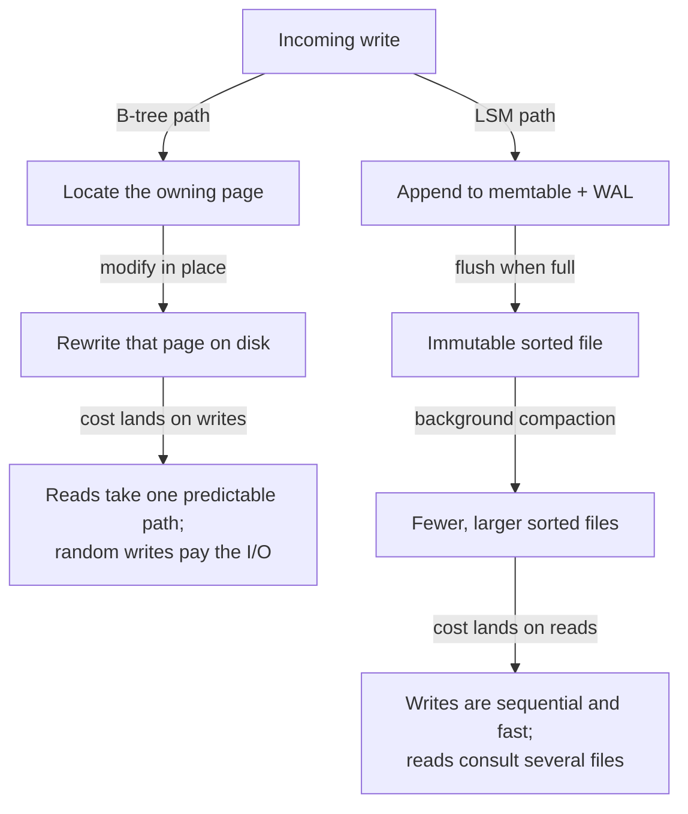
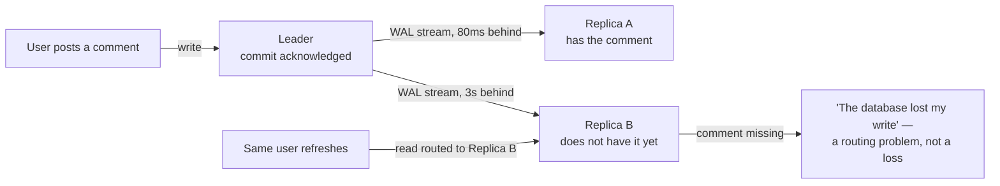
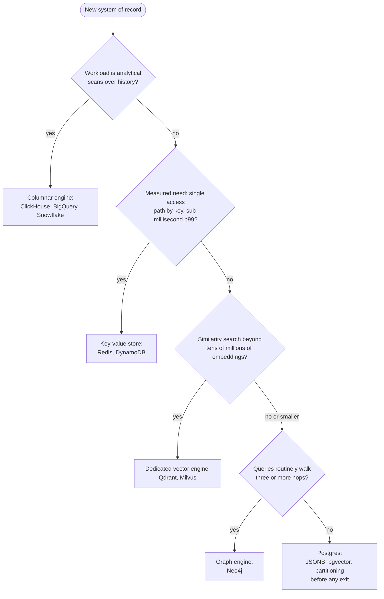
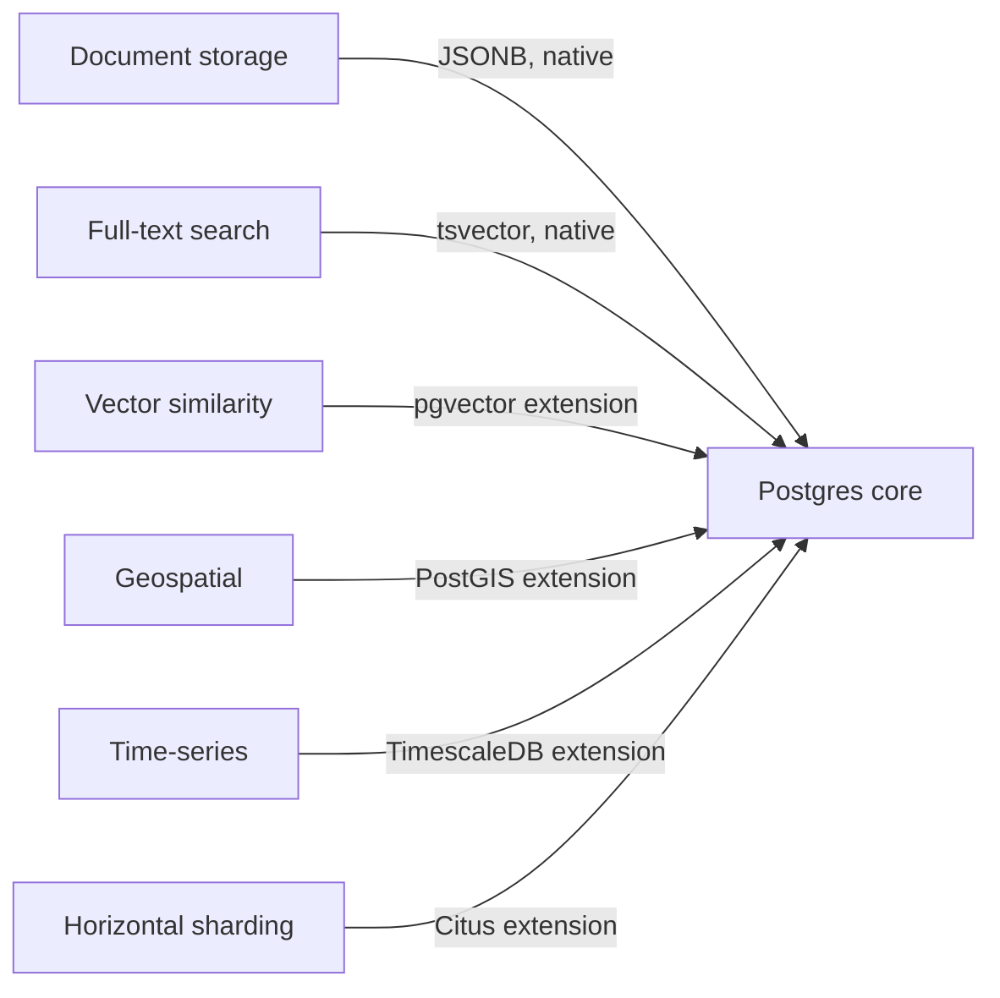

# Databases

> Start on a general-purpose relational database; in 2026 that means Postgres. Leave it only when a measured access pattern forces you out, because specialised engines are escape hatches, not starting points. The caveat is real: at genuine global write scale, for sub-millisecond cache reads, and for billion-scale vector recall, the escape hatch is the correct door.

This article covers the engine families a practitioner chooses between — relational, document, key-value, wide-column and columnar, vector, and graph — and the machinery the choice rests on: storage structures, transactions, replication, and partitioning. The machinery matters because an engine is inseparable from the guarantees it defaults to, and the defaults are weaker than most practitioners assume. One mental model organises everything that follows: **a database is a data structure you rent over a network.**

Every engine is three choices wearing a brand name. A storage layout decides which bytes sit next to each other on disk. An index structure decides which lookups skip the full scan. A query surface decides which questions you can ask without writing the traversal yourself. Families differ because they fix those three choices for different access patterns. An access pattern the layout fights stays slow no matter how much hardware you rent — and a guarantee the engine holds by default is the cheapest one you will ever buy.

## The pendulum: sixty years of data models

The families below are not new ideas. They are laps of a cycle the field has now run at least four times, and the cycle is worth learning because it predicts how the current market resolves.

The first commercial database was a tree. IBM's IMS, built in the late 1960s to track the Apollo program's bill of materials, stored records hierarchically: a rocket contains stages, stages contain engines, engines contain parts. The one access path from root to leaf was fast, and every other question meant writing a program to walk the tree. CODASYL, the network model that followed, generalised the tree to a graph of pointers and made the trade explicit — Charles Bachman's Turing lecture was titled "The Programmer as Navigator", and navigation was exactly the job: hand-plotting a route through linked records for every new question the business asked.

Codd's 1970 relational model was a rebellion against navigation itself. Store facts in flat tables; ask questions declaratively; let the engine derive the route. The proposal looked academically pure and ran slowly, and it took a decade of query-optimiser engineering to win. It won on a property that decides every lap of the cycle: **physical data independence**. When the question is decoupled from the storage layout, the layout can change without rewriting the programs — and next quarter's question costs a query instead of a project.

The laps since have a rhythm. Object databases in the 1990s, XML stores in the 2000s, and the NoSQL wave of the 2010s each rediscovered some of the hierarchy and navigation the relational model had displaced, each for a real local reason — the object-relational mismatch, document-shaped payloads, horizontal scale. And each converged back: object features folded into SQL, XML became a column type, and the NoSQL engines grew schemas, secondary indexes, SQL dialects, and transactions, one concession at a time. Stonebraker and Pavlo's 2024 retrospective — co-written by the same Stonebraker whose 2005 paper declared the one-size-fits-all engine dead — surveys the record and reads the pendulum as swung back: challengers either stay niche or become more relational, and the newest lap, the vector database, is already being absorbed as an index type. The practitioner's takeaway is blunt: bet on the model that has won four consecutive laps, and treat this decade's revolutionary paradigm as this decade's future column type.

## Choose by access pattern, nothing else

The workload's access pattern is the only selection criterion that survives contact with production. An access pattern is the concrete set of operations a system performs: the read-to-write ratio, point lookups versus range scans versus aggregations, the latency budget per operation, the consistency the business logic assumes, and the size of the hot working set. Those measurements pick the engine. Nothing else does.

The common selection errors all ignore the access pattern. Choosing by the data's conceptual shape fails because every domain looks like a graph on a whiteboard and almost no workload is a traversal. Choosing by anticipated scale fails because the anticipated scale rarely arrives, while the distributed engine bought for it charges its operational tax from day one. Choosing by familiarity or fashion fails quietly, then expensively, when the first unanticipated query arrives.

A social product's feed makes the trap concrete. The domain model is a graph of users and follows. The access pattern is a hot, denormalised read of the newest posts per user, plus a fan-out write on every post — one insert under the whiteboard model, a million timeline appends when the author has a million followers. That is a key-value pattern with a range component, not a graph workload. A team that buys a graph engine for that domain shape has bought deep-traversal machinery to serve a query that never walks more than one hop.

The practical discipline follows directly: start on the general-purpose engine, instrument it, and read the pattern out of production. In Postgres, `pg_stat_statements` names the queries that dominate load. A measured pattern that the relational layout genuinely fights is the licence to reach for a specialised engine. A diagram of the domain is not.

## Two workloads: OLTP and OLAP

Every database serves one of two workload shapes well, and the split explains half the product landscape. OLTP, online transaction processing, is many small operations against current state: fetch this order, update that balance. It wants row storage, where all the fields of one record sit together, because the unit of work is the record. OLAP, online analytical processing, is few large questions against history: revenue by region by month, five years deep. It wants column storage, where all the values of one field sit together — a scan that reads three columns out of eighty touches a few percent of the bytes, and a column of one type compresses far better than rows of mixed types.

The split is operational, not academic. Running analytics on the OLTP primary is the classic self-inflicted incident: one analyst's five-year scan evicts the hot working set and every user-facing query slows at once. The durable architecture keeps transactional truth in a row store and analytical copies in a column store, with a pipeline between them. Vendors selling the collapse of that pipeline appear in the convergence section below.

## The storage layer: indexes, B-trees, LSM-trees

One level below the engine families sit the storage decisions, and they are where the deepest product differences live.

Start with what an index is: a redundant, ordered structure the engine maintains so that a query can skip the full scan. The definition contains its own cost model. Every index accelerates some read and taxes every write, because each insert must now maintain the table and every index on it. That is why engines do not index everything, why write-heavy tables accumulate indexes reluctantly, and why "add an index" is a purchase, not a free lunch. The planner's job is to exploit the copies you paid for; your job is to pay for the right ones.

Beneath the indexes, every transactional engine commits to one of two structures for keeping sorted data on disk, and the commitment is the read/write trade made physical.

A **B-tree** keeps records in a balanced tree of fixed-size pages — 8 KB in Postgres — and updates them in place. Branching is wide: one page holds hundreds of keys, so a tree three or four levels deep addresses billions of rows, and a point lookup costs a predictable handful of page reads, most of them cached. The tax falls on writes. Updating in place means locating the owning page and rewriting it — a random I/O per write — and because a crash mid-rewrite would corrupt the page, the engine first records every change in a write-ahead log (the WAL), an append-only journal replayed during crash recovery. Every B-tree write is really two writes: one sequential to the log, one random to the page.

An **LSM-tree** — log-structured merge-tree — refuses the random write. Nothing updates in place: writes append to a sorted in-memory buffer (the memtable), protected by the same WAL idea; when the buffer fills, it flushes to disk as an immutable sorted file (an SSTable); background **compaction** merges the accumulating files into fewer, larger ones. Writes become pure sequential appends, which is where LSM engines' ingestion numbers come from. The tax moves to reads and to the background. A lookup may consult the memtable and several files newest-to-oldest, so LSM engines carry Bloom filters — compact probabilistic summaries that answer "definitely not in this file" — to keep misses cheap. Compaction itself rewrites the same record several times as it migrates down the file hierarchy (write amplification), and when sustained ingest outruns the merge, read amplification grows and stalls surface at the latency tail.

The diagram is the entire trade: both paths store the same data, and they differ only in where the cost lands. The B-tree pays at write time and rewards reads with one predictable path; Postgres, MySQL, and SQL Server sit here. The LSM-tree pays at read time and in background compaction, and rewards writes with sequential appends; RocksDB, Cassandra, and most ingestion-heavy stores sit here.

This one distinction decodes most database marketing. An engine advertising an order-of-magnitude write-throughput advantage is an LSM engine, and the honest follow-up questions are about read amplification and compaction stalls — the costs the benchmark moved off-stage. It also explains a common production surprise: telemetry firehoses hurt on B-tree engines not because the engine is bad but because the layout charges every append the price of a random write.

## The engine families

| Family | The structure you rent | What it makes cheap | Canonical engines |
|---|---|---|---|
| Relational | Sorted tables with B-tree indexes, joined at query time | Questions you did not plan for | Postgres, MySQL, SQL Server |
| Document | Trees of nested records, indexed by path | Reading and writing one aggregate whole | MongoDB, Couchbase |
| Key-value | A hash or sorted map at network scale | Get and put by exact key at extreme throughput | Redis, DynamoDB |
| Wide-column | A partitioned, sorted map of sparse rows | Write-heavy append within a partition | Cassandra, ScyllaDB |
| Columnar | Column-at-a-time files with vectorised scans | Aggregations over billions of rows | ClickHouse, BigQuery, Snowflake |
| Vector | An approximate-nearest-neighbour index over embeddings | "What is similar to this?" | pgvector, Qdrant, Milvus |
| Graph | An adjacency structure walked without indexes | Many-hop relationship queries | Neo4j, Memgraph |

The table names the trade each family makes; the verdicts below say when each trade is worth taking.

### Relational: the default for a reason

The relational model's superpower is answering questions nobody anticipated. Joins, secondary indexes, and a declarative planner mean the question you invent next quarter runs against the schema you designed last year. Transactions and constraints keep a decade of accumulating data honest, which matters more than any launch-week benchmark. The costs are real — horizontal write scaling is an add-on rather than a birthright, schema migrations demand discipline, and object-relational mapping friction is permanent — but they are the cheapest costs in this article, which is why the stance starts here.

### Document: the aggregate is the unit

A document store earns its keep when one aggregate, such as an order with its line items, is always read and written whole, and when records are genuinely heterogeneous. The trade: cross-aggregate questions reintroduce the joins the engine does not want to do, and "schemaless" relocates the schema into application code, where it drifts unversioned. Postgres's `JSONB` type serves the middle honestly — documents inside a relational engine, indexed, with joins available the day you need them. Reach for a dedicated document engine when the aggregate boundary is stable and cross-cutting queries are provably rare.

### Key-value: one operation, brutally fast

A key-value store does one thing at a speed nothing else matches: get and put by exact key, in memory in Redis's case, at contractual any-scale latency in DynamoDB's. The cost is the query surface, which is the key and nothing else. Every future question must be pre-computed into the keyspace at write time, so an evolving domain pays a redesign for each new access path. Correct as a cache, as a session store, and as the system of record for a stable, known access pattern at brutal scale. Wrong as the system of record for a domain still discovering its questions.

### Wide-column and columnar: two designs sharing a name

The shared word "column" causes real selection errors, because the two designs solve opposite problems. A wide-column store such as Cassandra is an LSM-based transactional engine: a partitioned, sorted map built for relentless write volume and geographic spread, with tables designed per query in advance. A columnar engine such as ClickHouse or a cloud warehouse is the OLAP side of the split above, built for scanning billions of rows and useless at point updates. Buy wide-column for write-heavy serving with known queries. Buy columnar for analytics. Never substitute one for the other.

### Vector: similarity as a query primitive

A vector database indexes embeddings, the numeric representations models produce, so that "what is similar to this?" becomes a query, served by an approximate-nearest-neighbour (ANN) index that trades a little recall for a lot of speed. Three costs tighten as the corpus grows: the index is approximate by construction, combining vector search with metadata filters is hard at the index level, and recall, latency, and cost form a three-way trade. `pgvector` inside Postgres serves corpora into the tens of millions of vectors alongside the rest of your data. Dedicated engines earn their operational bill at hundreds of millions of vectors, heavy filtered search, or strict tenant isolation.

### Graph: buy it for traversals, not for graphs

A graph database stores adjacency directly, so walking from a node to its neighbours costs the same at hop five as at hop one, where the equivalent SQL join chain grows a scan per hop. That is the purchase, whole. Most workloads described as graph problems are one or two hops deep, and one or two hops is a join Postgres executes without complaint. Buy a graph engine when deep, variable-depth traversal is the product itself: fraud-ring detection, dependency and impact analysis, knowledge-graph reasoning. The bill: a smaller operational ecosystem, and analytics over whole graphs usually belongs in batch compute rather than the serving engine.

## Transactions: the isolation you run, not the isolation you assume

A transaction is the engine's promise that a group of reads and writes behaves as a unit. ACID names the promise's parts, and knowing which parts do the work changes how you write applications. **Atomicity** is abort-ability: a failed transaction disappears completely, so error handling is "retry the whole thing", never "work out which half landed". **Durability** is the WAL again: committed means journalled to disk and crash-recoverable. **Consistency** is, honestly, the application's property — the engine enforces the constraints you declared, but only you know that debits must equal credits; it rides on the other three. **Isolation** is where practitioners get hurt, because isolation is the guarantee engines quietly weaken by default.

The mental model everyone carries is serializability: concurrent transactions behave as if they had run one at a time. Almost nothing runs serializable. Postgres defaults to Read Committed. MySQL's InnoDB defaults to its Repeatable Read. Oracle's level named SERIALIZABLE is actually snapshot isolation. Kleppmann's Hermitage test suite — which probes real engines with real anomaly workloads — exists precisely because the standard's level names do not describe behaviour across engines. Treat an isolation level as a per-engine measured fact, the way you treat a latency number.

What weak isolation permits is best seen in two anomalies. The **lost update** is the famous one: two workers read a counter at 41, each adds one, each writes 42, and one increment evaporates. Read Committed permits it; the fixes are an atomic single statement (`UPDATE stock SET n = n + 1`), an explicit lock (`SELECT … FOR UPDATE`), or a stronger level. **Write skew** is the subtle one, because the invariant spans rows. A rule says at least one moderator must stay on duty; two moderators each check the count, see two, and each removes themselves. Neither transaction touched the row the other wrote, so snapshot isolation — which detects only write-write collisions — waves both through, and the invariant is dead. Any rule of the shape "check a condition, then write somewhere else" is exposed: the on-call rota, the double-booked room, the balance check before the withdrawal.

Postgres's ladder up, concretely. Read Committed takes a fresh snapshot per statement: simple, fast, and two statements in one transaction can see two different databases. Repeatable Read is snapshot isolation — one snapshot for the whole transaction, and in Postgres it prevents phantom reads too, beyond what the standard requires — but write skew survives it. Serializable is snapshot isolation plus SSI, Serializable Snapshot Isolation: an optimistic algorithm that tracks read/write dependencies with predicate locks and aborts any transaction whose interleaving could not have happened in some serial order. The price of SSI is not blocking but retries — aborted transactions fail with SQLSTATE `40001`, and the application must loop. A retry wrapper around a serializable transaction is boring, mechanical code, and it is dramatically easier to review than a hand-written argument about why write skew cannot bite this particular pair of queries.

The verdict follows the stance's own logic: take the cheap guarantee. Where an invariant spans rows and money or safety rides on it, run that path serializable and write the retry loop, or make the conflict explicit with locks and constraints. Everywhere else, know what Read Committed permits and design with open eyes. It is no accident that the engines where these guarantees are cheapest are the general-purpose ones — several NoSQL engines spent a decade adding transactions because their absence turned every application into a concurrency research project.

## Replication: designing for the lag you bought

A production database is never one machine for long. The second copy buys survival when the first dies; the third buys read capacity. And the moment a second copy exists, its drift becomes your application's problem, because copies are never perfectly current.

The default shape is **single-leader replication**, which is what Postgres ships as streaming replication: all writes go to one leader, which streams its WAL to followers that replay it and serve reads. The design's virtue is that there is nothing to reconcile — one node orders every write. Its constraints are that the leader is the write ceiling, and that failover is where the operational danger concentrates.

Copies drift because replication is asynchronous by default: the leader acknowledges your commit first and streams it afterwards, with a healthy follower typically under a second behind. Async is the default for the reason Abadi's PACELC paper makes precise: the alternative — **synchronous** replication — adds at minimum one network round trip to every commit, because the leader waits for the standby's disk before answering. What synchronous buys is a hard guarantee: data survives unless leader and standby die together. Postgres lets you split the difference with quorum commit ("any two of these three standbys") and lets you choose per transaction — run the money synchronous, the pageview counters not.

What asynchrony costs is not durability first. It is a pair of anomalies that will file themselves as bug reports unless the application designs them away:

**Read-your-own-writes**: a user posts a comment, committed on the leader; the refresh reads a lagging replica; the comment is gone. Nothing was lost — the read raced the replication stream and won. The fix is a routing rule: serve a user's own recent writes from the leader, or pin a session to the leader for a beat after it writes. **Monotonic reads**: two refreshes hit two replicas with different lag, and time visibly runs backwards — the comment is there, gone, there again. The fix is stickiness: a given user reads a given replica. Neither fix is exotic. Both must be chosen, which is the point — and most consistency incidents in ordinary systems are exactly this, stale replicas doing what stale replicas do, not network partitions.

Failover is where single-leader earns its reputation. Promoting a follower means deciding the leader is dead rather than slow (a timeout — a guess), ensuring exactly one node believes it is the new leader (two leaders accepting writes is split brain, the worst state a database can be in), and accepting that under asynchronous replication the promoted follower may lack the last acknowledged writes. Managed Postgres earns its bill here; hand-rolled automatic failover is an engineering project wearing a checkbox's clothes.

This machinery is also the honest frame for CAP, which is narrower than its fame. The theorem binds only during a network partition: the partitioned system chooses between refusing some requests (consistency) and answering everywhere at the risk of divergence (availability). It says nothing about normal operation, and its formal definitions are strict enough that — as Kleppmann has argued — most real systems, default Postgres and default Cassandra included, are neither "CP" nor "AP"; the labels are better retired than applied. PACELC is the formulation that describes an ordinary Tuesday: if Partitioned, availability versus consistency; Else, latency versus consistency. The else branch is precisely the synchronous/asynchronous dial above, and it explains the market: Dynamo-style systems relaxed consistency because latency sells — Abadi cites studies where an extra 100 ms measurably drives customers away — while fully-ACID systems pay the round trips.

The verdict the machinery supports: a single-region Postgres with one synchronous standby is a strongly consistent, highly durable default that sidesteps this section's entire failure zoo at the cost of one round trip per commit. Eventual consistency is a real tool with a real bill. Take it deliberately, for a measured latency or availability need — and when you do, build read-your-writes and monotonic reads in from day one, because retrofitting session routing during an incident is how the second week of an outage happens.

## Partitioning: the exit with a one-way door

When a dataset or its write load genuinely outgrows one machine, the remaining move is to split the data by key across nodes — partitioning, or sharding. Every distributed engine in this article stands on it. It is also the decision with the least undo in the whole field, which is why it sits last among the mechanics.

There are two basic schemes, and each fails in its own way. **Range partitioning** keeps keys sorted and assigns contiguous ranges to nodes. Range scans stay cheap, because the keys you scan sit together — but skew is built in, since a time-ordered key sends every insert to the newest partition: one node works while the rest watch. **Hash partitioning** spreads keys uniformly and kills that hot tail, at the price of scattering ranges — a scan over a key range now visits every node. Choosing between them is easy once the access pattern is named. Reversing the choice on a live system means rewriting the dataset, which is the sense in which the partition key is a one-way door.

And hashing distributes keys, not traffic. One key can be hot all by itself — the celebrity account, the flash-sale SKU, the tenant who is forty percent of revenue — and no partitioning scheme fixes a workload where one key *is* the workload. That is application-level work: split the key, cache it, absorb it.

Two quieter costs decide real designs. **Secondary indexes** stop being one structure: either every partition indexes its own rows, and each index query scatters to all partitions and gathers the results, or the index is itself partitioned globally, and every write pays index updates on other nodes. **Transactions** stop at the partition boundary: the guarantees from the transactions section either vanish for cross-partition work or return by coordination — two-phase commit — whose price is extra round trips and a coordinator in every failure story. Single-partition transactions stay cheap, which is why partitioned systems push you to design single-partition workloads, and why Cassandra's data-modelling discipline is one table per query, partition key first.

The verdict: partitioning is the last rung of a ladder, not the first move. A bigger box is unfashionable and extremely effective. Read replicas absorb read growth. Postgres's native partitioning splits large tables locally — pruning queries to the partitions they touch, detaching old data in one statement — with none of the distributed costs above. When measurement, not the growth deck, says the write path itself has outgrown one leader, that is the genuine global-write-scale exit the stance names, and the honest options are the systems built for it: Spanner-class engines, Dynamo-style stores, and the now-GA distributed-Postgres line (Aurora DSQL, CockroachDB) — each charging exactly the coordination costs this section priced.

## Choosing: the decision, drawn

Read the diagram top-down, and hold one rule while reading: every "yes" edge demands a measurement, not a forecast. The p99 latency (the 99th-percentile response time) that justifies the key-value exit is a number from production or a load test, never a hunch. The default node at the bottom carries its own pressure valves, because `JSONB`, `pgvector`, read replicas, and native partitioning each defer an exit that once looked mandatory.

The stance breaks in three named places, and pretending otherwise would be dishonest. Genuine global write scale breaks it: a single-writer Postgres tops out, and active-active multi-region writes are what Spanner-class and Dynamo-style systems are for by design. Sub-millisecond p99 at high throughput breaks it: a disk-backed transactional engine across a network hop does not outrun an in-memory store, so caches belong to Redis and its kin. Billion-scale, heavily filtered vector recall breaks it: purpose-built ANN engines exist precisely for the corner where `pgvector` runs out. Each break is an access pattern, measured; none of them is a reason to skip the default on day one.

## The convergence: every database becomes every other database

Feature sets are converging; storage physics are not. Holding those two facts together is the whole trick to reading the 2026 market. The specialised-engine era began as a correction, crystallised by Stonebraker and Çetintemel's 2005 argument that one size fits all was over, and for fifteen years the correction held: an engine per workload, glued together per system. The current decade runs the film in reverse — and the reversal now carries the original author's signature, because Stonebraker and Pavlo's 2024 retrospective reads the NoSQL decade as one more lap of the data-model pendulum, its survivors more relational every year. Four forces drive the convergence.

Multi-model creep is the first. MongoDB ships multi-document transactions and full-text search; Redis ships JSON documents, secondary querying, and vector search; Cassandra ships secondary indexes and vector search. Every specialised engine climbs toward general-purpose, because every vendor eventually wants the workloads adjacent to its niche.

The second force runs the other way, and it is the one the stance rides: the general-purpose core absorbs each specialised capability at good-enough quality.

The extension mechanism is the moat the diagram draws, and the absorption is not only extensions — the core keeps closing the performance gaps that once justified exits. PostgreSQL 18, shipped September 2025, added an asynchronous I/O subsystem that queues and batches reads instead of issuing them one at a time, B-tree skip scan that lets a multicolumn index serve queries omitting its leading column, and native UUIDv7 keys for time-ordered identifiers: each one a workload that used to argue for a second engine, now a release note. Every absorbed capability deletes a reason to run that second engine, and a deleted second engine is a deleted backup regime, upgrade cadence, on-call rotation, and cross-store consistency problem. The feature-checklist comparison between Postgres-plus-extension and the dedicated engine misses that the operational bill of the second engine is the real price, and it is paid monthly.

HTAP, hybrid transactional/analytical processing, is the third force: engines such as TiDB and SingleStore keep a row copy and a column copy of the same data and route each query to the right one, collapsing the OLTP-to-OLAP pipeline into a single system. The fourth is disaggregated storage and compute: Aurora and Neon rebuild Postgres on shared, replicated storage with stateless compute in front, the shape cloud warehouses proved first. Disaggregation makes engines operationally interchangeable in exactly the way the rented-data-structure model predicts, because what you rent stops being a machine and becomes the structure itself.

What never converges is the physics underneath: row versus column layout, B-tree versus LSM, memory versus disk, synchronous versus asynchronous replication. Convergence blurs the feature checklists while leaving those trades exactly where they were. That asymmetry is the deepest argument for the stance. When features converge, the engine with the lowest operational cost and the broadest absorption mechanism wins the default, and the exits stay open only where physics, not feature lists, force them.

## What would change this stance

A stance that cannot name its falsifiers is a preference. These are the developments that would move this one:

- Distributed SQL at commodity cost: a managed Spanner-class or distributed-Postgres engine (Aurora DSQL and CockroachDB are the live candidates) matching single-node Postgres latency and operational simplicity at comparable price would make "start distributed" free, and the single-node default would weaken.
- Postgres fragmentation: cloud vendors forking the extension ecosystem until "Postgres" no longer names one compatible surface would hollow out the absorption argument.
- HTAP landing for real: a mainstream engine serving transactional and analytical load on one copy of data without interference would retire the row/column split as an architectural boundary.
- Retrieval-first products dominating: if the embedding index becomes the system of record for mainstream applications, the vector caveat stops being a corner and becomes the centre.

Until one of those arrives, the default holds: rent the general-purpose data structure, measure what production does to it, and let the measurements — never the whiteboard — open the escape hatches.
