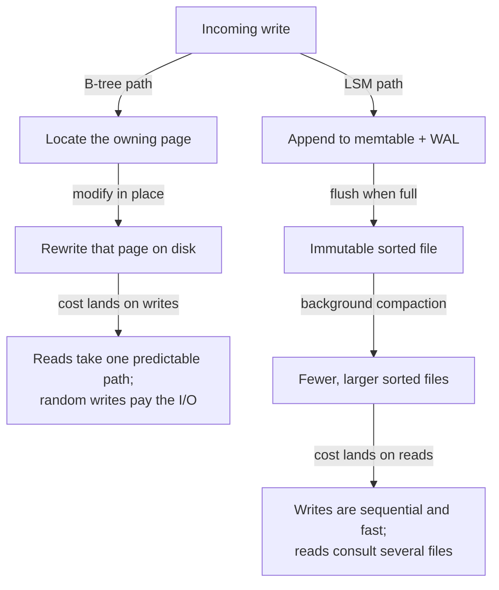
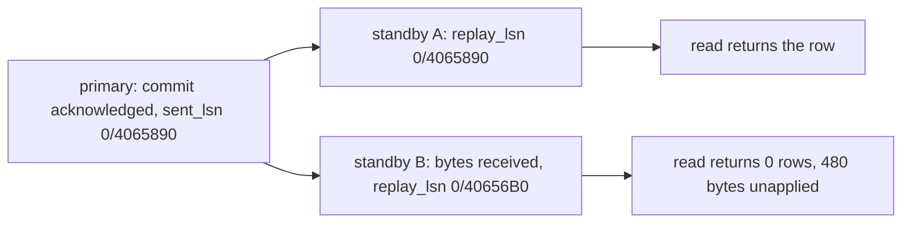
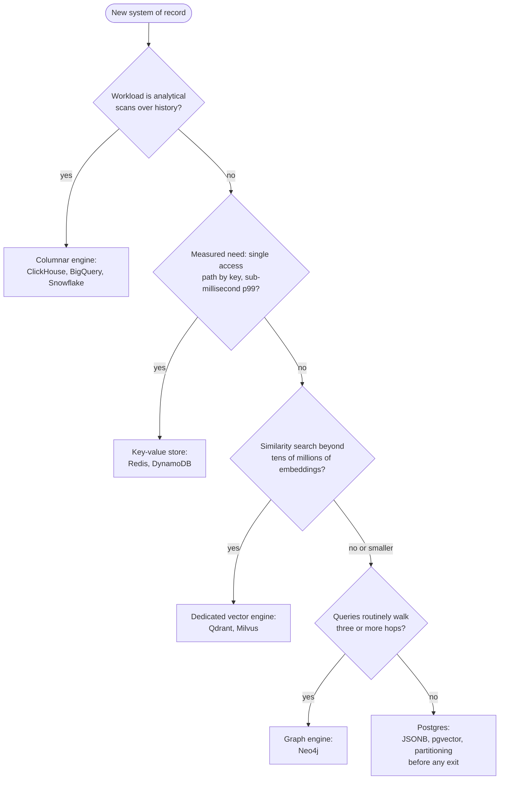
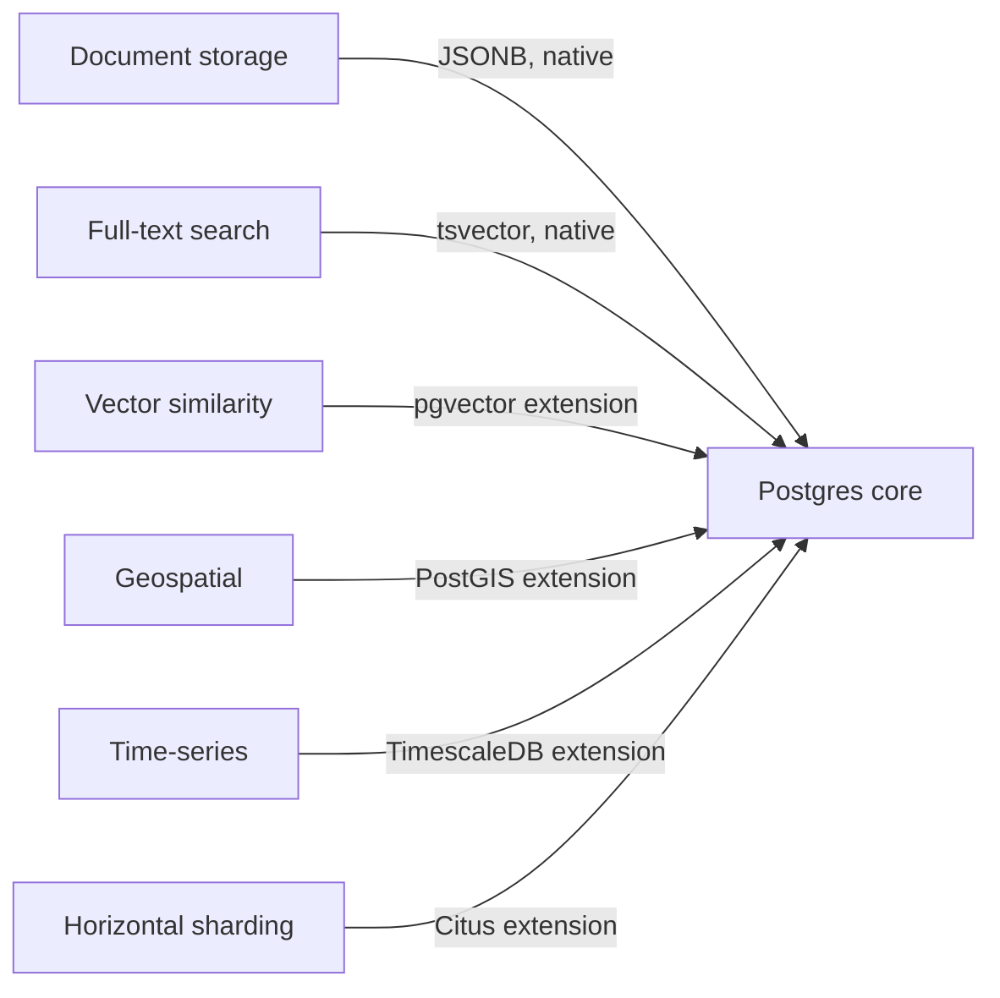

# Databases

> Start on a general-purpose relational database; in 2026 that means Postgres. Leave it only when a measured access pattern forces you out, because specialised engines are escape hatches, not starting points. The caveat is real: at genuine global write scale, for sub-millisecond cache reads, and for billion-scale vector recall, the escape hatch is the correct door.

This article covers the engine families a practitioner chooses between — relational, document, key-value, wide-column and columnar, vector, and graph — and the machinery the choice rests on: storage structures, transactions, replication, and partitioning. The machinery matters because an engine is inseparable from the guarantees it defaults to, and the defaults are weaker than most practitioners assume. One mental model organises everything that follows: **a database is a data structure you rent over a network.**

Every engine is three choices wearing a brand name. A storage layout decides which bytes sit next to each other on disk. An index structure decides which lookups skip the full scan. A query surface decides which questions you can ask without writing the traversal yourself. Families differ because they fix those three choices for different access patterns. An access pattern the layout fights stays slow no matter how much hardware you rent. And a guarantee the engine holds by default is the cheapest one you will ever buy.

## The pendulum: sixty years of data models

The families below are not new ideas. They are laps of a cycle the field has now run at least four times, and the cycle is worth learning because it predicts how the current market resolves.

The first commercial database was a tree. IBM's IMS, built in the late 1960s to track the Apollo program's bill of materials, stored records hierarchically: a rocket contains stages, stages contain engines, engines contain parts. The one access path from root to leaf was fast, and every other question meant writing a program to walk the tree. CODASYL, the network model that followed, generalised the tree to a graph of pointers and made the trade explicit. Charles Bachman's Turing lecture was titled "The Programmer as Navigator", and navigation was exactly the job: hand-plotting a route through linked records for every new question the business asked.

Codd's 1970 relational model was a rebellion against navigation itself. Store facts in flat tables; ask questions declaratively; let the engine derive the route. The proposal looked academically pure and ran slowly, and it took a decade of query-optimiser engineering to win. It won on a property that decides every lap of the cycle: **physical data independence**. When the question is decoupled from the storage layout, the layout can change without rewriting the programs, and next quarter's question costs a query instead of a project.

The laps since have a rhythm. Object databases in the 1990s, XML stores in the 2000s, and the NoSQL wave of the 2010s each rediscovered some of the hierarchy and navigation the relational model had displaced, each for a real local reason: the object-relational mismatch, document-shaped payloads, horizontal scale. And each converged back. Object features folded into SQL, XML became a column type, and the NoSQL engines grew schemas, secondary indexes, SQL dialects, and transactions, one concession at a time. Stonebraker and Pavlo's 2024 retrospective surveys the record and reads the pendulum as swung back: challengers either stay niche or become more relational, and the newest lap, the vector database, is already being absorbed as an index type. The verdict carries weight because it is co-signed by the same Stonebraker whose 2005 paper declared the one-size-fits-all engine dead. The practitioner's takeaway is blunt: bet on the model that has won four consecutive laps, and treat this decade's revolutionary paradigm as this decade's future column type.

## Choose by access pattern, nothing else

The workload's access pattern is the only selection criterion that survives contact with production. An access pattern is the concrete set of operations a system performs: the read-to-write ratio, point lookups versus range scans versus aggregations, the latency budget per operation, the consistency the business logic assumes, and the size of the hot working set. Those measurements pick the engine. Nothing else does.

The common selection errors all ignore the access pattern. Choosing by the data's conceptual shape fails because every domain looks like a graph on a whiteboard and almost no workload is a traversal. Choosing by anticipated scale fails because the anticipated scale rarely arrives, while the distributed engine bought for it charges its operational tax from day one. Choosing by familiarity or fashion fails quietly, then expensively, when the first unanticipated query arrives.

A social product's feed makes the trap concrete. The domain model is a graph of users and follows. The access pattern is a hot, denormalised read of the newest posts per user, plus a fan-out write on every post — one insert under the whiteboard model, a million timeline appends when the author has a million followers. That is a key-value pattern with a range component, not a graph workload. A team that buys a graph engine for that domain shape has bought deep-traversal machinery to serve a query that never walks more than one hop.

The practical discipline follows directly: start on the general-purpose engine, instrument it, and read the pattern out of production. In Postgres, `pg_stat_statements` names the queries that dominate load. A measured pattern that the relational layout genuinely fights is the licence to reach for a specialised engine. A diagram of the domain is not.

## Two workloads: OLTP and OLAP

Every database serves one of two workload shapes well, and the split explains half the product landscape. OLTP, online transaction processing, is many small operations against current state: fetch this order, update that balance. It wants row storage, where all the fields of one record sit together, because the unit of work is the record. OLAP, online analytical processing, is few large questions against history: revenue by region by month, five years deep. It wants column storage, where all the values of one field sit together. A scan that reads three columns out of eighty touches a few percent of the bytes, and a column of one type compresses far better than rows of mixed types.

The split is operational, not academic. Running analytics on the OLTP primary is the classic self-inflicted incident: one analyst's five-year scan evicts the hot working set and every user-facing query slows at once. The durable architecture keeps transactional truth in a row store and analytical copies in a column store, with a pipeline between them. Vendors selling the collapse of that pipeline appear in the convergence section below.

## The storage layer: indexes, B-trees, LSM-trees

One level below the engine families sit the storage decisions, and they are where the deepest product differences live.

Start with what an index is: a redundant, ordered structure the engine maintains so that a query can skip the full scan. The definition contains its own cost model. Every index accelerates some read and taxes every write, because each insert must now maintain the table and every index on it. That is why engines do not index everything, why write-heavy tables accumulate indexes reluctantly, and why "add an index" is a purchase, not a free lunch. The planner's job is to exploit the copies you paid for; your job is to pay for the right ones.

Beneath the indexes, every transactional engine commits to one of two structures for keeping sorted data on disk, and the commitment is the read/write trade made physical.

A **B-tree** keeps records in a balanced tree of fixed-size pages, 8 KB in Postgres, and updates them in place. Branching is wide: one page holds hundreds of keys, so a tree three or four levels deep addresses billions of rows, and a point lookup costs a predictable handful of page reads, most of them cached. The tax falls on writes. Updating in place means locating the owning page and rewriting it, a random I/O per write. And because a crash mid-rewrite would corrupt the page, the engine first records every change in a write-ahead log (the WAL), an append-only journal replayed during crash recovery. Every B-tree write is really two writes: one sequential to the log, one random to the page.

An **LSM-tree**, short for log-structured merge-tree, refuses the random write. Nothing updates in place. Writes append to a sorted in-memory buffer (the memtable), protected by the same WAL idea. When the buffer fills, it flushes to disk as an immutable sorted file (an SSTable), and background **compaction** merges the accumulating files into fewer, larger ones. Writes become pure sequential appends, which is where LSM engines' ingestion numbers come from. The tax moves to reads and to the background. A lookup may consult the memtable and several files newest-to-oldest, so LSM engines carry Bloom filters, compact probabilistic summaries that answer "definitely not in this file", to keep misses cheap. Compaction itself rewrites the same record several times as it migrates down the file hierarchy (write amplification). When sustained ingest outruns the merge, read amplification grows and stalls surface at the latency tail.



The diagram is the entire trade: both paths store the same data, and they differ only in where the cost lands. The B-tree pays at write time and rewards reads with one predictable path; Postgres, MySQL, and SQL Server sit here. The LSM-tree pays at read time and in background compaction, and rewards writes with sequential appends; RocksDB, Cassandra, and most ingestion-heavy stores sit here.

This one distinction decodes most database marketing. An engine advertising an order-of-magnitude write-throughput advantage is an LSM engine, and the honest follow-up questions are about read amplification and compaction stalls, the costs the benchmark moved off-stage. It also explains a common production surprise: telemetry firehoses hurt on B-tree engines not because the engine is bad but because the layout charges every append the price of a random write.

## The engine families

| Family | The structure you rent | What it makes cheap | Canonical engines |
|---|---|---|---|
| Relational | Sorted tables with B-tree indexes, joined at query time | Questions you did not plan for | Postgres, MySQL, SQL Server |
| Document | Trees of nested records, indexed by path | Reading and writing one aggregate whole | MongoDB, Couchbase |
| Key-value | A hash or sorted map at network scale | Get and put by exact key at extreme throughput | Redis, DynamoDB |
| Wide-column | A partitioned, sorted map of sparse rows | Write-heavy append within a partition | Cassandra, ScyllaDB |
| Columnar | Column-at-a-time files with vectorised scans | Aggregations over billions of rows | ClickHouse, BigQuery, Snowflake |
| Vector | An approximate-nearest-neighbour index over embeddings | "What is similar to this?" | pgvector, Qdrant, Milvus |
| Graph | An adjacency structure walked without indexes | Many-hop relationship queries | Neo4j, Memgraph |

The table names the trade each family makes; the verdicts below say when each trade is worth taking.

### Relational: the default for a reason

The relational model's superpower is answering questions nobody anticipated. Joins, secondary indexes, and a declarative planner mean the question you invent next quarter runs against the schema you designed last year. Transactions and constraints keep a decade of accumulating data honest, which matters more than any launch-week benchmark. The costs are real: horizontal write scaling is an add-on rather than a birthright, schema migrations demand discipline, and object-relational mapping friction is permanent. They are also the cheapest costs in this article, which is why the stance starts here.

### Document: the aggregate is the unit

A document store earns its keep when one aggregate, such as an order with its line items, is always read and written whole, and when records are genuinely heterogeneous. The trade: cross-aggregate questions reintroduce the joins the engine does not want to do, and "schemaless" relocates the schema into application code, where it drifts unversioned. Postgres's `JSONB` type serves the middle honestly — documents inside a relational engine, indexed, with joins available the day you need them. Reach for a dedicated document engine when the aggregate boundary is stable and cross-cutting queries are provably rare.

### Key-value: one operation, brutally fast

A key-value store does one thing at a speed nothing else matches: get and put by exact key, in memory in Redis's case, at contractual any-scale latency in DynamoDB's. The cost is the query surface, which is the key and nothing else. Every future question must be pre-computed into the keyspace at write time, so an evolving domain pays a redesign for each new access path. Correct as a cache, as a session store, and as the system of record for a stable, known access pattern at brutal scale. Wrong as the system of record for a domain still discovering its questions.

### Wide-column and columnar: two designs sharing a name

The shared word "column" causes real selection errors, because the two designs solve opposite problems. A wide-column store such as Cassandra is an LSM-based transactional engine: a partitioned, sorted map built for relentless write volume and geographic spread, with tables designed per query in advance. A columnar engine such as ClickHouse or a cloud warehouse is the OLAP side of the split above, built for scanning billions of rows and useless at point updates. Buy wide-column for write-heavy serving with known queries. Buy columnar for analytics. Never substitute one for the other.

### Vector: similarity as a query primitive

A vector database indexes embeddings, the numeric representations models produce, so that "what is similar to this?" becomes a query. The structure serving it is an approximate-nearest-neighbour (ANN) index, which trades a little recall for a lot of speed. Three costs tighten as the corpus grows: the index is approximate by construction, combining vector search with metadata filters is hard at the index level, and recall, latency, and cost form a three-way trade. `pgvector` inside Postgres serves corpora into the tens of millions of vectors alongside the rest of your data. Dedicated engines earn their operational bill at hundreds of millions of vectors, heavy filtered search, or strict tenant isolation.

### Graph: buy it for traversals, not for graphs

A graph database stores adjacency directly, so walking from a node to its neighbours costs the same at hop five as at hop one, where the equivalent SQL join chain grows a scan per hop. That is the purchase, whole. Most workloads described as graph problems are one or two hops deep, and one or two hops is a join Postgres executes without complaint. Buy a graph engine when deep, variable-depth traversal is the product itself: fraud-ring detection, dependency and impact analysis, knowledge-graph reasoning. The bill: a smaller operational ecosystem, and analytics over whole graphs usually belongs in batch compute rather than the serving engine.

## Transactions: the isolation you run, not the isolation you assume

A transaction is the engine's promise that a group of reads and writes behaves as a unit. **Atomicity** is abort-ability: a failed transaction disappears completely, so error handling is "retry the whole thing". **Durability** is the WAL again, and committed means journalled to disk and crash-recoverable. **Consistency** is, honestly, the application's property, since only you know that debits must equal credits. **Isolation** is where practitioners get hurt, because isolation is the guarantee engines quietly weaken by default.

The mental model everyone carries is serializability: concurrent transactions behave as if they ran one at a time. Almost nothing runs serializable. Postgres defaults to Read Committed. MySQL's InnoDB defaults to its own Repeatable Read. Oracle's level named SERIALIZABLE is actually snapshot isolation.

Kleppmann's Hermitage suite probes real engines with real anomaly workloads, and it exists because the standard's level names don't describe behaviour across engines. Treat an isolation level as a per-engine measured fact, the way you treat a latency number. I haven't run MySQL or Oracle here; those level claims are the documentation's and Hermitage's.

Two anomalies show what weak isolation permits. The **lost update** is the famous one. An account holds 100; two sessions read it, subtract in the application, and write back — A withdraws 40, B withdraws 30. In either serial order the balance should be 30. Read Committed permits something else. Here it is on PostgreSQL 16.14 in Docker on a laptop, two psql sessions fed one statement at a time, `default_transaction_isolation` at `read committed`:

```
 id | balance |   last_writer
----+---------+-----------------
  1 |      70 | B (withdrew 30)
```

70 is 100 − 30, and `last_writer` names the session that withdrew 30. The other withdrawal never happened. The row lock did its job. B's UPDATE waited 2557.109 ms for A's commit, then overwrote A's balance with a number computed before A had written anything. Reading the timings, the staleness was captured at read time. The three fixes close the gap between read and write: arithmetic inside the statement (`UPDATE accounts SET balance = balance - 40`), an explicit `SELECT … FOR UPDATE`, or a stronger level.

**Write skew** is the subtle one, because the invariant spans rows. A rule says at least one moderator stays on duty. Two moderators each check the count, see two, and each removes themselves. Neither transaction touched the row the other wrote, so snapshot isolation, which detects only write-write collisions, waves both through. Two sessions at Repeatable Read did exactly that. Both committed, and the invariant was dead. Any rule shaped "check a condition, then write somewhere else" is exposed: the on-call rota, the double-booked room, the balance check before the withdrawal.

Postgres's ladder up, concretely. Read Committed takes a fresh snapshot per statement. Simple, fast, and two statements in one transaction can see two different databases. Repeatable Read is snapshot isolation — one snapshot for the whole transaction, and in Postgres it prevents phantom reads too, beyond what the standard requires. Write skew survives it.

Serializable is snapshot isolation plus SSI, Serializable Snapshot Isolation, which the documentation calls an optimistic algorithm that tracks read/write dependencies with predicate locks and aborts any transaction whose interleaving couldn't have happened in some serial order. The price of SSI is not blocking but retries. Aborted transactions fail with SQLSTATE `40001`, and the application must loop.

The same rota conflict at SERIALIZABLE, with `\set VERBOSITY verbose` on the losing session so psql prints the code:

```
=== STEP B4 (fed 09:44:37.502) ===
COMMIT;
Time: 0.663 ms
ERROR:  40001: could not serialize access due to read/write dependencies among transactions
DETAIL:  Reason code: Canceled on identification as a pivot, during commit attempt.
HINT:  The transaction might succeed if retried.
```

The `HINT` is Postgres's own text, so the engine is recommending the retry loop itself. That reason code is the one this interleaving produced; SSI reports others for other shapes. The `LOCATION:` line is trimmed — verbose mode prints it, and an application is handed the code and the message.

And the rota the abort protected:

```
 id | name  | on_duty
----+-------+---------
  1 | alice | f
  2 | bob   | t

 still_on_duty
---------------
             1
```

One moderator off duty, one still on, and the rule holds. A retry wrapper around a serializable transaction is boring, mechanical code, and far easier to review than a hand-written argument about why write skew can't bite this particular pair of queries.

The verdict follows the stance's own logic. Take the cheap guarantee. Where an invariant spans rows and money or safety rides on it, run that path serializable with the retry loop, or make the conflict explicit with locks and constraints. Everywhere else, know what Read Committed permits and design with open eyes. It's no accident that these guarantees are cheapest on the general-purpose engines: several NoSQL engines spent a decade adding transactions because their absence turned every application into a concurrency research project.

## Replication: designing for the lag you bought

A production database is never one machine for long. The second copy survives the first one's disk; the third absorbs your reads. And its drift is your problem now, because a copy is only ever as current as the last thing it applied.

**Single-leader replication** is the shape, and in Postgres that's streaming replication: one primary orders every write and streams its write-ahead log to standbys that replay it and serve reads. Nothing has to be reconciled, and the primary is your write ceiling.

Streaming replication is asynchronous by default: the primary acknowledges your commit and streams the WAL afterwards, which opens a window on every commit. Everything below ran on PostgreSQL 16.14 in Docker on a laptop: one primary, two streaming standbys, one machine. I held that window open with `pg_wal_replay_pause()` on standby B, committed a row on the primary, and read it back from both:

```
$ psql@sbb -c "SELECT id, author, body FROM comments;"
 id | author | body
----+--------+------
(0 rows)

$ psql@sba -c "SELECT id, author, body FROM comments;"
 id | author |                body
----+--------+------------------------------------
  1 | user7  | sentinel-9f4c22 — posted by user 7
(1 row)
```

Same query, same instant, two answers. That's **read-your-own-writes** failing. The user posts, refreshes, and their comment is gone.

Check what B was missing. `pg_stat_replication` on the primary showed its received position equal to `sent_lsn`, with only `replay_lsn` behind, by 480 bytes:

```
 application_name |   state   | sent_lsn  | replay_lsn | replay_lag_bytes
------------------+-----------+-----------+------------+------------------
 sba              | streaming | 0/4065890 | 0/4065890  |                0
 sbb              | streaming | 0/4065890 | 0/40656B0  |              480
```

The bytes were already on B's disk, unapplied. That kills the usual picture, where the replica hasn't received the data yet. So the window you're racing opens in replay, after delivery — an inference from one run on one laptop, and whether that's the common shape in production this lab can't say.



The same pause produces the second anomaly. Four reads from one user, round-robined across the two standbys between `09:32:10.579` and `09:32:10.830`, returned visible comment counts of 2, 1, 2, 1 — time running backwards twice inside 251 milliseconds. (Those are `count(*)` over the whole table as each standby saw it, not per-user counts.) Replay lag was 0 bytes on the streaming standby, 208 on the paused one; both converged once the pause lifted.

That's **monotonic reads** failing, and both fixes are routing rules. Serve a user's own reads from the primary for a beat after that user writes; pin a user to one standby so their reads can't hop between two pasts. Neither is exotic, and both have to be chosen. Partitions get the literature; lag files the tickets.

Both windows were forced open with a pause, so read `sent_lsn` against `replay_lsn` on your own primary before you trust any lag figure, mine included.

The dial's other side is what closing that window costs. `synchronous_commit` sets how far a commit travels before the primary answers. I ran pgbench at each setting: single client, 300 transactions per run, three runs per rung, standby A the sole synchronous standby with `sync_state` verified `sync` before every run. 4,500 rows landed, which is 5 rungs × 3 runs × 300, the check that every run ran.

| `synchronous_commit` | who the primary waits for | run 1 | run 2 | run 3 | range |
|---|---|---|---|---|---|
| `off` | nobody — not even its own flush | 0.050 ms | 0.067 ms | 0.062 ms | 0.050–0.067 ms |
| `local` | the primary's own disk | 0.273 ms | 0.243 ms | 0.222 ms | 0.222–0.273 ms |
| `remote_write` | the standby's OS | 0.292 ms | 0.233 ms | 0.224 ms | 0.224–0.292 ms |
| `on` | the standby's disk | 0.405 ms | 0.338 ms | 0.330 ms | 0.330–0.405 ms |
| `remote_apply` | the standby, replayed | 0.394 ms | 0.340 ms | 0.334 ms | 0.334–0.394 ms |

Run 1 is the slowest in every rung, which is warmup. The ranges are min–max of the three logged runs, not means.

That ladder has two steps, not four. `off` to `local` separates cleanly, and so does `remote_write` to `on`. The other two overlap outright: `local` against `remote_write`, `on` against `remote_apply`. Two disk flushes is the likeliest reading, the primary's and then the standby's, with the two steps that stayed invisible being the ones that would have been paid on the wire and in replay.

Which is where you should stop trusting these milliseconds. All three containers share one Docker VM, so there is no real network between primary and standby, and this run cannot price the network round trip. The mechanism still holds — synchronous commit adds at minimum one round trip per commit — and what the measurement adds is where the rest of the cost sits when that trip is nearly free: a second fsync, on somebody else's disk. A cross-AZ standby adds real network latency on top of every figure above.

Failover is where single-leader earns its reputation. Promotion starts when a timeout expires, and a timeout can't tell a dead primary from a slow one. Exactly one node must come to believe it, because two primaries accepting writes is split brain. Under asynchronous replication the promoted standby may lack writes the old primary acknowledged. Managed Postgres earns its bill here; hand-rolled failover is a checkbox on a design doc and a quarter of somebody's year.

This machinery is also the honest frame for CAP, whose fame runs past its scope. The theorem binds during a network partition, and only then. Partitioned, you either refuse some requests (consistency) or answer everywhere and risk divergence (availability). Its definitions are strict enough that, as Kleppmann argues, most real systems are neither CP nor AP — default Postgres and default Cassandra included — so the labels are better retired. PACELC describes an ordinary Tuesday instead: if Partitioned, availability versus consistency; Else, latency versus consistency. That else branch is the table above. Latency sells, and Abadi cites studies where an extra 100 ms measurably drives customers away.

A single-region Postgres with one synchronous standby is a strongly consistent, durable default that sidesteps this whole failure zoo, at the cost of one round trip per commit plus the standby flush that showed up even where that trip was almost free. Eventual consistency is a real tool with a real bill. Take it deliberately, for a measured latency or availability need, and build read-your-own-writes and monotonic reads in from day one, because retrofitting session routing during an incident is how the second week of an outage happens.

## Partitioning: the exit with a one-way door

Most of what this article recommends is reversible. An isolation level is one line of config; last section's read-your-own-writes routing is application work you can back out. Change your mind about a partition key on a live system and you're rewriting the dataset.

Postgres partitions inside one machine, so start there. Everything below ran on PostgreSQL 16.14 in Docker on a laptop: a 2,400,000-row `events` table range-partitioned by month into twelve partitions, beside an unpartitioned twin with identical rows and index. Count one month against the partitioned table and the plan names one partition.

```
 Finalize Aggregate (actual time=11.948..13.448 rows=1 loops=1)
   Buffers: shared hit=1699
   ->  Gather (actual time=11.852..13.445 rows=2 loops=1)
         Workers Planned: 1
         Workers Launched: 1
         ->  Partial Aggregate (actual time=10.476..10.476 rows=1 loops=2)
               ->  Parallel Seq Scan on events_2025_07 events
                     (actual time=0.008..7.247 rows=101912 loops=2)
                     Filter: ((occurred_at >= '2025-07-01 00:00:00+00'...)
                     Buffers: shared hit=1699
 Execution Time: 13.476 ms
```

`Parallel Seq Scan on events_2025_07` is the pruning. One partition named, eleven absent, `Buffers: shared hit=1699` the whole cost. `rows=101912` counts per worker — two workers reporting their own share, roughly the partition's 203,825 rows between them, while the query itself returned one row, per `Finalize Aggregate`.

Take the partition key out of the predicate and pruning can't help. Filtered on `tenant_id`, the same table produces a `Parallel Append` over all twelve partitions. One scan node in the first plan, twelve in the second.

The twin needed vacuuming first: unvacuumed, its `Heap Fetches: 203825` flattered partitioning by roughly 119× on buffers. Vacuum both sides and the same one-month count goes the other way.

| | plan node | buffers | execution, 3 runs |
|---|---|---|---|
| partitioned | `Parallel Seq Scan on events_2025_07` | `shared hit=1699` | 14.144 / 12.499 / 11.770 ms |
| flat twin | `Parallel Index Only Scan`, `Heap Fetches: 0` | `shared hit=564` | 9.632 / 9.213 / 8.161 ms |

Those numbers are measured; the explanation for them is interpretation on my part. Pruning to one partition left an index nothing to exploit, because the partition *is* the month, so the partitioned side scanned it end to end while the flat table's btree answered from its index alone. One query shape on one shape of data: enough to retire partitioning as a read optimisation, too thin to support the opposite claim.

Retiring data is where local partitioning pays. Three months came off each side, detached to standalone tables on one and deleted on the other, row counts matching exactly at every step.

| rows retired | `ALTER TABLE … DETACH PARTITION` | `DELETE FROM … WHERE` |
|---|---|---|
| 203,855 | 2.312 ms | 124.934 ms |
| 184,128 | 2.153 ms | 104.757 ms |
| 203,856 | 1.884 ms | 112.535 ms |
| **range** | **1.884–2.312 ms** | **104.757–124.934 ms** |

Same rows, same job, single-digit milliseconds against three digits. The deleted table stayed at its pre-delete 208 MB even after a `VACUUM` cleared 591,839 dead tuples, because plain `VACUUM` frees space for reuse inside the table and doesn't return it to the filesystem (documented, not measured here). The partitioned side's remaining partitions summed to 157 MB immediately, no vacuum at all.

Feed 120,000 rows with strictly increasing timestamps into two identically-keyed twelve-partition tables and the schemes fail in opposite directions: the range table put all 120,000 in one partition and left eleven empty, the hash table spread them 9,762 to 10,187 across the twelve. A one-hour range scan then touched 1 partition on the range table, 12 on the hash one.

There are no nodes in this lab, though. It's one Postgres on one machine, showing which partition takes the writes and how many a scan opens; that a time-ordered key leaves one node working while the rest watch is the distributed consequence, which I take from the literature. Either way, the key is stamped into where every row already sits.

Hashing spreads keys. Traffic is a different distribution, and one key can be hot by itself — the celebrity account, the flash-sale SKU, the tenant who is forty percent of revenue. No partitioning scheme fixes a workload where one key is the workload. That's application work: split the key, cache it, absorb it.

Two quieter costs decide real designs, neither measured here. Secondary indexes stop being one structure: either each partition indexes its own rows and index queries scatter to all of them, or the index is partitioned on its own key and writes update entries elsewhere. Cross-partition transactions either lose the transactions section's guarantees or buy them back with two-phase commit, paying round trips and a coordinator in every failure story. Single-partition transactions stay cheap, which is why Cassandra models one table per query, partition key first.

Partitioning is the last rung of a ladder, not the first move. A bigger box is unfashionable and extremely effective, read replicas absorb read growth, and Postgres's own partitioning prunes to what the predicate names and retires a month in milliseconds, without the distributed costs. When you've measured the write path and one leader is the ceiling, that's the global-write-scale exit: Spanner-class engines, Dynamo-style stores, and the now-GA distributed-Postgres line (Aurora DSQL, CockroachDB), each charging the coordination costs this section priced.

## Choosing: the decision, drawn



Read the diagram top-down, and hold one rule while reading: every "yes" edge demands a measurement, not a forecast. The p99 latency (the 99th-percentile response time) that justifies the key-value exit is a number from production or a load test, never a hunch. The default node at the bottom carries its own pressure valves, because `JSONB`, `pgvector`, read replicas, and native partitioning each defer an exit that once looked mandatory.

The stance breaks in three named places, and pretending otherwise would be dishonest. Genuine global write scale breaks it: a single-writer Postgres tops out, and active-active multi-region writes are what Spanner-class and Dynamo-style systems are for by design. Sub-millisecond p99 at high throughput breaks it: a disk-backed transactional engine across a network hop does not outrun an in-memory store, so caches belong to Redis and its kin. Billion-scale, heavily filtered vector recall breaks it: purpose-built ANN engines exist precisely for the corner where `pgvector` runs out. Each break is an access pattern, measured. None of them is a reason to skip the default on day one.

## The convergence: every database becomes every other database

Feature sets are converging; storage physics are not. Holding those two facts together is the whole trick to reading the 2026 market. The specialised-engine era began as a correction, crystallised by Stonebraker and Çetintemel's 2005 argument that one size fits all was over. For fifteen years the correction held: an engine per workload, glued together per system. The current decade runs the film in reverse, and the reversal now carries the original author's signature: Stonebraker and Pavlo's 2024 retrospective reads the NoSQL decade as one more lap of the data-model pendulum, its survivors more relational every year. Four forces drive the convergence.

Multi-model creep is the first. MongoDB ships multi-document transactions and full-text search; Redis ships JSON documents, secondary querying, and vector search; Cassandra ships secondary indexes and vector search. Every specialised engine climbs toward general-purpose, because every vendor eventually wants the workloads adjacent to its niche.

The second force runs the other way, and it is the one the stance rides: the general-purpose core absorbs each specialised capability at good-enough quality.



The extension mechanism is the moat the diagram draws, and the absorption is not only extensions: the core keeps closing the performance gaps that once justified exits. PostgreSQL 18, shipped September 2025, added an asynchronous I/O subsystem that queues and batches reads instead of issuing them one at a time; B-tree skip scan, which lets a multicolumn index serve queries omitting its leading column; and native UUIDv7 keys for time-ordered identifiers. Each one is a workload that used to argue for a second engine, now a release note. Every absorbed capability deletes a reason to run that second engine. And a deleted second engine is a deleted backup regime, upgrade cadence, on-call rotation, and cross-store consistency problem. The feature-checklist comparison between Postgres-plus-extension and the dedicated engine misses that the operational bill of the second engine is the real price, and it is paid monthly.

HTAP, hybrid transactional/analytical processing, is the third force: engines such as TiDB and SingleStore keep a row copy and a column copy of the same data and route each query to the right one, collapsing the OLTP-to-OLAP pipeline into a single system. The fourth is disaggregated storage and compute: Aurora and Neon rebuild Postgres on shared, replicated storage with stateless compute in front, the shape cloud warehouses proved first. Disaggregation makes engines operationally interchangeable in exactly the way the rented-data-structure model predicts, because what you rent stops being a machine and becomes the structure itself.

What never converges is the physics underneath: row versus column layout, B-tree versus LSM, memory versus disk, synchronous versus asynchronous replication. Convergence blurs the feature checklists while leaving those trades exactly where they were. That asymmetry is the deepest argument for the stance. When features converge, the engine with the lowest operational cost and the broadest absorption mechanism wins the default, and the exits stay open only where physics, not feature lists, force them.

## What would change this stance

A stance that cannot name its falsifiers is a preference. These are the developments that would move this one:

- Distributed SQL at commodity cost: a managed Spanner-class or distributed-Postgres engine (Aurora DSQL and CockroachDB are the live candidates) matching single-node Postgres latency and operational simplicity at comparable price would make "start distributed" free, and the single-node default would weaken.
- Postgres fragmentation: cloud vendors forking the extension ecosystem until "Postgres" no longer names one compatible surface would hollow out the absorption argument.
- HTAP landing for real: a mainstream engine serving transactional and analytical load on one copy of data without interference would retire the row/column split as an architectural boundary.
- Retrieval-first products dominating: if the embedding index becomes the system of record for mainstream applications, the vector caveat stops being a corner and becomes the centre.

Until one of those arrives, the default holds: rent the general-purpose data structure, measure what production does to it, and let the measurements — never the whiteboard — open the escape hatches.
