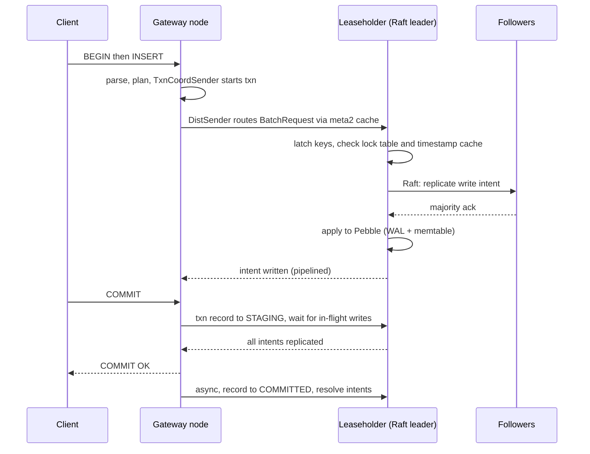

# Distributed SQL: Spanner and CockroachDB

> Distributed SQL is the database family to reach for when you need serialisable transactions that survive a node, a zone, or a whole region going away. You pay for that with a consensus round trip on every write. Spanner buys external consistency with Google's clocks and runs only where Google runs it; CockroachDB buys portability with hybrid clocks and a retry loop in every client. Neither can give you a write that finishes faster than the network between your replicas.

This is one of the deep dives behind the [databases overview](/databases/). It explains how the two flagship systems of the family work underneath, so you can reason about them under load, under failure, and in an interview. Each section starts with the mechanism the whole family shares, then shows how Spanner and CockroachDB each build it. YugabyteDB, TiDB, and Aurora DSQL each get a paragraph where they differ. Everything is as of September 2026: Spanner as Google Cloud offers it, CockroachDB at version 26.2.

## What it is

The family descends from one paper. Google's "Spanner: Google's Globally-Distributed Database" (OSDI 2012) described a database that "shards data across many sets of Paxos state machines in datacenters spread all over the world" and called itself "the first system to distribute data at global scale and support externally-consistent distributed transactions". The 2017 SIGMOD sequel, "Spanner: Becoming a SQL System", described how a key-value store with a schema grew a real SQL query engine. Every distributed SQL database since has taken the same shape: a stateless SQL layer on top of a key space cut into ranges, each range replicated by consensus, and timestamps rather than one machine's log ordering everything.

**Spanner** is Google's managed service built on that internal system. It runs only on Google Cloud, in regional, dual-region, and multi-region configurations. Each database speaks one of two SQL dialects: GoogleSQL, or a [PostgreSQL](/relational/) dialect reached through **PGAdapter**, a proxy that translates the PostgreSQL wire protocol so that psql, the common drivers, and the common ORMs connect unchanged. Since 24 September 2024 it's sold in three editions. Standard covers single-region configurations at 99.99% availability; Enterprise adds Spanner Graph, full-text search, and vector search; Enterprise Plus adds the 99.999% multi-region and dual-region configurations and geo-partitioning. In April 2026 Google announced Spanner Omni, a downloadable version for your own data centres and other clouds, in preview.

**CockroachDB** is the open-source-descended answer, from Cockroach Labs, founded in New York in 2015 by three engineers who had worked on Google's storage systems and wanted a Spanner for ordinary machines without atomic clocks. It's written in Go, ships as a single `cockroach` binary, and speaks the PostgreSQL wire protocol natively. The FAQ states the target: applications that need "reliable, available, and correct data, and millisecond response times, regardless of scale". It also says CockroachDB "is not yet suitable for heavy analytics / OLAP".

The licence has changed twice: from Apache 2.0 to the Business Source License in 2019, and in November 2024 to the **CockroachDB Software License**, which covers every release from v24.3.0 (18 November 2024). The free "Core" build was retired with 24.3. There are four licence types: paid Enterprise; Enterprise Free, with the same features, for organisations with under $10 million in annual revenue including parent and affiliates, government entities excluded; a 30-day Trial; and Evaluation from sales. Free and Trial clusters must send telemetry; one that stops for 7 days is throttled to 5 concurrent open transactions, and a cluster with no key at all is throttled 7 days after initialisation. Single-node clusters started with `cockroach start-single-node` or `cockroach demo` need no key and are never throttled, so local development stays free.

The current major is v26.2, released 27 April 2026. Cockroach Labs ships four majors a year, alternating Regular releases (longer support) with Innovation releases that can be skipped. You run it self-hosted (each node starts with `cockroach start --join`, then `cockroach init` once; there's a Kubernetes operator) or on CockroachDB Cloud, which has three plans: Basic (multi-tenant, billed by request units), Standard (provisioned vCPUs from 2 to 200), and Advanced (dedicated nodes, multi-region, compliance features). Every Cloud cluster carries an Enterprise licence.

## Architecture

The shared shape has four parts. A **stateless SQL layer** parses, plans, and coordinates; any node can do it, so you scale it by adding nodes behind a load balancer. Under it, all data lives in one sorted key-value space, cut into contiguous **ranges** (Spanner calls them splits). Each range has its own **consensus group**: three or more replicas that agree on a log of writes, one of which is the leader that serves reads and sequences writes. Every write carries a **timestamp**, so the store is multi-versioned and a reader at a timestamp sees a consistent snapshot without blocking writers. The two systems differ in the details of each part, and in one thing that shapes everything else: where the timestamps come from.

Spanner's deployment, in the 2012 paper, is a universe of zones. Each zone is a set of **spanservers**, each serving hundreds of **tablets**. A tablet's state lives in B-tree-like files and a write-ahead log on Colossus, Google's distributed file system, and the replicas of a tablet across zones form a **Paxos group**. Within a tablet, a **directory** is a set of contiguous keys sharing a prefix and the unit of placement; Spanner moves directories to shed load, and "a 50MB directory can be moved in a few seconds". Today's documentation calls the unit of sharding a **split**. Splits are created by size and by load, so a hot key range is split and moved to other servers automatically.

A Paxos leader holds a **leader lease**, "10 seconds by default", extended implicitly on each successful write. Within a group each leader's lease interval is disjoint from every other's, which is what lets a leader assign timestamps without asking anyone. The leader also runs the lock table and the transaction manager for its group.

Replicas come in three kinds. **Read-write replicas** keep a full copy, serve reads, vote on commits, and can be leader. **Read-only replicas** keep a full copy and serve reads but don't vote and can't lead. **Witness replicas** vote and take part in elections but hold no full copy and serve no reads; they let a quorum form with fewer data-bearing regions, and you pay no storage for them. A **regional** configuration puts three read-write replicas in three zones of one region. A **dual-region** configuration forms its write quorum from exactly two read-write regions, has six replicas per node, and, in the API's words, "requires failover in the event of regional failures". A **multi-region** configuration spreads its write quorum across more than one region with five or more replicas. One region is the default leader region, so leaders, and therefore writes, sit near where you expect traffic.

Capacity is bought in **nodes** or **processing units**: a node is 1,000 processing units, and instances can be as small as 100. Compute is separate from storage, which sits in Colossus, so adding a node adds serving capacity without copying data. Each node can hold 10 TiB of data, and an instance smaller than a node gets 1,024 GiB for every 100 processing units.

The part nothing else has is **TrueTime**. Every Google data centre has time masters, most with GPS receivers and the rest ("Armageddon masters") with atomic clocks, and every machine runs a daemon that polls several masters and rejects liars. `TT.now()` returns an interval `[earliest, latest]` guaranteed to contain the true time. In the paper's production numbers the uncertainty ε "is typically a sawtooth function of time, varying from about 1 to 7 ms over each poll interval", so "ε is therefore 4 ms most of the time". Spanner uses this bound in its commit protocol, covered in the transactions section.

CockroachDB's architecture guide describes five layers: SQL, transactional, distribution, replication, and storage. Every node runs the same process with the same role. Whichever node a client connects to becomes the **gateway** for that connection: it parses, plans, coordinates the transaction, and returns results. Each node has one or more **stores**, each a directory on disk with its own Pebble instance. All stores share one block cache sized by `--cache`, `--max-sql-memory` bounds in-flight query state, and the production guidance is 25% of RAM for each.

Every table and every index is encoded into one sorted key space as `/<table id>/<index id>/<indexed columns> -> <other columns>`. That key space is cut into **ranges** of at most 512 MiB by default (`range_max_bytes` = 536,870,912); below 128 MiB a range tries to merge with its right-hand neighbour. A new table starts as one range and splits as it grows, at the size limit or under load: a range serving more than 2,500 queries a second, or using more than 500 ms of CPU per second, becomes a candidate for a **load-based split** at the key where the load concentrates. The map of ranges lives in the key space itself, in a two-level index (`meta1`, `meta2`) holding a **range descriptor** for every range, and every node caches the entries it has used.

Each range is replicated to 3 nodes by default, and those replicas form a **Raft group**. One replica holds the **lease** and is the only replica that serves consistent reads and proposes writes. Since v25.2 the lease is tied to Raft leadership through **leader leases**, so leaseholder and leader are the same replica except briefly during a transfer. Reads at the leaseholder skip Raft entirely, because whatever is on its disk already reached consensus when it was written. So a read costs one network hop and a write costs a consensus round.

Storage is **Pebble**, a log-structured merge tree written in Go and inspired by RocksDB. A write goes to a write-ahead log and an in-memory memtable at once. The memtable flushes to an immutable sorted-string-table file (an SST) in level L0, and compaction merges SSTs down through L1 to L6, each level holding about a tenth of the data of the one below. If compaction falls behind, L0 fills and the tree "inverts", and every read consults many files; the docs call a read amplification under 10 healthy. An optional **value separation** mode keeps large values in blob files so compactions copy a pointer, which the docs say cuts write amplification by about half for about 20% more space. Every value carries a timestamp for **multi-version concurrency control (MVCC)**. Old versions are collected once older than the zone's `gc.ttlseconds`, default 14,400 seconds (4 hours), which is also how far back `AS OF SYSTEM TIME` can read.

Unlike Spanner, CockroachDB storage is local to each node, so adding a node means moving replicas onto it. And there is no TrueTime. CockroachDB uses **hybrid logical clocks (HLC)**: a timestamp whose physical part tracks wall time and whose logical part orders events on the same tick. Every message between nodes carries the sender's HLC and the receiver advances its own if needed, so causally related events order correctly. Each node starts with `--max-offset`, default 500 ms, the largest clock difference the cluster will tolerate. A node out of sync with at least half the others by 80% of that offset shuts itself down. Within the bound, a read that finds a value timestamped slightly ahead of its own timestamp can't tell whether that write came before or after it started. That window is the **uncertainty interval**. The transaction pushes its timestamp past the value and re-checks its reads; if that fails the client gets a `ReadWithinUncertaintyIntervalError`, one of the 40001 retry errors. Skew beyond the bound doesn't break serialisability, but it can break linearisability between causally dependent transactions, which is why the docs insist on NTP from one time source. For multi-region clusters they recommend 250 ms, because the offset sets the commit-wait on global tables.

Here is CockroachDB's write path for an `INSERT` inside a transaction; Spanner's differs in the places noted afterwards.

1. The gateway parses and plans; a plan that touches many rows is distributed (DistSQL) so processors run next to the data. The `TxnCoordSender` picks an HLC timestamp, tracks every key the transaction touches, and heartbeats the transaction. The `DistSender` looks up each key's range in its `meta2` cache and sends the request to the leaseholder.
2. On the leaseholder, a latch serialises requests on the same keys, the in-memory lock table checks for conflicts, and the **timestamp cache** checks that nobody has read these keys at a later timestamp. If someone has, the write's timestamp is pushed forward.
3. The write becomes a **write intent**: a provisional MVCC value that is also an exclusive lock pointing at the transaction's record. It's proposed to Raft, replicated to a majority, and applied to each replica's Pebble. With **transaction pipelining** the gateway doesn't wait per statement; it collects the acknowledgements at commit. Since 26.2, explicit serialisable transactions also use **buffered writes** by default: writes stay on the gateway (up to 4 MiB per transaction) until commit, and only the last write per key is sent. A transaction whose writes all land in one range takes the one-phase-commit fast path.
4. At `COMMIT`, **parallel commits** takes over. The coordinator writes the transaction record in `STAGING` with the list of in-flight writes, waits for all of them to replicate, and answers the client. The transaction is committed at that moment, because anyone who finds the record can verify the listed writes. That makes commit one consensus round rather than two, and the docs put a transaction's latency at "the sum of all read latencies plus one round of consensus latency".
5. Asynchronously, the coordinator flips the record to `COMMITTED` and rewrites the intents as ordinary values; if it dies first, the next transaction to find an intent does the recovery.

Spanner's path, from the paper, buffers a transaction's writes at the client until commit, while reads go to the leader of each split and take read locks. At commit the client chooses a coordinator group and sends the buffered writes to each participant's leader. Each participant leader takes write locks, picks a prepare timestamp, and logs a prepare record through Paxos. The coordinator leader picks the commit timestamp, logs the commit through Paxos, then waits out commit-wait before releasing locks and answering. That's two-phase commit over Paxos groups, with the client driving it "to avoid sending data twice across wide-area links". A transaction touching one split skips the prepare phase.

The read path is shorter. A consistent read in either system goes to the range's leader and reads the MVCC version at the transaction's timestamp. CockroachDB records the read in the timestamp cache so later writers are ordered after it. A read that hits someone else's intent checks that transaction's record and queues if it's still pending, and deadlocks are broken by aborting one waiter at random. Spanner's strong read goes to the leader too. A read-only transaction is "lock-free": it picks a timestamp and runs snapshot reads "at any replicas that are sufficiently up-to-date".

Both offer stale reads from the nearest replica. In CockroachDB every range has a **closed timestamp**, a promise from the leaseholder that no new write will land at or below it, trailing the present by a 3-second target. `AS OF SYSTEM TIME follower_read_timestamp()` reads from the nearest replica below it, which the docs put at least 4.2 seconds in the past, and `with_max_staleness('10s')` picks the freshest timestamp the local replica can serve without blocking. Spanner's API has the same two shapes: `exact_staleness` for a fixed point in the past, and `max_staleness` for a bounded-staleness read that the nearest replica can serve.

## Data model and indexing

The shared fact is that the table is its own primary index, sorted by primary key, and the primary key is therefore the shard key. Neither system lets you pick a different one. Every secondary index is a second sorted set of keys in the same key space, so it splits into ranges and is replicated like a table. A write to a row with three secondary indexes is four key-value writes, likely on four ranges with four leaders, inside one distributed transaction. And because keys are ordered, a key that increases monotonically sends every insert to the last range, which is the most common performance mistake in both systems.

### Spanner

Spanner keeps the paper's hierarchy. A table can be declared `INTERLEAVE IN PARENT`, which stores its rows physically inside the parent row's key range; the paper's example is `Albums` interleaved in `Users`, with `ON DELETE CASCADE`. Interleaving makes a parent-child join local to one split, without a distributed transaction. The cost is that a parent with too many children becomes one enormous key range that can't be split as freely.

Keys that are timestamps or sequence numbers hotspot the last split. Google's advice is a version 4 UUID as the key, or, if you need a compact integer, a **bit-reversed sequence** (`CREATE SEQUENCE ... OPTIONS (sequence_kind = 'bit_reversed_positive')`), which hands out integers whose bits are reversed so that consecutive values land far apart in the key space. A composite key with a well-spread column first and the timestamp second also works, and secondary indexes on timestamps need the same treatment.

Secondary indexes take `STORING` to add covering columns and `NULL_FILTERED` to leave out rows where an indexed column is null, the equivalent of a partial index on `IS NOT NULL`. An index can itself be interleaved in the table it indexes so that index and row live in the same split. Since September 2026 a single DML statement may generate at most 80,000 **mutation mods**, counted as "modified cells, primary keys, and secondary index updates". Before that, the 80,000 cap applied to the whole transaction, and it still does for a commit made through the mutation API rather than DML. A wide row with many indexes burns it fast.

Enterprise edition adds three more models over the same storage. **Spanner Graph** is queried with ISO GQL, with graph algorithms in preview since June 2026. **Vector search** uses approximate nearest neighbour indexes powered by ScaNN, which Google says scale past 10 billion vectors. Full-text search is the third. A columnar engine for analytics over live data entered preview in February 2026.

### CockroachDB

Every table must have a primary key; without one you get a hidden `rowid`, which the docs advise against. Non-key columns are stored as the value, grouped into **column families**; splitting a frequently updated column into its own family avoids rewriting large, rarely updated ones on every update. The docs say to drop indexes you don't need and to size-limit every indexed column, because values over 1 MiB drive write amplification and can crash nodes.

The index types are:

- Standard secondary indexes, with `UNIQUE` creating one automatically. `STORING` makes a covering index that avoids an **index join** back to the primary index.
- Partial indexes with a `WHERE` predicate, and expression indexes such as `lower(name)`.
- **Hash-sharded indexes**, which add a hidden computed shard column, 16 buckets by default, so sequential keys spread across ranges. The cost is that every range scan reads every shard.
- GIN (inverted) indexes over `JSONB`, `ARRAY`, and spatial data, and trigram indexes over strings.
- Vector indexes compatible with pgvector's `VECTOR` type, partitioned with k-means and enabled by default in 26.2.

Interleaved tables, CockroachDB's copy of Spanner's feature, were deprecated in v20.2 and removed in v21.2, so a parent-child join always crosses ranges. There's also no `CREATE DOMAIN`, no range types, no XML, and no foreign data wrappers.

The hotspot story is the same as Spanner's: the tail range splits at 512 MiB, the new tail lands on another node, and the problem moves with it. The fix is a `UUID` key from `gen_random_uuid()`, or a hash-sharded index if you need the order. A **row hotspot** (a celebrity's follower count updated thousands of times a second) can't be split at all in either system, so you change the model, for instance by spreading the counter across several rows. Row-level TTL expires rows by a timestamp column with a background job. **Changefeeds** turn the row-level change stream into messages for Kafka, Pub/Sub, Event Hubs, Pulsar, webhooks, or cloud storage, with at-least-once delivery and per-key ordering.

## Transactions and consistency

Both systems default to **SERIALIZABLE** isolation, where the outcome equals some one-at-a-time ordering of the transactions, and both let a transaction span any rows, tables, and ranges in the cluster. Both use MVCC so that reads never block on other readers and snapshot reads never block at all. The difference is how each decides the order, and what promise it makes beyond serialisability.

### Spanner

Spanner promises **external consistency**, which the paper defines as: "if a transaction T1 commits before another transaction T2 starts, then T1's commit timestamp is smaller than T2's". Serialisability alone only says there is some valid order; it would allow T2 to be ordered before T1 even though a human saw T1 finish first. External consistency (the paper equates it with linearisability) closes that gap. The commit timestamps become a global clock you can trust: a snapshot read at timestamp T anywhere in the world sees exactly the transactions that committed before T.

TrueTime makes that affordable. The coordinator leader assigns a commit timestamp no earlier than `TT.now().latest`, then obeys **commit-wait**: it holds the result until `TT.after(commit timestamp)` is true, that is, until the true time is certainly past the commit timestamp. With ε around 4 ms that wait is a few milliseconds, and it runs in parallel with the Paxos round. The paper's microbenchmarks on 4 KB operations: "commit wait is about 5ms, and Paxos latency is about 9ms", write latencies around 14 ms, read-only transactions around 1.4 ms. Reads inside a read-write transaction take locks and use **wound-wait** to avoid deadlocks: an older transaction wounds a younger one holding a lock it needs, and the younger one aborts and retries.

Aborts surface to the client as an `ABORTED` error. The official client libraries wrap read-write transactions in a retry loop for you, so a Spanner application rarely writes one by hand. A newer option is **REPEATABLE_READ**. All reads "observe a consistent snapshot of the database", it defaults to optimistic locking, and "only write-write conflicts are detected". It's snapshot isolation under a Postgres name, it allows write skew, and it can't be used for read-only or partitioned DML transactions. One more knob: `max_commit_delay` lets a request accept up to 500 ms of extra latency so Spanner can batch commits for throughput. A strong read at the leader is always fresh, so you never need a read-your-writes workaround.

### CockroachDB

What serialisable costs on CockroachDB is retries in the client. When two transactions conflict, CockroachDB first tries to push one's timestamp forward and re-validate everything it already read, a **read refresh**. If a value it read has changed, the transaction is aborted with SQLSTATE `40001` and a message starting `restart transaction`. The codes include `RETRY_WRITE_TOO_OLD` (a later transaction already wrote the row), `RETRY_SERIALIZABLE` (your timestamp was pushed and your reads no longer hold), and `ReadWithinUncertaintyIntervalError`. The server retries on its own only while it still holds the whole transaction: a single statement or a batch sent together, with under 16 KiB of results not yet streamed. Once a client has seen a result, only the client can retry. So every application on the default isolation needs a retry loop around each transaction, and the docs ship adapters for pgx, GORM, SQLAlchemy, and Active Record. You reduce retries by keeping transactions short, batching statements, locking rows with `SELECT ... FOR UPDATE` before you read them, and moving read-only work to stale reads.

**READ COMMITTED** is the alternative, and in 26.2 the cluster setting `sql.txn.read_committed_isolation.enabled` is on by default. Each statement takes a fresh snapshot, so one transaction can see different states in different statements. Conflicts are retried per statement inside the server, and the docs say these transactions "do not return serialization errors that require client-side handling", barring rare cases tied to the result buffer. Locks under read committed are replicated through Raft, so they survive lease transfers. What you give up is the anomaly set: lost updates and write skew are both possible, and you prevent the ones that matter with locking reads, paying in lock waits instead.

Limits are soft. Lock tracking and refresh spans are each budgeted at 4 MiB per transaction, and a serialisable transaction that overflows the second can't refresh and must retry. There's no wall-clock limit, but a long transaction gets pushed past the closed timestamp and fails at commit if anything it read has changed. Global tables use **non-blocking transactions**, CockroachDB's borrowing of commit-wait. Writes get a timestamp slightly in the future, and the writer waits until the cluster clock passes it, roughly the max clock offset. After that every replica can serve a consistent, current read locally.

## Replication and failover

The shared mechanism is majority consensus per range. A write is acknowledged only after a majority of its replicas have appended it, so losing a minority loses nothing acknowledged, and a range tolerates `(replicas - 1) / 2` failures. There are no asynchronous read replicas in the Postgres sense. Consistent reads go to the leader and always include your own committed writes; stale reads from followers are explicitly stale. When a leader dies, the survivors elect a new one and the range is unavailable only for the election. Nothing acknowledged is lost on failover. In-flight transactions coordinated by the dead node fail, and the client sees an error and retries.

### Spanner

Paxos leaders hold 10-second leases, so after a leader fails the group elects a new one once the lease can no longer be renewed. Google describes failover as automatic, and the SLA reflects it: a monthly uptime of at least 99.999% for multi-region and dual-region instances and 99.99% for regional ones. In a multi-region configuration the write quorum spans regions. If the default leader region is lost, the leaders move to the other read-write region and writes continue, at higher latency for clients that were near the old leaders. In a dual-region configuration the quorum needs both read-write regions, which is why the API says it "requires failover in the event of regional failures". You keep your data inside two regions of one country and accept a manual step if one of them goes.

### CockroachDB

When a leaseholder dies, store liveness notices the missing heartbeats and the surviving replicas hold a Raft election, with a timeout of 4 ticks of 500 ms times a random factor between 1 and 2. The new leader takes the lease. The docs say the whole process completes "within a few seconds", triggered lazily by the next request for the range. Cockroach Labs' testing of leader leases reports partitions between a leaseholder and its followers healing in under 20 seconds and liveness outages under 1 second. If a range does become unavailable, a per-replica circuit breaker trips after 60 seconds and requests get a `ReplicaUnavailableError` instead of hanging. **Non-voting replicas** follow the log and serve follower reads but don't vote, the same idea as Spanner's read-only replicas.

Rebalancing is automatic. A joining node receives ranges, a lost node's replicas are re-created elsewhere from snapshots, and replicas move continuously to even out count and CPU. Leases follow the workload, re-evaluated roughly every 10 minutes on large clusters based on where requests come from. Disk usage isn't a rebalancing input, and locality diversity overrides evenness.

Multi-region is two settings. The **survival goal** is per database. `ZONE`, the default, keeps the database available through the loss of one availability zone. `REGION` keeps it available through the loss of a whole region. It needs at least three database regions and raises replication to 5 in a 2+2+1 placement, and the docs warn that "write latency will be increased by at least as much as the round-trip time to the nearest region". The **table locality** is per table. `REGIONAL BY TABLE`, the default, homes the whole table's leaseholders and voting replicas in one region. `REGIONAL BY ROW` homes each row where its `crdb_region` says, defaulting to the inserting region. The optimiser then does **locality-optimised search**, checking the local partition first for lookups of at most 100,000 keys. `GLOBAL` serves consistent reads from every region and pays with slower writes. Beyond what one cluster can survive, **physical cluster replication** streams a whole cluster asynchronously to a standby, with lag "generally in the tens-of-seconds range".

## Scaling

Both systems scale by adding capacity, and the unit that moves is the range. Reads scale because leaders are spread across nodes and because stale reads can be served from any replica near the client. Writes scale because different ranges have different consensus groups on different machines, so write capacity is roughly the sum of the leaders' capacity, provided writes are spread across ranges. That proviso decides everything: a spread key uses every range, a sequential key uses one hot range regardless of cluster size. Load-based splitting helps a range that's hot because it's popular and does nothing for a moving tail or a single hot row. Resharding is automatic in both directions and you never run it by hand.

### Spanner

You scale Spanner by changing a number: nodes or processing units, up or down, online, with the managed autoscaler doing it for you against CPU and storage targets. Because storage lives in Colossus, a new node starts serving splits without a data copy. The documented CPU guidance is to keep high-priority CPU below 65% on a regional instance and below 45% per region on a dual-region or multi-region one, so that a zone or region loss doesn't overload the survivors. Multi-region instances can be given asymmetric autoscaling so that a read-only region gets fewer processing units than the leader region. **Data Boost** is the answer to analytics scans: it runs a query on separate, serverless compute, so a BigQuery federated query or a Dataflow export doesn't steal CPU from your transactions.

### CockroachDB

Node sizing from the production settings page: at least 8 vCPUs per node and never fewer than 4, with 64 the most Cockroach Labs tests extensively. Provision 4 GiB of RAM per vCPU, 320 GiB of storage per vCPU as a starting point and no more than 10 TiB per node, and 500 IOPS and 30 MB/s per vCPU. Cloud limits are 200 vCPUs on Standard, about 60 vCPUs' worth on Basic, and 9 regions per Advanced cluster through the console. The healthy-cluster guidance is that connections actively executing statements shouldn't exceed 4 times the cluster's vCPU count. There's no default cap on connections, so you size the pool in the client.

The floor on write latency is the network in both systems. Under CockroachDB's 2+2+1 or Spanner's multi-region quorum another region is always in the majority, so every commit waits for at least one cross-region round trip. The only way around it is to keep a row's replicas in one region and accept that region's loss.

## Consistency versus availability

Both are CP systems and both say so. Under a partition, the side that still holds a majority of a range's replicas keeps serving it; the minority side stops. A range that has lost its majority everywhere is unavailable until enough replicas return, and requests get errors rather than stale or conflicting data. CockroachDB's multi-active availability page states it: clusters that lose a majority of replicas "stop responding because they've lost the ability to reach a consensus on the state of your data". In normal operation you pay in two places: every write waits for a majority, and serialisable isolation turns contention into aborts and retries.

The knobs differ in name and not much in kind: on Spanner the configuration, the default leader region, extra read-only replicas, the isolation level, and the staleness of each read; on CockroachDB the replication factor and survival goal, table locality, the isolation level, follower reads, and `--max-offset`. Bounded-staleness reads are the one path in both systems that keeps serving on the minority side of a partition.

What a region loss means is the sharpest difference. A Spanner multi-region instance keeps taking writes because its quorum was designed to span regions, and the SLA is five nines on that basis. A dual-region instance stops and needs failover. A CockroachDB database with zone survival loses the data homed in the dead region until it returns. With region survival it keeps going, having paid the cross-region round trip on every write beforehand.

## Operations

### Spanner

There is no host to patch, no compaction to watch, and no version to upgrade; Google runs the fleet. What's left is backups, retention, change capture, and cost. Backups are consistent as of a timestamp, full or incremental, where an incremental chain keeps older backups alive until the younger ones expire. Scheduled backups run on a cron with a retention of at least 6 hours, billed per GiB from completion until deletion with a 24-hour minimum. Point-in-time recovery comes from `version_retention_period`. The database keeps every version for that long, which "defaults to 1 hour, if not set", and you can raise it to as much as 7 days and then read, back up, or restore as of any timestamp inside the window. Change streams are declared in DDL and read through a table-valued function `READ_<name>` or the Dataflow connector. Records carry commit timestamps and are partitioned by key range, with an ordering guarantee per key inside a partition.

Pricing since editions is per node-hour by edition and configuration, plus storage, backup storage, inter-region replication, and network. In us-central1 a regional node costs $0.90 an hour on Standard, $1.23 on Enterprise, and $1.71 on Enterprise Plus, each including all three replicas. One- and three-year commitments take 20% and 40% off. Multi-region and dual-region configurations are Enterprise Plus only. The pricing page lists $3.705 an hour per node for the first multi-region configuration in its menu and $4.617 for the first dual-region one, again including all replicas. Optional read-only replicas add $0.41 to $0.57 per node-hour. SSD storage in a regional configuration is $0.000410959 per GiB-hour (about $0.30 per GiB-month) and backup storage $0.000136986 per GiB-hour. Inter-region transfer on one continent is $0.01 per GiB, and Data Boost $1.17 per 1,000 serverless-processing-unit hours. A 90-day free trial instance holds 10 GiB.

### CockroachDB

Backups are `BACKUP` to S3, GCS, Azure, or NFS, as collections of full backups plus incrementals, and the docs recommend nightly fulls. Adding `revision_history` captures every MVCC version, which enables **point-in-time restore**: `RESTORE ... AS OF SYSTEM TIME` to any moment the backup covers. Scheduled backups place protected timestamps so GC can't remove what they need.

Upgrades are rolling and online: drain and restart one node at a time on the new binary. A major-version upgrade then needs **finalisation**, automatic by default, which runs migration jobs and after which you can't roll back. Regular releases can't be skipped, Innovation releases can. The housekeeping is mostly automatic: compaction, MVCC garbage collection, range splits and merges, and replica and lease rebalancing. **Admission control** queues CPU and disk-write work per node by priority so background jobs don't starve foreground SQL.

The monitoring guide gives you the list to watch. Unavailable ranges (alert immediately) and under-replicated ranges (alert if they persist). `liveness_livenodes`. CPU persistently above 80%. The IO Overload score, where above 1.0 means L0 is filling faster than compaction drains it, and read amplification, single digits normal. The Top Ranges page for hot ranges and the Insights page for contention, which since 26.2 records the actual conflicting key. Clock offset, circuit-breaker events, and changefeed lag. And `seconds_until_enterprise_license_expiry`, since an expired licence eventually throttles the cluster.

The Cloud cost model has three shapes. Basic bills usage only: $0.20 per million request units and $0.50 per GiB-month, with $15 a month free. Standard bills provisioned vCPUs by the hour, with storage, data transfer, backups, and changefeeds on usage, and prices a multi-region cluster at its most expensive region's rate. Advanced bills per node per hour including storage and IOPS, plus the same usage items. The per-vCPU rates live on the pricing page rather than in the docs, and the plans appear to be changing again in late 2026, so check the page before quoting a rate.

## Performance envelope

Two numbers live here and nowhere else. CockroachDB's FAQ promises single-row reads in 2 ms or less and single-row writes in 4 ms or less on a single-region cluster. And neither vendor publishes a headline throughput figure in its current documentation, so treat any tpmC or QPS number from a blog as a benchmark on their hardware rather than a limit. Neither system caps connections by default; CockroachDB's rule of 4 active connections per vCPU is in Scaling. The rest of the envelope sits with its mechanism: Spanner's commit-wait, Paxos, and TrueTime figures in Architecture and Transactions, the 80,000-mod limit in Data model, and CockroachDB's range sizes, split thresholds, clock offset, follower-read staleness, lease and circuit-breaker timings, retry budgets, and node sizing in Architecture, Replication, and Scaling.

## When to use it, and when not to

Use this family when the workload is transactional, the data must not be lost or read inconsistently, and you need to survive a zone or a region without a failover runbook. Payment ledgers, order and inventory systems, identity stores, and control planes for other infrastructure are the common cases: many small transactions, keys that spread naturally, and a real cost to a lost or double-applied write. It's also a fit when one Postgres has run out of a single machine's write capacity and you'd rather not build application sharding.

Between the two: choose Spanner when you're on Google Cloud and want the strongest guarantee and the least operations, and can live with its dialects and its price. Choose CockroachDB when you must run outside one cloud, on your own hardware, or across clouds, or when native Postgres wire compatibility matters more than external consistency.

Don't use either for analytics; CockroachDB's FAQ says so, and Spanner's answer is Data Boost and the new columnar engine rather than the core engine. Don't use them for queue-like tables or outboxes, where you insert at one end and delete at the other: CockroachDB's docs describe the queueing hotspot and the tombstone scan it causes, and the tail hotspot is the same on Spanner. Don't use them if the application can't carry a retry loop and can't accept read committed's or repeatable read's anomalies. Don't use them for a small single-region app that a managed Postgres would serve; you'd pay a consensus round on every write, and on CockroachDB a licence once you pass $10 million in revenue, for resilience you don't need. And don't expect Postgres extensions on either.

**YugabyteDB** takes the other road to Postgres compatibility. Its query layer reuses the actual PostgreSQL code, so extensions and behaviour match Postgres far more closely. Its storage engine, DocDB, is a customised RocksDB with a Raft group per tablet, hash or range sharded, split automatically. It's Apache 2.0. Its isolation default moved the opposite way to CockroachDB's. Read committed is the default for new clusters from v2025.2 and, since v2026.1 (29 June 2026), in release builds generally, because Postgres applications don't carry retry loops.

**TiDB** is [MySQL](/relational/)-compatible rather than Postgres-compatible. A stateless SQL layer sits over TiKV, a Raft-replicated key-value store on RocksDB with 256 MiB Regions as the replication unit, and a Placement Driver that schedules Regions and hands out transaction timestamps. Its distinguishing piece is **TiFlash**, a columnar replica fed by Raft learners, a real answer to the analytics question CockroachDB declines. It runs snapshot isolation advertised as repeatable read, with pessimistic locking by default. Apache 2.0 throughout; 8.5 is the current LTS line, released December 2024 and patched to 8.5.8 in August 2026.

**Aurora DSQL** is AWS's serverless version, generally available since May 2025. It's Postgres-compatible at the wire level, uses optimistic concurrency with conflicts detected at commit (also as 40001), and bills by units of work. Its limits are sharper than either system's. A transaction may modify at most 3,000 rows and 10 MiB and must finish within 5 minutes, none of it configurable. There are no extensions, triggers, or PL/pgSQL, and foreign keys only arrived on 26 August 2026.

## Interview deep dive

**Q. Walk me through what happens between `COMMIT` and the client's acknowledgement on CockroachDB.**
By the time `COMMIT` arrives, the coordinator has already sent each write intent to its leaseholder without waiting for replication. It now writes the transaction record in `STAGING` with the list of in-flight writes, waits for every intent to reach a Raft majority, and acknowledges the client. That's parallel commits: one consensus round instead of two, because anyone who later finds the staged record can verify the listed writes. The flip to `COMMITTED` and the cleanup of intents happen afterwards, asynchronously; if the coordinator dies first, the next transaction to hit an intent finishes the job.

**Q. Why does Spanner wait after committing, and what does the wait buy?**
The coordinator picks a commit timestamp at or after `TT.now().latest`, then holds the result until `TT.after(timestamp)` is true, so the true time is certainly past it. With TrueTime's uncertainty around 4 ms that's a few milliseconds, overlapped with the Paxos round. What it buys is external consistency: any transaction that starts after this one returns gets a strictly larger timestamp, so commit order matches what people observed. CockroachDB gets the same effect only for global tables, by pushing timestamps into the future and waiting out its clock offset, which is why it recommends lowering that offset to 250 ms.

**Q. Your service is getting SQLSTATE 40001 under load. What's happening and what do you do?**
At serialisable isolation CockroachDB couldn't order two conflicting transactions, so one was aborted and must be re-run. First make sure every transaction runs inside a retry loop with backoff, because the server only retries on its own while it still holds the whole batch and under 16 KiB of results. Then reduce the conflicts: shorten transactions, batch statements, take `SELECT ... FOR UPDATE` before reading rows you'll update, move read-only queries to follower reads, and check the Insights page for the conflicting key. If the workload can tolerate lost updates and write skew, switch those transactions to read committed.

**Q. Writes were fine on 3 nodes but adding 6 more didn't help. Why, and what's the Spanner version of the same problem?**
Almost certainly a hot range from a sequential key: an `INT` primary key from a sequence, or a secondary index on `created_at`. Every insert lands at the tail of one range, one leaseholder takes all the writes, and adding nodes just moves the tail around. Confirm it on the Top Ranges page, then fix it with a `UUID` key from `gen_random_uuid()` or, if you need ordering, a hash-sharded index. On Spanner the same table keyed by `(event_timestamp, device_id)` pins one split at 100% CPU, and load-based splitting can't help because the hot key keeps moving. Reorder the key to `(device_id, event_timestamp)` if queries are per device, or use a version 4 UUID or a bit-reversed sequence. A single hot row can't be split at all on either system and needs a model change, such as spreading a counter across rows and summing on read.

**Q. A node dies mid-transaction. What's lost, and how long until its ranges serve again?**
Nothing acknowledged is lost, because every acknowledged write reached a majority of its range. Transactions coordinated by the dead gateway fail from the client's point of view, and on CockroachDB their intents get cleaned up when another transaction finds them and sees nobody is heartbeating the record. For ranges it led, the survivors elect a new Raft leader and the lease moves with leadership within a few seconds. On Spanner the same story runs on 10-second Paxos leases.

**Q. Estimate the write latency for a Spanner multi-region instance with leaders in Iowa and a second read-write region in South Carolina, for a client in Iowa.**
A commit needs a Paxos majority, and with two read-write regions and a witness the majority always includes a replica outside Iowa. So the commit waits at least one Iowa-to-South-Carolina round trip, on the order of 30 ms, plus a few milliseconds of commit-wait that overlaps it, plus the local work. Call it 35 to 45 ms for a single-split write, and add another cross-region round for the prepare phase if the transaction spans splits in different groups. A client in South Carolina pays the round trip to reach the Iowa leaders first, so its commits are closer to two round trips.

**Q. Design a global inventory system for a retailer selling in the US and Europe that must never oversell and must stay up if a region is lost.**
Model stock per SKU per fulfilment location, with the location's region as the home of the row. On CockroachDB that's a `REGIONAL BY ROW` table keyed by `(crdb_region, location_id, sku)` with region survival across three regions; on Spanner a multi-region configuration with the leader region where most orders originate, or geo-partitioning under Enterprise Plus. A reservation is one serialisable transaction that reads the stock row, checks the quantity, and decrements it. On CockroachDB wrap it in a retry loop and take the row with `SELECT ... FOR UPDATE` to cut aborts. Never keep a single global counter per SKU, because that's a row hotspot; keep counts per location, or shard a hot SKU's count across several rows. Under region survival every reservation pays a cross-region round trip. If that's too slow, keep zone survival and accept that a region's inventory is unavailable while that region is down.

**Q. How does CockroachDB get serialisable isolation without atomic clocks?**
Hybrid logical clocks give every transaction a timestamp and MVCC stores every version with one. Three mechanisms enforce the order: write intents lock written keys; the timestamp cache on each leaseholder records the latest read of every key so a lower-timestamped write is pushed forward; and read refreshing re-checks a pushed transaction's reads before it commits. Skew is bounded by `--max-offset`, and a read inside the uncertainty window pushes past it rather than guessing. Serialisability holds regardless of skew; what skew beyond the bound can break is linearisability between causally related transactions.

**Q. What anomaly do you invite by switching to read committed on CockroachDB, or repeatable read on Spanner, and how do you guard the cases that matter?**
Write skew, and on read committed lost updates too. Two transactions each read that the other doctor is on call, each books leave on that basis, and both commit, leaving nobody on call; serialisable would abort one. Under these levels the reads take no locks and nothing checks at commit that what you read is still true. Guard the invariants that matter with locking reads on the rows the decision depends on: `SELECT ... FOR UPDATE` on CockroachDB, or a read-write transaction with pessimistic locking on Spanner. You pay in waiting instead of retries.

**Q. Estimate a CockroachDB cluster for 2 TiB of data and 30,000 queries a second, 20% writes.**
Storage first: 2 TiB times 3 replicas is 6 TiB, plus MVCC versions and headroom, call it 9 TiB, spread over at least the 3 nodes replication needs. Compute: at a few milliseconds per query, 30,000 QPS is on the order of 100 concurrent executions, and the health rule allows 4 active connections per vCPU, so about 25 vCPUs at the floor; double it for headroom and hot ranges. A first cut is 6 nodes of 16 vCPUs, 64 GiB RAM, and 1.5 to 2 TiB of SSD each across three zones. Then load-test with a UUID-keyed schema while watching CPU, IO Overload, and the Top Ranges page.

**Q. What happens during a partition that splits a 5-node CockroachDB cluster 3 and 2?**
Every range has 3 replicas, so each range has its majority on exactly one side: two or three replicas among the three nodes, or two among the two cut-off nodes. Each range keeps serving on the side that holds its majority, and with leader leases a leaseholder stranded on the wrong side loses its lease within seconds instead of holding it. A gateway that can't reach a range's majority side sees requests fail after the 60-second circuit breaker rather than hang, except bounded-staleness follower reads, which keep serving from local replicas. Most ranges have their majority on the 3-node side, but the 2-node side isn't dead: any range with two replicas there is served from there until the partition heals.

**Q. When would you not choose distributed SQL?**
When the workload is analytical, because neither core engine is columnar; when the access pattern is a queue, because the tail hotspot fights the design; when the application can't carry a retry loop and can't accept the weaker isolation levels' anomalies; when it needs Postgres extensions; when one region and a managed Postgres would do, because you'd pay consensus latency for resilience you don't use; and, for CockroachDB specifically, when the company is past $10 million in revenue and hasn't budgeted for an Enterprise licence, or, for Spanner, when you can't be on Google Cloud.

## What changed recently

- **24 September 2024.** Spanner editions (Standard, Enterprise, Enterprise Plus) went generally available, with per-replica billing, multi-region and dual-region configurations moving to Enterprise Plus, and Spanner Graph, full-text, and vector search bundled into Enterprise.
- **18 November 2024.** CockroachDB v24.3: the CockroachDB Software License replaced the Business Source License and the free Core build. Enterprise Free for organisations under $10 million in revenue, telemetry required, throttling after 7 days without it.
- **1 December 2024.** New CockroachDB Cloud pricing with usage-based data transfer, backup, and changefeed charges took effect for all customers except those on earlier contracts.
- **12 May 2025.** CockroachDB v25.2: leader leases became the default, removing the partitioned-leaseholder outage that epoch-based leases allowed.
- **27 May 2025.** Aurora DSQL went generally available.
- **20 February 2026.** Spanner's native [Cassandra](/cassandra/) Query Language endpoint went generally available.
- **27 February 2026.** Spanner columnar engine entered preview, with Google claiming scans up to 200 times faster on live data.
- **22 April 2026.** Spanner Omni, a downloadable Spanner for on-premises and other clouds, announced in preview.
- **27 April 2026.** CockroachDB v26.2: SQL triggers generally available. Buffered writes generally available and on by default for explicit serialisable transactions. Contention events now record the actual conflicting key.
- **2 June 2026.** Spanner Graph algorithms in preview, invoked from GQL.
- **29 June 2026.** YugabyteDB v2026.1 made read committed the default in release builds.
- **21 August 2026.** CockroachDB 26.2.6 shipped, followed by foreign key constraints in Aurora DSQL on 26 August and TiDB 8.5.8 on 27 August.
- **9 September 2026.** Spanner moved the 80,000 mutation-mod limit from the transaction to the individual DML statement.
