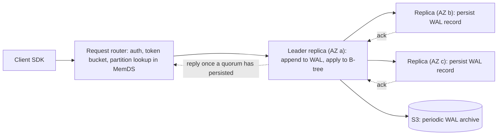

# DynamoDB

> DynamoDB is the store to reach for when every query is addressed by a key, the volume is large or spiky, and you want nobody on call for the database. You pay for that with a schema designed around the queries you know today; any query you didn't design for is expensive or impossible.

This is the deep dive behind the paragraph DynamoDB gets in the databases overview: how the service is built underneath, then the data model, indexes, transactions, replication, scaling, and cost, ending with the questions a Staff+ candidate gets asked about it. Every number is a documented limit or a listed price, and where the documentation doesn't publish a figure I say so.

## What it is

DynamoDB is Amazon Web Services' managed key-value and document database. It went generally available on 18 January 2012. It has two ancestors inside Amazon: Dynamo, the leaderless key-value store described in a 2007 paper, and SimpleDB, a managed service with a table model. The 2022 USENIX ATC paper on DynamoDB is blunt that the modern service shares little with Dynamo beyond the name and the goals. Dynamo was leaderless and single-tenant, and each Amazon team ran its own copy. DynamoDB is one multi-tenant service with a leader per partition and Paxos replication, and nobody runs their own.

That settles the usual questions about versions and licences. There is no version number, because AWS deploys the service continuously; the wire protocol has carried the date `2012-08-10` since launch. There is no licence, because there is no software to license. What you can run yourself is DynamoDB Local, a Java emulator for development, and since May 2026 ExtendDB, an Apache 2.0 adapter from AWS that speaks the DynamoDB wire protocol on top of PostgreSQL 14 or MongoDB 7. ExtendDB is a clean-room reimplementation for local development, CI, and self-hosting rather than the production engine. ScyllaDB's Alternator is a third-party API-compatible option.

The scale is public. During the 66-hour Prime Day event in 2021, Amazon's own systems peaked at 89.2 million requests per second against DynamoDB at single-digit-millisecond latency. AWS backs a single-region table with a 99.99% availability service-level agreement (SLA) and a global table with 99.999%.

## Architecture

The 2022 paper describes DynamoDB as tens of microservices. Four of them carry the request path: request routers, the metadata service, storage nodes, and an "autoadmin" control plane.

A client's HTTPS request lands on a **request router**. The router authenticates and authorises it, looks up which partition holds the key, applies admission control, and forwards the request to the right storage node. The lookup uses **MemDS**, an in-memory metadata store replicated across its own fleet and sized for the whole request rate of the service. Each router caches the partition map, with one twist: a cache hit still sends an asynchronous refresh to MemDS, so the fleet sees constant load whether caches are warm or cold. That is a lesson from an outage on 20 September 2015, when the partition map lived in DynamoDB itself, the routers' cache hit rate was about 99.75%, and cold routers coming up spiked metadata traffic until the region degraded. Keeping the backing store at full load all the time removes that cliff.

A table is split into **partitions**, each holding a contiguous slice of the hashed key space. Every partition is a **replication group** of three replicas in three availability zones, kept consistent with Multi-Paxos. One replica is the leader. It holds a lease and renews it while healthy. Only the leader accepts writes and serves strongly consistent reads. Any replica can serve eventually consistent reads, which is why those cost half as much.

Each **storage replica** keeps two things on disk: a write-ahead log and a B-tree holding the key-value data. A group can also hold **log replicas**, which store only recent log entries and no B-tree, acting as extra Paxos acceptors. They exist for fast healing. Copying a full replica (B-tree and logs) takes minutes, but adding a log replica takes seconds, because only the recent log entries move. So when a replica fails, the group is back to three durable copies of every acknowledged write almost at once, and the full replica is rebuilt in the background. A region runs millions of these Paxos groups, and a current storage node hosts thousands of partition replicas.

The write path, end to end:

The leader appends the write to its log, sends the record to its peers, and replies once a quorum (two of three) has persisted it. The write is on disk in two availability zones before the client hears back. Replicas periodically archive their logs to S3; the unarchived tail is typically a few hundred megabytes. Every log entry, message, and file carries a checksum. A background scrub keeps checking that the three replicas agree with each other and with a copy rebuilt from the archived logs. The replication protocol was specified in TLA+.

The read path is shorter. A strongly consistent `GetItem` goes to the leader and returns the latest committed value. An eventually consistent read, the default, can go to any replica and may lag the leader by a moment. Failover rides on the lease: when the leader dies a new one is elected, but it won't serve writes or consistent reads until the old lease expires, which the paper puts at a couple of seconds. To avoid needless elections under "gray" failures, a follower that stops hearing from the leader first asks the other replicas whether they can still reach it.

Admission control has been rewritten more than once, and the history explains the limits you'll hit. Originally each partition got a fixed slice of the table's provisioned throughput, and splitting a partition for size split its throughput too: a 3,200-WCU table over four partitions gave each 800 WCU, so a hot key was throttled while the table sat idle. AWS added bursting (a partition can spend up to 300 seconds of unused capacity) and then adaptive capacity, which boosted hot partitions; both were reactive. The current design is **global admission control** (GAC). Every request router keeps a token bucket per table, refilled from a central service every few seconds, so a table's capacity follows its traffic instead of being pinned to partitions. A partition still has a physical ceiling, so the autoadmin service splits partitions that stay hot, choosing the split point from the key distribution it has observed. The paper calls this split for consumption; the documentation now calls it split for heat.

## Data model and indexing

A table holds **items**, each a set of attributes. An item can be at most 400 KB, and that size includes attribute names, so short names matter on wide items. Every item has a **primary key**: either a single **partition key** or a partition key plus a **sort key**. Key attributes must be scalar strings, numbers, or binary. A partition key value can be up to 2,048 bytes and a sort key up to 1,024 bytes. Non-key attributes can be anything, including maps and lists nested 32 levels deep. DynamoDB hashes the partition key to choose the partition. Within a partition it stores items with the same partition key together, ordered by sort key; that group is an **item collection**, and it is the unit of efficient range reads.

There are two ways to read. `GetItem` takes a full key. `Query` takes an exact partition key and an optional condition on the sort key (`=`, `<`, `between`, `begins_with`). A `Query` returns at most 1 MB per call before any filter is applied, and you page through with the returned key. A filter expression runs after the read, so it saves bandwidth but not capacity: you pay for what was read. `Scan` reads the whole table or index and is billed on every item it evaluates. There is no join, no aggregate, and no query on a non-key attribute without an index.

There are three index types.

A **local secondary index** (LSI) keeps the table's partition key and gives you a different sort key. LSIs must be declared when the table is created, there can be five, and they share the table's capacity. Their advantage is that they support strongly consistent reads. Their cost is a hard limit. On a table with any LSI, an item collection (all items and index entries for one partition key value) cannot exceed 10 GB, because DynamoDB won't split an item collection across partitions when an LSI exists. In practice I'd avoid LSIs unless a strongly consistent secondary read is a real requirement.

A **global secondary index** (GSI) has its own partition key and sort key, can be added or removed at any time, and there are 20 by default. Each GSI has its own capacity and is maintained asynchronously, so it is always eventually consistent; the documentation says changes propagate "within a fraction of a second, under normal conditions". You choose a projection (`KEYS_ONLY`, a list of attributes, or `ALL`), and the projection decides storage and write cost. Two write rules matter. A GSI is **sparse**: an item without the index's key attributes simply isn't in the index, which is the cheapest way to index "open orders" or "unprocessed jobs". And a GSI can throttle the base table. If the index can't absorb the write rate, base-table writes fail with a throttling error that names the index. A GSI keyed on a low-cardinality attribute such as `status` builds its own hot partition however well the base table is spread. GSI keys can now be composed of up to four attributes each. A pattern called **GSI overloading** puts different entity types under one index by reusing a generic sort-key attribute, which is how single-table designs get past the 20-index quota.

A **vector index**, generally available since 5 August 2026, is the third kind. You store an embedding as a list of numbers on the item and declare an index with a dimension count (up to 4,096) and a distance function (cosine, dot product, or Euclidean). You query it with `SearchVectors`, which returns up to 100 nearest neighbours. There can be five per table. They are indexed asynchronously after each write, stored as 32-bit floats, and only available on on-demand tables, and a response is capped at 16 MB with no pagination. In US East the index is billed per gigabyte written ($0.52), per gigabyte processed at search time ($0.002), and per gigabyte-month stored ($0.25).

What can't be indexed: anything nested, because index keys must be top-level scalars. There is no uniqueness constraint beyond the primary key; a second unique attribute is enforced by writing a marker item in a transaction.

Modelling starts from the queries rather than the entities. AWS's guidance and Alex DeBrie's method agree: list every access pattern with its expected rate, then design keys so each pattern is a `GetItem` or a single `Query`. For one-to-many, DeBrie gives five options: embed the children as a nested attribute when they are small and read together; duplicate parent data onto children; put parent and children in one item collection under a composite key so one `Query` fetches both; do the same through a secondary index; or build a hierarchical sort key (`country#region#city`) that answers range queries at every level. For many-to-many, the standard pattern is the **adjacency list**. Each entity gets a partition key, each relationship is an item under one side's partition with the other entity's ID as the sort key, and a GSI that swaps partition and sort keys answers the reverse direction. AWS's current guidance is more measured about single-table design than it was: co-locate what is read together, keep entities with different operational needs (TTL, streams, backups, capacity) in separate tables, and treat single-table as a tactic rather than a rule.

## Transactions and consistency

A single-item write (`PutItem`, `UpdateItem`, `DeleteItem`) is atomic and can carry a **condition expression**. The condition is evaluated on the leader against the current item. So `attribute_not_exists(pk)` gives you insert-if-absent, and `version = :expected` gives you optimistic concurrency. A failed condition still costs a write unit. This is the primitive most DynamoDB applications live on, and it avoids the classic lost update without any transaction.

Multi-item transactions arrived in 2018. `TransactWriteItems` groups up to 100 put, update, delete, or condition-check actions across tables in one account and region, up to 4 MB in total, and applies them all or not at all. `TransactGetItems` reads up to 100 items as a consistent snapshot. Underneath, a transaction coordinator runs a two-phase protocol with timestamp ordering. It sends a prepare to the leader of each item's partition; each leader checks the conditions and reserves the item; if every leader accepts, the coordinator commits. There are no locks. A conflicting single-item write fails at once with `TransactionConflictException`, a conflicting transaction with `TransactionCanceledException`, and the caller retries. The 2023 USENIX paper on the protocol has the details. The cost is two underlying writes per item, one to prepare and one to commit, so transactional writes and reads are billed at double. A `ClientRequestToken` makes the call idempotent for 10 minutes.

The isolation story is precise and worth learning. Between two transactions, and between a transaction and a single-item `GetItem`, `PutItem`, `UpdateItem`, or `DeleteItem`, isolation is serializable. Between a transaction and `Query`, `Scan`, or `BatchGetItem`, it is read committed: those operations can see a transaction's effects on some items and not yet on others. `BatchWriteItem` is not atomic as a unit; each item in it is. So the anomaly to design against is a `Query` observing half a transaction. If a reader must never see a partial state, read with `TransactGetItems`, or read one summary item that the transaction updates last.

There is no interactive transaction. You can't read an item, think, and write inside one transaction; a `ConditionCheck` action is the only way to fold a read into the decision. Transactions don't span regions. On a global table they are atomic only in the region that ran them, and multi-Region strong consistency (below) doesn't support them at all.

## Replication and failover

Within a region, replication is synchronous and quorum-based, as above. An acknowledged write is on disk in at least two availability zones. Losing a node or a zone loses no acknowledged writes, and log replicas restore three-way durability within seconds. Leader failover takes a few seconds, during which that partition rejects writes and consistent reads while eventually consistent reads carry on. Replica lag only affects eventually consistent reads. The documentation promises that a repeated read "after a short time" returns the latest value, and in practice the window is well under a second. Read-your-writes is one flag: `ConsistentRead`.

Across regions the mechanism is **global tables**, and since 30 June 2025 there are two modes.

**Multi-Region eventual consistency (MREC)** is the original design. Every replica accepts reads and writes. Each write is applied locally and shipped asynchronously to every other region, typically within a second; there is a `ReplicationLatency` metric per region pair and no SLA on it. Concurrent writes to the same item in two regions are resolved by **last writer wins** on a system timestamp, silently, with nothing logged. If a region fails, writes it hadn't shipped yet are stuck until it returns, when replication resumes in both directions with no operator action. Your recovery point objective (RPO), the data you can lose, is therefore the replication lag, seconds in the normal case. A strongly consistent read in one region reflects only writes made in that region. A replicated write costs one replicated write unit per replica region, priced the same as an ordinary write since November 2024, with no cross-region transfer charge for the replication. Since February 2026 the replicas can live in different AWS accounts.

**Multi-Region strong consistency (MRSC)** changes the write path. The table lives in exactly three regions from one region set (US, EU, or AP): three full replicas, or two replicas plus a **witness**. The witness stores recent writes for quorum, serves no reads or writes, and costs nothing to replicate to. A write is replicated synchronously to at least one other region before it is acknowledged, and a strongly consistent read from any replica returns the latest write from any region. The RPO is zero. The price is latency: writes and consistent reads pay a cross-region round trip to the nearest participating region, while eventually consistent reads don't. Conflicting concurrent writes fail with `ReplicatedWriteConflictException` instead of being merged. MRSC tables can't use TTL, local secondary indexes, or transactions, must start empty, and are capped at 400 per account.

## Scaling

Reads and writes scale the same way, by adding partitions. The service does that for you; the physical ceiling per partition is what you design around. Each partition delivers at most 3,000 read units and 1,000 write units per second and holds about 10 GB. The documentation gives the throughput figures directly; 10 GB is its stated item-collection limit when an LSI exists, and the storage split threshold is the same size. A partition that stays hot is split for heat, which doubles its throughput; a table that grows is split for size. Neither is instant. A split can't help when the heat is on a single item, because the ceiling per key is the partition ceiling, or, with LSIs, inside one item collection.

Hot keys are the failure mode. The fix is **write sharding**: append a suffix to the partition key so one logical key becomes N physical ones. A random suffix in 1 to N spreads writes evenly but a read must query all N shards and merge. A calculated suffix (a hash of something the reader knows, such as the order ID) keeps point reads as one `GetItem`. Size N from the numbers: the write rate divided by 1,000, or the read rate divided by 3,000, whichever is larger. For a hot item that is read far more than written, a cache is cheaper than sharding. **DAX** (DynamoDB Accelerator) is a managed write-through cache cluster that serves eventually consistent `GetItem`, `Query`, and `Scan` from memory in microseconds, with a 5-minute default TTL. It passes strongly consistent and transactional reads straight through, and it only earns its keep above roughly a 90% hit rate.

Capacity comes in two modes. **On-demand** bills per request and scales by itself, with rules. A new table can serve 12,000 read and 4,000 write request units per second at once. After that it can serve double the previous peak instantly; exceed double within 30 minutes and you may be throttled while partitions split. Since November 2024 every table reports a **warm throughput** figure, the rate it can serve right now, and you can pre-warm it before a launch (the default value is free, pre-warming is charged). The default per-table quota is 40,000 read and 40,000 write units, raisable, and you can set a per-table maximum as a spending guard. **Provisioned** mode fixes a rate you pay for by the hour. Auto scaling moves it toward a target utilisation (70% recommended) after two minutes above target, decreases are limited to 4 a day plus one an hour, and unused capacity accrues as burst for up to 300 seconds. You can move a table from provisioned to on-demand four times in a rolling 24 hours (a limit raised in August 2025) and back at any time.

The practical ceilings are high enough that you design around partitions rather than the table. There is no documented maximum table size, the throughput quotas are raisable, and the largest public number is Amazon's own 89.2 million requests per second. What a single storage node can do isn't exposed.

## Consistency versus availability

Within a region DynamoDB is a consistent system. A write needs a quorum, so a replica cut off from the majority can't accept writes, and a leader whose lease has lapsed stops serving. Eventually consistent reads are the availability lever: half price, served by any replica, possibly a moment stale. Strongly consistent reads go to the leader at full price. These tunables are per request rather than per table.

Across regions the choice is explicit. MREC is available-first. Every region takes writes during a partition and conflicts are resolved by timestamp afterwards, so a write can be silently overwritten by a slightly later write elsewhere. MRSC is consistent-first. A region that can't reach a quorum partner rejects writes and consistent reads, and every write pays a cross-region round trip. The AWS guidance is to keep an item's writes in one region under MREC (give each user a home region) and reserve MRSC for state that can't tolerate a lost write, such as balances or inventory. Both modes carry the 99.999% SLA.

## Operations

There is nothing to patch, vacuum, compact, or rebalance. AWS deploys continuously with a "read-write" pattern (ship the code that reads a new format first, then the code that writes it) and rolls back automatically on error or latency. What's left for you is backups, streams, expiry, monitoring, and money.

**Backups.** Point-in-time recovery, once enabled, keeps continuous backups for a window you set between 1 and 35 days. You can restore to any second in that window, to a new table, in the same or another region, and the latest restorable time is about five minutes behind now. Auto scaling policies, IAM policies, alarms, tags, stream settings, and TTL settings aren't restored. A deleted table with PITR on leaves a system backup for 35 days. On-demand backups are snapshots that consume no capacity, are kept until you delete them, and copy across accounts and regions through AWS Backup. Export to S3 needs PITR, reads from the backup rather than the table, and can be full or incremental over a window of 15 minutes to 24 hours. In US East, PITR is $0.20 per GB-month, on-demand backup $0.10 per GB-month, restores $0.15 per GB, and exports $0.10 per GB.

**Streams.** DynamoDB Streams records every item change once, in order per item, keeps it for 24 hours, and allows at most two consumers per shard; Lambda polls it four times a second. Kinesis Data Streams for DynamoDB is the alternative when you want longer retention or many consumers, at the price of possible duplicates and reordering. Streams are how global tables replicate, how you build materialised views, and how you fan writes out to search or caches.

**Expiry.** TTL deletes items whose epoch-seconds attribute has passed, at no write cost, "typically within a few days". Until then expired items are still returned and you filter them. TTL deletes appear in streams as service deletes and are replicated to global-table replicas as billed replicated writes.

**Monitoring.** Watch consumed read and write units against provisioned or warm throughput, `ReadThrottleEvents` and `WriteThrottleEvents`, `SuccessfulRequestLatency`, and `ReplicationLatency` on global tables. A throttle that names a partition (`KeyRangeThroughputThrottleException`) means a hot key rather than a capacity shortage.

**Cost.** In US East after the November 2024 cut: on-demand is $0.625 per million write request units and $0.125 per million read request units. Provisioned is $0.00065 per WCU-hour and $0.00013 per RCU-hour. Reserved capacity (one or three years, bought in blocks of 100 units, Standard table class only) is discounted up to 54% and 77%. Storage is $0.25 per GB-month with the first 25 GB free. The Standard-IA table class cuts storage to $0.10 per GB-month and raises request prices by about a quarter; AWS's rule of thumb is to switch when storage is more than half the bill. Stream reads are $0.02 per 100,000 `GetRecords` calls. The 2024 cut halved on-demand prices and cut replicated writes by two thirds, from $1.875 to $0.625 per million, which made the old advice to prefer provisioned mode marginal. Per unit, on-demand costs about 3.5 times fully used provisioned capacity, so the two cost the same at roughly 30% utilisation; provisioned only wins for steady, well-predicted load, and reserved capacity wins by a lot.

The capacity arithmetic is simple enough for a whiteboard. One read unit is one strongly consistent read of up to 4 KB per second; an eventually consistent read is half a unit; a transactional read is two. One write unit is one write of up to 1 KB; a transactional write is two. Sizes round up per item (a 4.1 KB item costs two read units), `Query` rounds up on the total returned, and an update is billed on the larger of the old and new item. A worked example is in the interview section.

## Performance envelope

The documented and published numbers, as of September 2026:

- Latency: designed for low single-digit milliseconds server-side for a 1 KB item in-region; DAX serves cached reads in microseconds.
- Per partition: 3,000 read units and 1,000 write units per second; about 10 GB.
- Per item: 400 KB including attribute names; 32 levels of nesting; 100 bytes of storage overhead per item.
- Per request: 1 MB per `Query` or `Scan` page; 100 items and 16 MB per `BatchGetItem`; 25 items and 16 MB per `BatchWriteItem`; 100 items and 4 MB per transaction; 4 KB per expression.
- Per table: 20 GSIs by default, 5 LSIs, 100 projected attributes across indexes, 5 vector indexes; 40,000 read and 40,000 write units by default in either mode, raisable.
- Per region: 2,500 tables by default, raisable to 10,000; 400 MRSC global tables.
- Vector search: 4,096 dimensions, top 100, 16 MB response, 1 GB per second of search and 10 MB per second of writes per partition key value.
- Streams: 24 hours, two readers per shard.
- Backups: 50 concurrent restores up to 50 TB; 300 concurrent exports up to 100 TB.
- Connections: none. Every request is a signed HTTPS call to a regional endpoint, so there is no pool to size.

## When to use it, and when not to

Use it for state that is looked up by key at high or unpredictable volume, where you'd rather not run a database: sessions, carts, profiles, feature flags, rate-limit counters, idempotency keys, per-user timelines, order histories keyed by customer, and the state behind serverless functions. The latency holds at any size, cost tracks usage down to zero, and the stream makes it a natural source for downstream systems. It is also the easiest multi-region active-active store to operate, and since 2025 one of the few with a managed strongly consistent mode.

Don't use it when the questions aren't known in advance. Ad hoc reporting, filters on arbitrary attributes, joins, and aggregates all become scans, or a stream feeding a system that can do them (an export to S3 and Athena, or a replica in Postgres or ClickHouse). Don't use it for items over 400 KB; put the blob in S3 and the pointer in the item. Don't use it for a hot key above a thousand writes a second that can't be sharded, or for workloads that need interactive transactions. And if the workload fits in one Postgres instance and doesn't need multi-region writes, the overview's advice applies: use Postgres.

## Interview deep dive

**Q. Walk me through what happens when a client writes an item.**
The SDK signs an HTTPS request to the regional endpoint. A request router authenticates it, takes a token from the table's admission-control bucket, finds the partition for the hashed key in its MemDS cache, and forwards the write to that partition's leader. The leader evaluates any condition expression, appends the write to its log, applies it to its B-tree, and sends the log record to the two peers in the other availability zones. When one peer has persisted it, the leader replies and the router returns 200. Secondary indexes, streams, and global-table replication are fed asynchronously after that point.

**Q. How do you scale writes past what one partition can take?**
Spread them over partitions by giving the partition key enough distinct values that are written evenly. If a logical key must take more than 1,000 writes a second, shard it: append a suffix in 1 to N, with N at least the write rate divided by 1,000. Use a calculated suffix when a reader can compute it, so point reads stay a single `GetItem`; use a random suffix and a scatter-gather query otherwise. Check the indexes too, because a GSI keyed on a low-cardinality attribute has its own partitions and throttles base-table writes when it gets hot. In on-demand mode, pre-warm before a launch so the table doesn't need to split partitions under load.

**Q. A single item gets 5,000 reads a second and you're seeing throttles. What do you do?**
The per-partition ceiling is 3,000 read units a second and a single item can't be split, so table capacity is irrelevant. First check item size and consistency: a 4 KB item costs one unit per strongly consistent read, so 5,000 reads is 5,000 units, but eventually consistent reads halve that to 2,500, which fits. If freshness allows, put DAX in front and serve it from memory. If it must be fresh and consistent, store the item under N keys, have writers update all N in a transaction, and have readers pick one at random. Then ask why one item is that hot; usually it is configuration or a counter that belongs in a cache.

**Q. What is lost when a storage node fails, and what happens in a region outage?**
Nothing acknowledged is lost on a node failure. A write is only acknowledged after two of three replicas have persisted it, and the leader adds a log replica within seconds so the group is back to three durable copies. The partition rejects writes for a couple of seconds while a new leader waits for the old lease to expire. In a region outage a single-region table is simply unavailable, which is what the 99.99% SLA covers. On an eventually consistent global table the other regions keep serving, and the failed region's unreplicated writes (its last second or so) wait until it recovers and replication resumes. On a strongly consistent global table nothing waits, because every write was already in a second region; the cost was a cross-region round trip on every write in normal operation.

**Q. Give me a consistency anomaly in DynamoDB and how you'd avoid it.**
The common one is read-modify-write on an eventually consistent read: you read a stale copy, compute, and overwrite a newer write. Avoid it with a condition expression on a version attribute, which is checked on the leader, or with a strongly consistent read. The subtler one is a `Query` running while a `TransactWriteItems` commits. It can see some of the transaction's items updated and others not, because `Query` is read committed against transactions; avoid it by reading with `TransactGetItems`, or by having the transaction update one summary item last and reading only that. On eventually consistent global tables, last writer wins can silently discard a concurrent write in another region; avoid it by routing each item's writes to one region, or by using multi-Region strong consistency.

**Q. Size and price a sessions store: 20,000 requests a second, each reads a 2 KB session, one in ten writes it back, sessions live 24 hours.**
Key: `session_id` as the partition key, no sort key; the IDs are random, so writes spread evenly and there is no hot key. Reads: 20,000 a second, 2 KB rounds to one 4 KB unit, eventually consistent is fine for a session, so 10,000 read units a second. Writes: 2,000 a second at 2 KB is two units each, so 4,000 write units a second. Storage: perhaps 10 million live sessions at 2 KB, about 20 GB. Partitions: writes need at least 4,000 / 1,000 = 4 and reads about the same, so the table will hold a handful. Expiry: TTL on an `expires_at` attribute, free, with a filter on read for the lag. On-demand cost: 10,000 read units a second over a 2.63-million-second month is 26.3 billion units at $0.125 per million, about $3,300; 4,000 write units a second is 10.5 billion at $0.625 per million, about $6,600; storage about $5; so roughly $9,900 a month. Provisioned at a 70% target: about 14,300 RCU and 5,700 WCU, about $1,360 plus $2,700, so $4,100 a month, and roughly half that again with one-year reserved capacity. The on-demand table's initial warm throughput is 12,000 reads and 4,000 writes a second, so pre-warm before cutover.

**Q. Design the keys for an order system: customers, orders, order lines, and "all open orders".**
One table, composite key. Customer: `PK=CUST#<id>`, `SK=PROFILE`. Order: `PK=CUST#<id>`, `SK=ORDER#<iso-timestamp>#<orderId>`, so one `Query` with `begins_with(SK, 'ORDER#')` and `ScanIndexForward=false` returns a customer's orders newest first. Order lines: `PK=ORDER#<orderId>`, `SK=LINE#<n>`, so an order's lines are one `Query`. Order by ID alone: a GSI with `GSI1PK=ORDER#<orderId>`. Open orders: a sparse GSI keyed on an `open_shard` attribute that exists only while the order is open, holding `OPEN#<n>` for n in 1 to N to spread the hot "open" partition, queried scatter-gather and removed on fulfilment so the index stays small. Every pattern is a `GetItem` or one `Query`, and the only eventually consistent path is the GSI, which is fine for lists.

**Q. Why is a GSI eventually consistent and an LSI not, and what does each cost?**
An LSI lives in the same partition as its base items because it shares the partition key, so the leader updates it in the same write and can serve consistent reads from it. The price is the 10 GB item-collection cap, because an item collection with an LSI can't be split across partitions. A GSI has a different partition key, so its entries live in other partitions with other leaders. The base write is acknowledged first and the index is updated asynchronously, normally within a fraction of a second. A GSI costs its own storage and its own write units for every item that has the key attributes (one write for a new entry, two when a key attribute changes), and if it can't keep up it throttles the base table.

**Q. Compare on-demand and provisioned capacity. When is each wrong?**
On-demand bills per request, absorbs double the previous peak instantly, and starts at 12,000 reads and 4,000 writes a second. It is wrong when traffic more than doubles inside 30 minutes without pre-warming, and its unit price is about 3.5 times fully used provisioned capacity, which matters once utilisation is steady and high. Provisioned bills by the hour for a rate you set, with auto scaling that reacts after two minutes and can only decrease 27 times a day. It is wrong for spiky or unknown traffic, where you either overpay or throttle. Since the 2024 price cut the break-even is roughly 30% utilisation, and reserved capacity at up to 77% off is the real reason to run provisioned. Vector indexes require on-demand.

**Q. What does a transaction do underneath, and what doesn't it give you?**
A coordinator sends a prepare to the leader of every item's partition. Each leader checks the item's condition, reserves it with a timestamp, and answers; if all accept, the coordinator commits and the leaders apply the writes. There are no locks, so a conflicting single-item write or transaction fails immediately with a conflict exception rather than waiting, and you retry. It costs two writes per item, is capped at 100 items and 4 MB, and is serializable against other transactions and single-item operations but only read committed against `Query` and `Scan`. It doesn't give you an interactive read-then-write session, it doesn't span regions, and it isn't available on strongly consistent global tables.

**Q. Explain the October 2025 us-east-1 outage and what it says about depending on DynamoDB.**
Late on 19 October 2025 a race between two redundant DNS "enactor" processes, which publish DynamoDB's regional endpoint, left `dynamodb.us-east-1.amazonaws.com` with an empty record. The storage layer was fine, but nothing could resolve the endpoint for about three hours. EC2's instance workflow, Lambda, and network load balancer health checks all depend on DynamoDB, so the region took about fourteen and a half hours to fully recover. The lessons: a regional endpoint is a single dependency however replicated the storage is, and a global table plus a client that can fail over to another region's endpoint is the only way DynamoDB itself offers to ride it out.

**Q. When would you not use DynamoDB?**
When the access patterns aren't known and stable enough to design keys around. When the team needs ad hoc queries, joins, or aggregates in the operational store. When items exceed 400 KB, when the workload needs interactive multi-statement transactions, when a hot key can't be sharded, or when one Postgres instance would carry the load and the team knows Postgres. I'd also hesitate when portability matters, because the data model doesn't map cleanly onto anything else and ExtendDB is a development tool rather than a second production home.

## What changed recently

- **1 November 2024**: on-demand request prices halved and replicated write units cut by up to 67%, to the same price as ordinary writes. **13 November 2024**: warm throughput exposed on every table and index, with pre-warming.
- **30 June 2025**: global tables with multi-Region strong consistency went generally available, after a preview at re:Invent in December 2024. Three regions or two plus a witness, synchronous replication, zero RPO; no TTL, LSIs, or transactions.
- **14 August 2025**: the limit on switching a table from provisioned to on-demand rose to four times in a rolling 24 hours.
- **19 to 20 October 2025**: the us-east-1 event. A latent race in DynamoDB's DNS automation emptied the regional endpoint's record from 11:48 PM PDT on 19 October. DynamoDB recovered by 2:40 AM and the region by 2:20 PM on 20 October, and AWS disabled the automation worldwide pending fixes.
- **December 2025**: AWS announced Database Savings Plans at re:Invent, the first commitment discount that applies to DynamoDB on-demand usage.
- **February 2026**: global tables can replicate across AWS accounts, in eventual consistency mode only.
- **May 2026**: ExtendDB 0.1, AWS's open-source, Apache 2.0, DynamoDB-compatible adapter over PostgreSQL and MongoDB.
- **5 August 2026**: vector search went generally available in all commercial regions, with the `SearchVectors` API and vector indexes on on-demand tables.
- **September 2026**: AWS published a DynamoDB storage backend for the Strands Agents SDK, and the documentation now describes GSI keys of up to four attributes each.
