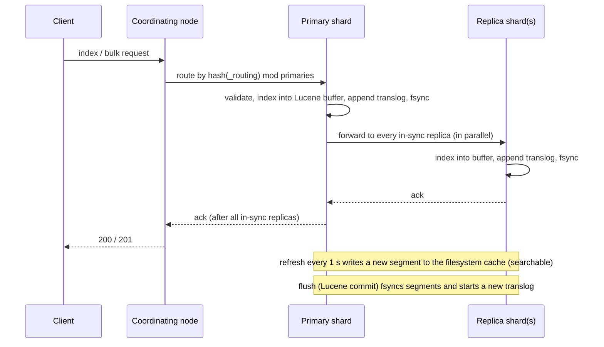

# Elasticsearch and OpenSearch

> Elasticsearch and its fork OpenSearch are the default engines for full-text search, log analytics, and hybrid vector search over a sharded Lucene index. They trade transactions, exact counts, and a simple operating model for relevance ranking and horizontal scale. The fork exists because of a licence change rather than a technical split, so you pick by ecosystem and vendor, and the mechanisms below apply to both.

This piece explains how the two engines work underneath. It covers what Lucene stores on disk, how a write becomes durable and then searchable, how a cluster elects a master and keeps shard copies in sync, what an aggregation can and can't promise, and where the operating costs hide. It's written for someone who has to design a search or log-analytics system on one of them and defend the design in a review. Where OpenSearch does something differently, the difference is called out. Where it isn't mentioned, the two behave the same.

## What it is

Elasticsearch is a distributed search engine built on Apache Lucene, the Java library that has implemented inverted indexes since 1999. Shay Banon released the first version in 2010 and founded the company now called Elastic around it. Elasticsearch wrapped Lucene in a JSON API and a cluster layer, and the tools around it (Kibana, Logstash, Beats) made it the standard for log analytics as well as search. That ecosystem is what people mean by "the ELK stack".

The licence has changed twice. Elasticsearch was Apache 2.0 through version 7.10. In January 2021 Elastic moved 7.11 and later to a choice of the Server Side Public License (SSPL) and the Elastic License 2.0, in a dispute with Amazon over its hosted Elasticsearch service. Amazon responded in April 2021 by forking 7.10.2 as **OpenSearch** under Apache 2.0, with Kibana forked as OpenSearch Dashboards. In August 2024 Elastic added a third option, the GNU Affero General Public License v3, and called Elasticsearch "open source again". In September 2024 Amazon moved OpenSearch into the OpenSearch Software Foundation under the Linux Foundation. Both engines are now open source in the licence sense, with different licences, different governance, and five years of divergent features.

As of September 2026 the current lines are Elasticsearch 9.5 (9.5.0 on 4 August 2026, 9.5.4 on 15 September 2026, with 8.19 still patched) and OpenSearch 3.8 (3.8.0 on 5 August 2026, with 2.19 still patched). Elasticsearch 9.0 shipped on 15 April 2025 on Lucene 10. OpenSearch 3.0 shipped on 6 May 2025 on Lucene 10.1 and Java 21. Both projects release a minor every two to three months.

Most teams run one of three ways. Self-managed on virtual machines or Kubernetes is still common for large log clusters, where managed pricing hurts. Elastic Cloud Hosted bills per hour by node size and subscription tier. Elastic Cloud Serverless bills by usage: "as low as" $0.14 per virtual compute unit hour for ingest, $0.09 for search, and $0.07 for machine learning, plus a per-gigabyte-month charge for stored data, where a VCU is a slice of a host with 1 GB of RAM. Amazon OpenSearch Service bills per instance hour plus block storage, with UltraWarm and cold tiers priced per gigabyte-month. Amazon OpenSearch Serverless bills per OpenSearch Compute Unit hour, about $0.24 in us-east-1, an OCU being roughly 6 GB of RAM with matching CPU. Classic collections carry a minimum of two OCUs with redundancy on, so an idle production collection costs a few hundred dollars a month; the NextGen collections that reached general availability in May 2026 scale to zero when idle. The AWS figures come from the pricing page as indexed by search, since the page couldn't be fetched for this piece, so check them before you budget.

## Architecture

A node is one JVM process. Every request runs on a named thread pool. The `search` pool has `int(3 × processors / 2) + 1` threads with a queue of 1,000 per thread. The `write` pool has one thread per processor and a queue of `max(10,000, processors × 750)`. When a queue fills, the node rejects the request with HTTP 429, and that rejection count is the first number to watch when a cluster is overloaded. A **cluster** is a set of nodes sharing one elected master. An **index** is a namespace mapped onto one or more **shards**, and each shard is a complete Lucene index holding a subset of the documents. Every document belongs to exactly one primary shard, and each primary has zero or more replica copies on other nodes.

### What Lucene stores

Underneath every shard is a set of Lucene **segments**, and a segment is immutable once written. That one fact explains most of Elasticsearch's behaviour. A segment holds several structures for the same documents. The **inverted index** maps each term to a postings list of the documents containing it, with term frequencies and positions. The term dictionary in front of it is a finite-state transducer, so looking up a term or a prefix is a cheap walk. **Doc values** store each field as a column, all values of `status` together, all values of `bytes` together. Sorting and aggregations read doc values, which live on disk rather than in heap. **Stored fields** hold the original document, which in Elasticsearch is the `_source` JSON. Numeric, date, and geo fields also go into a points structure (a block k-d tree) for range queries. Vector fields go into an HNSW graph or a quantised flat layout, covered later.

Because segments never change, an update is a delete plus a re-index. The old document is marked in a per-segment bitset of live documents and a new copy goes into a new segment. Deleted documents still take space and still get scored past until a **merge** rewrites the segments without them. Merging runs in the background under Lucene's tiered merge policy. It keeps about ten segments per size tier, floors segment size at 2 MB, and stops growing merged segments at 5 GB. Merges cost I/O and CPU. A shard that takes heavy updates spends much of its capacity rewriting itself, which is why Elasticsearch is a poor fit for workloads that update the same documents often.

### Memory

Memory splits between the JVM heap and everything else. Elasticsearch sizes the heap to about half of RAM, capped at 31 GB so that the JVM can keep using compressed object pointers, the 32-bit references that stop working above about 32 GB of heap. The other half of RAM is left to the operating system's filesystem cache on purpose. Lucene reads segments through memory-mapped files, so a search whose segments are in page cache is fast and one that reads from disk is not. Inside the heap sit four caches. The indexing buffer is 10% of heap, with 512 MB per active shard as the target. The node query cache is 10% of heap and holds filter results. The shard request cache is 1% of heap and holds aggregation results for `size: 0` requests. The fielddata cache loads a text field into heap if someone aggregates on it. Circuit breakers guard all of this: the parent breaker trips at 95% of heap, the fielddata breaker at 40%, and the request breaker at 60%.

### The write path

A write goes to any node, which acts as the **coordinating node**. It picks the primary with `shard = hash(_routing) mod number_of_primary_shards`, where `_routing` defaults to the document's `_id` and the hash is MurmurHash3. The primary validates the request, indexes the document into an in-memory Lucene buffer, and appends the operation to its **translog**, an append-only write-ahead log kept per shard. By default (`index.translog.durability: request`) the translog is fsynced before the primary responds, so an acknowledged write is on disk on the primary. The primary then forwards the operation to every replica in the in-sync set in parallel. Each replica indexes and fsyncs, and only when all have answered does the primary acknowledge. Each operation carries a **sequence number** assigned by the primary and the **primary term**, a counter the master bumps every time it promotes a new primary. Together they order every change to a shard and expose stale primaries.

The document is durable at that point but not yet searchable. Every second (`index.refresh_interval`, 1 s by default, 5 s on Elastic Cloud Serverless) a **refresh** turns the in-memory buffer into a new segment in the filesystem cache and opens it for search. No fsync happens. That is why Elasticsearch calls itself near-real-time: the gap between an acknowledged write and a visible one is about a second. Shards with no search in 30 seconds stop refreshing on a timer and refresh on the next search instead. Periodically, or when the translog reaches 10 GB, a **flush** performs a Lucene commit. It fsyncs the segments, writes a commit point, and starts a new translog generation, after which the old translog can go. If a node crashes, recovery replays the translog since the last commit. Set durability to `async` and the translog is fsynced every 5 seconds instead. That is faster, and a crash then loses up to 5 seconds of acknowledged writes on that copy.

### The read path

A search runs in two phases. In the **query phase** the coordinating node sends the query to one copy of every shard. It chooses copies with adaptive replica selection, which prefers the copy that has been answering fastest. Each shard runs the query locally and returns only the identifiers and sort values of its top `from + size` hits. The coordinating node merges those into a global top list. In the **fetch phase** it asks the shards holding the winners for their `_source`. Since 9.5, shards on the same data node are batched into one round trip per node, with part of the merge done there. Aggregations work the same way: every shard computes its own buckets and the coordinating node reduces them, which is where the accuracy caveats below come from. A get by identifier is different. It goes straight to the shard by routing and is real-time, reading the translog if the document hasn't been refreshed yet.

## Data model and indexing

A document is a JSON object. An index has a **mapping** that declares each field's type, and every indexed field costs something on every write. A `text` field is analysed and goes into the inverted index. A `keyword` field is indexed as one exact term and gets doc values, so it can be filtered, sorted, and aggregated. Numbers, dates, booleans, IP addresses, and geo points get doc values and points. There is no primary key beyond `_id`, and no secondary indexes to create, because every mapped field is already an index. What you choose is what not to index: `index: false` skips the inverted index, `doc_values: false` skips the column, and `enabled: false` on an object keeps it in `_source` only.

Analysis is where text becomes terms. An **analyser** is zero or more character filters, exactly one **tokeniser**, and zero or more token filters; the standard analyser splits on Unicode word boundaries and lowercases. A **normaliser** is the same idea for keyword fields without a tokeniser, so `"iPhone"` and `"iphone"` match as one exact term. The analyser runs at index time and again on the query string, so the two must agree, and changing one means reindexing.

**Dynamic mapping** is the convenience that becomes the trap. Send a document with an unknown field and Elasticsearch guesses a type. A JSON string becomes a `text` field with a `keyword` sub-field (ignoring values over 256 characters), a number becomes `long` or `float`, and a string that looks like a date becomes a `date`. The first value wins, so a field that arrives as `"123"` once is a string forever. Logs with user-controlled keys, such as a `labels` map, grow a new field for every distinct key. That is a **mapping explosion**. The mapping lives in the cluster state that every node holds in heap and the master publishes on every change, so a few hundred thousand fields slow the whole cluster. The default cap is 1,000 fields per index, with 20 levels of object depth, 100 nested field types, and 10,000 nested objects per document. The fixes are `dynamic: false` (unknown fields kept in `_source` but not indexed), `dynamic: strict` (rejected), or a `flattened` field that indexes a whole object as keywords under one mapping entry.

Two rules follow from the storage layout. Map identifiers as `keyword` even when they are numbers, because a term lookup beats the range structure for exact matches. And never aggregate on a `text` field. It has no doc values, so Elasticsearch would build them in heap as fielddata, which is off by default and should stay off; use the `keyword` sub-field.

`_source` is the original JSON, kept as a stored field. It takes a large share of disk, but disabling it breaks updates, reindex, and highlighting. The supported way to shrink it is **synthetic source**, which rebuilds the document from doc values and stored fields at read time and needs a paid subscription. The `logsdb` index mode combines synthetic source, sorting, and columnar compression for logs. In 9.5 a `columnar` mode arrived in technical preview that stores every field once as a column.

### Vector fields

A `dense_vector` field holds up to 4,096 float dimensions. Elasticsearch builds an **HNSW** graph over them (Hierarchical Navigable Small World, a layered proximity graph walked greedily from an entry point) with 16 neighbours per node and 100 candidates during construction by default. The graph and vectors must sit in the filesystem cache to be fast, so memory is the whole point of quantisation. `int8_hnsw` cuts vector memory by 4× and `int4_hnsw` by 8×. **BBQ** (Better Binary Quantization, Elastic's name for it) reduces each dimension to one bit for 32×, plus 14 bytes of correction data per vector, then rescores the top candidates with full-precision vectors, fetching three times `k` by default. Since 9.1 the default for vectors of 384 dimensions or more is `bbq_hnsw`. **DiskBBQ** (`bbq_disk`, shipped in 9.2 on 23 October 2025) drops the graph. It clusters the quantised vectors with hierarchical k-means and scans the nearest clusters from disk under a `visit_percentage` budget. Elastic says it holds up to around 95% recall and struggles at 99%. It needs an Enterprise subscription and became the default under that licence in 9.4. A `knn` query takes `k` and `num_candidates` (up to 10,000 per shard); each shard returns its top `k` and the coordinating node merges. Hybrid search combines a BM25 retriever and a `knn` retriever with **reciprocal rank fusion**, which scores each document `1 / (60 + rank)` in each list and sums, the 60 being `rank_constant`.

OpenSearch's `knn_vector` field allows up to 16,000 dimensions and comes from the k-NN plugin, which wraps two engines: Faiss (the default since 2.18) and Lucene's own HNSW. The nmslib engine was deprecated in 2.16 and blocked for new indices in 3.0. Faiss brings IVF (inverted file, a cluster-then-scan index) as well as HNSW, and binary quantisation at 1, 2, or 4 bits per dimension (32×, 16×, 8×) since 2.17. The Lucene engine gained 1-bit scalar quantisation in 3.6, and 3.7 added 1-bit quantisation with remote index build, which offloads graph construction to a separate service. OpenSearch hybrid search runs through a search pipeline, with either a normalisation processor (min-max scores, arithmetic mean) or a rank processor using the same reciprocal rank fusion.

### Limits worth knowing

A request body is capped at 100 MB, and the documentation warns against raising it. A shard holds at most 2,147,483,519 documents, Lucene's limit. An index can have up to 1,024 primary shards, a `terms` query up to 65,536 values, and a response up to 65,536 aggregation buckets. `from + size` cannot exceed 10,000 without raising `index.max_result_window`, for reasons covered under scaling.

## Transactions and consistency

There are no transactions. The unit of atomicity is one document on one shard: an index, update, or delete either happens or doesn't. A bulk request is a list of independent operations, each of which can succeed or fail on its own. Nothing spans two documents, two shards, or two indices, and there are no isolation levels to choose from. If two documents must change together, model them as one document, or accept that a reader can see one change without the other.

What Elasticsearch offers instead is **optimistic concurrency control** per document. Every response carries the document's `_seq_no` and `_primary_term`. Send them back as `if_seq_no` and `if_primary_term` on the next write, and the primary applies the write only if the document hasn't changed, returning HTTP 409 otherwise. The `update` API does a read-modify-write server-side and retries a conflict for you with `retry_on_conflict`. External versions (`version_type: external`) make only newer versions from a source system win, which is the usual way to keep a search index consistent with the database it mirrors.

Each shard search runs against a fixed set of segments, the ones open at the last refresh, so one shard's part of the answer is a consistent snapshot. Across shards there is no shared snapshot unless you open a **point in time**, which pins the segments on every shard for a `keep_alive` period and is the mechanism behind stable pagination. Read-your-writes holds for gets by identifier, which are real-time, and not for searches, which see the write after the next refresh. `refresh: wait_for` on a write blocks until that refresh has happened; `refresh: true` forces one, which is expensive and should stay out of hot paths.

"Eventually consistent" here means something specific. Acknowledged writes are already on every in-sync copy when the client gets its response, so replicas don't lag the way a Postgres streaming replica lags. What is eventual is visibility. Each copy refreshes on its own timer, so two searches routed to two copies of the same shard can disagree for up to a refresh interval. That is why a user paging through results can see a document twice or miss one, unless the client pins a copy with `preference` or opens a point in time. Counts are approximate in two documented ways as well: `hits.total` stops at 10,000 unless `track_total_hits: true`, and the terms and cardinality aggregations are estimates, explained below.

## Replication and failover

Replication is synchronous and primary-driven. The master keeps, per shard, an **in-sync set** of copies that hold every acknowledged write. A write is acknowledged only after every copy in that set has applied and fsynced it. If a replica stops responding, the primary asks the master to remove it from the in-sync set, waits for the master to confirm, and only then acknowledges; the master schedules a replacement copy. That protocol is why a replica never lags behind an acknowledged write, and why a slow replica slows every write to its shard. `wait_for_active_shards` (default 1, the primary alone) is a pre-check on how many copies must be up before the primary starts, not a quorum on the write.

What can be lost depends on how many copies you keep and how you fsync. With the default `request` durability and at least one replica, an acknowledged write survives the loss of any one node, because it is on disk on at least two. With zero replicas, losing the node that holds a primary loses every write on that shard since the last snapshot, and the documentation says so plainly. With `async` durability you also lose up to 5 seconds on any copy that crashes. There is one narrow window the documentation calls a dirty read. A primary cut off from the cluster keeps serving reads, and even accepting writes, for a few seconds until it notices it can't reach the master. A client can read a write that is later rolled back when a replica is promoted.

Failover of a data node works like this. The master pings every node once a second and calls a node faulty after three consecutive checks time out at 10 seconds each. So about 30 seconds of silence removes a node, while a clean disconnect is detected at once. For each primary the node held, the master promotes an in-sync replica and bumps the primary term; a write in flight waits up to a minute for that. The master then waits another minute (`index.unassigned.node_left.delayed_timeout`) before building new replica copies elsewhere, because the node often comes back. Rebuilding is throttled by `indices.recovery.max_bytes_per_sec`, 40 MiB per second per node by default. A lost node holding a few terabytes therefore takes hours to re-replicate unless you raise it.

Master election has been quorum-based since 7.0. Elasticsearch maintains a **voting configuration**, the set of master-eligible nodes whose votes count, and a decision needs more than half of them. Three master-eligible nodes tolerate the loss of one; two tolerate none. The configuration adjusts itself as nodes join and leave. That replaced the `minimum_master_nodes` setting, whose default of 1 let a misconfigured pre-7.0 cluster elect two masters and diverge, the **split brain** in every older Elasticsearch post-mortem. Elections start after a random wait of up to 100 ms and each attempt lasts 500 ms, so a new master usually exists within seconds of the old one being declared dead. The master publishes each cluster-state change with a 30-second timeout, and a node 90 seconds behind is removed. OpenSearch renamed the role to cluster manager but forked after 7.0, so it runs the same protocol.

For multiple regions there are two tools. **Cross-cluster search** federates a query across clusters and returns one result, at the cost of a wide-area round trip. **Cross-cluster replication** makes a follower index in one cluster pull the operation history of a leader index in another, shard by shard. The leader keeps soft-deleted operations for 12 hours by default so a follower can catch up; beyond that you recreate the follower. It is asynchronous, so a regional failover loses whatever the follower hadn't pulled, and the follower is read-only until promoted. In Elasticsearch it is a paid feature; OpenSearch ships an Apache 2.0 plugin with the same leader-follower shape.

OpenSearch has also changed the replication mechanism itself. **Segment replication** (opt-in per index) sends finished segment files from the primary to its replicas instead of having every replica re-index every document. The project reports around 40% more indexing throughput on the same hardware. The cost is replicas that trail the primary by a segment, so `refresh: wait_for` isn't supported on such indices and reads by identifier go to the primary. **Remote-backed storage** goes further. The primary uploads its translog and segments to S3-compatible storage, replicas hydrate from there, and with `request` durability the cluster can recover every acknowledged write from the remote store even with zero replicas. Amazon's OR1 instances and OpenSearch Serverless are built on this. Elastic Cloud Serverless has the same shape: object storage as the source of truth, indexing and search scaled separately, and a cache in front of recent data.

## Scaling

Reads scale with replicas. Each replica is a full copy that can serve searches, and adding one multiplies both read capacity and disk. The documentation's formula for how many you can afford is `max(max_failures, ceil(nodes / primaries) - 1)`. Caches help less than people expect. The node query cache only keeps filters seen repeatedly on segments of at least 10,000 documents, and the request cache is invalidated on every refresh, which on a live index is every second. The cache that matters is the filesystem cache. That is why half of RAM goes to the page cache, and why a node's practical ceiling is how much of its hot index fits there.

Writes scale by adding primary shards, and the count is fixed at index creation because the routing formula hashes into it. There are three ways to change it. `_split` goes to a multiple of the current count with the index read-only meanwhile; `_shrink` goes to a factor of it after all copies are moved onto one node; a full `_reindex` builds a new index behind an alias. Custom routing puts all of one tenant's documents on one shard, so their searches touch one shard instead of all. The cost is a hot shard when one tenant is huge, softened by `index.routing_partition_size`, which spreads a routing value across a small set of shards.

Shard sizing has more written about it than any other topic here, and the current guidance is short. Keep each shard between 10 GB and 50 GB and under 200 million documents. Keep under 1,000 non-frozen shards per node (3,000 frozen shards per dedicated frozen node). Give master nodes at least 1 GB of heap per 3,000 indices. Both too big and too small hurt. A 500 GB shard takes hours to recover and can't be balanced. A thousand 50 MB shards cost far more per search than one 50 GB shard, because every shard is a separate Lucene index with its own segments, file handles, and per-request overhead, and every shard adds to the cluster state. The older rule of 20 shards per gigabyte of heap was dropped in 8.3.

Time-series data, which is most of what Elasticsearch stores, gets this right by construction with **data streams**. A named stream writes to its newest backing index, and **rollover** creates a new backing index when the current one reaches a size (50 GB per primary is the recommended trigger), an age, or a document count. **Index lifecycle management** then moves each backing index through hot, warm, cold, frozen, and delete phases, each of which can shrink, force-merge, and relocate it. Data tiers map those phases onto node roles. Hot nodes on fast SSD take the writes. Warm nodes hold recent weeks on cheaper disk. The cold tier holds a fully mounted **searchable snapshot** with no replica, halving disk. The frozen tier holds partially mounted snapshots that fetch segments from object storage on demand through a local cache. Elastic says that extends capacity by up to 20× over warm, at the cost of slower queries. OpenSearch's equivalents are Index State Management, `warm` nodes with searchable snapshots, and on Amazon the UltraWarm and cold tiers.

On what one node can do: Elastic's nightly Rally benchmark on the `http_logs` track shows about 160,000 documents per second from a single client, and an Elastic sizing blog measured 220,000 events per second for web-server logs on tuned hardware. Neither is a promise for your documents. The point is that a well-fed data node ingests on the order of 100,000 small documents per second. Bulk requests, several client threads, a longer refresh interval, and zero replicas during initial loads are the documented ways to get there. Elasticsearch doesn't publish a maximum node count. The practical ceiling is the cluster state, which grows with indices, shards, and mapped fields, so large installations run several clusters joined by cross-cluster search rather than one cluster of a thousand nodes.

## Consistency versus availability

For cluster metadata, Elasticsearch chooses consistency. Index creation, mapping changes, and shard allocation all go through the elected master and need a majority of the voting configuration. The minority side of a partition can't change anything, and if it holds the old master, that master steps down. For data, a primary needs the master to shrink the in-sync set when a replica stops answering. A primary on the minority side therefore stalls writes until it times out, while the majority side promotes a replica and moves on. The gap between the partition and the primary noticing is the dirty-read window above. In normal operation the engine trades visibility (a refresh interval) and write latency (a synchronous round trip to every replica) for never acknowledging a write that only one copy holds.

The tunables sit on that line: `number_of_replicas` for how many copies must apply each write, `index.translog.durability` for whether the fsync is per request or every 5 seconds, `wait_for_active_shards` to refuse writes when too few copies are up, `refresh` for visibility, and `preference` to pin a client to particular copies. Across regions, cross-cluster replication is asynchronous by design, so a region failover loses the tail of unpulled operations. You choose between a uni-directional leader model and a bi-directional setup in which each region owns its own indices and follows the other's.

## Operations

**Backups** are snapshots to a repository (S3, GCS, Azure Blob, HDFS, or a shared filesystem). A snapshot copies segment files, and because segments are immutable it is incremental by construction: the second snapshot uploads only segments the first didn't have. Snapshot lifecycle management schedules them and prunes old ones. Copying data directories is unsupported. There is no point-in-time recovery; the granularity is the snapshot, so the recovery point is your snapshot interval, and a tighter one means cross-cluster replication or, on OpenSearch, remote-backed storage. Restores can't go to an older version.

**Upgrades** are rolling within and between adjacent majors (8.19 to 9.x is the supported path, and there is no downgrade). The recipe hasn't changed in years. Set `cluster.routing.allocation.enable` to `primaries` so the cluster doesn't rebuild replicas for a node that is only restarting. Flush, stop the node, upgrade it, start it, wait for it to rejoin, re-enable allocation, wait for green, and move to the next node.

**Housekeeping** is mostly automatic. Merges run continuously. A force-merge to one segment is worth doing on indices that no longer receive writes, because one segment has the smallest structures and no deleted documents. Rebalancing runs whenever shard counts change, throttled to two concurrent recoveries per node. Lifecycle policies are polled every 10 minutes.

The **signals** are few and specific. Cluster health is red when a primary is unassigned (searches and writes on that shard fail), yellow when only replicas are, and green when every copy is assigned. `_cluster/allocation/explain` says why a shard isn't. Pending tasks building up on the master mean it is overloaded or the cluster state is too big. JVM memory pressure, a rolling average of old-generation garbage collection, is the heap signal: Elastic Cloud marks 75% red and recommends action above 85%. Rejections in `_cat/thread_pool` are the overload signal, merge time in `_nodes/stats` the write-amplification signal. The disk watermarks are the storage signal. At 85% a node stops receiving new shards, at 90% the master moves shards off it, and at 95% every index with a shard on it gets a read-only block that lifts once usage drops below 90%.

The common failure modes follow from the mechanisms. Unassigned shards after a node loss are usually the delayed-allocation timer or a watermark. A red cluster with no node lost is usually a primary whose only copy was on a node that died. **Hot spotting** is one node doing most of the work: uneven hardware within a tier, a write-heavy index whose few shards landed together, or one expensive query. `_cat/nodes` and `_cat/thread_pool` show it, and `index.routing.allocation.total_shards_per_node` spreads it. A fielddata blow-up is someone aggregating on a `text` field, seen as the fielddata breaker tripping. A mapping explosion is dynamic mapping on user-controlled keys.

**Capacity maths** starts from retained bytes, times copies, divided by usable disk under the 85% watermark, and then checks the shard count against 40 GB per shard and 1,000 per node. Indexed size is close to raw size with the default codec and well under it with `logsdb`. A worked example is in the interview section. Every hot node wants 64 GB of RAM for a 31 GB heap, and then you benchmark, because the bytes per document and the query mix change everything.

## Performance envelope

Elastic doesn't publish latency figures; what it publishes are limits and defaults. Visibility lag is the refresh interval, 1 s. Deep pagination is bounded at 10,000 hits by `index.max_result_window`, because page 1,000 of 10 makes every shard sort and hold 10,000 hits before the merge; `search_after` with a point in time keeps the cost flat and is the documented replacement for the scroll API. A request body is 100 MB at most. The write queue is 10,000 requests per node before 429s, the search queue 1,000 per search thread. Recovery moves 40 MiB per second per node unless raised. Aggregations return at most 65,536 buckets. The `cardinality` aggregation uses HyperLogLog++ with a precision threshold of 3,000 by default and 40,000 at most, costing about 8 bytes per unit of threshold, and Elastic's own tests show error of a few per cent even far above the threshold. For vectors, DiskBBQ is documented as performing well to around 95% recall. OpenSearch 3.8 reports base64 vector ingestion at up to 4.16× the bulk throughput of JSON arrays, and 3.7 reports fetching vectors from doc values up to 5.5× faster than from `_source`. Indexing throughput per node is on the order of 100,000 small documents per second in Elastic's public benchmarks.

## When to use it, and when not to

Use it for search that has to rank. That means product search with facets, typo tolerance, synonyms, and boosting; site and document search over millions of pages; and any search that mixes BM25 with embeddings, where hybrid retrieval is built in and quantisation lets a few hundred million vectors fit on ordinary nodes. Use it for log, metric, trace, and security analytics, which is where most clusters are. That workload is append-only time-series data, rolled over daily, aggregated by terms and date histograms, aged through tiers and deleted, and the immutable-segment design fits it exactly. Use it for the dashboards on top of those aggregations, where approximate unique counts and a second of lag are fine.

Don't use it as the system of record. There are no transactions, a bulk request is not atomic, and a wrongly configured cluster can lose acknowledged writes. The pattern that works is a database as the source of truth, a change stream feeding the index, and external versioning to keep the two in order. Don't use it for workloads that update the same documents constantly, because every update rewrites the document into a new segment and the merges eat the node. Don't use it for joins: `nested` and `join` fields exist, both are expensive and limited, and the advice is to denormalise. Don't use it where counts must be exact at scale.

Postgres full-text search is enough more often than search teams admit. A `tsvector` column with a GIN (generalised inverted) index handles stemming, phrase queries, and ranking over a few million rows inside the same transaction as the data, with no second system to operate; its `ts_rank` is not BM25. It stops being enough when you need typo tolerance, facets over the result set, relevance tuning beyond weights on a few fields, or an index bigger than one machine's memory. The ParadeDB `pg_search` extension adds BM25 and closes part of that gap. I'd start on Postgres when search is a feature of the application and move when a measured problem shows up. Start on Elasticsearch or OpenSearch when search or log analytics is the product.

Between the two engines, the decision is ecosystem. Elasticsearch has ES|QL, Kibana, DiskBBQ, and its paid features (searchable snapshots, cross-cluster replication, synthetic source, machine learning) under a subscription. OpenSearch has everything under Apache 2.0, including security, alerting, anomaly detection, and the k-NN plugin, plus deep Amazon integration and a slower path to Lucene's newest work. The query language, mappings, and clients are close enough that most application code ports with small changes.

## Interview deep dive

**Q. You have 2 TB of product data that grows 10% a year and gets 500 searches a second. How many shards, and why?**

Start from the shard-size band, 10 to 50 GB, and remember that a search touches every shard. Two terabytes at 40 GB is about 50 primaries, which is 5 per node on a 10-node cluster with room to grow. Then check reads: 500 searches a second across 50 shards is 25,000 shard-level queries a second, so add replicas until each node's search pool keeps up, which a load test decides. If the catalogue partitions by tenant or region, custom routing lets a search hit one shard instead of 50, which is worth more than any shard count. Say that the count is fixed at creation, so you'd put an alias in front and plan to `_split` or reindex.

**Q. A dashboard shows the top 10 customers by order count, and finance says the numbers are wrong. Why, and how do you fix it?**

A `terms` aggregation runs on every shard independently. Each shard returns its own top `shard_size` buckets (`size × 1.5 + 10` by default) and the coordinating node sums what arrived. A customer who is 11th on three shards is dropped by all three and never counted, and one who is 12th on a single shard has a partial count. Ask for `show_term_doc_count_error` to see the bound, raise `shard_size` so each shard sends more candidates, or route by customer so each customer's orders live on one shard, which makes the count exact. A unique-customer count is a `cardinality` aggregation, HyperLogLog++ with a precision threshold, and the fix there is a higher threshold up to 40,000 or accepting the documented error.

**Q. Design a log-analytics pipeline for 2 TB a day with 30 days of retention and 90 days of searchable archive.**

Agents ship to a buffer (Kafka), an ingest tier parses and enriches, and bulk requests of a few megabytes land in a data stream with an explicit mapping, `dynamic: false` on the free-form parts, and `logsdb` mode. Roll over at 50 GB per primary with, say, 8 primaries and 1 replica per backing index. A lifecycle policy keeps 3 days hot on SSD nodes, moves each index to warm with a force-merge, to cold as a searchable snapshot at 30 days (no replica, halving disk), to frozen at 60 days as a partially mounted snapshot, and deletes it at 90. Size the hot tier from bytes per day and the write pool, the warm tier from disk, and the frozen tier from almost nothing. Snapshots double as the backup, and the signals are 429s from the write pool, merge time, and the watermarks.

**Q. How do you scale writes when one index is taking all the traffic?**

Each write goes to one primary and its replicas, so more primaries spread the load across more nodes. The count is fixed, so the practical move is rollover into a new backing index with more primaries. Then make each write cheaper: bulk requests, a longer refresh interval, `async` translog durability if losing 5 seconds is acceptable, fewer replicas during backfill, and auto-generated identifiers so the primary skips the existence check. Check hot spotting with `_cat/thread_pool` and `_cat/shards`; if the index's shards landed on two nodes, `total_shards_per_node` spreads them.

**Q. One tenant is 40% of your data and custom routing sends them all to one shard. What now?**

That is the hot shard custom routing creates, and it has three answers. `index.routing_partition_size` spreads each routing value across a small set of shards, so the big tenant's searches touch, say, 4 of 32 shards instead of 1. Give the big tenant their own index behind the same alias, sized on its own. Or drop routing and accept fan-out for everyone, which is right when no tenant dominates. More shards on the same index is the wrong answer, because it doesn't move the tenant off their one shard.

**Q. A data node dies. What happens, and what did you lose?**

Within about 30 seconds the master removes it, promotes an in-sync replica for every primary it held, and bumps the primary term; writes in flight wait up to a minute for that. A minute later the master starts building new replicas elsewhere at 40 MiB per second per node. With one replica and `request` durability nothing acknowledged is lost, because every acknowledged write was fsynced on the surviving copy. With `async` durability the dead copy may be missing 5 seconds, but the survivor has them. With zero replicas you lost everything on those shards since the last snapshot, and the cluster is red for them.

**Q. Two users updating the same document overwrite each other. How do you stop it?**

Read the document, keep its `_seq_no` and `_primary_term`, and send them back as `if_seq_no` and `if_primary_term` on the write. The primary rejects the write with 409 if anything changed in between, and the client re-reads and retries. For increments and partial changes, the `update` API does that loop server-side with `retry_on_conflict`. If the index mirrors a database, use `version_type: external` with the database's version so a stale change-stream event can't overwrite a newer one.

**Q. A user paging through results sees the same document on page 2 and page 3. Why?**

Two reasons, both about consistency across copies and time. Each request can land on a different copy of a shard, and copies refresh on their own timers, so ordering shifts between requests; and a write between pages inserts a document above the cursor. Fix it with a point in time, which pins the segments on every shard for the session, and `search_after` with the last hit's sort values instead of `from`, which also removes the 10,000-hit ceiling. Deep `from/size` is expensive because every shard must sort and return `from + size` hits for the merge.

**Q. Size a cluster for 500 GB of logs a day, 14 days hot, one replica.**

Fourteen days times 500 GB times two copies is 14 TB. At 40 GB per shard that is 350 primaries and 350 replicas. A node with 64 GB of RAM (31 GB heap) and 8 TB of disk offers about 6.8 TB under the 85% watermark, so three nodes on disk. But 500 GB a day is about 6 MB per second sustained with bursts well above, so size the write pool from a benchmark and expect three to five hot nodes plus three small dedicated masters. Then say you'd add warm nodes rather than more hot ones for anything older than a few days.

**Q. Should the product identifier be a `long` or a `keyword`?**

`keyword`, unless you'll run range queries on it. A `keyword` is a term in the inverted index, and an exact-match lookup on the term dictionary beats a lookup in the numeric points structure, which is built for ranges. The documentation says exactly that. The same goes for status codes and postcodes: map as `keyword` and add a numeric multi-field only if you need `range`.

**Q. Why would you not use Elasticsearch?**

When the data needs transactions or is the only copy, since there is no multi-document atomicity and a bulk request can half-succeed. When documents update constantly, because each update is a delete and re-index with a merge behind it. When counts must be exact, because the terms and cardinality aggregations are estimates by design. When the search is a feature of a Postgres application and a `tsvector` with a GIN index covers it. And when nobody will own shard sizing, heap, watermarks, and mapping discipline, because somebody has to.

## What changed recently

- **15 April 2025**: Elasticsearch 9.0 on Lucene 10, with BBQ generally available and ES|QL joins.
- **6 May 2025**: OpenSearch 3.0 on Lucene 10.1 and Java 21, with gRPC transport (experimental), pull-based ingestion from Kafka and Kinesis, star-tree indexes, and the nmslib vector engine blocked for new indices.
- **29 July 2025**: Elasticsearch 9.1 made `bbq_hnsw` the default index type for vectors of 384 dimensions or more.
- **23 October 2025**: Elasticsearch 9.2 shipped DiskBBQ (`bbq_disk`), the disk-first quantised vector index.
- **3 February and 5 May 2026**: Elasticsearch 9.3 and 9.4. In 9.4 DiskBBQ became the default vector index under an Enterprise licence, GPU-accelerated vector indexing with NVIDIA cuVS went generally available, and native Prometheus and PromQL support arrived.
- **7 April and 9 June 2026**: OpenSearch 3.6 added 1-bit scalar quantisation to the Lucene engine. 3.7 added 1-bit quantisation with remote index build, vector retrieval from doc values (up to 5.5× faster than `_source`), and native Prometheus querying in Dashboards.
- **28 May 2026**: Amazon OpenSearch Serverless NextGen collections reached general availability, removing the minimum-OCU floor by scaling to zero.
- **4 August 2026**: Elasticsearch 9.5 batched the query phase per data node by default. It also added a `columnar` index mode in technical preview, `date_range` fields, data-stream lifecycle to the frozen tier, and ES|QL federation over S3 (experimental).
- **5 August 2026**: OpenSearch 3.8 on Lucene 10.5, with base64 vector ingestion (up to 4.16× bulk throughput), redesigned radial search (recall 0.85 to 0.97), and Model Context Protocol support across its agent types.
- **15 September 2026**: Elasticsearch 9.5.4, the current patch; 8.19.22 followed on 23 September 2026 for the previous major.
