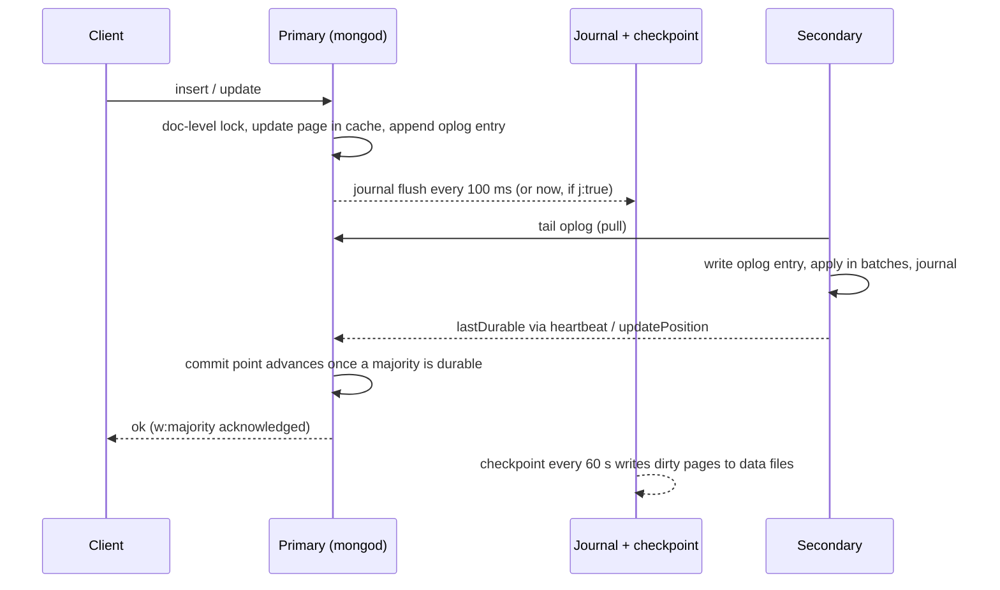

# MongoDB

> MongoDB is the document store to pick when one read should return one whole entity and you want replication, failover and sharding built in. The price is that you design the schema and the shard key around your queries up front, and that its strongest guarantees (majority writes, majority reads, causal sessions) only hold when you ask for them.

This is one of the deep dives behind the [databases overview](/databases/), written the way a system-design interviewer would ask it. It covers what a document is on disk, how WiredTiger caches it, what a write passes through before it's durable, and how a replica set elects a primary and what an election can lose. Then it goes into how a sharded cluster splits and moves data, what indexes and transactions cost, how to back it up and size it, and what changed in 2025 and 2026. It closes with eleven interview questions and the answers a strong candidate would give.

## What it is

MongoDB stores JSON-like documents in collections instead of rows in tables. A document can hold nested objects and arrays, so one document can carry a whole order with its line items, and one read returns the lot. There's no fixed schema unless you add validation rules, and no joins unless you ask for them in an aggregation pipeline.

MongoDB began at 10gen, founded in 2007 by Dwight Merriman, Eliot Horowitz and Kevin Ryan, as one component of a planned platform-as-a-service. The team spun it out as a product with a first public release in February 2009. The name is short for "humongous". 10gen renamed itself MongoDB, Inc. in 2013 and listed on Nasdaq in 2017.

The licence changed once, and it mattered. Until 16 October 2018 the server was under the GNU AGPLv3. From that date, and from release 4.0.4, it's under the Server Side Public License, the SSPL, which MongoDB wrote. The SSPL keeps the AGPL's freedoms to use, modify and redistribute, and adds one condition: anyone offering MongoDB as a service must release the source of everything they use to run that service. The Open Source Initiative never approved it, and Debian, Fedora and Red Hat Enterprise Linux dropped the packages. So the cloud providers built MongoDB-compatible front ends rather than host the real server: Amazon DocumentDB, Azure Cosmos DB's API for MongoDB, and since 2025 Google's Firestore with MongoDB compatibility. Compatibility itself is now in court. On 23 May 2025 MongoDB sued FerretDB, which puts a MongoDB-compatible wire protocol in front of [Postgres](/relational/), in the District of Delaware (case 1:25-cv-00641) over four patents and trademark use. As of July 2026 the case was still at the motions stage.

Versions come in two kinds. A major release ships once a year and gets long-term support; 8.0 arrived on 2 October 2024. Rapid releases ship in between and fold into the next major: 8.1 in May 2025, 8.2 in September 2025, and 8.3 in May 2026, with patch 8.3.11 on 11 September 2026. From 8.2 the rapid releases are also available for self-managed Community and Enterprise deployments, which they weren't before. As of September 2026 the supported lines are 8.0, 8.2 and 8.3. Version 9.0 has not shipped, though the database tools already list support for it.

You run it three ways. Community Edition is the free self-managed server. Enterprise Advanced adds in-memory storage, auditing, LDAP and Kerberos and comes with a support contract. Atlas is the managed service on AWS, Azure and Google Cloud, and it's where MongoDB, Inc. puts new features first. Most teams in 2026 are on Atlas, and this piece says where Atlas differs from the self-managed server.

## Architecture

A single server process is `mongod`. It listens on one port and serves one thread per client connection by default, with a 1 MB stack each. Its storage engine has been WiredTiger since 3.2 for every deployment that matters. The connection limit, `maxIncomingConnections`, is 65,536 by default, but on Linux the effective default is 80 per cent of half the file-descriptor limit, so about 25,600 with the usual 64,000 setting. Nobody puts a pooler in front of MongoDB the way they do with Postgres. The drivers keep their own pools, and each idle connection still costs about a megabyte of server memory.

WiredTiger stores each collection and each index as a **B-tree** in its own file under the data directory. Documents are stored as **BSON**, a binary encoding of JSON that adds the types JSON lacks (dates, 64-bit integers, decimals, binary blobs, ObjectIds). Strings, nested documents, arrays and binary values carry a length prefix, so the server can skip over one it doesn't need without parsing it. A single document can't exceed 16 MB, and nesting stops at 100 levels. The 16 MB limit isn't a storage detail you can tune. It's the wire-protocol and BSON limit, and every schema decision in this piece comes back to it.

On-disk pages are compressed. Collections default to snappy block compression, with zlib and zstd available, and time-series collections default to zstd. Indexes use prefix compression, which stores each key as a difference from the previous one. The engine's in-memory **cache** holds uncompressed pages. Its default size is the larger of 50 per cent of RAM minus 1 GB, or 256 MB, so 7.5 GB on a 16 GB machine. The rest of memory is left to the operating system's file-system cache, which holds compressed pages, so a page that falls out of the WiredTiger cache is often still in RAM. Recent committed versions of updated records live in a durable **history store**, the `WiredTigerHS.wt` file, which is what makes point-in-time reads and rollbacks possible.

Concurrency is at the document level. Two clients can update different documents in one collection at once. Readers never block writers, because WiredTiger uses multi-version concurrency control and each operation sees a snapshot of the data as of when it started. Two writers on the same document don't block either. The second one gets a write conflict, which the server retries for a single-document operation. Inside a multi-document transaction the conflict aborts the transaction and the driver retries.

The write path has four steps and two timers. A write reaches the primary. The server opens a WiredTiger transaction, takes the document-level lock, modifies the page in cache, and in the same storage transaction appends an entry to the **oplog**, the capped collection `local.oplog.rs` that records every change. At this point the change is in memory only. The **journal**, WiredTiger's write-ahead log, buffers records in memory (up to 128 kB) and flushes them to disk every 100 ms. That interval is `commitIntervalMs`, and journal files roll over at about 100 MB. Every 60 seconds WiredTiger writes a **checkpoint**: a consistent snapshot of every changed B-tree page, written to the data files. After a crash the engine loads the last checkpoint and replays the journal from there. Between the two timers, a write acknowledged with `w:1` can be up to 100 ms old and still be lost if the process dies. `j:true` forces the journal flush before the acknowledgement. `w:"majority"`, the default since 5.0, waits until a majority of the voting, data-bearing members have the entry in their journals, because `writeConcernMajorityJournalDefault` is true.

The read path is the same tree walked backwards. The planner picks an index or a collection scan, walks the B-tree in cache, fetches pages from disk on a miss, and reads the version of each document its snapshot allows. Since 8.0 an **express path** skips the planner for `_id` equality lookups and similar single-key reads. Since 8.3 a cost-based ranker is the default plan chooser for eligible queries, with the older trial-run "multi-planning" as a fallback. Aggregation pipelines run stage by stage with a 100 MB memory limit per stage, and `allowDiskUse` lets `$sort`, `$group` and `$lookup` spill to disk past that.

## Data model and indexing

Every collection has a unique index on `_id`, which the driver fills with a 12-byte ObjectId if you don't supply one. Since 5.3 a collection can be **clustered**: the documents are stored inside the `_id` index in key order, the way MySQL's [InnoDB](/relational/) stores rows. That saves one lookup per read and makes range scans on `_id` sequential. You choose it at creation time, and the key must be `_id`.

Secondary indexes are B-trees too, and a collection can have 64 of them. The types are:

- **Single-field and compound** indexes, the workhorses. A compound index can have 32 fields, and the order matters. The house rule is **ESR**: fields you match with equality first, then fields you sort by, then fields you match with a range. Equality fields narrow the walk to one region of the tree. Sort fields keep results in index order, so no in-memory sort is needed. The range field goes last because nothing after a range can be used for seeking. `{status: 1, created: -1, amount: 1}` serves "status equals X, sorted by created, amount over Y" with one tree walk.
- **Multikey** indexes, which is what an index becomes when the field holds an array: one entry per element. A compound index can include only one array field, and a large array means a large index.
- **Text** indexes for word search, **2d** and **2dsphere** for geometry, and **hashed** indexes, which index a hash of the value and exist for hashed sharding.
- **Wildcard** indexes, which index every field under a path for schemas whose field names vary. They can't be unique, TTL, text, geospatial or hashed.
- Options rather than types: **unique**; **partial**, which indexes only documents matching a filter (a partial index on unpaid orders stays small); **sparse**; and **TTL**, which deletes documents once a date field is older than a set number of seconds, from a background thread that runs about once a minute.

Every index costs a B-tree update on every insert, every delete, and every update that touches an indexed field, plus cache space, because an index has to be in memory to be fast. A collection with twelve indexes does twelve extra tree writes per insert. A query is **covered** when the index holds every field it needs and the projection excludes `_id` (or `_id` is in the index); explain then shows `totalDocsExamined: 0`. Index intersection, using two indexes for one query, exists but the planner rarely picks it, so build compound indexes for the queries you have. The 1,024-byte limit on an index key went away in 4.2.

Building an index is no longer a lock-out. Since 4.2 a build takes an exclusive lock on the collection only at the start and the end, and yields to reads and writes in between. Since 4.4 the build runs on every data-bearing member at once. The primary waits for a commit quorum (all voting members by default) before it marks the index ready, so the build lands on the secondaries at the same time. The server allows three concurrent user index builds. A build on a large collection still competes for cache and disk and can push replication lag, so schedule it.

Joins exist as a pipeline stage. `$lookup` does a left outer join against another collection, and since 5.1 that collection can be sharded. It runs as a nested loop, one lookup per input document, so it wants an index on the joined field. Most MongoDB schemas avoid it by embedding.

Schema design comes down to one question: which data is read together? **Embed** when the child is always read with the parent, the number of children is bounded, and they change together. One document then means one read and one atomic write. **Reference** (store an id and do a second query or a `$lookup`) when the child is queried on its own, shared by several parents, or unbounded. An array that grows forever is the classic mistake: it walks the document toward 16 MB and makes every update rewrite a bigger document. Two patterns handle the common cases. The **bucket pattern** groups many small records (a sensor's readings for one hour) into one document with an array and a count. The **outlier pattern** stores the normal case embedded and moves the 0.1 per cent of documents that would overflow (a celebrity's followers) into extra documents flagged as overflow. Document validation arrived in 3.2, and since 3.6 a collection can carry a `$jsonSchema` rule that rejects or warns on documents that break it.

**Time-series collections**, added in 5.0, are the bucket pattern built into the engine. You name a `timeField` and a `metaField` (the sensor id, say). The server groups measurements that share a metaField value into buckets stored in a columnar layout and compressed with zstd. A bucket closes at about 1,000 measurements or about 125 KB, or when it has spanned longer than its granularity allows: an hour for `seconds`, a day for `minutes`, 30 days for `hours`. You can only update the metaField. Since 8.0 sharding on the timeField is deprecated in favour of the metaField. MongoDB 8.0's block processing runs `$group` and similar stages over whole buckets and claims more than 200 per cent faster throughput on those queries.

**Change streams** are the change-data-capture interface. A client opens a stream on a collection, database or cluster and receives an event for each insert, update, replace or delete, with a resume token it can hand back after a disconnect. Events are emitted only once they're majority-committed, so a consumer never sees a write that later rolls back. A stream can only resume from a point still inside the oplog.

**Search and vector search** are not in `mongod`. They run in a separate Java process called `mongot`, built on Apache Lucene, the same library under [Elasticsearch](/elasticsearch/). It tails change streams for each collection you index, builds Lucene indexes asynchronously, and answers `$search`, `$searchMeta` and `$vectorSearch` stages by returning document ids that `mongod` then fetches. A search index is therefore eventually consistent with its collection. On Atlas, `mongot` runs on the database nodes or on dedicated search nodes you pay for separately. Vector search uses HNSW graphs (hierarchical navigable small world, the standard approximate nearest-neighbour index), accepts embeddings of up to 8,192 dimensions, and offers scalar (4x) and binary (32x) quantisation to keep the index in memory. Until 2025 this was Atlas-only. On 17 September 2025, alongside 8.2, MongoDB released `mongot` as a public preview for Community Edition and Enterprise Server, with the same stages and no functional cuts, but flagged for development and testing rather than production. Hybrid search combines the two through `$rankFusion` and `$scoreFusion`; `$scoreFusion` became generally available in 8.3.

**Queryable Encryption** lets the client encrypt a field so the server never sees the plaintext, and still run equality queries (generally available in 7.0) and range queries (8.0) against it. It's built on structured encryption: the driver sends a search token, and the server matches ciphertext against it without learning the value. A field is configured for equality or range, not both. Prefix, suffix and substring queries arrived in 8.2 as a public preview.

## Transactions and consistency

A write to one document is atomic, always, including an update that touches several fields and array elements at once. That covers more than it would in a relational database, because an embedded schema puts a whole aggregate in one document. Multi-document transactions came later: 4.0 in June 2018 for replica sets, and 4.2 in 2019 for sharded clusters, where they can span collections, databases and shards.

Transactions run at **snapshot isolation**. Every read in the transaction sees the data as of one point in time. A write to a document that another transaction has changed since that point fails with a write conflict, which aborts the transaction. The driver's `withTransaction` helper retries on `TransientTransactionError` and retries the commit on `UnknownTransactionCommitResult`. What the snapshot is a snapshot of depends on the read concern. With read concern `snapshot` and write concern `majority`, the transaction reads majority-committed data and its own writes become majority-committed on commit. With the default `local` read concern it can read data that later rolls back. The same holds outside transactions: the default read concern is `local`, so a plain read on a primary can return a write that a failover then discards.

The limits matter in practice. A transaction is killed after 60 seconds by default (`transactionLifetimeLimitSeconds`) and waits 5 ms for a lock before aborting (`maxTransactionLockRequestTimeoutMillis`). MongoDB's own guidance is to touch at most 1,000 documents in one transaction and batch anything larger. The reason is that the transaction's uncommitted changes and their old versions sit in the WiredTiger cache until commit, and a transaction that outgrows the cache aborts with `TransactionTooLargeForCache`. Each write in a transaction is its own oplog entry, so the old 16 MB total limit is gone, but no single entry can exceed 16 MB. Transactions can't create or drop collections or indexes except in narrow cases. They can't write to capped collections or the `config`, `admin` and `local` databases, can't run on a secondary, and on a sharded cluster need `w:"majority"` to mean anything. A pending index build blocks new transactions on that collection until it finishes.

**Retryable writes** are the other half of the story. Since 3.6 every single-document write carries a logical session id and a transaction number. If the driver loses the connection mid-write (a failover is the usual reason), it retries once against the new primary. The server recognises the pair and returns the original result instead of applying the write twice. Drivers have turned this on by default since 4.2. It's what makes "retry on failover" safe for an `$inc`.

## Replication and failover

A **replica set** is one primary and up to 49 secondaries, of which at most seven can vote. All writes go to the primary. Secondaries **pull** the oplog from the primary, or from another secondary (chained replication), with a tailing cursor. They write the entries to their own oplog and apply them in batches across 16 writer threads by default, keeping operations on the same document on the same thread so order holds. Oplog entries are **idempotent**: an `$inc` is rewritten as a `$set` of the resulting value before it enters the oplog, so applying an entry twice gives the same result and a secondary can re-apply after a crash without harm. Replication is asynchronous by design. The primary doesn't wait for anyone unless the write concern tells it to.

The oplog is a capped collection, so it's a ring buffer. Its default size is 5 per cent of free disk, floored at 990 MB and capped at 50 GB, and since 4.4 you can also set a minimum retention in hours. The **oplog window**, how far back the oldest entry reaches, is the number to watch. A secondary that's been down longer than the window can't catch up and has to do a full initial sync.

Elections use protocol version 1, which is derived from **Raft**. Every member sends a heartbeat to every other member every 2 seconds. If a secondary hears nothing from the primary for `electionTimeoutMillis` (10 seconds by default), it starts an election in a new term. The candidate with the most recent oplog and a majority of votes wins, and two primaries can't be elected in the same term. Members have priorities, and a higher-priority member schedules a "priority takeover" to reclaim the role once it has caught up. A new primary spends up to `catchUpTimeoutMillis` pulling any writes the old primary had that it doesn't, which trades faster failover against keeping `w:1` writes. The documentation's figure for a typical failover with default settings is a median under 12 seconds. A primary that can't reach a majority of voters steps down on its own, so during a partition the minority side has no primary and takes no writes.

**Arbiters** are members that vote but hold no data. The cheap three-member shape they enable, primary-secondary-arbiter or **PSA**, survives one node loss, and because the arbiter can't acknowledge writes the default write concern for that shape falls back to `w:1`. It also has a trap worth understanding in full. Take the secondary away. A majority is two of three voters, and the only two members that hold data are the primary and the missing secondary, so no new write can become majority-committed and the **majority commit point** stops moving. Writes keep succeeding at `w:1`, so the application notices nothing. Underneath, the commit point is WiredTiger's stable timestamp. The engine checkpoints only at that timestamp, and it has to keep every version written after it so that it can serve `majority` reads and roll back to that point if it ever has to. Those versions pile up in the history store and the cache fills with content that can't be made stable. Eviction falls behind, and within hours the application threads are evicting pages instead of serving queries. Meanwhile a `majority` read returns the snapshot from the moment the secondary died, and change streams go quiet, because they only emit majority-committed events. Before 5.0 the workaround was to switch majority read concern off. 5.0 removed that switch and added `rs.reconfigForPSASet()`, which takes the vote away from the missing member. The majority then comes down to the primary alone and the commit point moves again, and you give the vote back when the secondary returns. A third data-bearing member costs more and has none of this.

What can be lost is a write the old primary acknowledged that never reached a majority. When the old primary comes back and finds the new primary's history has diverged from its own, it **rolls back**. It reverts to the last stable (majority-committed) timestamp using the history store and writes the reverted documents to `<dbpath>/rollback/<collection uuid>/removed.<timestamp>.bson` for you to inspect. Since 4.0 there's no size cap on a rollback, though there's a 24-hour elapsed-time limit. This is what `w:"majority"` protects against. A majority-acknowledged write is on enough journals that any electable majority contains it, so it survives the failover and is never rolled back. A `w:1` write can be acknowledged and rolled back a few seconds later.

On the read side there are two dials. **Read preference** says which member to ask: `primary` (the default), `primaryPreferred`, `secondary`, `secondaryPreferred` or `nearest`. Reads from secondaries are stale by the replication lag, and badly stale if a secondary is under cache pressure or building an index. **Read concern** says how committed the data must be. `local`, the default, returns whatever the member has, including data that could roll back. `available` is `local` without the orphan-document filtering on shards. `majority` returns only majority-committed data, served from the majority commit point snapshot. `linearizable` runs only on the primary and first confirms with the secondaries that this node is still a primary able to complete majority writes. That makes a single-document read reflect every majority write that finished before it, at the cost of a heartbeat round, so it's much slower. `snapshot` gives a point-in-time view across shards.

Read-your-writes is not automatic. A `w:"majority"` write followed by a `secondary` read can miss the write. What fixes it is a **causally consistent session**. The driver tracks the cluster time (a hybrid logical clock) returned by each operation and sends it as `afterClusterTime` on the next read, and the server waits until it has reached that time. With majority read and majority write concern a session gives read-your-writes, monotonic reads, monotonic writes and writes-follow-reads. With other concerns it gives nothing.

Across regions, a replica set can put members anywhere. Atlas lets you place electable members in several regions and read-only members in more, and the same election rules apply. Writes still go to one primary, so a cross-region majority acknowledgement is a cross-region round trip. There's no multi-primary. For writes in several regions you shard by region with zones, which the next section covers.

## Scaling

Reads scale with secondaries, up to a point. Each secondary is a full copy, is stale by its lag, and needs the same cache as the primary to serve the same working set. Adding a secondary works for reads that tolerate lag. It doesn't work for reads that need the latest write, because those go to the primary or through a causal session that waits.

Writes scale by **sharding**. A sharded cluster has three kinds of members. The **config servers** are a replica set holding the metadata: which key range lives on which shard. The **shards** are each a replica set holding a slice of the data. The **mongos** routers are stateless; they cache the metadata and forward each operation to the right shards. Since 8.0 the config server replica set can also hold application data as a **config shard**, which saves three nodes on a small cluster.

Each sharded collection has a **shard key**, an indexed field or fields present in every document. The key space is divided into **ranges** (older docs say chunks), 128 MB by default since 6.0. A **balancer** on the config server moves ranges between shards when the difference in data size between the largest and smallest shard crosses a threshold. Since 6.0 the balancer measures data size rather than counting chunks, and since 6.0.3 the server no longer auto-splits ranges on write; it splits as it migrates. A range that holds a single shard key value can't be split and gets marked **jumbo**, and the balancer ignores it, so a bad key ends up as one overloaded shard.

A migration moves one range at a time and never stops serving it. The balancer tells the shard that holds the range, the donor, to move it to a recipient. The recipient builds any indexes it's missing, then pulls the range's documents from the donor in batches while the donor keeps taking reads and writes for them. Writes that land during the copy are logged and streamed to the recipient until it has caught up. Then the donor enters a short **critical section**: writes to the range block for a moment while the config servers record the new owner. The mongos routers find out on their next operation, when a shard rejects a request carrying the old metadata version and the router refreshes. The documents are still on the donor at this point. A background **range deleter** removes them later, once no open cursor needs them, and until it does they're **orphans**: documents sitting on a shard that no longer owns their range. A shard filters orphans out of query results using its ownership metadata; read concern `local` gets that filter and `available` skips it. It's also why a `count` without a query can come back high while a migration is in flight.

Choosing the key is the design decision, and three properties decide it. **Cardinality**: a key with seven values can only ever produce seven ranges, so at most seven shards. **Frequency**: a key where one value is 30 per cent of the documents puts 30 per cent of the data in one jumbo range. **Monotonicity**: an ObjectId or timestamp always increases, so every insert lands in the range with the highest key, on one shard, and that shard takes all the writes. The fix for monotonic keys is **hashed sharding**, where the hash of the key is ranged instead. That spreads inserts evenly and costs you range queries on the key, which now scatter. **Ranged sharding** on a well-chosen compound key (tenant id, then timestamp) keeps a tenant's data together and its time-range queries targeted.

The other half of the choice is query routing. A query that includes the shard key, or a prefix of a compound key, is **targeted**: mongos sends it to the one shard, or the few, that can hold the answer. A query without it is **scatter-gather**: mongos sends it to every shard and merges. That costs as much as the whole cluster and doesn't get faster as you add shards. Sorts are merged on mongos or on one shard, a limit is pushed down and re-applied, and a skip can't be pushed down, so mongos fetches everything up to it. A cluster whose queries mostly scatter has been sharded on the wrong key.

Changing the key used to mean a dump and reload. Since 4.2 a document's shard key value can be updated, inside a transaction or a retryable write, unless the key is `_id`, which is immutable. Since 4.4 `refineCollectionShardKey` adds suffix fields to an existing key without moving data, which is the cure for jumbo ranges. Since 5.0 `reshardCollection` changes the key entirely, online. It clones the collection under the new key, applies the oplog to catch up, holds a short critical section, and commits; the minimum duration is five minutes. 8.0 made it faster with about half the memory, and added `forceRedistribution: true` to reshard on the same key and spread data onto newly added shards. 8.0 also added `moveCollection`, which places an unsharded collection on a chosen shard, and `unshardCollection`, which pulls a sharded collection back to one shard.

Zones map ranges of the key to named sets of shards. Put `region` first in the key, pin the EU range to shards in Frankfurt and the US range to shards in Virginia, and each region's writes stay local with a local primary. This only works because the application put a region in every document.

Ceilings: Atlas allows 70 shards in a single-region cluster and 12 in a multi-region one, and 7 electable nodes per replica set. The self-managed server doesn't publish a shard limit, and what one node does depends on whether the working set fits the cache.

## Consistency versus availability

MongoDB is a single-leader system that chooses consistency under a partition. When the network splits, the side without a majority of voters has no primary and takes no writes, and the side with a majority elects one if it needs to. For up to the election timeout plus the election itself there's no primary at all; writes fail and drivers retry. Until a partitioned old primary notices it's in the minority, it can accept `w:1` writes that will later roll back. It can't complete a `w:"majority"` write, because the majority can't hear it.

In normal operation the tunables set where you sit. `w:1` with `local` reads is fast, can lose acknowledged writes on failover, and can show reads that roll back. `w:"majority"` with `majority` reads never loses an acknowledged write and never shows one that's later undone. It costs a replication round trip per write, and reads lag the primary's latest by a little. `linearizable` reads on the primary with `majority` writes give real-time ordering for a single document, and a causal session gives ordering across a client's own operations. The defaults since 5.0 are `w:"majority"` for writes and `local` for reads. That means writes are durable but a plain read can still return data that later rolls back.

A majority spread over three regions means every majority write waits for the second-fastest region, and a region that holds no majority can't take writes when it's cut off. Putting the majority of voters in one region makes writes fast and that region's loss an outage. Zone sharding sidesteps this by giving each region its own primaries for its own data.

## Operations

Backups come in three grades. `mongodump` reads documents through the query layer and writes BSON files; with `--oplog` it captures the oplog during the dump, so `mongorestore --oplogReplay` can restore to a consistent point. It's fine for gigabytes and wrong for terabytes, because it pulls everything through the cache. File-system or volume snapshots of the data directory are consistent on their own because of the journal, and they're what self-managed teams of any size use. Atlas Cloud Backup takes snapshots on a schedule. With continuous backup enabled it also retains the oplog, so it can restore to any point inside a window you set, with one-minute granularity; the window can't exceed the hourly snapshot retention. Point-in-time recovery anywhere is the same idea: a base snapshot plus a replay of the oplog up to a timestamp.

Upgrades are rolling. Upgrade each secondary, step the primary down, upgrade it, then raise the **feature compatibility version** once you're sure you won't go back; the new on-disk and wire features stay off until you do. Since 7.0, Community Edition can't downgrade binaries at all. Atlas does the rolling part for you and can auto-apply rapid releases.

Housekeeping is lighter than in Postgres but not nothing. WiredTiger reuses space inside its files but doesn't return it to the file system. `compact`, or since 8.0 the background `autoCompact`, rewrites a collection to reclaim it, or you resync a member. The balancer needs a window when it won't fight peak traffic. The oplog needs to cover your longest planned maintenance plus your backup interval. TTL indexes do the deleting you'd otherwise script.

Watch the numbers that move a few minutes before a stall. First, the cache's **dirty ratio**: eviction threads start at 5 per cent dirty, and at 20 per cent application threads are conscripted to evict. Once your query threads are evicting pages instead of serving queries, latency climbs everywhere at once. The cache-full trigger is 95 per cent. **Pages evicted by application threads** should be zero; any sustained non-zero rate means the cache is too small for the working set. Then **replication lag** in seconds, the **oplog window** in hours, **queued readers and writers** (operations waiting for a concurrency ticket), and **connections** against the per-node limit. Atlas charts all of these and alerts on most.

To size a node, start from the working set: the documents and the indexes that a typical hour touches, uncompressed. That has to fit in the WiredTiger cache with room for dirty pages, so RAM needs to be about twice that plus 1 GB. Indexes should fit in the cache whole, because a B-tree that pages from disk is slow on every query. Disk is the compressed data, usually a third to a half of the uncompressed size with snappy, plus the oplog, plus the journal, plus 20 per cent headroom for resharding. Then triple everything for a three-member replica set.

Atlas pricing is per cluster, billed by the hour, on a ladder of tiers. As of 2026 an M10 (2 vCPU, 2 GB RAM, 10 to 128 GB storage) is $0.08 an hour, about $57 a month, for a three-node replica set. An M30 (2 vCPU, 8 GB) is $0.54 an hour, about $390 a month, and an M40 (4 vCPU, 16 GB) is $1.04. Sharding multiplies the price by the shard count. Backup storage, data transfer, dedicated search nodes and support are separate lines on the invoice, and backup and transfer are what surprise people. The Flex tier, which replaced the Serverless tier when it went generally available in February 2025, starts at $8 a month for 100 operations a second and is capped at $30 a month. The free M0 tier still exists for development. Connection limits scale with the tier; an M10 allows 1,500 connections per node.

## Performance envelope

MongoDB publishes limits rather than throughputs, and most of them sit in the sections above. Document, nesting and aggregation limits are in Architecture, index limits in Data model, transaction limits in Transactions, the replica set, oplog and election figures in Replication, the shard ceilings in Scaling, and connection limits in Architecture and Operations. Two numbers live only here. A batch write carries at most 100,000 operations. And MongoDB's own tests put 8.0 at up to 36 per cent more read throughput, 56 per cent faster bulk inserts and 20 per cent faster concurrent writes during replication than 7.0. None of its throughput claims come with an absolute operations-per-second figure or a hardware description you could reproduce, so treat them as direction rather than capacity. In practice a single-document read from cache on a primary takes well under a millisecond of server time. A `w:"majority"` write can't be faster than the round trip to your second-fastest voter.

## When to use it, and when not to

Use it when the data is naturally a document: a product catalogue with different attributes per category, a user profile with its settings and recent activity, an order with its lines, an event with a nested payload. One read returns the aggregate, one write updates it atomically, and the schema can vary per document without migrations. Use it when you want replication, automatic failover and sharding from one vendor without assembling them, which in 2026 means Atlas. Use time-series collections for metrics and telemetry you query by series and time range. Use it when you want text search and vector search next to the operational data without running a separate search cluster; `mongot` is a separate process, but on Atlas it's someone else's problem.

Don't use it when the workload is relational at heart: many entities that reference each other in different combinations, reports that join across all of them, and constraints that span documents. `$lookup` exists, but a schema built on it is a relational schema with worse tooling. Don't use it when many-document transactions are the normal case; the 60-second, 1,000-document envelope is real, and each transaction pins its versions in the cache. Don't use it as a cache or a queue; [Redis or Valkey](/redis/) does that in a tenth of the latency. Don't use it for analytical scans over billions of rows; a column store such as [ClickHouse](/clickhouse/) reads three columns of a hundred and MongoDB reads whole documents. And don't use it if you'd be running it as a service for others, because the SSPL then requires you to open-source your whole service stack.

## Interview deep dive

**Q. How does a write become durable, and what do `w:1`, `j:true` and `w:"majority"` each wait for?**

The primary updates the page in cache and appends an oplog entry in one storage transaction. `w:1` returns then, in memory only, so the write is lost if the process dies before the next journal flush, up to 100 ms later. `j:true` waits for the journal record to reach the primary's disk; that survives a crash but not a failover, because the entry may not have replicated. `w:"majority"` waits until a majority of voting, data-bearing members report the entry in their journals, so it survives both. It's the default since 5.0, except in a set with an arbiter, where the default falls back to `w:1`.

**Q. What does `w:"majority"` actually guarantee, and what doesn't it?**

It guarantees the write is in a majority of voters' journals. Any future primary needs a majority to be elected and is chosen for having the freshest oplog, so it has the write, and the write will never be rolled back. It doesn't guarantee that a later read sees it: a secondary can lag, and even a primary read with `local` concern just reads the primary's current state. It doesn't guarantee the client learns the result; a network error after the majority commit leaves the client not knowing, which is why retryable writes and `UnknownTransactionCommitResult` handling exist. And it says nothing about ordering relative to other clients' operations; for that you need `linearizable` reads or a causal session.

**Q. A primary fails. Walk through what happens and what can be lost.**

After 10 seconds without a heartbeat a secondary calls an election in a new term, and the member with the freshest oplog and a majority of votes wins, usually within 12 seconds of the failure. The drivers see "not primary" errors, rediscover the topology, and retry retryable writes once with the same transaction number so nothing applies twice. When the old primary returns, any write it acknowledged that never reached a majority is on its oplog but not the new primary's. It rolls back to the last majority-committed timestamp and writes the discarded documents to rollback files. `w:1` writes in that window are lost; `w:"majority"` writes are not.

**Q. Why can a read return data that later disappears, and how do you stop it?**

Because the default read concern is `local`, which returns the member's current state, including writes not yet majority-committed. If the primary then loses an election, those writes roll back and the reader has seen a value that never happened. Read concern `majority` serves from the majority commit point, so everything returned is durable. If the reader also needs its own earlier write, use a causally consistent session; if it needs everyone's latest write, use `linearizable` on the primary and pay the heartbeat round.

**Q. Design the shard key for a multi-tenant SaaS: a hundred thousand tenants, a few of them huge, queries always scoped to one tenant and usually to a time range.**

Start from the queries. They all carry the tenant id, so it has to be the prefix of the key or everything scatters. Tenant id alone fails on frequency: the huge tenants become jumbo ranges that can't split. So use `{tenantId: 1, createdAt: 1}`. Queries with a tenant id are targeted, a tenant's time range is contiguous on one or a few shards, and a huge tenant splits across many ranges by time. The remaining risk is that a huge tenant's inserts are monotonic in `createdAt`, so its writes concentrate on the shard holding its newest range. If that shows up, a hashed or high-cardinality second field spreads it, at the cost of scattering that tenant's time-range queries. If the key turns out wrong, `refineCollectionShardKey` adds a suffix without moving data, and `reshardCollection` changes it online in hours.

**Q. One shard is taking most of the writes. Why, and what do you do?**

Almost always a monotonic shard key: an ObjectId, a timestamp or an auto-increment. Every insert goes to the range with the highest key, which lives on one shard, and the balancer moves ranges after the fact but can't move the insert hotspot. Confirm it with the shard's ops rate and the range distribution. The fix is hashed sharding on that field, or a compound key with a high-cardinality first field, applied with `reshardCollection` while the application keeps running. If instead one key value (one customer) is hot, refine the key with a second field so that customer's range can split, or move to the outlier pattern in the schema.

**Q. A team wants to wrap every request in a multi-document transaction "for safety". What do you tell them?**

That a single-document write is already atomic, and an embedded schema makes most operations single-document, so most of those transactions do nothing but cost. Under contention they abort on write conflict and retry, so throughput drops. They hold their uncommitted versions in the cache until commit, they're killed at 60 seconds, and the guidance is 1,000 documents at most. Use them where a change must span documents that can't be embedded, an order and an inventory count say, keep them short, and let the driver's `withTransaction` handle the retry.

**Q. Estimate the cluster for 2 TB of documents, 200 GB of indexes, a 300 GB working set, 20,000 reads and 5,000 writes a second.**

The working set plus indexes has to sit in the WiredTiger cache: 300 GB of hot data plus 200 GB of indexes is 500 GB, which the default formula turns into about 1 TB of RAM. No single node does that, so shard, and size each shard so the cache is about half full, leaving room for dirty pages and growth. Eight shards of 256 GB RAM give 127 GB of cache each against 62.5 GB needed. Twelve shards of 128 GB (63 GB of cache against 42 GB needed) also work, but eight bigger nodes means fewer things to balance. Disk per node: 2.2 TB of data and indexes over eight shards is 275 GB uncompressed, about 140 GB with snappy. Add a 50 GB oplog and a few gigabytes of journal for about 195 GB, then 20 per cent resharding headroom for about 235 GB, so provision 250 GB. That's 24 data nodes at 256 GB RAM and 250 GB disk, 6 TB of disk for 2.2 TB of data, plus config servers (or a config shard) and a few mongos. The load divides by eight, 2,500 reads and 625 writes a second per shard, which one node serves from cache. The sanity check is that the shard key makes the reads targeted; if they scatter, every shard sees all 20,000 reads.

**Q. Why is an unbounded array in a document a problem, and what's the pattern?**

Every update rewrites the document, and every index on the array gets an entry per element, so a growing array makes each write slower and the multikey index larger. At 16 MB the write fails outright. The bucket pattern splits the array across documents of a fixed size (a day's readings, a page of comments) with a count field, so the writer knows when to start a new bucket. The subset pattern keeps only the recent elements embedded and the rest in a second collection. The outlier pattern keeps the normal case embedded and flags the rare document that overflowed.

**Q. A primary-secondary-arbiter set loses its secondary. Writes keep succeeding, but an hour later the primary is crawling and `majority` reads are stale. What happened?**

The arbiter holds no data, so a majority-committed write needs both the primary and the secondary, and with the secondary gone the majority commit point freezes. Writes still succeed because the default write concern for a set with an arbiter is `w:1`. The commit point is WiredTiger's stable timestamp: the engine can't checkpoint past it and must keep every version written since. Those versions fill the history store and then the cache, and application threads end up evicting pages instead of running queries. `majority` reads return the snapshot from when the secondary died, and change streams stop. The fix is `rs.reconfigForPSASet()`, which takes the missing member's vote away so the primary alone is the majority, and restoring the vote when the secondary is back. An arbiter is a cheaper third vote with this trap attached; a third data-bearing member doesn't have it.

**Q. How would you add search or vector search to a MongoDB-backed app, and what consistency does it have?**

Through `mongot`, the Lucene process beside `mongod`, on Atlas or since 8.2 as a self-managed public preview. You define a search or vector index on a collection, `mongot` builds it from the collection's change stream, and a `$search` or `$vectorSearch` stage at the start of a pipeline returns matching ids that `mongod` fetches. Because it's fed by a change stream, the index lags the collection a little, so a document just inserted may not be searchable for a moment. On Atlas you can put `mongot` on dedicated search nodes so a heavy search load doesn't take cache from the database.

## What changed recently

- **2 October 2024.** MongoDB 8.0, the current long-term release. It brought the express query path, query settings, `moveCollection`, `unshardCollection`, config shards, same-key resharding and range queries on Queryable Encryption. MongoDB claims gains over 7.0 of 36 per cent on reads, 56 per cent on bulk inserts and 200 per cent on time-series queries.
- **February 2025.** The Atlas Flex tier reaches general availability and replaces the Serverless tier, at $8 to $30 a month.
- **May 2025.** MongoDB 8.1, the first rapid release of the 8.x line.
- **23 May 2025.** MongoDB sues FerretDB in Delaware over four patents and trademark use, and the case was still at the motions stage in July 2026.
- **26 August 2025.** Google's Firestore with MongoDB compatibility reaches general availability, joining Amazon DocumentDB and Cosmos DB as cloud-provider front ends that speak the wire protocol without running the server.
- **September 2025.** MongoDB 8.2, announced 17 September at MongoDB.local NYC. It brings `$search`, `$searchMeta` and `$vectorSearch` to Community Edition and Enterprise Server as a public preview through `mongot`, adds `$scoreFusion` for hybrid search, and previews prefix, suffix and substring queries on encrypted fields. Rapid releases become available for self-managed deployments from this version.
- **May 2026.** MongoDB 8.3 makes the cost-based query ranker the default plan chooser for eligible queries, makes `$scoreFusion` generally available, and claims 10 to 40 per cent improvements in CPU, throughput and latency. Patch 8.3.11 shipped on 11 September 2026 with a security fix.
- **September 2026.** 8.0, 8.2 and 8.3 are the supported lines. The database tools already declare support for a 9.0 server that hasn't shipped.
