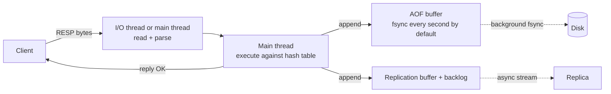

# Redis and Valkey

> Redis and Valkey are the fastest way to serve data that fits in memory and can be rebuilt from somewhere else. Use them for caches, counters, sessions, queues and locks, and never as the only copy of anything, because replication is asynchronous and an acknowledged write can be lost on failover.

This is one of the deep dives behind the [databases overview](/databases/): a working profile of Redis and its Linux Foundation fork Valkey as of September 2026. It covers how one thread serves a million requests a second, what each data structure costs in memory, what a snapshot does to your RAM, what replication and clustering promise, and the patterns built on top: caches, locks, rate limiters, queues. Valkey speaks the same protocol and shares the same mechanisms, so most of the piece applies to both, and I call out where they've diverged. Memcached and Dragonfly get a paragraph each at the end of the first section.

## What it is

Redis is an in-memory data structure server. A client sends a command such as `SET user:42 "ada"` or `ZADD leaderboard 1500 ada`. The server runs it against a hash table held entirely in RAM and replies, usually within tens of microseconds of server time. Salvatore Sanfilippo started it in 2009. The company now called Redis Ltd has employed most of the core developers since 2015 and owns the trademark.

The licence has moved twice. Everything up to Redis 7.2 is BSD-3. On 20 March 2024 the company announced that Redis 7.4 onwards would ship under two source-available licences, RSALv2 and SSPLv1. Both forbid offering the software as a managed service. On 2 May 2025 Redis 8.0 added the AGPLv3 as a third option, so Redis 8 is open source again in the OSI sense, with AGPL's copyleft attached. The repository's LICENSE.txt spells out the three choices.

The community's answer to the March 2024 change was **Valkey**. The Linux Foundation announced it on 28 March 2024 as a fork of Redis 7.2.4 under BSD-3, backed by AWS, Google Cloud, Oracle, Ericsson and Snap. Valkey 8.0 shipped on 15 September 2024 with a rewritten I/O threading model. Valkey 9.0 followed on 21 October 2025 with atomic slot migration and hash-field expiry, and 9.1 on 19 May 2026. The current stable is 9.1.2 (31 August 2026); 9.2 reached release candidate 1 on 16 September 2026. Amazon ElastiCache and Google Memorystore both offer Valkey as an engine, and ElastiCache prices it about 20 per cent below Redis.

Redis itself is on a roughly quarterly cadence. 8.0 came on 2 May 2025, then 8.2 (4 August 2025), 8.4 (18 November 2025), 8.6 (10 February 2026), 8.8 (25 May 2026) and 8.10 (29 July 2026); 8.10.2 is the newest patch as of 17 September 2026. Redis 8 also folded the former Redis Stack modules into the core binary: JSON, the query engine, time series, five probabilistic structures, and a new vector set type. Valkey keeps those as separate BSD-3 modules (valkey-json, valkey-search, valkey-bloom).

You run either one of three ways. Self-managed, as one process per node, usually a primary with one or two replicas plus Sentinel or Cluster for failover. Managed by a cloud: ElastiCache (Valkey, Redis OSS or Memcached, node-based or serverless), Memorystore, or Azure Cache. Or from a vendor: Redis Cloud from Redis Ltd, or Upstash, which bills per command and speaks the protocol over HTTP.

**Memcached** is the older, simpler alternative, still maintained (1.6.45 on 9 July 2026, BSD-3). It's a multithreaded string cache with no other data structures, no persistence and no replication; the client hashes keys across servers itself. It defaults to 4 worker threads, 64 MB of memory, a 1 MB item limit and 250-byte keys. It has two things Redis lacks: `extstore`, which spills large values to flash while keeping keys in RAM, and a built-in proxy.

**Dragonfly** reimplements the Redis and Memcached APIs in C++ with a shared-nothing thread-per-core design, so one process uses every core. Its README claims 3.8 million queries a second on a 64-core AWS instance and about 30 per cent less memory than Redis. Version 2.0 shipped on 16 September 2026. The licence is the Business Source License 1.1, which forbids offering it as a service; each version converts to Apache 2.0 after four years. It implements about 185 commands, roughly the Redis 5 surface, so check your command list first.

## Architecture

One thread does all the work on data that is all in memory, so there are no locks, no disk reads and no waiting. The main thread runs an event loop over `epoll` on Linux. It reads a command from whichever socket is ready, runs it against the in-memory structures, writes the reply, and moves on. Every command runs to completion before the next starts. That's what makes `INCR` atomic without a lock. It's also why one slow command stalls every client.

A few things run off the main thread. Freeing a large value can go to a background thread (`UNLINK` instead of `DEL`, and the `lazyfree-*` settings; Valkey turns these on by default, Redis leaves them off). The append-only file is fsynced from a background thread. Snapshots and AOF rewrites happen in a forked child. And since Redis 6.0 there are optional **I/O threads**, which take socket work off the main thread while the main thread still executes every command. In Redis 6 and 7 they only write replies by default; reading and parsing go to them as well only with `io-threads-do-reads yes`, and the shipped config says to enable any of it only on four or more cores and only when the main thread is saturated. Redis 8 rewrote the implementation so the threads read, parse and write, and its 8.4 notes report over 30 per cent more throughput on a four-core caching workload. Valkey's 8.0 design also has the I/O threads prefetch the hash-table entries the next batch of commands will touch. Valkey 9.0 made the thread count changeable at runtime, and 9.1 swapped in lock-free queues for another 8 to 17 per cent.

The cost of a single thread is that anything slow blocks everyone. `KEYS *` walks every key; the documentation says to use it in production only "with extreme care". `SMEMBERS` on a million-member set, `HGETALL` on a huge hash, `SORT`, `LREM` and `SUNION` are all O(N) on the main thread. A Lua script blocks the server for its whole run. After `busy-reply-threshold` (5 seconds by default) other clients get a `BUSY` error, and `SCRIPT KILL` only works on a script that hasn't written yet. Deleting a key with a million elements is also O(N) unless you `UNLINK` it. The rule is that every command should take microseconds; anything that doesn't gets replaced by `SCAN`, `HSCAN`, pagination, or a background job.

Memory is managed by jemalloc. `used_memory` in `INFO` is what Redis asked the allocator for and `used_memory_rss` is what the operating system sees; their ratio is `mem_fragmentation_ratio`. Well above 1 means fragmentation, which active defragmentation (`activedefrag`, off by default) repairs online. Below 1 means the box is swapping, which is an emergency.

Here's the write path for a `SET` on a primary with one replica and AOF on.

The reply goes back as soon as memory has changed. The AOF write and the replica stream both happen after the client has its `OK`. With `appendfsync everysec`, the default when AOF is on, a crash can lose up to a second of acknowledged writes. With `appendfsync always` the server fsyncs before replying, which the docs call "very very slow, very safe". With `appendfsync no` the kernel flushes when it likes, typically within 30 seconds on Linux. The read path is the same loop without the propagation: look up the key, delete it if it has expired, encode the value, reply.

## Data model and indexing

The model is a flat keyspace. A binary-safe string key (up to 512 MB, in practice a few dozen bytes) maps to one value of one type. There is no schema, no table and no secondary index in the core. What you get instead is a set of data structures, each with commands that run in known time.

Six core types carry most workloads. **Strings** hold up to 512 MB and are the basis for counters (`INCR`) and locks (`SET NX PX`). **Lists** are a deque with O(1) pushes and pops at either end, blocking pops, and up to 2^32 − 1 elements. **Sets** hold unique members with O(1) membership tests and union and intersection across keys. **Hashes** are a map inside a key, up to 2^32 − 1 fields. **Sorted sets** order members by a float score with O(log N) insert and rank, and they're the structure under leaderboards and sliding windows. **Streams** are an append-only log with `millis-seq` IDs and consumer groups.

Three more are built on those. A HyperLogLog estimates the cardinality of a set in at most 12 KB with 0.81 per cent standard error. A bitmap is a string addressed by bit, so 100 million users' flags fit in 12 MB. A geospatial index is a sorted set keyed by geohash.

Redis 8 added the former modules to the core. JSON documents are addressed by JSONPath with nesting to 128 levels. The query engine (`FT.*` commands) builds secondary indexes over hashes and JSON with text, tag, numeric and vector fields, including HNSW graphs. Time series and the probabilistic types (Bloom, Cuckoo, Count-min sketch, Top-K, t-digest) came across too. Vector sets hold a quantised embedding per member and `VSIM` returns nearest neighbours; they're still marked beta. Redis 8.8 added an Array type and 8.10 a compact hash encoding that stores field names once for keys sharing a schema. Valkey 9.2 adds a path hash, a radix tree for longest-prefix lookups.

Each type has several in-memory encodings, and the encoding decides memory use. A string that parses as an integer is an `int`. Up to 44 bytes it's an `embstr`, allocated in one block with its key entry; Valkey 9.1 raised that to 128 bytes and claims 30 per cent more `GET` throughput from it. Larger strings are `raw`. Small hashes, sets and sorted sets live in a **listpack**, a single contiguous byte array, until they pass the config thresholds: 512 entries or a 64-byte value for hashes, 128 entries for sorted sets and non-integer sets. Sets of small integers are an **intset**, a sorted array, up to 512 members. Past the thresholds they become a hash table, or for sorted sets a skiplist plus a hash table (Valkey 9.2 moves large sorted sets to a B+ tree). Lists are a **quicklist**, a linked list of listpack nodes of about 8 KB. Streams are a radix tree of listpacks. The documentation says the compact encodings use "up to 10 times less memory", five times on average, so people keep hashes under 512 fields and values under 64 bytes on purpose. `MEMORY USAGE key` reports what a key costs with overhead, and is the right basis for sizing; the docs don't publish a per-key overhead figure.

You build your own indexes. The pattern is a sorted set mapping an attribute to keys: `ZADD users:by_signup <timestamp> user:42`, then `ZRANGEBYSCORE` to query. You maintain it in the same `MULTI` block or script as the primary write, at one more O(log N) operation per index per write, on the main thread. The Redis 8 query engine and the valkey-search module do this for you over hash and JSON keys with real inverted indexes and vector graphs. The price is index memory, and every write to an indexed key updates the index inline. Nothing indexes across nodes in a cluster without hash tags or a module that fans out.

Two mechanisms tidy the keyspace. **Expiry** stores a millisecond timestamp per key. A key past its time is deleted when accessed. A background job also samples: ten times a second it takes 20 random keys with a TTL from each database, deletes the expired ones, and repeats at once if more than a quarter were expired. So expired keys can linger, and the memory doesn't return until they're touched or sampled. Replicas never expire keys; the primary sends them a `DEL`. Hash fields carry their own TTLs since Redis 7.4 (`HEXPIRE` and friends) and 8.0 (`HSETEX`, `HGETEX`), and in Valkey since 9.0. Expired fields are removed by a periodic job and still count in `HLEN` until then.

**Eviction** is what happens at `maxmemory`, which is unset by default on 64-bit builds. The default policy, `noeviction`, returns an error on writes once the limit is hit. `allkeys-lru` and `allkeys-lfu` evict anything; the `volatile-*` variants evict only keys with a TTL, and `volatile-ttl` picks the soonest to expire. The LRU is approximate. The server samples `maxmemory-samples` keys (5 by default; the docs say 10 gets close to true LRU) and evicts the least recently used of them. LFU keeps an 8-bit Morris counter per key that decays every minute. Redis 8.6 added "least recently modified" variants. The practical distinction is **cache mode** versus **store mode**. In cache mode you set `maxmemory` and an `allkeys` policy, the server manages its own memory, and every key is disposable. In store mode you keep `noeviction` with persistence on, the application decides what to delete, and a full server refuses writes. Don't mix them in one instance; a cache that evicts session keys is a bug you find in production.

## Transactions and consistency

A transaction is `MULTI`, a list of commands, `EXEC`. The commands queue on the connection and then run back to back on the main thread with nothing interleaved, so from outside they're atomic and serialisable. There is no rollback. If a command fails at runtime (say `LPUSH` on a string), the rest still run and you get the error in that slot of the reply. If a command fails to queue, `EXEC` refuses with `EXECABORT`. The docs are blunt that rollback was left out for simplicity and speed.

The optimistic check-and-set is `WATCH`. You `WATCH` a key, read it, compute, then `MULTI ... EXEC`; if any watched key changed in between, `EXEC` returns null and you retry. Because the server is single-threaded, isolation is not a setting. Every command, transaction and script sees a consistent state because nothing else runs. The anomalies are of a different kind: a `GET` on a replica can return stale data, and a write acknowledged by the primary can vanish on failover.

For read-then-write atomically, Lua is the usual answer. `EVAL` runs a script on the main thread with the server blocked; `EVALSHA` runs one by hash from a cache that restarts clear. **Functions** (7.0) are libraries loaded once with `FUNCTION LOAD`, persisted in the dataset and replicated, so a failover doesn't lose them. A script's effects are replicated as a `MULTI` block rather than the script itself. Keep scripts to microseconds.

A transaction or script only touches keys on one node. In a cluster that means keys in one hash slot; multi-key operations across slots fail with `CROSSSLOT` unless a hash tag forces the keys together. There's no size limit beyond memory and no time limit beyond the `BUSY` warning, but a transaction of a million commands is a million commands nobody else can run. Durability is one `write()` to the AOF; a crash midway leaves a partial record that `redis-check-aof` trims on restart.

## Replication and failover

Replication is **asynchronous** and leader-based. A replica connects with `REPLICAOF`, and the primary streams it every write after acknowledging the client. Each primary has a replication ID and a byte offset. A reconnecting replica sends `PSYNC id offset`; if the primary still holds those bytes in its **backlog** (a ring buffer, 1 MB by default in Redis, 10 MB in Valkey), it gets just the missing tail. Otherwise it gets a full sync. The primary forks, the child writes an RDB snapshot, and by default (`repl-diskless-sync yes`, after a 5-second wait so several replicas can share one) streams it straight to the socket. Valkey 8 added a **dual-channel** full sync, off by default, that sends the snapshot and the live stream on separate connections so the primary buffers less. Replicas serve reads while catching up unless `replica-serve-stale-data` is off.

`WAIT n timeout` makes replication synchronous for one client. It blocks until `n` replicas have acknowledged everything that client wrote, and returns how many did. The documentation is exact about the limit: "WAIT does not make Redis a strongly consistent store", and "acknowledged writes can still be lost during a failover, depending on the exact configuration of the Redis persistence". The gap is that the replica that acknowledged might not be the one promoted. `WAITAOF` (7.2) does the same for fsync to the append-only file. `min-replicas-to-write 1` with `min-replicas-max-lag 10` makes the primary refuse writes when no replica has reported in ten seconds, which bounds the loss window rather than closing it.

Failover comes from one of two systems. **Sentinel** is a set of separate processes, at least three on separate hosts, watching a primary. Each marks it subjectively down after `down-after-milliseconds`. When `quorum` of them agree, it's objectively down; a majority of all Sentinels then elect one to run the failover. It promotes a replica chosen by configured priority, then replication offset, then run ID, reconfigures the others, and tells clients through its API. During a partition the old primary can keep taking writes from clients on its side until it's reconfigured. That's the **split-brain** window, and the `min-replicas` settings are the documented way to shrink it.

**Redis Cluster** fails over per shard without Sentinel. Every node gossips with every other over a second port (client port plus 10000). A primary silent for `cluster-node-timeout` (15 seconds by default) is flagged by each peer. When a majority of primaries agree it has failed, its replicas ask for votes, the most up-to-date one delaying least, and the winner takes a fresh configuration epoch and the slots. A primary cut off from a majority of primaries stops taking writes after the same timeout. Two things are lost: writes the old primary acknowledged that hadn't reached the winner, and writes sent to a primary on the minority side of a partition within the timeout window.

Read-your-writes therefore holds only against the primary. Replica reads (`READONLY` in cluster mode) lag by however far the stream is behind, usually milliseconds and sometimes seconds during a full sync. Across regions the open-source servers give you asynchronous replicas over the WAN, good for reads and disaster recovery, with the same loss window stretched by the round trip. ElastiCache's Global Datastore is that arrangement with a managed promote. Redis Ltd's Enterprise product sells active-active replication built on conflict-free replicated data types, a different engine from the one described here.

## Scaling

One instance is bounded by one core. The `redis-benchmark` and `valkey-benchmark` docs show the shape: about 72,000 `SET`s a second from 50 clients without pipelining, and 400,000 to 500,000 with a pipeline depth of 16, on the same box. The docs also note that 30,000 connections get half the throughput of 100. And 4 KB values at 100,000 requests a second is 3.2 Gbit/s, which is where many "Redis is slow" stories actually end. Valkey's threaded I/O takes one instance past a million requests a second on its own benchmark, and its 9.0 press release claims a billion a second across a cluster.

Scaling reads is straightforward: add replicas and send reads there, accepting the lag, or move the cache into the client. **Client-side caching** (`CLIENT TRACKING`, since 6.0) has the server remember which keys each connection read and push an invalidation over RESP3 when one changes. The application keeps a local copy and skips the round trip. **Pipelining** is the other multiplier: send many commands before reading replies. The docs' own example drops 10,000 pings from 1.19 seconds to 0.25. Batch in the low thousands so the server's output buffer doesn't balloon.

Scaling writes means **Cluster**. The keyspace is split into 16,384 hash slots; a key's slot is `CRC16(key) mod 16384`, and each primary owns a range. If the key contains `{...}`, only the part inside the braces is hashed. That's how `user:{42}:profile` and `user:{42}:sessions` stay on one node for multi-key commands. A client that hits the wrong node gets `-MOVED slot host:port` and updates its slot map. During a legacy migration it gets `-ASK` for a key that has already moved, sends `ASKING` and retries without updating the map. The spec calls 1,000 nodes the sensible ceiling. Redis Cluster supports only database 0; Valkey 9.0 added numbered databases in cluster mode.

Resharding used to mean moving keys one at a time with `MIGRATE` while both nodes served `ASK` redirects, which is slow and fragile with big keys. Redis 8.4 (November 2025) and Valkey 9.0 (October 2025) both added **atomic slot migration**. The source forks a snapshot of just the migrating slots and streams it to the target like a replica sync. It accumulates the writes that arrive meanwhile and sends them. Once the backlog is small it pauses writes to those slots, hands over ownership with a new epoch, and deletes its copy. Clients see one `MOVED` at the end and nothing in between. In Redis it's `CLUSTER MIGRATION`; in Valkey it's `CLUSTER MIGRATESLOTS`, with `CLUSTER GETSLOTMIGRATIONS` to watch progress.

A **hot key** doesn't shard. One key lives in one slot on one primary. If it takes 300,000 reads a second, that node takes 300,000 reads a second however many nodes you add. The fixes are to serve it from replicas, cache it in the client with tracking, or split it: a counter becomes `counter:{0..15}` summed on read, a hot hash becomes several. Both servers now find hot keys for you (`HOTKEYS` in Redis 8.6 and Valkey 9.2). A **big key** is the other pathology. A list or set with millions of members makes every command on it slow and stalls migration and replication. Split it, `SCAN` it, and `UNLINK` it.

## Caching patterns

Most deployments are a cache in front of a database, and the hard part is keeping the two agreeing. The usual arrangement is **cache-aside**: the application reads Redis first, on a miss reads [Postgres](/relational/) or whatever the source is, and writes the value back with a TTL (`SET product:42 <json> EX 300`). Updates go to the database, and the application deletes the cached key. Two alternatives put the cache on the write path. **Write-through** writes cache and database together on every update, so the cache is never stale, at the cost of two round trips per write and a cache full of keys nobody reads. **Write-behind** writes only the cache and flushes to the database later. It's the fastest, and it's the one pattern where Redis is the only copy for a while, so a failover loses updates. Cache-aside is the default because it costs nothing until a key is read, and when Redis is down it degrades to slower rather than wrong.

Staleness is bounded by two mechanisms, and you want both. Invalidation deletes the key when the source changes, which keeps staleness near zero as long as every writer remembers. A TTL bounds the damage when one forgets. Set it by how long a stale value is tolerable, and add jitter: a thousand keys loaded together with the same `EX 300` expire together and hit the database in one burst, so add a random 0 to 30 seconds and they drain out over half a minute. Cache misses too. If a lookup for a product that doesn't exist reaches the database every time, a bot walking IDs becomes a load test, so store a short-lived sentinel for "no such row" (`SET product:99 "" EX 30`). That's negative caching.

The expiry of one hot key is the case that takes sites down. A key read a thousand times a second expires, and for the hundred milliseconds the database takes to answer, all thousand readers miss and run the same query. This is a **cache stampede**, also called a dogpile, and there are four defences. Lock the rebuild: the first reader to miss takes `SET lock:product:42 <token> NX PX 5000` and recomputes, and the rest wait briefly and retry. Coalesce in the process: one in-flight fetch per key per application instance, with every concurrent caller waiting on it (client libraries call this single-flight). Recompute early: each reader refreshes with a small probability that rises as the TTL runs down, so the key is renewed before it expires. Or serve stale: keep a logical expiry inside the value and a longer real TTL, and once the logical one passes, return the old value and refresh in the background. Facebook's memcache paper describes the lease form of the first: the cache hands the first misser a token, tells the others to wait or use the stale value, and issues at most one lease per key every ten seconds.

The subtle bug is the race between the database write and the cache write. In cache-aside the writer updates the database, then deletes the key. A reader that missed just before the update, read the old row, and writes it back after the delete leaves a stale value until the TTL. That window is one database read wide, so it's rare. Delete first, then update, is worse: any reader arriving during the update repopulates the old value, and the window is the whole write. Updating the cache instead of deleting it is worse again, because two concurrent writers can land in the cache in the opposite order from the database. A read replica adds a window of its own, since a reader that repopulates from a lagging replica after the delete reinstalls the old row. So the default is update then delete with a TTL as the backstop, plus a second delete a second later when the replica case matters. Where correctness matters, drive the delete from the database's change log (Facebook's mcsqueal daemon tails the MySQL commit log; Debezium does the same from Postgres's WAL), so the invalidation follows the commit and can be replayed if it fails.

## Consistency versus availability

Redis and Valkey are available-first with a bounded window of lost writes. They never promise that a read sees the latest write unless it goes to the primary. Under a partition the majority side keeps serving and promotes replicas. The minority side stops accepting writes after the node timeout, so divergence is bounded, but what was written there in that window is lost along with whatever hadn't replicated. The cluster documentation says it plainly: "Redis Cluster does not guarantee strong consistency". In normal operation an acknowledgement means the write is in memory on the primary and nowhere else yet.

The tunables move the loss window rather than close it: `WAIT` and `WAITAOF` per write, `min-replicas-to-write` and `min-replicas-max-lag` per primary. `cluster-require-full-coverage` (default yes) makes the whole cluster refuse queries while any slot has no owner, trading availability for never serving a partial keyspace. `cluster-allow-reads-when-down` lets a cut-off node keep serving reads. Across regions the choice is asynchronous replicas with a promote step, or a vendor's active-active product. Neither gives a cross-region linearizable write.

## Operations

A backup is an RDB snapshot file. The default `save 3600 1 300 100 60 10000` writes one after an hour with one change, five minutes with a hundred, or a minute with ten thousand. You copy the file elsewhere. It's a point in time and nothing finer. There's no point-in-time recovery, only the last snapshot plus, if AOF is on, the log up to the last fsync. The AOF since 7.0 is **multi-part**: a base file, incremental files and a manifest. A rewrite writes a new base in the child while the parent opens a new incremental file, then swaps the manifest atomically. Rewrites trigger when the file doubles and exceeds 64 MB. On restart the AOF wins, since it's the more complete.

Every snapshot and rewrite calls `fork()`. The child gets a copy-on-write view of memory, free until the parent writes, and then every page the parent touches is duplicated. On a busy write workload the process can approach double its size during a save. The fork itself pauses the main thread while the kernel copies page tables. The latency guide's measurements run from 9 to 13 milliseconds per GB on physical hardware and modern EC2, up to 239 milliseconds per GB on old Xen instances. It also says to disable transparent huge pages, which make copy-on-write duplicate 2 MB pages instead of 4 KB. `latest_fork_usec` in `INFO` shows what you're paying. Valkey 9.2 adds an opt-in **forkless** snapshot: the server keeps 4 extra bytes per key so a background thread can write the snapshot from inside the process. That removes the memory doubling and the fork pause. It's a release candidate as of September 2026.

Upgrades roll through the replicas first: upgrade each replica, fail over, then upgrade the old primary. An older server can't read a newer RDB, so the rollback path is a replica that was never upgraded. The background housekeeping is active expiry, defragmentation if enabled, AOF rewrites and slot rebalancing, and all of it shows up in latency.

Alarm on `used_memory` against `maxmemory`, on `mem_fragmentation_ratio` above about 1.5 or below 1, and on `evicted_keys` rising when you didn't plan on eviction. Watch the hit ratio from `keyspace_hits` and `keyspace_misses`, and replica lag as `master_repl_offset` minus each replica's offset. Add `latest_fork_usec`, `rejected_connections` against the `maxclients` cap, `blocked_clients`, the slow log and the latency monitor. Replica output buffers are cut off at 256 MB, or 64 MB held for 60 seconds, and a replica that hits that gets a full sync.

Size by memory first, because memory is what you buy. Sample real keys, run `MEMORY USAGE` on them, multiply by key count, then add headroom. Allow as much again if you snapshot under write load, plus the backlog, client buffers, and fragmentation, which commonly sits at 1.2 to 1.5. As a worked case: 50 million session keys at a measured 200 bytes is 10 GB of data. I'd put that on a 26 GB node (a `cache.r7g.xlarge`) rather than a 13 GB one, with `maxmemory` at about 70 per cent. Throughput is the second axis. One instance is good for a few hundred thousand simple commands a second, so a workload past that shards regardless of data size.

ElastiCache bills per node-hour. From the AWS price list for us-east-1 dated 14 September 2026, a `cache.r7g.large` (13.07 GiB) is $0.1752 an hour on Valkey and $0.219 on Redis OSS, a 20 per cent gap that runs across the range. A `cache.r7g.4xlarge` (105.81 GiB) is $1.396 on Valkey and a `cache.t4g.micro` (0.5 GiB) is $0.0128. Replicas are full-price nodes, so a primary with two replicas is three times the figure. Serverless bills data at $0.084 per GB-hour on Valkey ($0.125 on Redis) plus $0.0023 per million ECPUs, AWS's unit of request work ($0.0034 on Redis), and snapshots at $0.085 per GB-month. Memorystore for Valkey is also per node-hour by node type, Redis Cloud sells fixed plans by dataset size, and Upstash bills per command. I couldn't fetch those three price pages for this cut, so treat the shape as confirmed and the figures as unverified.

## Performance envelope

Latency on one box is dominated by the network. The latency guide measures intrinsic latency at 115 microseconds worst case on a good bare-metal host, against close to 10 milliseconds on a busy virtual machine. A 1 Gbit network hop is about 200 microseconds and a Unix socket about 30. Connections are capped by `maxclients` (10,000 by default) and by file descriptors, each client gets a query buffer of up to 1 GB, and a server outside cluster mode has 16 numbered databases. One request or reply argument is bounded by `proto-max-bulk-len` at 512 MB.

The other numbers live in the sections that own them: per-instance throughput, the pipelining gain and the cost of 30,000 connections in Scaling; the 2^32 − 1 element cap on every list, set, hash and sorted set and the 128-level JSON nesting in Data model; the 16,384 slots and the 1,000-node ceiling in Scaling; the memory signals and buffer limits in Operations. There is no row or document limit beyond memory, and in practice memory is the limit you hit.

## When to use it, and when not to

Use it as a cache in front of a database, where a miss is a slower read and the eviction policy is the memory manager. Use it for sessions and rate limits, where a lost record means one user logs in again or gets one extra request. Use it for counters, leaderboards, presence, and anything else that wants a sorted set or an atomic increment at a hundred thousand a second. Use streams for a work queue with consumer groups when you want at-least-once delivery without running Kafka, and lists with `BLMOVE` for a simpler one. Use pub/sub for fan-out where a disconnected subscriber can afford to miss messages, because pub/sub keeps nothing.

Don't use it as the only copy of a business record. Replication is asynchronous, failover can lose acknowledged writes, and the safest persistence setting makes every write wait on `fsync`. Don't use it for a dataset that won't fit in RAM on one node or a modest cluster, because the price per gigabyte is memory price. Don't use it for queries you didn't plan; there's no secondary index unless you build one or load the query engine, and there's no join. Don't use it for a lock that guards correctness rather than efficiency, for the reasons below. And don't put a hundred-megabyte value or a ten-million-member set behind one key, because the single thread makes everyone pay for it.

## Interview deep dive

**Q. Why is Redis single-threaded, and how does it still reach a million requests a second?**
With all data in memory, a command is a hash lookup and a few pointer operations, so a lock or a context switch would cost a large fraction of the work itself. One thread with an event loop never contends and never waits on disk, so it saturates the network before the core. The real ceiling is the round trip, which pipelining amortises: the docs go from 72,000 to over 400,000 commands a second by batching 16 deep. I/O threads (Redis 6, redesigned in Redis 8 and Valkey 8) move socket reads, parsing and reply writes off the main thread, and Valkey's benchmark passes a million a second that way. The trade is that one slow command stalls everyone.

**Q. Design a distributed lock on Redis. What can go wrong?**
The single-node lock is `SET lock:order:42 <random-token> NX PX 30000`: create only if absent, with a TTL so a dead client can't hold it forever. Release with a Lua script (or Valkey's `DELIFEQ`) that deletes only if the value still equals your token. Redlock extends this to five independent nodes and counts the lock as held if a majority granted it within the TTL minus elapsed time. Kleppmann's critique is that any lease-based lock fails if the holder pauses past the TTL, through a GC stop or a slow network: it wakes up believing it holds the lock while another client has it. Redlock also assumes bounded clock drift that wall-clock TTLs don't give. The fix for correctness is a fencing token, a number that increases with each grant and that the protected resource rejects if stale, which Redis doesn't provide and ZooKeeper or etcd does. So I'd use a Redis lock to avoid duplicate work, and fencing when a duplicate would corrupt data.

**Q. Design a rate limiter: 100 requests per user per minute.**
The simple version is a fixed window: `INCR ratelimit:{user}:{minute}`, `EXPIRE 60` on the first hit, reject above 100; it allows 200 across a window boundary. The sliding window uses a sorted set per user with request timestamps as scores. One Lua script runs `ZREMRANGEBYSCORE` to drop entries older than 60 seconds, `ZCARD` to count, `ZADD` if under the limit, and `EXPIRE` on the key. The script makes check-and-add atomic, and the hash tag keeps it in one slot. Memory is one entry per allowed request in the window, so for a high limit use two weighted counters (this minute and last) instead. Redis 8.8's `INCREX` folds increment, bound and expiry into one command for the fixed-window case. Run it in cache mode; a lost counter under-limits for one window, which is acceptable.

**Q. The primary dies. What happens, and what's lost?**
Something has to notice, agree and promote. With Sentinel that's three or more watcher processes: a quorum agree the primary is down, a majority elect one Sentinel to promote the best replica and tell the clients. With Cluster the other primaries do that job among themselves after `cluster-node-timeout`, and the most caught-up replica takes the slots. Either way the loss is every write the old primary acknowledged that hadn't reached the winner, usually milliseconds of traffic. If it was a partition rather than a crash, clients on the old primary's side kept writing for up to the timeout, and those writes are gone too. `WAIT` and `min-replicas-to-write` shrink that window, the docs still say acknowledged writes can be lost, and I'd design as if some will be.

**Q. One key is taking most of the traffic. What do you do?**
Confirm it with `HOTKEYS` (Redis 8.6, Valkey 9.2) or a sampled `MONITOR`. If it's read-hot, serve it from replicas with `READONLY`, or hold a copy in each application instance: a local cache with a TTL of a second or so turns a thousand reads a second into one per instance, and client-side tracking pushes invalidations if a second is too long. Coalesce as well, so one fetch per key is in flight per instance and every other caller waits on it. If it's write-hot, split it: a counter becomes sixteen sub-counters chosen by hashing the request and summed on read, a hash becomes several by field prefix. If it's big as well as hot, the big is the worse problem: replace `HGETALL` with `HSCAN` or a smaller model, and never `DEL` it on the main thread.

**Q. Product pages are cached in Redis in front of Postgres. A price changes. How do you keep the cache right, and what happens when the key expires under load?**
Cache-aside: read Redis, on a miss read the database and `SET` with a TTL. On the price change, update the database and then delete the key, in that order, because deleting first leaves the whole write as a window for a reader to put the old price back. A short TTL, say five minutes with jitter, is the backstop for a delete that fails or a replica that lagged. If prices are the kind of thing that must not be wrong, I'd drive the delete from the database's change log rather than from application code, so it can't be forgotten and can be replayed. When a hot product's key expires, every request misses at once, so I'd put a lock or a single-flight fetch around the rebuild and serve the stale value while it runs. And I'd cache the misses briefly, so a scan of missing IDs can't reach the database.

**Q. Give a consistency anomaly and how you'd avoid it.**
A user updates their profile, the primary acknowledges, the next request reads from a replica and sees the old profile. That's replica lag. The fix is to read your own writes from the primary, or to `WAIT 1` after the write so at least one replica has it before you read from replicas. A worse one: the write is acknowledged, the primary crashes before replicating, a replica is promoted, and the write is gone from everywhere. No configuration prevents that; `min-replicas-to-write` only makes the primary refuse writes when it's alone. That is why you keep the source of truth in another store.

**Q. Size a session store for 20 million active sessions of about 500 bytes each.**
Measure first: `MEMORY USAGE` on real session keys shows the overhead on top of 500 bytes; call it 600. Twenty million times 600 bytes is 12 GB of data. Add fragmentation at 1.3 and headroom for a snapshot under load, which can double resident memory, and you want about 30 GB. That's a 26 GB `r7g.xlarge` with `maxmemory` at 18 GB and `allkeys-lru`, or two shards if the write rate is high. Sessions are a read and maybe a write per request, so 50,000 requests a second sits well inside one instance. On ElastiCache Valkey that node is about $0.35 an hour, times three for a primary and two replicas, so roughly $750 a month on demand.

**Q. Model a leaderboard with per-user rank and a top-100 page.**
One sorted set per board: `ZADD board:{season} score user`, `ZREVRANGE board:{season} 0 99 WITHSCORES` for the page, `ZREVRANK` for a user's position, `ZINCRBY` for updates, all O(log N). At a million players that's one key of a few tens of megabytes, fine for reads and updates but big for migration and for `ZRANGE` calls that ask for tens of thousands of rows. If a board grows to tens of millions or gets write-hot, split by bracket or region and merge the top pages in the application. Keep the authoritative scores in the database and rebuild the set from them if it's lost.

**Q. Pub/sub or streams for a notification pipeline?**
Pub/sub delivers a message once to whoever is subscribed at that instant and stores nothing; a consumer that's down misses it. Streams append every message with an ID, and consumer groups track delivery. `XREADGROUP` hands each entry to one consumer, it sits in the pending entries list until `XACK`, and `XAUTOCLAIM` lets another consumer take entries idle too long. That's at-least-once delivery, so consumers must be idempotent, and the stream must be trimmed with `MAXLEN ~` or it grows without bound. For notifications that must arrive, streams; for live updates to a screen, pub/sub.

**Q. Memory doubled during a BGSAVE and the box swapped. Why, and what now?**
Copy-on-write. The forked child holds the old pages while the parent keeps writing, and every page written gets duplicated, so a write-heavy instance approaches twice its size during the save. Swapping is fatal to latency. Short term, snapshot from a replica instead of the primary, size for double, disable transparent huge pages, and watch `latest_fork_usec`. Longer term, Valkey 9.2's forkless snapshot removes the doubling for 4 bytes per key.

**Q. When would you not use Redis or Valkey?**
When the data is the record: orders, balances, anything where losing a second of writes on failover is a business event. When the dataset won't fit in memory at a price you'll pay. When you need queries you haven't designed keys for, or joins. When a lock must be correct rather than merely helpful. And when Memcached would do, because a fleet of plain string caches with client-side hashing is simpler and uses every core.

## What changed recently

- **2 May 2025.** Redis 8.0 GA: AGPLv3 added as a third licence, the Stack modules folded into the core, vector sets in beta, a new I/O threading implementation, `HGETEX`, `HSETEX` and `HGETDEL`.
- **4 August 2025.** Redis 8.2: `XDELEX` and `XACKDEL`, per-slot metrics, SVS-VAMANA vector index compression.
- **14 August to 21 October 2025.** Valkey 9.0 from first release candidate to GA: atomic slot migration (`CLUSTER MIGRATESLOTS`), numbered databases in cluster mode, hash-field expiry, runtime-changeable I/O threads, `DELIFEQ`.
- **18 November 2025.** Redis 8.4: `CLUSTER MIGRATION`, `FT.HYBRID`, `MSETEX`, and the claim of over 30 per cent more throughput from I/O threads on a four-core cache workload.
- **10 February 2026.** Redis 8.6: `HOTKEYS`, least-recently-modified eviction policies, idempotent `XADD`, memory reductions for large hashes and sorted sets.
- **19 May 2026.** Valkey 9.1: lock-free I/O thread queues (8 to 17 per cent), 128-byte embedded strings, per-database ACLs, TLS reload, `HGETDEL`, `MSETEX`, `CLUSTERSCAN`. ElastiCache added 9.1 in June.
- **25 May 2026.** Redis 8.8: Array type, `INCREX`, `XNACK`, hash-field keyspace notifications.
- **9 July 2026.** Memcached 1.6.45, a security and stability release.
- **29 July 2026.** Redis 8.10: compact hashes, `HIMPORT`, `LMOVEM`, `SUNIONCARD`, `BACKUP`. Patches 8.10.1 and 8.10.2 followed on 17 August and 17 September, the latter alongside security fixes across every 8.x line.
- **31 August 2026.** Valkey 9.1.2, the current stable.
- **16 September 2026.** Valkey 9.2.0-rc1: opt-in forkless snapshots, B+ tree sorted sets, `HOTKEYS`, replication throttling, ACL roles, the path hash type, LZ4 and zstd RDB compression. Dragonfly 2.0 shipped the same day.
