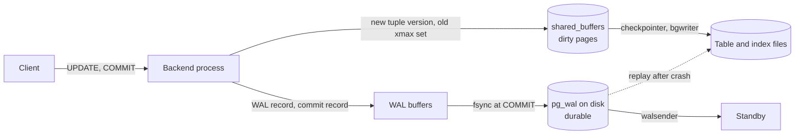

# PostgreSQL and MySQL

> Postgres is the relational engine to reach for in 2026. MySQL is the right answer where a team already runs it well or needs Vitess-style sharding today. Both have one primary, so the ceiling is write throughput on one machine, and the daily price is VACUUM on one side and primary-key discipline on the other.

This piece goes under the hood of the two general-purpose relational engines, with Postgres as the spine and a paragraph in each section on where MySQL's InnoDB differs, plus a short section on SQLite. It ends with the questions a Staff+ interview asks. Every figure is from the documentation or the source tree, and where I couldn't source one I say so.

## What it is

PostgreSQL grew out of the POSTGRES project at Berkeley and has been developed by a volunteer community since 1996. It is released under the PostgreSQL Licence, a permissive BSD-style licence that has never changed. One major version ships each year and gets five years of minor releases. The current major is 18, released on 25 September 2025, at minor 18.6 since 13 August 2026. PostgreSQL 19 reached beta 4 on 24 September 2026, with general availability planned for October. The project sells nothing, so how you run it is a separate choice. You self-manage it on a virtual machine or in Kubernetes with an operator, or you rent it from Amazon RDS and Aurora, Google Cloud SQL and AlloyDB, Azure, Neon (now Databricks Lakebase), Supabase, Crunchy Bridge (now Snowflake Postgres), or PlanetScale.

MySQL differs in ownership and licence. Oracle develops it, under the GPL version 2 for the community edition and a commercial licence for the enterprise one. A long-term-support release comes every two years, and 9.7 (April 2026) is the current one. Quarterly "innovation" releases are now numbered 26.x, and the trunk's version file records `MYSQL_PREVIOUS_LTS_VERSION=9.7.0`. The storage engine is pluggable, but in practice MySQL means InnoDB, and everything below about MySQL is about InnoDB. MariaDB is the community fork made when Oracle bought Sun. Its 12.3 long-term-support release came out in May 2026 under the GPL version 2, it has had vector search since 11.8, and it diverges from MySQL a little more every year.

## Architecture

Postgres runs one operating-system process per connection. A supervisor process, the postmaster, listens on the port and forks a backend for each client, and the backends share a block of memory for the buffer pool, the lock table, and transaction state. The manual's tutorial says it in one line: it "starts (forks) a new process for each connection". A process costs memory and a fork, so connections are expensive. The default `max_connections` is 100, and the documentation warns that raising it also grows shared memory. That is why every Postgres deployment of any size puts a pooler in front. PgBouncer in transaction mode lends a server connection to a client only for the length of one transaction, so a few dozen backends can serve thousands of clients; Neon uses it to offer 10,000 client connections over a compute whose own `max_connections` runs from 104 to 4,000 by size. The pooler has a cost. In transaction mode anything that lives on the session breaks, and PgBouncer's reference lists them: `SET` and `RESET`, `LISTEN`, `WITH HOLD` cursors, SQL-level `PREPARE`, session advisory locks, and `LOAD`. Protocol-level prepared statements, the kind your driver makes, have worked since PgBouncer 1.21 through a per-connection cache of `max_prepared_statements` entries, 200 by default.

The storage engine is a heap. A table is a file of 8 KB pages, and a row goes on whichever page has room. Each page has a 24-byte header, an array of 4-byte line pointers growing down from the top, and the tuples growing up from the bottom. Each tuple carries a 23-byte header. Two fields in it are the whole story of Postgres concurrency: `t_xmin`, the ID of the transaction that inserted this row version, and `t_xmax`, the ID of the one that deleted or replaced it. A value too big for its page is handled by TOAST, the oversized-attribute storage technique. Once a row passes about 2 KB, the engine compresses its wide columns (pglz by default, lz4 if compiled in) and, if still too big, slices them into chunks of about 2,000 bytes stored as rows in a side table. A single value tops out at 1 GB. Two small maps live beside each table. The free space map records how much room each page has. The visibility map holds two bits per page: whether every tuple on it is visible to all transactions, and whether every tuple is frozen. A table's `fillfactor` (100 by default) reserves a share of each page for updates, which matters in the next section.

Memory is layered. `shared_buffers` is the buffer pool, 128 MB out of the box. The documentation suggests a quarter of RAM on a dedicated server and warns that above 40 per cent it rarely helps, because the operating system's page cache holds the rest. `work_mem` (4 MB) is the per-sort, per-hash budget for each node of a query, so one query can spend it several times over, and `maintenance_work_mem` (64 MB) is the budget for VACUUM and index builds. Since PostgreSQL 18, reads can be issued ahead of need by an asynchronous I/O subsystem: `io_method` defaults to `worker` with three I/O worker processes, and can be `io_uring` on Linux builds with liburing.

The write path is what an interviewer wants step by step. A client's `UPDATE` arrives at its backend, which parses, plans, and executes it. The executor finds the old tuple and sets its `t_xmax` to the current transaction ID. It writes a new tuple version with `t_xmin` set to the same ID, on the same page if there's room and on another page if not. Both pages change only in the buffer pool. Before a modified page can leave the pool, a record describing the change goes into the write-ahead log, the WAL. The WAL is an append-only sequence of 16 MB segment files, and a byte position in it is a log sequence number, an LSN. At `COMMIT` the backend appends a commit record. With `synchronous_commit=on` it then calls `fsync`, so the WAL is on durable storage before the client hears "committed". The first change to any page after a checkpoint writes the whole 8 KB page into the WAL (`full_page_writes`). A power cut can tear a page across its 512-byte sectors, and the log needs a clean copy to repair from. Dirty pages reach the table files later. A checkpoint runs every `checkpoint_timeout` (5 minutes) or every `max_wal_size` (1 GB) of WAL, whichever comes first, and spreads its writes over 90 per cent of the interval. Crash recovery reads the last checkpoint position from `pg_control` and replays the WAL forward. Every page carries a checksum, on by default since 18.

`synchronous_commit` is the dial on that path. `on` waits for the local WAL flush. `off` returns before the flush, and a crash can lose commits from a window bounded at three times `wal_writer_delay` (200 ms), so about 600 ms. The docs stress that this loses recent transactions but cannot corrupt anything, because replay applies commits in order. `remote_write`, `on`, and `remote_apply` extend the wait to a synchronous standby, covered under replication. Turning `fsync` itself off is the one setting that can corrupt a database.

The read path is the mirror image. The planner chooses a sequential scan, an index scan that walks a B-tree to tuple locations and fetches each page, a bitmap scan that collects locations first and visits pages in order, or an index-only scan. Every page read goes through the buffer pool, and the hit rate in `pg_stat_database` decides whether the system is bound by disk.

MySQL differs from the first line. It runs one server process with a thread per connection, so connections are cheaper, though a pooler is still standard and RDS Proxy plays that role on Amazon. InnoDB's unit is a 16 KB page (`UNIV_PAGE_SIZE_SHIFT_DEF = 14` in the source). Its buffer pool defaults to 128 MB and is meant to be sized to most of RAM, because InnoDB does its own caching. Its table is not a heap. A table is stored inside its primary-key B-tree, the clustered index, with the rows in the leaves in key order; if you declare no primary key, InnoDB makes one from a hidden row ID and calls it `GEN_CLUST_INDEX`. Durability rides on the redo log (`innodb_redo_log_capacity`, 100 MB by default) and on `innodb_flush_log_at_trx_commit`, whose default of 1 means "write and flush at each commit" and whose value 2 writes at commit but flushes once a second. InnoDB's answer to torn pages is the doublewrite buffer: each dirty page is written to a doublewrite file first and then to its place.

## Data model and indexing

Every Postgres index is secondary, because the heap has no order of its own. An index maps a key to a tuple location, and every insert, and every update that changes an indexed column, writes an entry into every index on the table. That is the cost of an index on write, and it multiplies: a table with eight indexes does nine page writes per insert, plus WAL for each. One entry can hold about a third of a page, 2,704 bytes for a B-tree.

The default type is the B-tree. It handles equality and range operators, `IN`, `IS NULL`, and anchored `LIKE`, returns rows in order, and has folded repeated keys into posting lists since version 13. A multicolumn B-tree is only cheap to search from its leading columns. Since 18, a skip scan lets the planner use one when a leading low-cardinality column has no constraint, by walking each distinct value in turn. Hash indexes store a 32-bit hash and answer only equality. GiST is a framework for balanced trees over things that overlap, such as geometry and ranges, and does nearest-neighbour searches; SP-GiST does the same for quadtrees and radix trees. GIN is an inverted index, a key pointing to a list of rows, and is what indexes arrays, `jsonb`, and full-text vectors. It is slow to update because one row can add many keys, so it batches inserts into a pending list (`gin_pending_list_limit`, 4 MB) that searches must also scan. BRIN stores only the minimum and maximum of each range of pages. It's tiny, useful only when values follow physical order (an append-only table keyed by time), and every hit is rechecked. The pgvector extension (0.8.6, PostgreSQL Licence) adds HNSW and IVFFlat approximate-nearest-neighbour indexes. HNSW builds a graph with `m=16` and `ef_construction=64` by default and searches with `hnsw.ef_search=40`; an indexed `vector` can have at most 2,000 dimensions, or 4,000 as `halfvec`.

Three modifiers change what an index costs and covers. A partial index takes a `WHERE` clause and indexes only matching rows, which is how you index the 2 per cent of orders that are unpaid without paying for the rest. An expression index indexes `lower(email)` or a `jsonb` path, and costs that expression on every insert. A covering index adds payload columns with `INCLUDE`, on B-tree, GiST, and SP-GiST, so a query that needs only those columns can be answered by an **index-only scan**. That scan has a condition specific to Postgres. The index has no idea whether a tuple is visible to your transaction, so the executor consults the visibility map, and only pages with the all-visible bit set skip the heap. VACUUM sets that bit, so a table updated faster than it's vacuumed gets no benefit from covering indexes. GIN can't do index-only scans at all.

Updates have a shortcut, the heap-only tuple or HOT update. If an update touches no indexed column and the new version fits on the same page, the engine links the new tuple from the old one and writes no index entries at all. Later readers can prune the dead version without waiting for VACUUM. A `fillfactor` under 100 makes the second condition true more often, and `n_tup_hot_upd` in `pg_stat_user_tables` tells you whether it's working. What can't be indexed is anything the planner can't see through: a function that isn't `IMMUTABLE`, or a `LIKE` with a leading wildcard on a plain B-tree (a trigram GIN handles that). The limits are 1,600 columns per table, 32 columns per index, 32 partition keys, 63-byte identifiers, 65,535 parameters in one query, a 32 TB relation, and 1 GB per field.

MySQL differs because the table is the primary-key index. A secondary index's leaf entry holds the primary key rather than a physical location, so a lookup through it descends two trees, and every secondary index is wider by the size of the primary key. That makes the primary key the first schema decision. An auto-increment integer appends to the right edge of the clustered tree and keeps secondary indexes small. A random UUID inserts into the middle of the tree, splits pages, and bloats every index by 16 bytes per row. A time-ordered UUIDv7 gives you a globally unique key with insert locality, which is why both engines now recommend it, and Postgres has a built-in `uuidv7()` since 18. MySQL has had a `VECTOR` column type since 9.0, but the community edition has no index over it, so similarity search there is a full scan.

## Transactions and consistency

Postgres defaults to **read committed**. Each statement sees a snapshot of what had committed when the statement began, so two statements in one transaction can see different data. An `UPDATE` that finds its row changed underneath it re-reads the new version and continues. **Repeatable read** takes one snapshot at the first statement and keeps it, and in Postgres it also prevents phantom reads, which the SQL standard allows at that level. If a concurrent transaction has changed a row you try to update, you get `could not serialize access due to concurrent update`, SQLSTATE 40001, and must retry. **Serializable** uses serializable snapshot isolation, SSI. It runs on the same snapshots but tracks read/write dependencies with predicate locks (shown as `SIReadLock` in `pg_locks`) that never block. When it finds a cycle that no serial order could produce, it aborts one transaction with 40001, and it can raise false positives. The manual's advice is a generic retry loop for 40001, `READ ONLY` on read-only transactions, and a higher `max_pred_locks_per_transaction` (64) for large scans. Read uncommitted is accepted and behaves as read committed. The classic anomaly the default lets through is write skew. Two transactions each read that a shift has two doctors on call, each lets one doctor go, and both commit, leaving none.

The mechanism under all three is multi-version concurrency control. Readers never block writers and writers never block readers, because an update writes a new version rather than overwriting, and each transaction decides what it can see by comparing `t_xmin` and `t_xmax` against its snapshot. Old versions accumulate, which is what VACUUM is for. Transaction IDs are 32 bits and compared modulo 2^32, so each ID has two billion IDs "in the past" and two billion "in the future". A tuple older than that would flip from visible to invisible, and freezing, covered under operations, prevents it.

Explicit locks cover the cases MVCC doesn't. `SELECT ... FOR UPDATE` locks the rows it returns until the transaction ends, and `FOR NO KEY UPDATE`, `FOR SHARE`, and `FOR KEY SHARE` lock less. `NOWAIT` errors instead of waiting, and `SKIP LOCKED` skips rows someone else holds. That is the idiom for a job queue in a table: workers each run `SELECT ... FOR UPDATE SKIP LOCKED LIMIT 1` and never contend. Row locks are recorded on the tuple on disk, so there's no cap on rows locked. Advisory locks are locks on a 64-bit number you choose, at session level (surviving a rollback) or transaction level, and are how applications serialise a business operation such as "one running import per customer". Deadlocks are detected after `deadlock_timeout` (1 second), and one party is aborted with SQLSTATE 40P01.

A transaction can span any rows, tables, and partitions in one database. It cannot span two databases in the same cluster, or two servers without two-phase commit (`max_prepared_transactions` is 0 by default). There's no size limit, but there are two practical ceilings. A long-running transaction pins its snapshot and stops VACUUM from reclaiming anything newer. One that opens more than 64 subtransactions (a `SAVEPOINT`, or an exception block in PL/pgSQL) overflows the per-backend cache in `PGPROC`, and every other backend's visibility checks then consult `pg_subtrans` on disk, a known cliff.

MySQL differs at every layer. InnoDB's default is **repeatable read**, and it reaches that level with locks rather than snapshots for anything that writes. A locking read or an update over a range takes next-key locks, which the lock module describes as a record lock plus a lock on "the gap before the record", and an insert into a locked gap waits with an insert-intention lock. That gives repeatable read on MySQL a property Postgres doesn't have: a concurrent insert into a range you've scanned with `FOR UPDATE` blocks until you commit, so no phantom appears. The cost is more lock waits and more deadlocks, which InnoDB detects by walking the lock queues and resolves by rolling back the smaller transaction. Old row versions live in undo logs, not in the table. A purge thread removes them once no read view needs them, and the "history list length" in `SHOW ENGINE INNODB STATUS` is the count waiting. There is no VACUUM, but a long transaction has the same effect as on Postgres: the history list grows, and reads of hot rows slow down as they walk the undo chain.

## Replication and failover

Postgres replication is physical by default. The primary's `walsender` streams WAL bytes to a standby's `walreceiver`, which replays them into an identical copy. It is asynchronous unless you name synchronous standbys, and the manual says there's "a small delay between committing a transaction in the primary and the changes becoming visible in the standby". A replication slot makes the primary keep every WAL segment a standby hasn't received yet. That is what you want when a standby is briefly down and a disaster when it stays down: the docs warn that slots "can cause the server to retain so many WAL segments that they fill up the space allocated for pg_wal", and `max_slot_wal_keep_size` (unlimited by default) is the fence.

Synchronous replication is one setting, `synchronous_standby_names`, with two grammars. `FIRST 1 (a, b)` waits for the highest-priority live standby, and `ANY 2 (a, b, c)` waits for a quorum. What "waits for" means is `synchronous_commit` again. `remote_write` waits until the standby's operating system has the WAL, which survives a Postgres crash on the standby but not a power cut. `on` waits for the standby's flush to disk. `remote_apply` waits until the standby has replayed the commit, so a read there sees it, and the docs note this "will cause much larger commit delays". If every synchronous standby vanishes, commits hang rather than proceed, so you list more standbys than you require.

Failover is not built in. You promote a standby with `pg_ctl promote` or `pg_promote()`, and the manual states the STONITH principle for the old primary: make sure it can't come back and accept writes. Under asynchronous replication, what's lost on failover is every commit the primary acknowledged that hadn't reached the standby. Under synchronous replication nothing acknowledged is lost, and `pg_rewind` discards the old primary's unacknowledged tail when it rejoins as a standby. In practice the tool doing this is Patroni (4.1.5, MIT). Each node holds or contends for a leader lease in etcd or another consensus store, with a `ttl` of 30 seconds renewed every `loop_wait` of 10. When the lease lapses, the standbys elect the one furthest ahead, refusing any more than `maximum_lag_on_failover` (1 MB) behind. Patroni's docs name the trade: in asynchronous mode "the promoted standby is not guaranteed to have all the transactions". Its `synchronous_mode` refuses to promote any standby that could lose an acknowledged commit, at the price of write unavailability when no synchronous standby is healthy.

A hot standby answers read-only queries while replaying, and two settings decide who wins when replay wants to remove a row a query is reading. `max_standby_streaming_delay` (30 seconds) is how long replay waits before cancelling the query. `hot_standby_feedback` (off) instead tells the primary what the standby still needs, so VACUUM holds back, at the cost the docs name: "database bloat on the primary". Lag shows in `pg_stat_replication` as `write_lag`, `flush_lag`, and `replay_lag`. Read-your-writes across a replica is your problem to solve: pin a session to the primary for a moment after it writes, or wait until the replica's replay LSN passes the LSN your commit returned. PostgreSQL 19 adds a command for exactly that wait.

Logical replication is a separate mechanism. With `wal_level=logical`, a decoding plugin turns WAL into row changes. The built-in `pgoutput` feeds publication-and-subscription replication between Postgres servers, and plugins such as wal2json feed change-data-capture pipelines; Debezium's connector uses `pgoutput` by default. It replicates row changes and nothing else: no DDL, no sequences until 19, no large objects. Updates and deletes need a replica identity, the primary key by default or `REPLICA IDENTITY FULL`. On the subscriber a single apply worker applies transactions in order and stops on a conflict such as `insert_exists` until you fix the row or `ALTER SUBSCRIPTION ... SKIP` past it. Two operational traps follow. A logical slot exists only on the primary, so a failover strands the consumer unless the slot was synchronised with the `failover` option and `sync_replication_slots` (PostgreSQL 17). And a slot whose consumer is down retains WAL without limit, which Debezium's documentation flags as a disk-space risk.

Multi-region on Postgres means a standby in another region, run asynchronously, because a synchronous one would add the inter-region round trip to every commit. Aurora Global Database is the managed form: one writer region and up to five read-only secondaries, replicating "typically under a second", where a planned failover loses nothing and an unplanned one loses that second.

MySQL differs in what it ships. InnoDB replication is logical: the primary writes each transaction to the binary log, row-based by default (`binlog_format=ROW`), and replicas pull it asynchronously. Semi-synchronous replication, a plugin, holds the commit until `rpl_semi_sync_source_wait_for_replica_count` replicas acknowledge receipt, and falls back to asynchronous after a timeout, so it is a bounded-loss mode rather than a guarantee. Global transaction identifiers (GTIDs) name each transaction so a replica can find its position on any new source, which is what makes failover safe. Group Replication builds a Paxos-based group (its XCom module implements "the basic Paxos protocol") that certifies each transaction against concurrent ones before commit, in single-primary or multi-primary mode. The practical shape matches Postgres: one writer, replicas that lag, an orchestrator that promotes, and a loss window you set with semi-sync.

## Scaling

Reads scale in an order. First the pooler, because the cheapest read is one that doesn't need a new process. Then the buffer pool and page cache, since a working set that fits in memory turns the disk into a write-only device. Then read replicas, hot standbys behind a load balancer, with the lag caveats above; RDS and Aurora allow up to 15. A cache outside the database is the fourth step, and it moves the consistency problem into your application.

Writes go through one primary, and the scaling story is how far one primary goes and what to do after. Within one machine the tools are hardware, partitioning, and moving work off the primary. **Declarative partitioning** splits a table by `RANGE`, `LIST`, or `HASH` on a key into child tables the planner prunes. It makes dropping a month of data a metadata operation, keeps each index small enough to cache, and lets autovacuum work on one partition at a time. It does not spread writes across machines. The limit interviews ask about is this: a unique or primary key must include every partition-key column, because there is no global index. The planner "is generally able to handle partition hierarchies with up to a few thousand partitions fairly well" when queries prune to a few, and each session that touches a partition loads its metadata into local memory.

Beyond one machine you shard, and there are three ways. Citus (Citus 14, open source, an extension) turns a table into shards across worker nodes chosen by a distribution column. It replicates small reference tables to every node, co-locates tables that share a distribution column so joins and foreign keys between them stay local, and rebalances shards with `rebalance_table_shards()`. Anything that crosses shards costs a distributed transaction or isn't allowed. Application-level sharding does the same routing in your code, with the same rule: pick the key every query carries, and accept that queries without it fan out. PlanetScale's Neki, in preview since 2025, is sharded Postgres in the shape of Vitess. The hot-key problem is the same in all three. A hash of the tenant ID lands one giant tenant on one shard, and the fixes are a finer key (tenant plus a time bucket), a dedicated shard for the giant, or moving that tenant's write-heavy tables out. Resharding under load is where the products differ, and it's the question to ask a vendor.

The point at which people leave is not a number in any document. I'd put it this way: teams leave a single Postgres primary when sustained writes need more than the biggest machine they can rent, when the dataset outgrows what one VACUUM cycle can keep up with, or when they need writes accepted in two regions. That is later than most teams think, and the distributed SQL engines pay a consensus round trip on every commit to get there.

MySQL differs in having the sharding tool with the longest production record. Vitess (Apache 2.0, v24 in April 2026) sits between the application and many MySQL servers. A keyspace is a logical database that maps to many physical ones, VTGate is the proxy that speaks the MySQL protocol and routes each query, and a vindex maps a column value to a keyspace ID and so to a shard. The primary vindex "not only defines the sharding key, but also decides the sharding strategy", its column can't be updated after insert, and a query whose `WHERE` clause carries no vindex "is sent to all shards". Cross-shard writes are best-effort by default and can leave partial commits; two-phase commit buys atomicity at about 50 per cent more write cost. Vitess's own guidance is to keep each MySQL instance around 250 GB so backups, replication, and outages stay small. `Reshard` copies data with VReplication, a binlog-based stream, then `SwitchTraffic` cuts over while VTGate buffers queries. Schema changes on a fleet are their own problem. InnoDB does `ALTER TABLE` as `INSTANT` (metadata only), `INPLACE`, or `COPY`, and where the copy would lock too long, gh-ost rebuilds a ghost table from the binary log stream with no triggers and swaps it in when you say so.

## Consistency versus availability

Postgres has a single primary, so under a partition it chooses consistency. A primary cut off from its synchronous standbys stops accepting commits, and a primary cut off from its orchestrator's consensus store is demoted so it can't diverge. In normal operation it gives you serialisable transactions on one node with no cross-node coordination, which is the property distributed engines spend a round trip per commit to approximate. What it trades away is taking writes anywhere but the primary and, under asynchronous replication, the promise that an acknowledged commit survives the primary's loss. The tunables are the ones already named: `synchronous_commit` and `synchronous_standby_names` for how many copies a commit waits for, and Patroni's `synchronous_mode` and `maximum_lag_on_failover` for what a failover may lose.

Across regions, physics sets the price. A synchronous standby in a second region adds tens of milliseconds to every commit, so almost everyone runs the far standby asynchronously and accepts that a regional failover loses the last second or so. Postgres has no multi-primary mode of its own. The products that offer one (BDR-descended commercial extensions, or Aurora DSQL, which is not Postgres inside) resolve conflicts after the fact or reject one side at commit. MySQL's Group Replication multi-primary mode is the closest thing in the box, and in practice it stays within one datacentre's latencies.

## Operations

Backups start with `pg_dump` being logical: a consistent SQL snapshot, restorable into a newer major version, but one that "cannot be used as part of a continuous-archiving solution". The production shape is a base backup plus WAL archiving. `pg_basebackup` copies the cluster while it runs, and `archive_mode=on` with an `archive_command` ships every 16 MB WAL segment somewhere durable. Point-in-time recovery restores the base backup, sets `restore_command` and a `recovery_target_time`, replays to that moment, and starts a new timeline so you can try again. PostgreSQL 17 added incremental backups, with `summarize_wal` recording changed blocks and `pg_combinebackup` stitching the pieces together. pgBackRest (MIT) is what most self-managed sites actually run: parallel full, differential, and incremental backups, block-level incrementals, S3, Azure, and Google Cloud Storage repositories, encryption, checksums verified on restore, and delta restore. Test a restore. A backup you haven't restored is a hope.

Major upgrades use `pg_upgrade`, which rebuilds the catalogue and reuses the data files. `--link` hard-links them for a fast upgrade after which the old cluster is unusable, `--clone` uses reflinks where the filesystem has them, and `--swap`, new in 18, swaps directories and is "potentially the fastest". Since 18 it keeps planner statistics, so the long `ANALYZE` after upgrade is gone. Both servers are stopped during the run, so downtime is minutes for a linked upgrade, and standbys are re-synced with `rsync`. A zero-downtime upgrade uses logical replication into a new-version cluster and a cutover.

The housekeeping is VACUUM, and it has three jobs. It removes dead tuple versions so their space can be reused; it doesn't shrink the file, which only `VACUUM FULL` (exclusive lock) or `REPACK` in 19 does. It updates the free space and visibility maps, which is what makes index-only scans and HOT work. And it **freezes** old tuples, marking any tuple whose `t_xmin` is older than `vacuum_freeze_min_age` (50 million transactions) as visible to everyone, so its age no longer matters. Autovacuum runs all of this on a schedule. A table is vacuumed when dead tuples exceed `autovacuum_vacuum_threshold` (50) plus `autovacuum_vacuum_scale_factor` (0.2) times its rows, capped since 18 at `autovacuum_vacuum_max_threshold` (100 million). Inserts trigger it at 1,000 plus 0.2 times rows. Three workers wake every minute and pace themselves with a 2 ms cost delay. The two failure modes are the ones every Postgres team learns. Bloat: if vacuum can't keep up (long transactions, a slot with `hot_standby_feedback`, an undersized `maintenance_work_mem`), the table and its indexes grow without bound, and `n_dead_tup` in `pg_stat_user_tables` or the `pgstattuple` extension measures it. Wraparound: when a table's oldest unfrozen transaction ID reaches `autovacuum_freeze_max_age` (200 million), autovacuum forces an aggressive vacuum even if autovacuum is off. If that keeps failing, the server warns at 40 million IDs remaining and at 3 million "will refuse to assign new XIDs", and the database is read-only until you vacuum it. On big tables I'd lower the scale factor to about 0.01, set a fixed threshold, raise `autovacuum_vacuum_cost_limit`, and watch `pg_stat_progress_vacuum`.

Monitor five things. The `pg_stat_activity` view shows what each backend is doing, with `state`, `wait_event`, and `xact_start`, from which the oldest open transaction falls out. The `pg_stat_statements` extension (in `shared_preload_libraries`, 5,000 statements by default) gives calls, mean and total time, rows, buffer hits and reads, and WAL bytes per query shape. `pg_stat_replication` gives the three lags and `pg_replication_slots` the WAL retained. `pg_stat_user_tables` gives dead tuples, the HOT ratio, and the last autovacuum time, and `age(datfrozenxid)` per database is read against 200 million. `pg_stat_io` (16, with bytes since 18) and `blks_hit` against `blks_read` say whether the cache holds. Set `idle_in_transaction_session_timeout` and `statement_timeout`; both default to off. Sizing follows from the layout, and the interview section does the arithmetic on a real table.

The managed cost model has four lines: instance hours, storage per GB-month, I/O or IOPS, and backup storage beyond the free allowance. I couldn't fetch the price pages from this environment, so no figures here. The structural point is that Aurora bills I/O requests unless you choose its I/O-optimised tier, Neon bills compute-hours and lets a database scale to zero, and every vendor bills each replica as another instance.

MySQL differs in tooling more than in shape. Hot physical backups come from Percona XtraBackup (GPL version 2), which copies InnoDB files while the server runs and replays the redo log to make them consistent. The Clone plugin built into MySQL snapshots InnoDB locally or over the network and is the standard way to provision a replica. Point-in-time recovery replays the binary log on top of a backup. Major upgrades are in place: the server upgrades its data dictionary on start. There's no wraparound and no VACUUM; the chores are watching the history list length, the redo log capacity against write bursts, and buffer pool reads against requests, through `performance_schema` and the `sys` views.

## Performance envelope

The Postgres documentation publishes limits, not throughput. Per relation: 32 TB with 8 KB pages, 1,600 columns, 1 GB per field, 32 columns per index. Per cluster: `max_connections` 100 by default, and standbys must be set at least as high. RDS and Aurora derive it as `LEAST({DBInstanceClassMemory/9531392}, 5000)`, so 5,000 on the largest instances and about 400 on a `db.t4g.medium`; Aurora MySQL allows up to 16,000. Transactions: 32-bit IDs, two billion of headroom, 64 cached subtransactions before the overflow cliff. Latency: a commit costs one WAL flush, so the floor is your storage's `fsync` latency, which `pg_test_fsync` measures, and under concurrency the WAL writer groups flushes. The 18 release notes say the asynchronous I/O subsystem "can improve performance of sequential scans, bitmap heap scans, vacuums". The release announcement put the gain at up to three times for some read workloads; I couldn't fetch it directly and treat the multiplier as a vendor claim. Aurora restores service after a failover "typically in less than 60 seconds, and often less than 30", supports 15 replicas, and replicates across regions "typically under a second". No document I can cite gives transactions per second for a node. The honest answer in a design discussion is tens of thousands of simple transactions per second on one large NVMe-backed server, with the WAL flush and the buffer hit rate deciding where in that range you land.

MySQL's InnoDB limits are of the same order. The 16 KB page is from the source. The figures I remember from Oracle's manual, 1,017 columns per table and 64 secondary indexes, I couldn't fetch, so treat them as approximate. The knob that most changes MySQL's envelope is `innodb_flush_log_at_trx_commit`: 1 is durable and pays a flush per commit, and 2 loses up to a second on a power cut but nothing on a MySQL crash.

## SQLite

SQLite is the third relational engine you'll meet, and it's a library. There's no server: your process opens a file and calls functions, and the whole database is one file with a B-tree per table and per index. The code is in the public domain, with the authors' affidavits on record. The default page is 4,096 bytes and the maximum page count is 4,294,967,294, which with the largest page size puts the theoretical file limit near 281 TB. A table may have 2,000 columns and a value may be a billion bytes. The current release is 3.53.4 (July 2026), with 3.54.0 due in October.

The concurrency model is the thing to understand. In the default rollback-journal mode, a writer copies the pages it will change into a journal file and takes an exclusive lock for the commit, so readers wait. In write-ahead-log mode (`PRAGMA journal_mode=WAL`), which every production deployment should set, a writer appends changed pages as frames to a `-wal` file and readers keep working from the snapshot they started with. A checkpoint later copies the frames back into the main file. The source states the rule in one sentence: "There can only be a single writer active at a time." A second writer gets `SQLITE_BUSY`, which surfaces in your language as "database is locked", and `sqlite3_busy_timeout` installs a handler that retries for the milliseconds you give it before failing. Set it, always, and keep write transactions short. WAL mode keeps its index in shared memory, so it doesn't work on a network filesystem, and that is the general rule: SQLite belongs on a local disk.

Two patterns make it a production database rather than a cache. Per-tenant databases, one file per customer, keep each writer's lock to that customer and make backup a file copy. Edge deployment runs the database next to the code. Litestream streams the WAL to S3 as a disaster-recovery tail, talking to SQLite only through its API so it can't corrupt the file. libSQL, Turso's fork, adds embedded replicas that sync from a remote primary while inheriting "the single-writer model". Turso's from-scratch rewrite in Rust is the one to watch: `BEGIN CONCURRENT` for multiple writers under MVCC, `io_uring`, change data capture, and a Postgres frontend. It is at version 0.8.0, in production at a few companies, and in the project's own words not yet at 1.0, with a recommendation to keep independent backups. SQLite is the right production database when one process writes, when the data lives with the code (a device, a desktop app, a single-node service), when a tenant's data fits one file, and when you want zero operations. It is the wrong one the moment two processes on different machines need to write the same data.

## When to use it, and when not to

Use Postgres for the transactional core of almost any product: orders, accounts, inventory, bookings, anything where correctness under concurrent writers is the point. Use it where one system should hold relational data next to JSON documents, full-text search, geospatial queries, and vectors, because extensions make those one schema rather than four services. Use it where the team's time is worth more than the last ten per cent of throughput, which is most teams. Use MySQL where a team already runs it well, where the workload is read-heavy point lookups by primary key that the clustered index serves better than a heap, and where you need proven sharding today and Vitess is it. Use SQLite where the previous section says.

Don't use either where writes must be accepted in more than one region at once, where the write rate needs more than the largest single machine, or where a read must come back in well under a millisecond from a cache-shaped access pattern. Those are the cases for a distributed SQL engine, a partitioned key-value store, or an in-memory store. Don't use Postgres for a table whose every row is updated many times a second by many writers unless you design for it with HOT, fillfactor, and aggressive autovacuum, because dead tuples will win. Don't use MySQL with random UUID primary keys on large tables. Don't use SQLite behind a load balancer.

## Interview deep dive

**Q. Walk me through what happens between `COMMIT` and the client seeing success in Postgres.**
The backend has already put the new tuple versions into shared buffers and WAL records describing them into the WAL buffers. At commit it appends a commit record, and with `synchronous_commit=on` it flushes the WAL up to that record with `fsync` before replying. The table pages are still dirty in memory; the checkpointer writes them later, and if the server crashes first, recovery replays the WAL from the last checkpoint. If a synchronous standby is named, the reply also waits for that standby to write, flush, or apply the record. With `synchronous_commit=off` the reply comes before the flush, and a crash can lose about 600 milliseconds of commits without corrupting anything.

**Q. Your Postgres primary is at 90 per cent CPU on writes. How do you scale?**
First confirm it's writes and not connection churn or a missing index, using `pg_stat_statements` and `pg_stat_activity`. Then take work off the primary: reads to replicas, batch jobs to a replica, connection storms to a pooler. Then partition the hottest tables so indexes fit in cache and vacuum keeps up, and move append-only log tables to a store built for appends. Then a bigger machine, which buys more than people expect. Only after that do you shard, with Citus, application routing by tenant, or a sharded product, choosing a key every query carries.

**Q. One tenant is 40 per cent of your traffic and their shard is hot. What do you do?**
With hash sharding by tenant, that tenant sits on one shard, and no rebalancing helps because a shard is the unit. Give that tenant a dedicated shard, or a dedicated Postgres, so their load doesn't share I/O with anyone. Or split their data by a second key, tenant plus time bucket, so their writes spread. Or move their write-heaviest tables to their own store. Before any of that, check whether the heat is really writes or a few queries without an index, because a hot shard is often a hot query.

**Q. The primary dies under asynchronous replication. What's lost, and how is the new primary chosen?**
Every transaction the primary acknowledged after the last WAL the standby received is gone, bounded at 1 MB of WAL by Patroni's default `maximum_lag_on_failover`. Patroni's leader lease in etcd expires after 30 seconds without renewal; the standbys compare replay positions, the one furthest ahead within the bound takes the lease, and the others repoint to it. The old primary must be fenced, and when it returns, `pg_rewind` throws away its unacknowledged tail and it rejoins as a standby. If losing acknowledged commits is unacceptable, you run a synchronous standby with `synchronous_standby_names` and Patroni's `synchronous_mode`, and accept that writes stop when the standby is down.

**Q. Two transactions under read committed both check a balance and both withdraw, leaving it negative. Why, and how do you prevent it?**
Read committed gives each statement its own snapshot and locks only rows it writes, so both transactions read the same balance, both see enough money, and both updates succeed. That's write skew, and MVCC allows it by design. Fix it at the row with `SELECT ... FOR UPDATE`, so the second transaction blocks until the first commits and then re-reads. Or make the invariant a `CHECK (balance >= 0)` constraint so the second update fails. Or run the transactions `SERIALIZABLE`, where SSI aborts one with SQLSTATE 40001 and the application retries. The constraint is the cheapest, and the one I'd reach for first.

**Q. Estimate the size and I/O of a 500-million-row events table.**
Say a row is 120 bytes of columns plus a 23-byte tuple header and a 4-byte line pointer, about 150 bytes. A page has 8,168 usable bytes, so about 54 rows per page, 9.3 million pages, and 71 GB of heap before bloat. A B-tree on a `bigint` id costs about 20 bytes per entry (8 for the key, 8 for the index tuple header, 4 for the line pointer) at roughly 90 per cent leaf fill, so about 370 per page, 1.35 million pages, and 10 GB. Two more indexes on `(user_id, created_at)` at 28 bytes per entry come to about 14 GB each, for 110 GB in all and 140 GB with 25 per cent headroom for bloat. If reads hit the last month of two years, the hot heap is about 3 GB plus the upper index levels, so 16 GB of `shared_buffers` on a 64 GB machine holds it. For I/O, 2,000 inserts a second touch one heap page and three index leaf pages each, almost all in cache, and write perhaps 400 bytes of WAL each, under 1 MB per second with group commit. Then 5,000 point reads a second at a 98 per cent hit rate are 100 random reads a second. Both fit inside a small cloud volume, and the checkpoint burst every five minutes is the load to size for.

**Q. Design the primary key for a multi-tenant table in Postgres and in MySQL.**
In Postgres the heap doesn't care about key order, so a random UUID only hurts the index, whose inserts scatter; a `uuidv7()` key gives unique, unguessable, time-ordered inserts at the right edge of the B-tree. In MySQL the primary key is the physical order of the table and is copied into every secondary index, so a random UUID splits pages across the whole tree and adds 16 bytes to every index entry. Use an auto-increment `BIGINT` or a UUIDv7 stored as `BINARY(16)`. In both, if every query filters by tenant, lead the composite indexes with `tenant_id`. If you'll ever partition by tenant, put `tenant_id` in the primary key now, because Postgres requires the partition key in every unique constraint.

**Q. Why is Postgres running out of transaction IDs, and what happens if you ignore it?**
IDs are 32-bit and compared modulo 2^32, so a tuple whose `xmin` is more than two billion transactions old would appear to be in the future and vanish. VACUUM prevents that by freezing old tuples, and autovacuum forces an aggressive vacuum when a table's oldest unfrozen ID is 200 million transactions old. It runs out when that vacuum can't finish: a transaction held open for days, a slot with `hot_standby_feedback`, a prepared transaction nobody committed, or a huge table vacuumed too slowly. Ignored, the server warns at 40 million IDs remaining, refuses new IDs at 3 million, and the database is read-only until a vacuum completes. Monitor `age(datfrozenxid)` and alert well below 200 million.

**Q. What does a replication slot protect you from, and what does it expose you to?**
A slot makes the primary keep every WAL segment a consumer hasn't confirmed, so a standby or a change-data-capture connector that falls behind can resume without a rebuild. Without a slot, WAL is recycled after `max_wal_size`, and a lagging standby needs a new base backup. The exposure is that a consumer that stays down retains WAL forever, and the docs say slots can fill `pg_wal`. Set `max_slot_wal_keep_size` so a dead consumer is invalidated rather than taking the primary down, and alert on `pg_replication_slots`. Logical slots also live only on the primary, so a failover strands a Debezium connector unless the slot was synchronised with the `failover` option from 17.

**Q. Your serialisation failures spike after switching to `SERIALIZABLE`. What's going on?**
SSI tracks read/write dependencies with predicate locks and aborts a transaction whenever it finds a dangerous structure, and it deliberately accepts false positives. The application needs a retry loop keyed on SQLSTATE 40001 that re-runs the whole transaction, reads included. Reduce the rate by marking read-only transactions `READ ONLY`, by keeping transactions short, and by adding indexes so scans lock fewer pages, since a sequential scan takes a relation-level predicate lock. Raise `max_pred_locks_per_transaction` if locks are escalating to whole pages or tables.

**Q. Partition or shard a 10 TB orders table?**
Partition first. Range-partitioning by month keeps each partition and its indexes in cache, makes retention a `DROP` of a partition, and lets autovacuum work in units, all on one machine and inside the same transactions. The one constraint is that unique keys include the month. Shard only when the write rate or the storage exceeds one machine, and 10 TB fits on one server, so the question is throughput. If you must shard, shard by customer, which every order query carries, keep customer-scoped transactions single-shard, and send cross-customer reporting to a replica or a warehouse.

**Q. When would you not use Postgres?**
When writes must be accepted in several regions at once, because it has one primary and a synchronous cross-region standby would put the round trip on every commit. When sustained write throughput exceeds a single large machine and the workload doesn't shard cleanly by a key every query carries. When the access pattern is a cache, reads by key in well under a millisecond, where an in-memory store is built for the job. When the data is append-only telemetry at millions of rows a second, where a column store or a log-structured merge engine wins on write cost and storage. And when the whole system is one process on one device, where SQLite gives you the same SQL with no server.

**Q. Why does InnoDB care so much about primary-key choice?**
Because the table is the primary-key B-tree. Rows are stored in the leaves in key order, so an ascending key appends to the right-most page and a random key inserts into a random page, causing page splits and a half-empty tree. Every secondary index stores the primary key in place of a row address, so a 16-byte UUID against an 8-byte integer makes every secondary index bigger and every secondary lookup a second descent through a wider tree. A table with no primary key gets a hidden row ID that no query can use. So: a `BIGINT AUTO_INCREMENT`, or a UUIDv7 in `BINARY(16)` when clients must generate keys, and never a `VARCHAR(36)` UUID.

**Q. Under MySQL's repeatable read, A runs `SELECT ... WHERE id BETWEEN 10 AND 20 FOR UPDATE` and B inserts id 15. What happens?**
B blocks. A's locking read took next-key locks on the index records in the range and on the gaps between them, and an insert into a locked gap must first take an insert-intention lock, which waits for the gap lock to clear. When A commits, B proceeds. If A meanwhile tries to insert into a gap B has locked, InnoDB detects the deadlock and rolls back the transaction with less undo. This is how InnoDB prevents phantoms at repeatable read, and why MySQL workloads with range locks see deadlocks that Postgres, which locks only rows it writes and never gaps, would not. The Postgres equivalent is `SERIALIZABLE` or an explicit constraint.

**Q. Can I run production on SQLite?**
Yes, for a system where one process writes. Turn on WAL mode so readers and the writer don't block each other, set a busy timeout so a second writer waits instead of failing with "database is locked", keep write transactions short, and put the file on a local disk. Stream the WAL to object storage with Litestream so a lost machine costs seconds of data rather than everything. A per-tenant database file is a good production design for a small SaaS, and Turso and libSQL make the edge-replica pattern work. It stops being the answer when a second machine needs to write the same data, and then Postgres is the next step, not a bigger SQLite.

## What changed recently

- **25 September 2025.** PostgreSQL 18: asynchronous I/O (`io_method` = `worker` by default, `io_uring` optional), B-tree skip scans, `uuidv7()`, virtual generated columns, temporal constraints with `WITHOUT OVERLAPS`, OAuth, `OLD` and `NEW` in `RETURNING`, checksums on by default, `pg_upgrade` keeping statistics and gaining `--swap`, and MD5 passwords deprecated.
- **22 September 2025.** PlanetScale for Postgres became generally available, with Neki, its sharded Postgres, in preview.
- **May and June 2025.** Databricks agreed to buy Neon for about a billion dollars, and it became Lakebase. Snowflake bought Crunchy Data, which became Snowflake Postgres, generally available in February 2026.
- **17 February 2026.** Citus 14, with PostgreSQL 18 support.
- **April 2026.** MySQL 9.7 became the current long-term-support release, with the innovation track renumbered 26.x. Vitess v24 released.
- **May 2026.** MariaDB 12.3 LTS.
- **13 August 2026.** PostgreSQL 18.6. The same release train restricted which logical decoding output plugins may be loaded; wal2json's README documents the new `output_plugin_libraries` setting on 14.24, 15.19, 16.15, 17.11, and 18.6.
- **23 September 2026.** PgBouncer 1.26.0, fixing three CVEs.
- **24 September 2026.** PostgreSQL 19 beta 4, with general availability planned for October. The draft notes list `REPACK` and `REPACK (CONCURRENTLY)` replacing `VACUUM FULL` and `CLUSTER`, parallel autovacuum with a priority score, logical replication of sequences, automatic scaling of I/O workers, a plan-advice extension, and a command for read-your-writes on standbys.
- **Ongoing.** SQLite 3.53.4 (July 2026) with 3.54.0 due 15 October. Turso 0.8.0, in production at a handful of companies and pre-1.0.
